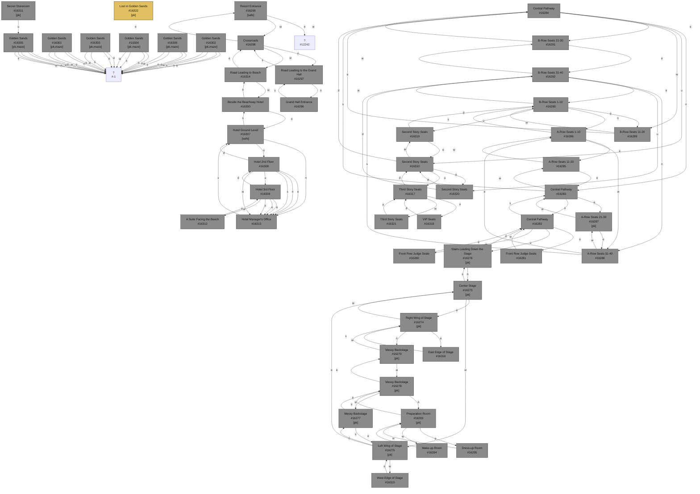

# Siren's Oasis Resort

50 rooms. Solid = direction; dotted = special exit.

```mermaid
flowchart TD
  r16299["Resort Entrance<br/>#16299<br/>[safe]"]
  r16298["Crossroads<br/>#16298"]
  r16314["Road Leading to Beach<br/>#16314"]
  r16300["Beside the Beachway Hotel<br/>#16300"]
  r16307["Hotel Ground Level<br/>#16307<br/>[safe]"]
  r16313["Hotel Manager's Office<br/>#16313"]
  r16301["Golden Sands<br/>#16301<br/>[pk,maze]"]
  r16303["Golden Sands<br/>#16303<br/>[pk,maze]"]
  r16304["Golden Sands<br/>#16304<br/>[pk,maze]"]
  r16306["Golden Sands<br/>#16306<br/>[pk,maze]"]
  r16302["Golden Sands<br/>#16302<br/>[pk,maze]"]
  r16322["Lost in Golden Sands<br/>#16322<br/>[pk]"]
  r16308["Hotel 2nd Floor<br/>#16308"]
  r16309["Hotel 3rd Floor<br/>#16309"]
  r16297["Road Leading to the Grand Hall<br/>#16297"]
  r16296["Grand Hall Entrance<br/>#16296"]
  r16284["Central Pathway<br/>#16284"]
  r16283["Central Pathway<br/>#16283"]
  r16310["Second Story Seats<br/>#16310"]
  r16319["Second Story Seats<br/>#16319"]
  r16320["Second Story Seats<br/>#16320"]
  r16317["Third Story Seats<br/>#16317"]
  r16318["VIP Seats<br/>#16318"]
  r16321["Third Story Seats<br/>#16321"]
  r16290["B-Row Seats 1-10<br/>#16290"]
  r16289["B-Row Seats 11-20<br/>#16289"]
  r16292["B-Row Seats 31-40<br/>#16292"]
  r16286["A-Row Seats 1-10<br/>#16286"]
  r16285["A-Row Seats 11-20<br/>#16285"]
  r16288["A-Row Seats 31-40<br/>#16288"]
  r16287["A-Row Seats 21-30<br/>#16287<br/>[pk]"]
  r16291["B-Row Seats 21-30<br/>#16291"]
  r16312["A Suite Facing the Beach<br/>#16312"]
  r16282["Central Pathway<br/>#16282"]
  r16280["Front Row Judge Seats<br/>#16280"]
  r16281["Front Row Judge Seats<br/>#16281"]
  r16276["Stairs Leading Down the Stage<br/>#16276<br/>[pk]"]
  r16275["Left Wing of Stage<br/>#16275<br/>[pk]"]
  r16274["Right Wing of Stage<br/>#16274<br/>[pk]"]
  r16279["Messy Backstage<br/>#16279<br/>[pk]"]
  r16278["Messy Backstage<br/>#16278<br/>[pk]"]
  r16277["Messy Backstage<br/>#16277<br/>[pk]"]
  r16315["West Edge of Stage<br/>#16315"]
  r16316["East Edge of Stage<br/>#16316"]
  r16293["Preparation Room<br/>#16293<br/>[pk]"]
  r16294["Make-up Room<br/>#16294"]
  r16295["Dress-up Room<br/>#16295"]
  r16311["Secret Storeroom<br/>#16311<br/>[pk]"]
  r16273["Center Stage<br/>#16273<br/>[pk]"]
  r16305["Golden Sands<br/>#16305<br/>[pk,maze]"]
  r12242["?<br/>#12242"]
  r16299 -->|e| r12242
  r16299 -->|w| r16298
  r16298 -->|e| r16299
  r16298 -->|n| r16297
  r16298 -->|w| r16314
  r16314 -->|e| r16298
  r16314 -->|w| r16300
  r16300 -->|e| r16314
  r16300 -->|n| r16307
  r16307 -->|n| r16313
  r16307 -->|s| r16300
  r16307 -->|u| r16308
  r16313 -->|s| r16307
  r-1["?<br/>#-1"]
  r16301 -->|e| r-1
  r16301 -->|n| r-1
  r16301 -->|s| r-1
  r16301 -->|w| r-1
  r16303 -->|e| r-1
  r16303 -->|n| r-1
  r16303 -->|s| r-1
  r16303 -->|w| r-1
  r16304 -->|e| r-1
  r16304 -->|n| r-1
  r16304 -->|s| r-1
  r16304 -->|w| r-1
  r16306 -->|e| r-1
  r16306 -->|n| r-1
  r16306 -->|s| r-1
  r16306 -->|w| r-1
  r16302 -->|e| r-1
  r16302 -->|n| r-1
  r16302 -->|s| r-1
  r16302 -->|w| r-1
  r16308 -->|d| r16307
  r16308 -->|e| r16313
  r16308 -->|n| r16313
  r16308 -->|s| r16313
  r16308 -->|u| r16309
  r16308 -->|w| r16313
  r16309 -->|d| r16308
  r16309 -->|e| r16313
  r16309 -->|n| r16313
  r16309 -->|s| r16313
  r16309 -->|w| r16312
  r16297 -->|n| r16296
  r16297 -->|s| r16298
  r16296 -->|s| r16297
  r16284 -->|e| r16291
  r16284 -->|n| r16283
  r16284 -->|u| r16310
  r16284 -->|w| r16289
  r16283 -->|e| r16287
  r16283 -->|n| r16282
  r16283 -->|s| r16284
  r16283 -->|w| r16285
  r16310 -->|d| r16284
  r16310 -->|e| r16320
  r16310 -->|u| r16317
  r16310 -->|w| r16319
  r16319 -->|d| r16290
  r16319 -->|e| r16310
  r16320 -->|d| r16292
  r16320 -->|w| r16310
  r16317 -->|d| r16310
  r16317 -->|u| r16318
  r16317 -->|w| r16321
  r16318 -->|d| r16317
  r16321 -->|e| r16317
  r16290 -->|e| r16289
  r16290 -->|n| r16286
  r16290 -->|u| r16319
  r16290 -->|w| r16292
  r16289 -->|e| r16284
  r16289 -->|w| r16290
  r16292 -->|e| r16290
  r16292 -->|n| r16288
  r16292 -->|u| r16320
  r16292 -->|w| r16291
  r16286 -->|e| r16285
  r16286 -->|s| r16290
  r16286 -->|w| r16288
  r16285 -->|e| r16283
  r16285 -->|w| r16286
  r16288 -->|e| r16286
  r16288 -->|s| r16292
  r16288 -->|w| r16287
  r16287 -->|e| r16288
  r16287 -->|w| r16283
  r16291 -->|e| r16292
  r16291 -->|w| r16284
  r16312 -->|e| r16309
  r16282 -->|e| r16281
  r16282 -->|s| r16283
  r16282 -->|u| r16276
  r16282 -->|w| r16280
  r16280 -->|e| r16282
  r16281 -->|w| r16282
  r16276 -->|d| r16282
  r16276 -->|n| r16273
  r16275 -->|e| r16273
  r16275 -->|n| r16277
  r16275 -->|w| r16315
  r16274 -->|e| r16316
  r16274 -->|n| r16279
  r16274 -->|w| r16273
  r16279 -->|s| r16274
  r16279 -->|w| r16278
  r16278 -->|e| r16279
  r16278 -->|n| r16293
  r16278 -->|w| r16277
  r16277 -->|e| r16278
  r16277 -->|s| r16275
  r16315 -->|e| r16275
  r16316 -->|w| r16274
  r16293 -->|e| r16295
  r16293 -->|s| r16278
  r16293 -->|w| r16294
  r16294 -->|e| r16293
  r16295 -->|w| r16293
  r16311 -->|u| r16305
  r16273 -->|e| r16274
  r16273 -->|s| r16276
  r16273 -->|w| r16275
  r16305 -->|d| r-1
  r16305 -->|e| r-1
  r16305 -->|n| r-1
  r16305 -->|s| r-1
  r16305 -->|w| r-1
  classDef t_inside fill:#8a8a8a,color:#111,stroke:#222
  class r16299 t_inside
  class r16298 t_inside
  class r16314 t_inside
  class r16300 t_inside
  class r16307 t_inside
  class r16313 t_inside
  class r16301 t_inside
  class r16303 t_inside
  class r16304 t_inside
  class r16306 t_inside
  class r16302 t_inside
  classDef t_desert fill:#e0c060,color:#111,stroke:#222
  class r16322 t_desert
  class r16308 t_inside
  class r16309 t_inside
  class r16297 t_inside
  class r16296 t_inside
  class r16284 t_inside
  class r16283 t_inside
  class r16310 t_inside
  class r16319 t_inside
  class r16320 t_inside
  class r16317 t_inside
  class r16318 t_inside
  class r16321 t_inside
  class r16290 t_inside
  class r16289 t_inside
  class r16292 t_inside
  class r16286 t_inside
  class r16285 t_inside
  class r16288 t_inside
  class r16287 t_inside
  class r16291 t_inside
  class r16312 t_inside
  class r16282 t_inside
  class r16280 t_inside
  class r16281 t_inside
  class r16276 t_inside
  class r16275 t_inside
  class r16274 t_inside
  class r16279 t_inside
  class r16278 t_inside
  class r16277 t_inside
  class r16315 t_inside
  class r16316 t_inside
  class r16293 t_inside
  class r16294 t_inside
  class r16295 t_inside
  class r16311 t_inside
  class r16273 t_inside
  class r16305 t_inside
```
