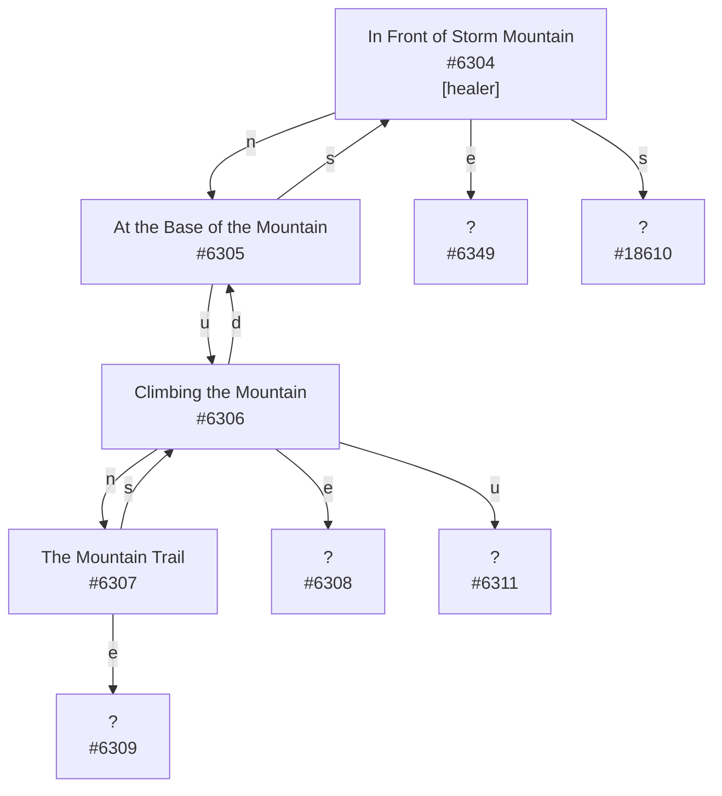

# Storm Mountain

4 rooms. Solid = direction; dotted = special exit.

```mermaid
flowchart TD
  r6304["In Front of Storm Mountain<br/>#6304<br/>[healer]"]
  r6305["At the Base of the Mountain<br/>#6305"]
  r6306["Climbing the Mountain<br/>#6306"]
  r6307["The Mountain Trail<br/>#6307"]
  r6349["?<br/>#6349"]
  r6304 -->|e| r6349
  r6304 -->|n| r6305
  r18610["?<br/>#18610"]
  r6304 -->|s| r18610
  r6305 -->|s| r6304
  r6305 -->|u| r6306
  r6306 -->|d| r6305
  r6308["?<br/>#6308"]
  r6306 -->|e| r6308
  r6306 -->|n| r6307
  r6311["?<br/>#6311"]
  r6306 -->|u| r6311
  r6309["?<br/>#6309"]
  r6307 -->|e| r6309
  r6307 -->|s| r6306
```
