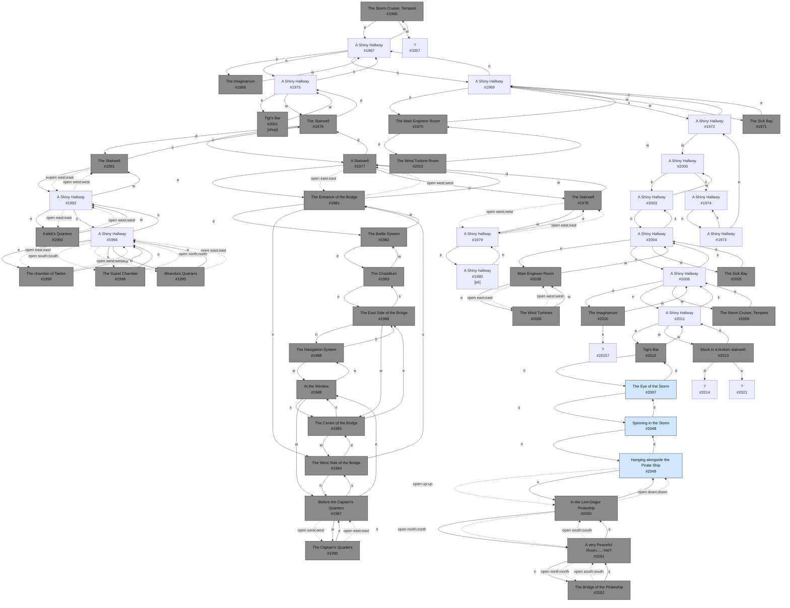

# Storm Ships of Lem-Dagor

52 rooms. Solid = direction; dotted = special exit.

```mermaid
flowchart TD
  r1966["The Storm Cruiser, Tempest<br/>#1966"]
  r1967["A Shiny Hallway<br/>#1967"]
  r1975["A Shiny Hallway<br/>#1975"]
  r1968["The Imaginarium<br/>#1968"]
  r1969["A Shiny Hallway<br/>#1969"]
  r1972["A Shiny Hallway<br/>#1972"]
  r2000["A Shiny Hallway<br/>#2000"]
  r2004["A Shiny Hallway<br/>#2004"]
  r1973["A Shiny Hallway<br/>#1973"]
  r1971["The Sick Bay<br/>#1971"]
  r1970["The Main Engineer Room<br/>#1970"]
  r2002["The Wind Turbine Room<br/>#2002"]
  r1976["The Stairwell<br/>#1976"]
  r2001["Tigi's Bar<br/>#2001<br/>[shop]"]
  r1977["A Stairwell<br/>#1977"]
  r1981["The Entrance of the Bridge<br/>#1981"]
  r1984["The West Side of the Bridge<br/>#1984"]
  r1982["The Battle System<br/>#1982"]
  r1983["The Cristallium<br/>#1983"]
  r1986["The East Side of the Bridge<br/>#1986"]
  r1985["The Centre of the Bridge<br/>#1985"]
  r1987["Before the Captain's Quarters<br/>#1987"]
  r1988["At the Window<br/>#1988"]
  r1990["The Captain's Quarters<br/>#1990"]
  r1978["The Stairwell<br/>#1978"]
  r1979["A Shiny hallway<br/>#1979"]
  r1980["A Shiny hallway<br/>#1980<br/>[pk]"]
  r1991["The Stairwell<br/>#1991"]
  r1992["A Shiny Hallway<br/>#1992"]
  r1993["Kaleb's Quarters<br/>#1993"]
  r1994["A Shiny Hallway<br/>#1994"]
  r1999["The chamber of Taelen<br/>#1999"]
  r1995["Miranda's Quarters<br/>#1995"]
  r1996["The Guest Chamber<br/>#1996"]
  r1989["The Navigation System<br/>#1989"]
  r2005["The Sick Bay<br/>#2005"]
  r2038["Main Engineer Room<br/>#2038"]
  r2006["The Wind Turbines<br/>#2006"]
  r2008["A Shiny Hallway<br/>#2008"]
  r2009["The Storm Cruiser, Tempest<br/>#2009"]
  r2010["The Imaginarium<br/>#2010"]
  r2013["Stuck in a broken stairwell.<br/>#2013"]
  r2012["Tigi's Bar<br/>#2012"]
  r2007["The Eye of the Storm<br/>#2007"]
  r2048["Spinning in the Storm<br/>#2048"]
  r2049["Hanging alongside the Pirate Ship<br/>#2049"]
  r2050["In the Lem-Dagor Pirateship<br/>#2050"]
  r2052["The Bridge of the Pirateship<br/>#2052"]
  r2051["A very Peaceful Room......Yet!!!<br/>#2051"]
  r2011["A Shiny Hallway<br/>#2011"]
  r2003["A Shiny Hallway<br/>#2003"]
  r1974["A Shiny Hallway<br/>#1974"]
  r1966 -->|e| r1967
  r3357["?<br/>#3357"]
  r1966 -->|w| r3357
  r1967 -->|e| r1968
  r1967 -->|n| r1975
  r1967 -->|s| r1969
  r1967 -->|w| r1966
  r1975 -->|e| r2001
  r1975 -->|s| r1967
  r1975 -->|w| r1976
  r1968 -->|w| r1967
  r1969 -->|e| r1970
  r1969 -->|n| r1967
  r1969 -->|s| r1972
  r1969 -->|w| r1971
  r1972 -->|n| r1969
  r1972 -->|w| r2000
  r2000 -->|e| r2003
  r2000 -->|s| r1974
  r2004 -->|e| r2038
  r2004 -->|n| r2008
  r2004 -->|s| r2003
  r2004 -->|w| r2005
  r1973 -->|e| r1972
  r1973 -->|s| r1974
  r1971 -->|e| r1969
  r1970 -->|e| r2002
  r1970 -->|w| r1969
  r2002 -->|w| r1970
  r1976 -->|d| r1991
  r1976 -->|e| r1975
  r1976 -->|u| r1977
  r2001 -->|w| r1975
  r1977 -->|d| r1976
  r1977 -->|e| r1981
  r1977 -.->|open east;east| r1981
  r1977 -->|u| r1978
  r1981 -->|e| r1982
  r1981 -->|n| r1984
  r1981 -.->|open west;west| r1977
  r1981 -->|w| r1977
  r1984 -->|e| r1985
  r1984 -->|n| r1987
  r1984 -->|s| r1981
  r1982 -->|e| r1983
  r1982 -->|w| r1981
  r1983 -->|n| r1986
  r1983 -->|w| r1982
  r1986 -->|n| r1989
  r1986 -->|s| r1983
  r1986 -->|w| r1985
  r1985 -->|e| r1986
  r1985 -->|n| r1988
  r1985 -->|w| r1984
  r1987 -->|e| r1988
  r1987 -.->|open west;west| r1990
  r1987 -->|s| r1984
  r1987 -->|w| r1990
  r1988 -->|e| r1989
  r1988 -->|s| r1985
  r1988 -->|w| r1987
  r1990 -->|e| r1987
  r1990 -.->|open east;east| r1987
  r1978 -->|d| r1977
  r1978 -.->|open west;west| r1979
  r1978 -->|w| r1979
  r1979 -->|e| r1978
  r1979 -.->|open east;east| r1978
  r1979 -->|s| r1980
  r1980 -->|n| r1979
  r1991 -->|e| r1992
  r1991 -.->|open east;east| r1992
  r1991 -->|u| r1976
  r1992 -->|e| r1993
  r1992 -.->|open east;east| r1993
  r1992 -.->|open west;west| r1991
  r1992 -->|s| r1994
  r1992 -->|w| r1991
  r1993 -.->|open west;west| r1992
  r1993 -->|w| r1992
  r1994 -->|e| r1999
  r1994 -->|n| r1992
  r1994 -.->|open east;east| r1999
  r1994 -.->|open south;south| r1996
  r1994 -.->|open west;west| r1995
  r1994 -->|s| r1996
  r1994 -->|w| r1995
  r1999 -.->|open west;west| r1994
  r1999 -->|w| r1994
  r1995 -->|e| r1994
  r1995 -.->|open east;east| r1994
  r1996 -->|n| r1994
  r1996 -.->|open north;north| r1994
  r1989 -->|s| r1986
  r1989 -->|w| r1988
  r2005 -->|e| r2004
  r2038 -->|e| r2006
  r2038 -.->|open east;east| r2006
  r2038 -->|w| r2004
  r2006 -.->|open west;west| r2038
  r2006 -->|w| r2038
  r2008 -->|e| r2010
  r2008 -->|n| r2011
  r2008 -->|s| r2004
  r2008 -->|w| r2009
  r2009 -->|e| r2008
  r28257["?<br/>#28257"]
  r2010 -->|e| r28257
  r2010 -->|w| r2008
  r2014["?<br/>#2014"]
  r2013 -->|d| r2014
  r2013 -->|e| r2011
  r2021["?<br/>#2021"]
  r2013 -->|u| r2021
  r2012 -->|u| r2007
  r2012 -->|w| r2011
  r2007 -->|d| r2012
  r2007 -->|u| r2048
  r2048 -->|d| r2007
  r2048 -->|u| r2049
  r2049 -->|d| r2048
  r2049 -.->|open up;up| r2050
  r2049 -->|u| r2050
  r2050 -->|d| r2049
  r2050 -->|n| r2051
  r2050 -.->|open down;down| r2049
  r2050 -.->|open north;north| r2051
  r2052 -.->|open south;south| r2051
  r2052 -->|s| r2051
  r2051 -->|n| r2052
  r2051 -.->|open north;north| r2052
  r2051 -.->|open south;south| r2050
  r2051 -->|s| r2050
  r2011 -->|e| r2012
  r2011 -->|s| r2008
  r2011 -->|w| r2013
  r2003 -->|n| r2004
  r2003 -->|w| r2000
  r1974 -->|n| r1973
  classDef t_inside fill:#8a8a8a,color:#111,stroke:#222
  class r1966 t_inside
  class r1968 t_inside
  class r1971 t_inside
  class r1970 t_inside
  class r2002 t_inside
  class r1976 t_inside
  class r2001 t_inside
  class r1977 t_inside
  class r1981 t_inside
  class r1984 t_inside
  class r1982 t_inside
  class r1983 t_inside
  class r1986 t_inside
  class r1985 t_inside
  class r1987 t_inside
  class r1988 t_inside
  class r1990 t_inside
  class r1978 t_inside
  class r1991 t_inside
  class r1993 t_inside
  class r1999 t_inside
  class r1995 t_inside
  class r1996 t_inside
  class r1989 t_inside
  class r2005 t_inside
  class r2038 t_inside
  class r2006 t_inside
  class r2009 t_inside
  class r2010 t_inside
  class r2013 t_inside
  class r2012 t_inside
  classDef t_air fill:#cfe8ff,color:#111,stroke:#222
  class r2007 t_air
  class r2048 t_air
  class r2049 t_air
  class r2050 t_inside
  class r2052 t_inside
  class r2051 t_inside
```
