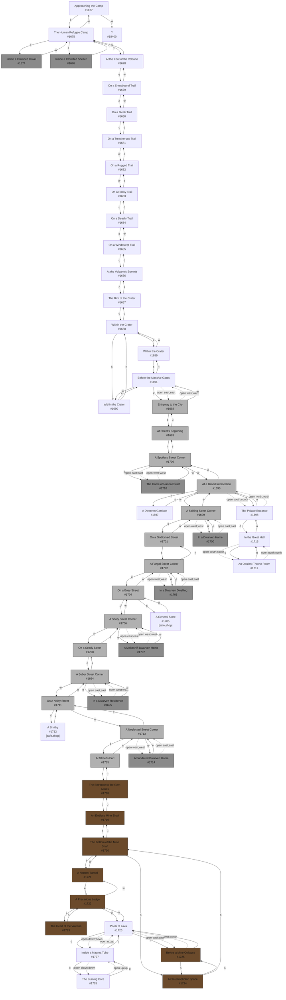

# Swordbreaker's Hoard

55 rooms. Solid = direction; dotted = special exit.

```mermaid
flowchart TD
  r1677["Approaching the Camp<br/>#1677"]
  r1675["The Human Refugee Camp<br/>#1675"]
  r1674["Inside a Crowded Hovel<br/>#1674"]
  r1676["Inside a Crowded Shelter<br/>#1676"]
  r1678["At the Foot of the Volcano<br/>#1678"]
  r1679["On a Snowbound Trail<br/>#1679"]
  r1680["On a Bleak Trail<br/>#1680"]
  r1681["On a Treacherous Trail<br/>#1681"]
  r1682["On a Rugged Trail<br/>#1682"]
  r1683["On a Rocky Trail<br/>#1683"]
  r1684["On a Deadly Trail<br/>#1684"]
  r1685["On a Windswept Trail<br/>#1685"]
  r1686["At the Volcano's Summit<br/>#1686"]
  r1687["The Rim of the Crater<br/>#1687"]
  r1688["Within the Crater<br/>#1688"]
  r1689["Within the Crater<br/>#1689"]
  r1690["Within the Crater<br/>#1690"]
  r1691["Before the Massive Gates<br/>#1691"]
  r1692["Entryway to the City<br/>#1692"]
  r1693["At Street's Beginning<br/>#1693"]
  r1709["A Spotless Street Corner<br/>#1709"]
  r1710["The Home of Nanna Dwarf<br/>#1710"]
  r1696["At a Grand Intersection<br/>#1696"]
  r1697["A Dwarven Garrison<br/>#1697"]
  r1699["A Striking Street Corner<br/>#1699"]
  r1698["The Palace Entrance<br/>#1698"]
  r1701["On a Gridlocked Street<br/>#1701"]
  r1702["A Fungal Street Corner<br/>#1702"]
  r1704["On a Busy Street<br/>#1704"]
  r1703["In a Dwarven Dwelling<br/>#1703"]
  r1700["In a Dwarven Home<br/>#1700"]
  r1706["A Sooty Street Corner<br/>#1706"]
  r1708["On a Seedy Street<br/>#1708"]
  r1694["A Sober Street Corner<br/>#1694"]
  r1711["On A Noisy Street<br/>#1711"]
  r1712["A Smithy<br/>#1712<br/>[safe,shop]"]
  r1713["A Neglected Street Corner<br/>#1713"]
  r1715["At Street's End<br/>#1715"]
  r1718["The Entrance to the Gem Mines<br/>#1718"]
  r1714["A Sundered Dwarven Home<br/>#1714"]
  r1695["In a Dwarven Residence<br/>#1695"]
  r1707["A Makeshift Dwarven Home<br/>#1707"]
  r1705["A General Store<br/>#1705<br/>[safe,shop]"]
  r1719["An Endless Mine Shaft<br/>#1719"]
  r1720["The Bottom of the Mine Shaft<br/>#1720"]
  r1721["A Narrow Tunnel<br/>#1721"]
  r1722["A Precarious Ledge<br/>#1722"]
  r1725["Before a Mine Collapse<br/>#1725"]
  r1724["A Claustrophobic Space<br/>#1724"]
  r1723["The Heart of the Volcano<br/>#1723"]
  r1716["In the Great Hall<br/>#1716"]
  r1717["An Opulent Throne Room<br/>#1717"]
  r1726["Pools of Lava<br/>#1726"]
  r1728["The Burning Core<br/>#1728"]
  r1727["Inside a Magma Tube<br/>#1727"]
  r1677 -->|e| r1675
  r18400["?<br/>#18400"]
  r1677 -->|w| r18400
  r1675 -->|e| r1674
  r1675 -->|n| r1678
  r1675 -->|s| r1676
  r1675 -->|w| r1677
  r1674 -->|w| r1675
  r1676 -->|n| r1675
  r1678 -->|e| r1679
  r1678 -->|s| r1675
  r1679 -->|e| r1680
  r1679 -->|w| r1678
  r1680 -->|u| r1681
  r1680 -->|w| r1679
  r1681 -->|d| r1680
  r1681 -->|w| r1682
  r1682 -->|e| r1681
  r1682 -->|w| r1683
  r1683 -->|e| r1682
  r1683 -->|u| r1684
  r1684 -->|d| r1683
  r1684 -->|e| r1685
  r1685 -->|u| r1686
  r1685 -->|w| r1684
  r1686 -->|d| r1685
  r1686 -->|n| r1687
  r1687 -->|d| r1688
  r1687 -->|s| r1686
  r1688 -->|e| r1689
  r1688 -->|s| r1690
  r1688 -->|u| r1687
  r1689 -->|s| r1691
  r1689 -->|w| r1688
  r1690 -->|e| r1691
  r1690 -->|n| r1688
  r1691 -->|e| r1692
  r1691 -->|n| r1689
  r1691 -.->|open east;east| r1692
  r1691 -->|w| r1690
  r1692 -->|d| r1693
  r1692 -.->|open west;west| r1691
  r1692 -->|w| r1691
  r1693 -->|n| r1709
  r1693 -->|u| r1692
  r1709 -->|e| r1710
  r1709 -.->|open east;east| r1710
  r1709 -->|s| r1693
  r1709 -->|w| r1696
  r1710 -.->|open west;west| r1709
  r1710 -->|w| r1709
  r1696 -->|e| r1709
  r1696 -->|n| r1697
  r1696 -.->|open south;south| r1698
  r1696 -->|s| r1698
  r1696 -->|w| r1699
  r1697 -->|s| r1696
  r1699 -->|e| r1696
  r1699 -.->|open west;west| r1700
  r1699 -->|s| r1701
  r1699 -->|w| r1700
  r1698 -->|d| r1716
  r1698 -->|n| r1696
  r1698 -.->|open north;north| r1696
  r1701 -->|n| r1699
  r1701 -->|s| r1702
  r1702 -->|e| r1704
  r1702 -->|n| r1701
  r1702 -.->|open west;west| r1703
  r1702 -->|w| r1703
  r1704 -->|e| r1706
  r1704 -->|s| r1705
  r1704 -->|w| r1702
  r1703 -->|e| r1702
  r1703 -.->|open east;east| r1702
  r1700 -->|e| r1699
  r1700 -.->|open east;east| r1699
  r1706 -->|e| r1707
  r1706 -->|n| r1708
  r1706 -.->|open east;east| r1707
  r1706 -->|w| r1704
  r1708 -->|n| r1694
  r1708 -->|s| r1706
  r1694 -->|e| r1695
  r1694 -.->|open east;east| r1695
  r1694 -->|s| r1708
  r1694 -->|w| r1711
  r1711 -->|e| r1694
  r1711 -->|n| r1712
  r1711 -->|w| r1713
  r1712 -->|s| r1711
  r1713 -->|e| r1711
  r1713 -.->|open west;west| r1714
  r1713 -->|s| r1715
  r1713 -->|w| r1714
  r1715 -->|n| r1713
  r1715 -->|s| r1718
  r1718 -->|d| r1719
  r1718 -->|n| r1715
  r1714 -->|e| r1713
  r1714 -.->|open east;east| r1713
  r1695 -.->|open west;west| r1694
  r1695 -->|w| r1694
  r1707 -.->|open west;west| r1706
  r1707 -->|w| r1706
  r1705 -->|n| r1704
  r1719 -->|d| r1720
  r1719 -->|u| r1718
  r1720 -->|e| r1721
  r1720 -->|s| r1724
  r1720 -->|u| r1719
  r1721 -->|e| r1722
  r1721 -->|w| r1720
  r1722 -->|e| r1726
  r1722 -->|n| r1726
  r1722 -->|s| r1723
  r1722 -->|w| r1721
  r1725 -->|n| r1724
  r1725 -.->|open west;west| r1726
  r1725 -->|w| r1726
  r1724 -->|n| r1720
  r1724 -->|s| r1725
  r1723 -->|n| r1722
  r1716 -.->|open south;south| r1717
  r1716 -->|s| r1717
  r1716 -->|u| r1698
  r1717 -->|n| r1716
  r1717 -.->|open north;north| r1716
  r1726 -->|d| r1727
  r1726 -->|e| r1725
  r1726 -.->|open down;down| r1727
  r1726 -.->|open east;east| r1725
  r1728 -.->|open up;up| r1727
  r1728 -->|u| r1727
  r1727 -->|d| r1728
  r1727 -.->|open down;down| r1728
  r1727 -.->|open up;up| r1726
  r1727 -->|u| r1726
  classDef t_inside fill:#8a8a8a,color:#111,stroke:#222
  class r1674 t_inside
  class r1676 t_inside
  classDef t_city fill:#b0b0b0,color:#111,stroke:#222
  class r1692 t_city
  class r1693 t_city
  class r1709 t_city
  class r1710 t_inside
  class r1696 t_city
  class r1699 t_city
  class r1701 t_city
  class r1702 t_city
  class r1704 t_city
  class r1703 t_inside
  class r1700 t_inside
  class r1706 t_city
  class r1708 t_city
  class r1694 t_city
  class r1711 t_city
  class r1713 t_city
  class r1715 t_city
  classDef t_underground fill:#6b4a2b,color:#111,stroke:#222
  class r1718 t_underground
  class r1714 t_inside
  class r1695 t_inside
  class r1707 t_inside
  class r1719 t_underground
  class r1720 t_underground
  class r1721 t_underground
  class r1722 t_underground
  class r1725 t_underground
  class r1724 t_underground
  class r1723 t_underground
```
