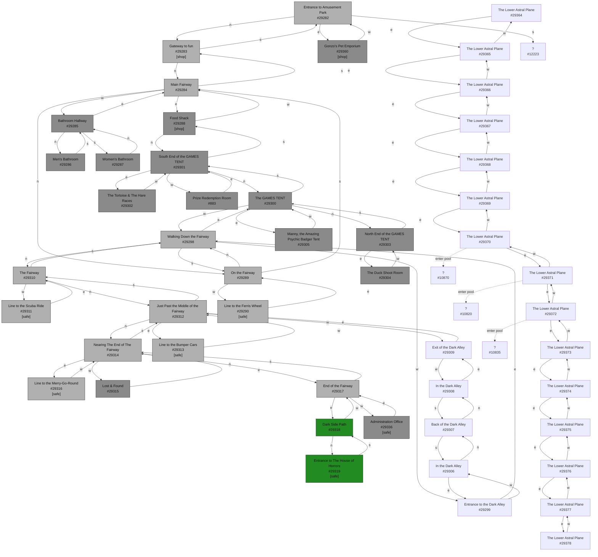

# The Amusement Park

49 rooms. Solid = direction; dotted = special exit.

```mermaid
flowchart TD
  r29282["Entrance to Amusement Park<br/>#29282"]
  r29283["Gateway to fun<br/>#29283<br/>[shop]"]
  r29284["Main Fairway<br/>#29284"]
  r29289["On the Fairway<br/>#29289"]
  r29298["Walking Down the Fairway<br/>#29298"]
  r29310["The Fairway<br/>#29310"]
  r29311["Line to the Scuba Ride<br/>#29311<br/>[safe]"]
  r29312["Just Past the Middle of the Fairway<br/>#29312"]
  r29309["Exit of the Dark Alley<br/>#29309"]
  r29313["Line to the Bumper Cars<br/>#29313<br/>[safe]"]
  r29299["Entrance to the Dark Alley<br/>#29299"]
  r29300["The GAMES TENT<br/>#29300"]
  r29303["North End of the GAMES TENT<br/>#29303"]
  r29304["The Duck Shoot Room<br/>#29304"]
  r29305["Manny, the Amazing Psychic Badger Tent<br/>#29305"]
  r29301["South End of the GAMES TENT<br/>#29301"]
  r29302["The Tortoise & The Hare Races<br/>#29302"]
  r883["Prize Redemption Room<br/>#883"]
  r29288["Food Shack<br/>#29288<br/>[shop]"]
  r29285["Bathroom Hallway<br/>#29285"]
  r29286["Men's Bathroom<br/>#29286"]
  r29290["Line to the Ferris Wheel<br/>#29290<br/>[safe]"]
  r29287["Women's Bathroom<br/>#29287"]
  r29360["Gonzo's Pet Emporium<br/>#29360<br/>[shop]"]
  r29314["Nearing The End of The Fairway<br/>#29314"]
  r29316["Line to the Merry-Go-Round<br/>#29316<br/>[safe]"]
  r29315["Lost & Found<br/>#29315"]
  r29317["End of the Fairway<br/>#29317"]
  r29318["Dark Side Path<br/>#29318"]
  r29319["Entrance to The House of Horrors<br/>#29319<br/>[safe]"]
  r29336["Administration Office<br/>#29336<br/>[safe]"]
  r29306["In the Dark Alley<br/>#29306"]
  r29307["Back of the Dark Alley<br/>#29307"]
  r29308["In the Dark Alley<br/>#29308"]
  r29364["The Lower Astral Plane<br/>#29364"]
  r29365["The Lower Astral Plane<br/>#29365"]
  r29366["The Lower Astral Plane<br/>#29366"]
  r29367["The Lower Astral Plane<br/>#29367"]
  r29368["The Lower Astral Plane<br/>#29368"]
  r29369["The Lower Astral Plane<br/>#29369"]
  r29370["The Lower Astral Plane<br/>#29370"]
  r29371["The Lower Astral Plane<br/>#29371"]
  r29372["The Lower Astral Plane<br/>#29372"]
  r29373["The Lower Astral Plane<br/>#29373"]
  r29374["The Lower Astral Plane<br/>#29374"]
  r29375["The Lower Astral Plane<br/>#29375"]
  r29376["The Lower Astral Plane<br/>#29376"]
  r29377["The Lower Astral Plane<br/>#29377"]
  r29378["The Lower Astral Plane<br/>#29378"]
  r29282 -->|e| r29360
  r29282 -->|n| r29283
  r12223["?<br/>#12223"]
  r29282 -->|s| r12223
  r29283 -->|n| r29284
  r29283 -->|s| r29282
  r29284 -->|e| r29288
  r29284 -->|n| r29289
  r29284 -->|s| r29283
  r29284 -->|w| r29285
  r29289 -->|n| r29298
  r29289 -->|s| r29284
  r29289 -->|w| r29290
  r29298 -->|e| r29300
  r29298 -->|n| r29310
  r29298 -->|s| r29289
  r29298 -->|w| r29299
  r29310 -->|n| r29312
  r29310 -->|s| r29298
  r29310 -->|w| r29311
  r29311 -->|e| r29310
  r29312 -->|e| r29313
  r29312 -->|n| r29314
  r29312 -->|s| r29310
  r29312 -->|w| r29309
  r29309 -->|e| r29312
  r29309 -->|w| r29308
  r29313 -->|w| r29312
  r29299 -->|e| r29298
  r29299 -->|w| r29306
  r29300 -->|e| r29305
  r29300 -->|n| r29303
  r29300 -->|s| r29301
  r29300 -->|w| r29298
  r29303 -->|e| r29304
  r29303 -->|s| r29300
  r29304 -->|w| r29303
  r29305 -->|w| r29300
  r29301 -->|e| r29302
  r29301 -->|n| r29300
  r29301 -->|s| r29288
  r29301 -->|w| r883
  r29302 -->|w| r29301
  r883 -->|e| r29301
  r29288 -->|n| r29301
  r29288 -->|w| r29284
  r29285 -->|e| r29284
  r29285 -->|n| r29286
  r29285 -->|s| r29287
  r29286 -->|s| r29285
  r29290 -->|e| r29289
  r29287 -->|n| r29285
  r29360 -->|w| r29282
  r29314 -->|e| r29316
  r29314 -->|n| r29317
  r29314 -->|s| r29312
  r29314 -->|w| r29315
  r29316 -->|w| r29314
  r29315 -->|e| r29314
  r29317 -->|e| r29318
  r29317 -->|s| r29314
  r29317 -->|w| r29336
  r29318 -->|n| r29319
  r29318 -->|w| r29317
  r29319 -->|s| r29318
  r29336 -->|e| r29317
  r29306 -->|e| r29299
  r29306 -->|n| r29307
  r29307 -->|n| r29308
  r29307 -->|s| r29306
  r29308 -->|e| r29309
  r29308 -->|s| r29307
  r29364 -->|e| r29365
  r29365 -->|e| r29366
  r29365 -->|w| r29364
  r29366 -->|e| r29367
  r29366 -->|w| r29365
  r29367 -->|e| r29368
  r29367 -->|w| r29366
  r29368 -->|e| r29369
  r29368 -->|w| r29367
  r29369 -->|e| r29370
  r29369 -->|w| r29368
  r29370 -->|e| r29371
  r10870["?<br/>#10870"]
  r29370 -.->|enter pool| r10870
  r29370 -->|w| r29369
  r29371 -->|e| r29372
  r10820["?<br/>#10820"]
  r29371 -.->|enter pool| r10820
  r29371 -->|w| r29370
  r29372 -->|e| r29373
  r10835["?<br/>#10835"]
  r29372 -.->|enter pool| r10835
  r29372 -->|w| r29371
  r29373 -->|e| r29374
  r29373 -->|w| r29372
  r29374 -->|e| r29375
  r29374 -->|w| r29373
  r29375 -->|e| r29376
  r29375 -->|w| r29374
  r29376 -->|e| r29377
  r29376 -->|w| r29375
  r29377 -->|e| r29378
  r29377 -->|w| r29376
  r29378 -->|w| r29377
  classDef t_city fill:#b0b0b0,color:#111,stroke:#222
  class r29282 t_city
  class r29283 t_city
  class r29284 t_city
  class r29289 t_city
  class r29298 t_city
  class r29310 t_city
  class r29311 t_city
  class r29312 t_city
  class r29313 t_city
  classDef t_inside fill:#8a8a8a,color:#111,stroke:#222
  class r29300 t_inside
  class r29303 t_inside
  class r29304 t_inside
  class r29305 t_inside
  class r29301 t_inside
  class r29302 t_inside
  class r883 t_inside
  class r29288 t_inside
  class r29285 t_inside
  class r29286 t_inside
  class r29290 t_city
  class r29287 t_inside
  class r29360 t_inside
  class r29314 t_city
  class r29316 t_city
  class r29315 t_inside
  class r29317 t_city
  classDef t_forest fill:#228b22,color:#111,stroke:#222
  class r29318 t_forest
  class r29319 t_forest
  class r29336 t_inside
```
