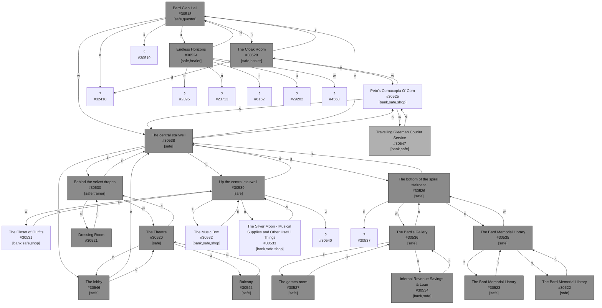

# The Bard Clan

22 rooms. Solid = direction; dotted = special exit.

```mermaid
flowchart TD
  r30518["Bard Clan Hall<br/>#30518<br/>[safe,questor]"]
  r30528["The Cloak Room<br/>#30528<br/>[safe,healer]"]
  r30525["Peto's Cornucopia O' Corn<br/>#30525<br/>[bank,safe,shop]"]
  r30538["The central stairwell<br/>#30538<br/>[safe]"]
  r30539["Up the central stairwell<br/>#30539<br/>[safe]"]
  r30531["The Closet of Outfits<br/>#30531<br/>[bank,safe,shop]"]
  r30524["Endless Horizons<br/>#30524<br/>[safe,healer]"]
  r30547["Travelling Gleeman Courier Service<br/>#30547<br/>[bank,safe]"]
  r30546["The lobby<br/>#30546<br/>[safe]"]
  r30520["The Theatre<br/>#30520<br/>[safe]"]
  r30530["Behind the velvet drapes<br/>#30530<br/>[safe,trainer]"]
  r30521["Dressing Room<br/>#30521"]
  r30542["Balcony<br/>#30542<br/>[safe]"]
  r30526["The bottom of the spiral staircase<br/>#30526<br/>[safe]"]
  r30535["The Bard Memorial Library<br/>#30535<br/>[safe]"]
  r30523["The Bard Memorial Library<br/>#30523<br/>[safe]"]
  r30522["The Bard Memorial Library<br/>#30522<br/>[safe]"]
  r30536["The Bard's Gallery<br/>#30536<br/>[safe]"]
  r30527["The games room<br/>#30527<br/>[safe]"]
  r30534["Infernal Revenue Savings & Loan<br/>#30534<br/>[bank,safe]"]
  r30532["The Music Box<br/>#30532<br/>[bank,safe,shop]"]
  r30533["The Silver Moon - Musical Supplies and Other Useful Things<br/>#30533<br/>[bank,safe,shop]"]
  r32418["?<br/>#32418"]
  r30518 -->|e| r32418
  r30518 -->|n| r30528
  r30519["?<br/>#30519"]
  r30518 -->|s| r30519
  r30518 -->|u| r30524
  r30518 -->|w| r30538
  r30528 -->|d| r32418
  r30528 -->|s| r30518
  r30528 -->|w| r30525
  r30525 -->|e| r30528
  r30525 -->|s| r30538
  r30525 -->|w| r30547
  r30538 -->|d| r30526
  r30538 -->|e| r30518
  r30538 -->|n| r30525
  r30538 -->|s| r30530
  r30538 -->|u| r30539
  r30538 -->|w| r30546
  r30539 -->|d| r30538
  r30539 -->|n| r30533
  r30539 -->|s| r30532
  r30540["?<br/>#30540"]
  r30539 -->|u| r30540
  r30539 -->|w| r30531
  r30531 -->|e| r30539
  r30524 -->|d| r30518
  r2395["?<br/>#2395"]
  r30524 -->|e| r2395
  r23713["?<br/>#23713"]
  r30524 -->|n| r23713
  r6162["?<br/>#6162"]
  r30524 -->|s| r6162
  r29282["?<br/>#29282"]
  r30524 -->|u| r29282
  r4563["?<br/>#4563"]
  r30524 -->|w| r4563
  r30547 -->|e| r30525
  r30546 -->|e| r30538
  r30546 -->|s| r30520
  r30520 -->|e| r30530
  r30520 -->|n| r30546
  r30520 -->|u| r30542
  r30530 -->|d| r30521
  r30530 -->|n| r30538
  r30530 -->|w| r30520
  r30521 -->|u| r30530
  r30542 -->|d| r30520
  r30526 -->|e| r30535
  r30537["?<br/>#30537"]
  r30526 -->|n| r30537
  r30526 -->|u| r30538
  r30526 -->|w| r30536
  r30535 -->|n| r30522
  r30535 -->|s| r30523
  r30535 -->|w| r30526
  r30523 -->|n| r30535
  r30522 -->|s| r30535
  r30536 -->|e| r30526
  r30536 -->|n| r30534
  r30536 -->|s| r30527
  r30527 -->|n| r30536
  r30534 -->|s| r30536
  r30532 -->|n| r30539
  r30533 -->|s| r30539
  classDef t_inside fill:#8a8a8a,color:#111,stroke:#222
  class r30518 t_inside
  class r30528 t_inside
  class r30538 t_inside
  class r30539 t_inside
  class r30524 t_inside
  classDef t_city fill:#b0b0b0,color:#111,stroke:#222
  class r30547 t_city
  class r30546 t_inside
  class r30520 t_inside
  class r30530 t_inside
  class r30521 t_inside
  class r30542 t_inside
  class r30526 t_inside
  class r30535 t_inside
  class r30523 t_inside
  class r30522 t_inside
  class r30536 t_inside
  class r30527 t_inside
  class r30534 t_inside
```
