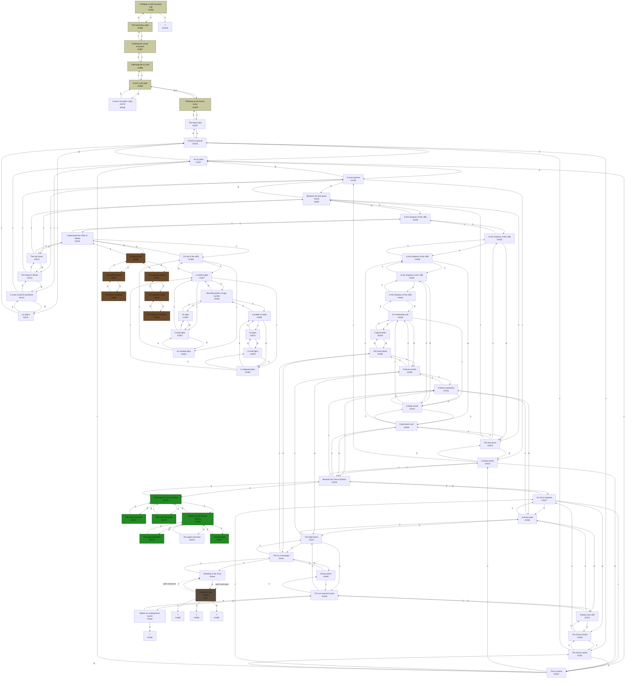

# The Blighted Tundra of Andarin

68 rooms. Solid = direction; dotted = special exit.

```mermaid
flowchart TD
  r2395["Climbing a cold mountain trail<br/>#2395"]
  r2396["The hazardous path<br/>#2396"]
  r2397["Climbing the snowy mountain<br/>#2397"]
  r2398["Following the icy trail<br/>#2398"]
  r2399["A turn in the path<br/>#2399"]
  r2478["A warm mountain cabin<br/>#2478<br/>[shop]"]
  r2400["Climbing up the frozen rocks<br/>#2400"]
  r2447["The dead calm<br/>#2447"]
  r2416["A frozen expanse<br/>#2416"]
  r2411["Icy plains<br/>#2411"]
  r2412["A snow covered wasteland<br/>#2412"]
  r2417["An icy plain<br/>#2417"]
  r2422["The icy plains<br/>#2422"]
  r2421["The frozen tundra<br/>#2421"]
  r2426["The frozen tundra<br/>#2426"]
  r2427["An arctic expanse<br/>#2427"]
  r2432["A wintry plain<br/>#2432"]
  r2431["A deep snow drift<br/>#2431"]
  r2436["The ice-covered tundra<br/>#2436"]
  r2437["The frigid plains<br/>#2437"]
  r2442["Before an underground cavern<br/>#2442"]
  r2445["Snowy plains<br/>#2445"]
  r2441["The icy champaign<br/>#2441"]
  r2444["Standing in the snow<br/>#2444"]
  r2479["Inside the cave<br/>#2479<br/>[pk]"]
  r2446["The frosty plains<br/>#2446"]
  r2438["A barren tundra<br/>#2438"]
  r2433["A frozen wasteland<br/>#2433"]
  r2428["Beneath the Tree of Sodrus<br/>#2428"]
  r2423["A damp tundra<br/>#2423"]
  r2418["A vast expanse<br/>#2418"]
  r2413["The Dead of Winter<br/>#2413"]
  r2414["The twin pines<br/>#2414"]
  r2419["Between the twin pines<br/>#2419<br/>[safe]"]
  r2424["The twin pines<br/>#2424"]
  r2429["A persistent cold<br/>#2429"]
  r2434["A bleak winter<br/>#2434"]
  r2439["An everlasting cold<br/>#2439"]
  r2443["A glacial plain<br/>#2443"]
  r2440["In the shadows of the cliffs<br/>#2440"]
  r2435["In the shadows of the cliffs<br/>#2435"]
  r2430["In the shadows of the cliffs<br/>#2430"]
  r2425["In the shadows of the cliffs<br/>#2425"]
  r2420["In the shadows of the cliffs<br/>#2420"]
  r2415["Underneath the Cliffs of Valhan<br/>#2415"]
  r2472["Climbing the Tree of Sodrus<br/>#2472"]
  r2471["The lower branches<br/>#2471"]
  r2473["The lower branches<br/>#2473"]
  r2475["Further up the Tree of Sodrus<br/>#2475"]
  r2474["The upper branches<br/>#2474"]
  r2476["The upper branches<br/>#2476"]
  r2477["A crow's nest<br/>#2477"]
  r2406["On top of the cliffs<br/>#2406"]
  r2407["A colorful igloo<br/>#2407"]
  r2404["A collapsed igloo<br/>#2404"]
  r2409["A small igloo<br/>#2409"]
  r2410["An igloo<br/>#2410"]
  r2405["A puddle of water<br/>#2405"]
  r2408["Standing before a huge sundial<br/>#2408"]
  r2403["An igloo<br/>#2403"]
  r2402["A large igloo<br/>#2402"]
  r2401["An isolated igloo<br/>#2401"]
  r2463["A large tunnel<br/>#2463"]
  r2462["The sapphire tunnel<br/>#2462"]
  r2465["The sapphire tunnel<br/>#2465"]
  r2466["The sapphire chamber<br/>#2466"]
  r2467["The amber tunnel<br/>#2467"]
  r2464["The amber chamber<br/>#2464"]
  r11516["?<br/>#11516"]
  r2395 -->|s| r11516
  r2395 -->|u| r2396
  r2396 -->|d| r2395
  r2396 -->|n| r2397
  r2397 -->|s| r2396
  r2397 -->|u| r2398
  r2398 -->|d| r2397
  r2398 -->|n| r2399
  r2399 -->|e| r2400
  r2399 -->|s| r2398
  r2399 -->|w| r2478
  r2478 -->|e| r2399
  r2400 -->|u| r2447
  r2400 -->|w| r2399
  r2447 -->|d| r2400
  r2447 -->|e| r2416
  r2416 -->|e| r2417
  r2416 -->|n| r2421
  r2416 -->|s| r2411
  r2416 -->|w| r2447
  r2411 -->|e| r2412
  r2411 -->|n| r2416
  r2412 -->|e| r2413
  r2412 -->|n| r2417
  r2412 -->|w| r2411
  r2417 -->|e| r2418
  r2417 -->|n| r2422
  r2417 -->|s| r2412
  r2417 -->|w| r2416
  r2422 -->|e| r2423
  r2422 -->|n| r2427
  r2422 -->|s| r2417
  r2422 -->|w| r2421
  r2421 -->|e| r2422
  r2421 -->|n| r2426
  r2421 -->|s| r2416
  r2426 -->|e| r2427
  r2426 -->|n| r2431
  r2426 -->|s| r2421
  r2427 -->|e| r2428
  r2427 -->|n| r2432
  r2427 -->|s| r2422
  r2427 -->|w| r2426
  r2432 -->|e| r2433
  r2432 -->|n| r2437
  r2432 -->|s| r2427
  r2432 -->|w| r2431
  r2431 -->|e| r2432
  r2431 -->|n| r2436
  r2431 -->|s| r2426
  r2436 -->|e| r2437
  r2436 -->|n| r2445
  r2436 -->|s| r2431
  r2436 -->|w| r2442
  r2437 -->|e| r2438
  r2437 -->|n| r2441
  r2437 -->|s| r2432
  r2437 -->|w| r2436
  r2448["?<br/>#2448"]
  r2442 -->|d| r2448
  r2442 -->|e| r2436
  r2445 -->|e| r2441
  r2445 -->|s| r2436
  r2441 -->|e| r2446
  r2441 -->|n| r2444
  r2441 -->|s| r2437
  r2441 -->|w| r2445
  r2444 -.->|open west;west| r2479
  r2444 -->|s| r2441
  r2444 -->|w| r2479
  r2479 -->|e| r2444
  r2480["?<br/>#2480"]
  r2479 -->|n| r2480
  r2479 -.->|open east;east| r2444
  r2486["?<br/>#2486"]
  r2479 -->|u| r2486
  r2485["?<br/>#2485"]
  r2479 -->|w| r2485
  r2446 -->|e| r2443
  r2446 -->|s| r2438
  r2446 -->|w| r2441
  r2438 -->|e| r2439
  r2438 -->|n| r2446
  r2438 -->|s| r2433
  r2438 -->|w| r2437
  r2433 -->|e| r2434
  r2433 -->|n| r2438
  r2433 -->|s| r2428
  r2433 -->|w| r2432
  r2428 -->|e| r2429
  r2428 -->|n| r2433
  r2428 -->|s| r2423
  r2428 -->|u| r2472
  r2428 -->|w| r2427
  r2423 -->|e| r2424
  r2423 -->|n| r2428
  r2423 -->|s| r2418
  r2423 -->|w| r2422
  r2418 -->|e| r2419
  r2418 -->|n| r2423
  r2418 -->|s| r2413
  r2418 -->|w| r2417
  r2413 -->|e| r2414
  r2413 -->|n| r2418
  r2413 -->|w| r2412
  r2414 -->|e| r2415
  r2414 -->|n| r2419
  r2414 -->|w| r2413
  r2419 -->|e| r2420
  r2419 -->|n| r2424
  r2419 -->|s| r2414
  r2419 -->|w| r2418
  r2424 -->|e| r2425
  r2424 -->|n| r2429
  r2424 -->|s| r2419
  r2424 -->|w| r2423
  r2429 -->|e| r2430
  r2429 -->|n| r2434
  r2429 -->|s| r2424
  r2429 -->|w| r2428
  r2434 -->|e| r2435
  r2434 -->|n| r2439
  r2434 -->|s| r2429
  r2434 -->|w| r2433
  r2439 -->|e| r2440
  r2439 -->|n| r2443
  r2439 -->|s| r2434
  r2439 -->|w| r2438
  r2443 -->|s| r2439
  r2443 -->|w| r2446
  r2440 -->|s| r2435
  r2440 -->|w| r2439
  r2435 -->|n| r2440
  r2435 -->|s| r2430
  r2435 -->|w| r2434
  r2430 -->|n| r2435
  r2430 -->|s| r2425
  r2430 -->|w| r2429
  r2425 -->|n| r2430
  r2425 -->|s| r2420
  r2425 -->|w| r2424
  r2420 -->|n| r2425
  r2420 -->|s| r2415
  r2420 -->|w| r2419
  r2415 -->|d| r2463
  r2415 -->|n| r2420
  r2415 -->|u| r2406
  r2415 -->|w| r2414
  r2472 -->|d| r2428
  r2472 -->|e| r2473
  r2472 -->|u| r2475
  r2472 -->|w| r2471
  r2471 -->|e| r2472
  r2473 -->|w| r2472
  r2475 -->|d| r2472
  r2475 -->|e| r2476
  r2475 -->|u| r2477
  r2475 -->|w| r2474
  r2474 -->|e| r2475
  r2476 -->|w| r2475
  r2477 -->|d| r2475
  r2406 -->|d| r2415
  r2406 -->|e| r2407
  r2406 -->|s| r2401
  r2407 -->|e| r2408
  r2407 -->|n| r2404
  r2407 -->|s| r2402
  r2407 -->|w| r2406
  r2404 -->|e| r2405
  r2404 -->|n| r2409
  r2404 -->|s| r2407
  r2409 -->|e| r2410
  r2409 -->|s| r2404
  r2410 -->|s| r2405
  r2410 -->|w| r2409
  r2405 -->|n| r2410
  r2405 -->|s| r2408
  r2405 -->|w| r2404
  r2408 -->|n| r2405
  r2408 -->|s| r2403
  r2408 -->|w| r2407
  r2403 -->|n| r2408
  r2403 -->|w| r2402
  r2402 -->|e| r2403
  r2402 -->|n| r2407
  r2402 -->|w| r2401
  r2401 -->|e| r2402
  r2401 -->|n| r2406
  r2463 -->|n| r2467
  r2463 -->|u| r2415
  r2463 -->|w| r2462
  r2462 -->|e| r2463
  r2462 -->|s| r2465
  r2465 -->|n| r2462
  r2465 -->|s| r2466
  r2466 -->|n| r2465
  r2467 -->|n| r2464
  r2467 -->|s| r2463
  r2464 -->|s| r2467
  classDef t_road fill:#c9c9a0,color:#111,stroke:#222
  class r2395 t_road
  class r2396 t_road
  class r2397 t_road
  class r2398 t_road
  class r2399 t_road
  class r2400 t_road
  classDef t_cave fill:#5a4a3a,color:#111,stroke:#222
  class r2479 t_cave
  classDef t_forest fill:#228b22,color:#111,stroke:#222
  class r2472 t_forest
  class r2471 t_forest
  class r2473 t_forest
  class r2475 t_forest
  class r2474 t_forest
  class r2477 t_forest
  classDef t_underground fill:#6b4a2b,color:#111,stroke:#222
  class r2463 t_underground
  class r2462 t_underground
  class r2465 t_underground
  class r2466 t_underground
  class r2467 t_underground
  class r2464 t_underground
```
