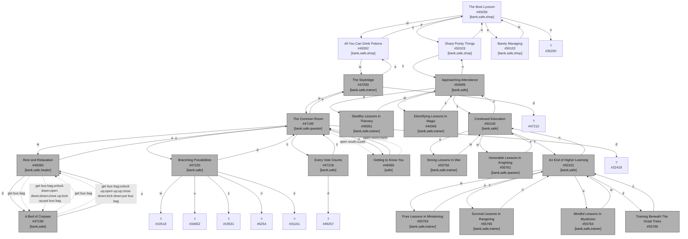

# The Boot Lyceum

22 rooms. Solid = direction; dotted = special exit.

```mermaid
flowchart TD
  r49256["The Boot Lyceum<br/>#49256<br/>[bank,safe,shop]"]
  r50103["Sharp Pointy Things<br/>#50103<br/>[bank,safe,shop]"]
  r49392["All You Can Drink Potions<br/>#49392<br/>[bank,safe,shop]"]
  r50102["Barely Managing<br/>#50102<br/>[bank,safe,shop]"]
  r47200["The Skybridge<br/>#47200<br/>[bank,safe,trainer]"]
  r50099["Approaching Attendance<br/>#50099<br/>[bank,safe]"]
  r47195["The Common Room<br/>#47195<br/>[bank,safe,questor]"]
  r47220["Branching Possibilities<br/>#47220<br/>[bank,safe]"]
  r49260["Rest and Relaxation<br/>#49260<br/>[bank,safe,healer]"]
  r47218["Every Vote Counts<br/>#47218<br/>[bank,safe]"]
  r49393["Getting to Know You<br/>#49393<br/>[safe]"]
  r47196["A Bed of Corpses<br/>#47196<br/>[bank,safe]"]
  r49391["Stealthy Lessons in Thievery<br/>#49391<br/>[bank,safe,trainer]"]
  r49345["Electrifying Lessons in Magic<br/>#49345<br/>[bank,safe,trainer]"]
  r50100["Continued Education<br/>#50100<br/>[bank,safe]"]
  r55762["Strong Lessons In War<br/>#55762<br/>[bank,safe,trainer]"]
  r55761["Honorable Lessons In Knighting<br/>#55761<br/>[bank,safe,questor]"]
  r50101["An End of Higher Learning<br/>#50101<br/>[bank,safe]"]
  r55763["Pure Lessons in Ministering<br/>#55763<br/>[bank,safe,trainer]"]
  r55764["Mindful Lessons In Mysticism<br/>#55764<br/>[bank,safe,trainer]"]
  r55765["Survival Lessons In Rangering<br/>#55765<br/>[bank,safe,trainer]"]
  r55766["Training Beneath The Great Trees<br/>#55766"]
  r49256 -->|e| r50102
  r35200["?<br/>#35200"]
  r49256 -->|n| r35200
  r49256 -->|s| r50103
  r49256 -->|w| r49392
  r50103 -->|n| r49256
  r50103 -->|s| r50099
  r49392 -->|e| r49256
  r49392 -->|w| r47200
  r50102 -->|w| r49256
  r47210["?<br/>#47210"]
  r47200 -->|d| r47210
  r47200 -->|e| r49392
  r47200 -->|w| r47195
  r50099 -->|e| r49391
  r50099 -->|n| r50103
  r50099 -->|s| r50100
  r50099 -->|w| r49345
  r32418["?<br/>#32418"]
  r47195 -->|d| r32418
  r47195 -->|e| r47200
  r47195 -->|n| r47218
  r47195 -.->|open south;south| r49393
  r47195 -->|s| r49393
  r47195 -->|u| r47220
  r47195 -->|w| r49260
  r47220 -->|d| r47195
  r31161["?<br/>#31161"]
  r47220 -->|e| r31161
  r6254["?<br/>#6254"]
  r47220 -->|n| r6254
  r19531["?<br/>#19531"]
  r47220 -->|s| r19531
  r34652["?<br/>#34652"]
  r47220 -->|u| r34652
  r10518["?<br/>#10518"]
  r47220 -->|w| r10518
  r49260 -->|d| r47196
  r49260 -->|e| r47195
  r49260 -.->|get bus bag| r47196
  r49260 -.->|get bus bag;unlock down;open down;down;close up;lock up;put bus bag| r47196
  r49257["?<br/>#49257"]
  r47218 -->|d| r49257
  r47218 -->|s| r47195
  r49393 -->|n| r47195
  r49393 -.->|open north;north| r47195
  r47196 -.->|get bus bag| r49260
  r47196 -.->|get bus bag;unlock up;open up;up;close down;lock down;put bus bag| r49260
  r47196 -->|u| r49260
  r49391 -->|w| r50099
  r49345 -->|e| r50099
  r50100 -->|e| r55762
  r50100 -->|n| r50099
  r50100 -->|s| r50101
  r50100 -->|w| r55761
  r55762 -->|w| r50100
  r55761 -->|e| r50100
  r50101 -->|d| r55766
  r50101 -->|e| r55764
  r50101 -->|n| r50100
  r50101 -->|s| r55765
  r50101 -->|w| r55763
  r55763 -->|e| r50101
  r55764 -->|w| r50101
  r55765 -->|n| r50101
  r55766 -->|u| r50101
  classDef t_city fill:#b0b0b0,color:#111,stroke:#222
  class r47200 t_city
  class r50099 t_city
  class r47195 t_city
  class r47220 t_city
  class r49260 t_city
  class r47218 t_city
  class r49393 t_city
  class r47196 t_city
  class r49391 t_city
  class r49345 t_city
  class r50100 t_city
  class r55762 t_city
  class r55761 t_city
  class r50101 t_city
  class r55763 t_city
  class r55764 t_city
  class r55765 t_city
  class r55766 t_city
```
