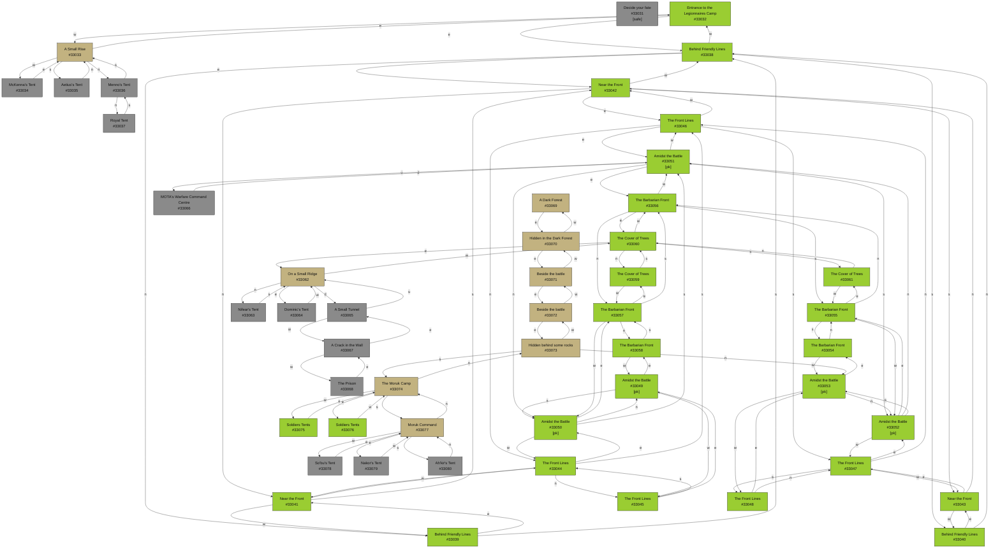

# The Call of Heroes

50 rooms. Solid = direction; dotted = special exit.

```mermaid
flowchart TD
  r33031["Decide your fate<br/>#33031<br/>[safe]"]
  r33032["Entrance to the Legionnaires Camp<br/>#33032"]
  r33033["A Small Rise<br/>#33033"]
  r33034["McKenna's Tent<br/>#33034"]
  r33035["Aetius's Tent<br/>#33035"]
  r33036["Menno's Tent<br/>#33036"]
  r33037["Royal Tent<br/>#33037"]
  r33038["Behind Friendly Lines<br/>#33038"]
  r33039["Behind Friendly Lines<br/>#33039"]
  r33040["Behind Friendly Lines<br/>#33040"]
  r33041["Near the Front<br/>#33041"]
  r33042["Near the Front<br/>#33042"]
  r33043["Near the Front<br/>#33043"]
  r33044["The Front Lines<br/>#33044"]
  r33045["The Front Lines<br/>#33045"]
  r33046["The Front Lines<br/>#33046"]
  r33047["The Front Lines<br/>#33047"]
  r33048["The Front Lines<br/>#33048"]
  r33049["Amidst the Battle<br/>#33049<br/>[pk]"]
  r33050["Amidst the Battle<br/>#33050<br/>[pk]"]
  r33051["Amidst the Battle<br/>#33051<br/>[pk]"]
  r33052["Amidst the Battle<br/>#33052<br/>[pk]"]
  r33053["Amidst the Battle<br/>#33053<br/>[pk]"]
  r33054["The Barbarian Front<br/>#33054"]
  r33055["The Barbarian Front<br/>#33055"]
  r33056["The Barbarian Front<br/>#33056"]
  r33057["The Barbarian Front<br/>#33057"]
  r33058["The Barbarian Front<br/>#33058"]
  r33059["The Cover of Trees<br/>#33059"]
  r33060["The Cover of Trees<br/>#33060"]
  r33061["The Cover of Trees<br/>#33061"]
  r33062["On a Small Ridge<br/>#33062"]
  r33063["Nifear's Tent<br/>#33063"]
  r33064["Dominic's Tent<br/>#33064"]
  r33065["A Small Tunnel<br/>#33065"]
  r33066["MOTA's Warfare Command Centre<br/>#33066"]
  r33067["A Crack in the Wall<br/>#33067"]
  r33068["The Prison<br/>#33068"]
  r33069["A Dark Forest<br/>#33069"]
  r33070["Hidden in the Dark Forest<br/>#33070"]
  r33071["Beside the battle<br/>#33071"]
  r33072["Beside the battle<br/>#33072"]
  r33073["Hidden behind some rocks<br/>#33073"]
  r33074["The Moruk Camp<br/>#33074"]
  r33075["Soldiers Tents<br/>#33075"]
  r33076["Soldiers Tents<br/>#33076"]
  r33077["Moruk Command<br/>#33077"]
  r33078["So'bu's Tent<br/>#33078"]
  r33079["Nakor's Tent<br/>#33079"]
  r33080["Ah'kir's Tent<br/>#33080"]
  r33032 -->|e| r33038
  r33032 -->|w| r33033
  r33033 -->|e| r33032
  r33033 -->|n| r33036
  r33033 -->|s| r33035
  r33033 -->|w| r33034
  r33034 -->|e| r33033
  r33035 -->|n| r33033
  r33036 -->|n| r33037
  r33036 -->|s| r33033
  r33037 -->|s| r33036
  r33038 -->|e| r33042
  r33038 -->|n| r33039
  r33038 -->|s| r33040
  r33038 -->|w| r33032
  r33039 -->|e| r33041
  r33039 -->|s| r33038
  r33040 -->|e| r33043
  r33040 -->|n| r33038
  r33041 -->|e| r33044
  r33041 -->|s| r33042
  r33041 -->|w| r33039
  r33042 -->|e| r33046
  r33042 -->|n| r33041
  r33042 -->|s| r33043
  r33042 -->|w| r33038
  r33043 -->|e| r33047
  r33043 -->|n| r33042
  r33043 -->|w| r33040
  r33044 -->|e| r33050
  r33044 -->|n| r33045
  r33044 -->|s| r33046
  r33044 -->|w| r33041
  r33045 -->|e| r33049
  r33045 -->|s| r33044
  r33046 -->|e| r33051
  r33046 -->|n| r33044
  r33046 -->|s| r33047
  r33046 -->|w| r33042
  r33047 -->|e| r33052
  r33047 -->|n| r33046
  r33047 -->|s| r33048
  r33047 -->|w| r33043
  r33048 -->|e| r33053
  r33048 -->|n| r33047
  r33049 -->|e| r33058
  r33049 -->|s| r33050
  r33049 -->|w| r33045
  r33050 -->|e| r33057
  r33050 -->|n| r33049
  r33050 -->|s| r33051
  r33050 -->|w| r33044
  r33051 -->|e| r33056
  r33051 -->|n| r33050
  r33051 -->|s| r33052
  r33051 -->|u| r33066
  r33051 -->|w| r33046
  r33052 -->|e| r33055
  r33052 -->|n| r33051
  r33052 -->|s| r33053
  r33052 -->|w| r33047
  r33053 -->|e| r33054
  r33053 -->|n| r33052
  r33053 -->|w| r33048
  r33054 -->|n| r33055
  r33054 -->|w| r33053
  r33055 -->|e| r33061
  r33055 -->|n| r33056
  r33055 -->|s| r33054
  r33055 -->|w| r33052
  r33056 -->|e| r33060
  r33056 -->|n| r33057
  r33056 -->|s| r33055
  r33056 -->|w| r33051
  r33057 -->|e| r33059
  r33057 -->|n| r33058
  r33057 -->|s| r33056
  r33057 -->|w| r33050
  r33058 -->|s| r33057
  r33058 -->|w| r33049
  r33059 -->|s| r33060
  r33059 -->|w| r33057
  r33060 -->|e| r33062
  r33060 -->|n| r33059
  r33060 -->|s| r33061
  r33060 -->|w| r33056
  r33061 -->|n| r33060
  r33061 -->|w| r33055
  r33062 -->|d| r33065
  r33062 -->|e| r33064
  r33062 -->|n| r33063
  r33062 -->|w| r33060
  r33063 -->|s| r33062
  r33064 -->|w| r33062
  r33065 -->|u| r33062
  r33065 -->|w| r33067
  r33066 -->|d| r33051
  r33067 -->|e| r33065
  r33067 -->|w| r33068
  r33068 -->|e| r33067
  r33069 -->|e| r33070
  r33070 -->|e| r33071
  r33070 -->|w| r33069
  r33071 -->|e| r33072
  r33071 -->|w| r33070
  r33072 -->|e| r33073
  r33072 -->|w| r33071
  r33073 -->|n| r33053
  r33073 -->|s| r33074
  r33073 -->|w| r33072
  r33074 -->|e| r33076
  r33074 -->|n| r33073
  r33074 -->|s| r33077
  r33074 -->|w| r33075
  r33075 -->|e| r33074
  r33076 -->|w| r33074
  r33077 -->|e| r33079
  r33077 -->|n| r33074
  r33077 -->|s| r33080
  r33077 -->|w| r33078
  r33078 -->|e| r33077
  r33079 -->|w| r33077
  r33080 -->|n| r33077
  classDef t_inside fill:#8a8a8a,color:#111,stroke:#222
  class r33031 t_inside
  classDef t_field fill:#9acd32,color:#111,stroke:#222
  class r33032 t_field
  classDef t_hills fill:#c2b280,color:#111,stroke:#222
  class r33033 t_hills
  class r33034 t_inside
  class r33035 t_inside
  class r33036 t_inside
  class r33037 t_inside
  class r33038 t_field
  class r33039 t_field
  class r33040 t_field
  class r33041 t_field
  class r33042 t_field
  class r33043 t_field
  class r33044 t_field
  class r33045 t_field
  class r33046 t_field
  class r33047 t_field
  class r33048 t_field
  class r33049 t_field
  class r33050 t_field
  class r33051 t_field
  class r33052 t_field
  class r33053 t_field
  class r33054 t_field
  class r33055 t_field
  class r33056 t_field
  class r33057 t_field
  class r33058 t_field
  class r33059 t_field
  class r33060 t_field
  class r33061 t_field
  class r33062 t_hills
  class r33063 t_inside
  class r33064 t_inside
  class r33065 t_inside
  class r33066 t_inside
  class r33067 t_inside
  class r33068 t_inside
  class r33069 t_hills
  class r33070 t_hills
  class r33071 t_hills
  class r33072 t_hills
  class r33073 t_hills
  class r33074 t_hills
  class r33075 t_field
  class r33076 t_field
  class r33077 t_hills
  class r33078 t_inside
  class r33079 t_inside
  class r33080 t_inside
```
