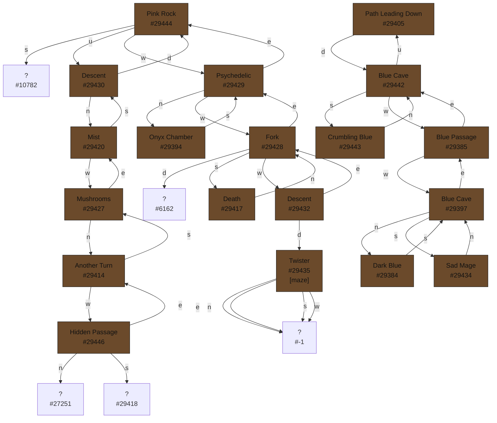

# The Chasm and The Catacombs

19 rooms. Solid = direction; dotted = special exit.

```mermaid
flowchart TD
  r29444["Pink Rock<br/>#29444"]
  r29429["Psychedelic<br/>#29429"]
  r29394["Onyx Chamber<br/>#29394"]
  r29428["Fork<br/>#29428"]
  r29432["Descent<br/>#29432"]
  r29417["Death<br/>#29417"]
  r29435["Twister<br/>#29435<br/>[maze]"]
  r29405["Path Leading Down<br/>#29405"]
  r29442["Blue Cave<br/>#29442"]
  r29385["Blue Passage<br/>#29385"]
  r29443["Crumbling Blue<br/>#29443"]
  r29397["Blue Cave<br/>#29397"]
  r29384["Dark Blue<br/>#29384"]
  r29434["Sad Mage<br/>#29434"]
  r29446["Hidden Passage<br/>#29446"]
  r29414["Another Turn<br/>#29414"]
  r29427["Mushrooms<br/>#29427"]
  r29420["Mist<br/>#29420"]
  r29430["Descent<br/>#29430"]
  r10782["?<br/>#10782"]
  r29444 -->|s| r10782
  r29444 -->|u| r29430
  r29444 -->|w| r29429
  r29429 -->|e| r29444
  r29429 -->|n| r29394
  r29429 -->|w| r29428
  r29394 -->|s| r29429
  r6162["?<br/>#6162"]
  r29428 -->|d| r6162
  r29428 -->|e| r29429
  r29428 -->|s| r29417
  r29428 -->|w| r29432
  r29432 -->|d| r29435
  r29432 -->|e| r29428
  r29417 -->|n| r29428
  r-1["?<br/>#-1"]
  r29435 -->|e| r-1
  r29435 -->|n| r-1
  r29435 -->|s| r-1
  r29435 -->|w| r-1
  r29405 -->|d| r29442
  r29442 -->|s| r29443
  r29442 -->|u| r29405
  r29442 -->|w| r29385
  r29385 -->|e| r29442
  r29385 -->|w| r29397
  r29443 -->|n| r29442
  r29397 -->|e| r29385
  r29397 -->|n| r29384
  r29397 -->|s| r29434
  r29384 -->|s| r29397
  r29434 -->|n| r29397
  r29446 -->|e| r29414
  r27251["?<br/>#27251"]
  r29446 -->|n| r27251
  r29418["?<br/>#29418"]
  r29446 -->|s| r29418
  r29414 -->|s| r29427
  r29414 -->|w| r29446
  r29427 -->|e| r29420
  r29427 -->|n| r29414
  r29420 -->|s| r29430
  r29420 -->|w| r29427
  r29430 -->|d| r29444
  r29430 -->|n| r29420
  classDef t_underground fill:#6b4a2b,color:#111,stroke:#222
  class r29444 t_underground
  class r29429 t_underground
  class r29394 t_underground
  class r29428 t_underground
  class r29432 t_underground
  class r29417 t_underground
  class r29435 t_underground
  class r29405 t_underground
  class r29442 t_underground
  class r29385 t_underground
  class r29443 t_underground
  class r29397 t_underground
  class r29384 t_underground
  class r29434 t_underground
  class r29446 t_underground
  class r29414 t_underground
  class r29427 t_underground
  class r29420 t_underground
  class r29430 t_underground
```
