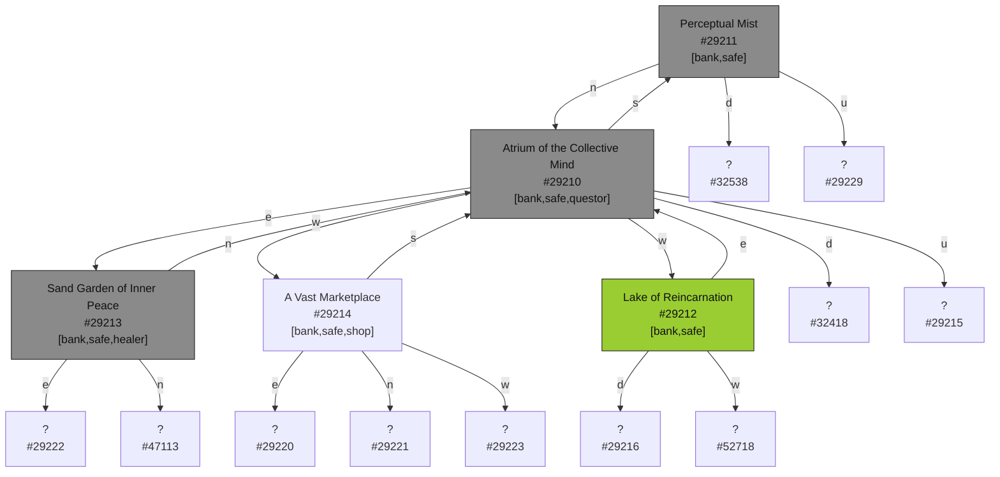

# The Collective Mind of Tao

5 rooms. Solid = direction; dotted = special exit.

```mermaid
flowchart TD
  r29211["Perceptual Mist<br/>#29211<br/>[bank,safe]"]
  r29210["Atrium of the Collective Mind<br/>#29210<br/>[bank,safe,questor]"]
  r29213["Sand Garden of Inner Peace<br/>#29213<br/>[bank,safe,healer]"]
  r29212["Lake of Reincarnation<br/>#29212<br/>[bank,safe]"]
  r29214["A Vast Marketplace<br/>#29214<br/>[bank,safe,shop]"]
  r32538["?<br/>#32538"]
  r29211 -->|d| r32538
  r29211 -->|n| r29210
  r29229["?<br/>#29229"]
  r29211 -->|u| r29229
  r32418["?<br/>#32418"]
  r29210 -->|d| r32418
  r29210 -->|e| r29213
  r29210 -->|n| r29214
  r29210 -->|s| r29211
  r29215["?<br/>#29215"]
  r29210 -->|u| r29215
  r29210 -->|w| r29212
  r29222["?<br/>#29222"]
  r29213 -->|e| r29222
  r47113["?<br/>#47113"]
  r29213 -->|n| r47113
  r29213 -->|w| r29210
  r29216["?<br/>#29216"]
  r29212 -->|d| r29216
  r29212 -->|e| r29210
  r52718["?<br/>#52718"]
  r29212 -->|w| r52718
  r29220["?<br/>#29220"]
  r29214 -->|e| r29220
  r29221["?<br/>#29221"]
  r29214 -->|n| r29221
  r29214 -->|s| r29210
  r29223["?<br/>#29223"]
  r29214 -->|w| r29223
  classDef t_inside fill:#8a8a8a,color:#111,stroke:#222
  class r29211 t_inside
  class r29210 t_inside
  class r29213 t_inside
  classDef t_field fill:#9acd32,color:#111,stroke:#222
  class r29212 t_field
```
