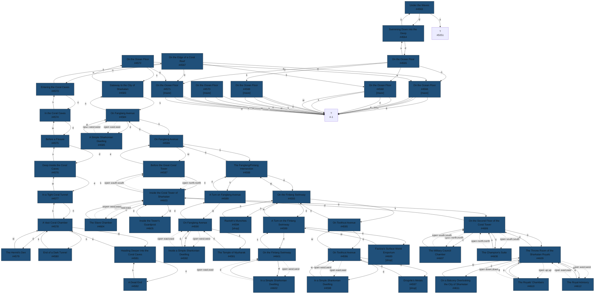

# The Coral Kingdom

50 rooms. Solid = direction; dotted = special exit.

```mermaid
flowchart TD
  r4563["Under the Waves<br/>#4563"]
  r4564["Swimming Down into the Deep<br/>#4564"]
  r4565["On the Ocean Floor<br/>#4565"]
  r4566["On the Ocean Floor<br/>#4566<br/>[maze]"]
  r4568["On the Ocean Floor<br/>#4568<br/>[maze]"]
  r4569["On the Ocean Floor<br/>#4569<br/>[maze]"]
  r4570["On the Ocean Floor<br/>#4570<br/>[maze]"]
  r4567["On the Edge of a Coral Reef<br/>#4567"]
  r4573["Entering the Coral Caves<br/>#4573"]
  r4574["In the Coral Caves<br/>#4574"]
  r4575["Before a Fissure<br/>#4575"]
  r4576["Deep Inside the Coral Caves<br/>#4576"]
  r4577["In a Tight Coral Tunnel<br/>#4577"]
  r4578["A Vast Coral Chamber<br/>#4578"]
  r4579["The Hermit's Den<br/>#4579"]
  r4580["End of a Dark Tunnel<br/>#4580"]
  r4581["Heading Deeper into the Coral Caves<br/>#4581"]
  r4582["A Dead End<br/>#4582"]
  r4571["On the Ocean Floor<br/>#4571<br/>[maze]"]
  r4572["On the Ocean Floor<br/>#4572"]
  r4583["Gateway to the City of Sharkatan<br/>#4583"]
  r4584["On Fanglang Avenue<br/>#4584"]
  r4585["A Simple Sharkonian Dwelling<br/>#4585"]
  r4586["On Fanglang Avenue<br/>#4586"]
  r4587["Before the Great Coral Tower<br/>#4587"]
  r4603["Inside the Coral Tower of Sharkatan<br/>#4603"]
  r4604["The Slave Chamber<br/>#4604"]
  r4605["Inside the Tower's Guardpost<br/>#4605"]
  r4588["The Fanglang/Finlang Intersection<br/>#4588"]
  r4593["On the Finlang Swimway<br/>#4593"]
  r4589["A Turn on Fanglang Avenue<br/>#4589"]
  r4590["On Fanglang Avenue<br/>#4590"]
  r4592["Inside a Simple Sharkonian Dwelling<br/>#4592"]
  r4591["The Temple of Mysharak<br/>#4591"]
  r4594["Raztoth's Munchies<br/>#4594<br/>[shop]"]
  r4595["On Toothcut Avenue<br/>#4595"]
  r4599["A Turn on the Finlang Swimway<br/>#4599"]
  r4596["On Toothcut Avenue<br/>#4596"]
  r4597["Grogvile's Metals<br/>#4597<br/>[shop]"]
  r4598["In a Simple Sharkonian Dwelling<br/>#4598"]
  r4601["On the Finlang Swimway<br/>#4601"]
  r4602["In a Simple Sharkonian Dwelling<br/>#4602"]
  r4600["Factiza's Surface World Emporium<br/>#4600<br/>[shop]"]
  r4606["On the Second Floor of the Coral Tower<br/>#4606"]
  r4607["The Military Council Chamber<br/>#4607"]
  r4608["The Champion's Suite<br/>#4608"]
  r4609["The Throne Room of the Sharkatan Royals<br/>#4609"]
  r4612["The Royal Advisory<br/>#4612"]
  r4610["The Royals' Chambers<br/>#4610"]
  r4611["On a Balcony Overlooking the City of Sharkatan<br/>#4611"]
  r4563 -->|d| r4564
  r5051["?<br/>#5051"]
  r4563 -->|u| r5051
  r4564 -->|d| r4565
  r4564 -->|u| r4563
  r4565 -->|e| r4568
  r4565 -->|n| r4566
  r4565 -->|s| r4569
  r4565 -->|u| r4564
  r4565 -->|w| r4571
  r-1["?<br/>#-1"]
  r4566 -->|e| r-1
  r4566 -->|n| r-1
  r4566 -->|s| r-1
  r4566 -->|w| r-1
  r4568 -->|e| r-1
  r4568 -->|n| r-1
  r4568 -->|s| r-1
  r4568 -->|w| r-1
  r4569 -->|e| r-1
  r4569 -->|n| r-1
  r4569 -->|s| r-1
  r4569 -->|w| r-1
  r4570 -->|n| r-1
  r4570 -->|s| r-1
  r4570 -->|w| r-1
  r4567 -->|e| r4571
  r4567 -->|n| r4573
  r4567 -->|s| r4568
  r4567 -->|w| r4566
  r4573 -->|n| r4574
  r4573 -->|s| r4567
  r4574 -->|e| r4575
  r4574 -->|s| r4573
  r4575 -->|d| r4576
  r4575 -->|w| r4574
  r4576 -->|e| r4577
  r4576 -->|u| r4575
  r4577 -->|n| r4578
  r4577 -->|w| r4576
  r4578 -->|e| r4579
  r4578 -->|n| r4580
  r4578 -->|s| r4577
  r4578 -->|w| r4581
  r4579 -->|w| r4578
  r4580 -->|s| r4578
  r4581 -->|e| r4578
  r4581 -->|n| r4582
  r4582 -->|s| r4581
  r4571 -->|e| r-1
  r4571 -->|n| r-1
  r4571 -->|s| r-1
  r4571 -->|w| r-1
  r4572 -->|e| r4566
  r4572 -->|n| r4571
  r4572 -->|s| r4583
  r4583 -->|n| r4572
  r4583 -->|s| r4584
  r4584 -->|e| r4585
  r4584 -->|n| r4583
  r4584 -.->|open east;east| r4585
  r4584 -->|s| r4586
  r4585 -.->|open west;west| r4584
  r4585 -->|w| r4584
  r4586 -->|n| r4584
  r4586 -->|s| r4588
  r4586 -->|w| r4587
  r4587 -->|e| r4586
  r4587 -->|n| r4603
  r4587 -.->|open north;north| r4603
  r4603 -->|e| r4604
  r4603 -.->|open east;east| r4604
  r4603 -.->|open south;south| r4587
  r4603 -->|s| r4587
  r4603 -->|u| r4606
  r4603 -->|w| r4605
  r4604 -.->|open west;west| r4603
  r4604 -->|w| r4603
  r4605 -->|e| r4603
  r4588 -->|e| r4593
  r4588 -->|n| r4586
  r4588 -->|s| r4589
  r4593 -->|e| r4599
  r4593 -->|n| r4594
  r4593 -->|s| r4595
  r4593 -->|w| r4588
  r4589 -->|n| r4588
  r4589 -->|w| r4590
  r4590 -->|e| r4589
  r4590 -.->|open west;west| r4592
  r4590 -->|s| r4591
  r4590 -->|w| r4592
  r4592 -->|e| r4590
  r4592 -.->|open east;east| r4590
  r4591 -->|n| r4590
  r4594 -->|s| r4593
  r4595 -->|e| r4596
  r4595 -->|n| r4593
  r4599 -->|e| r4600
  r4599 -->|n| r4601
  r4599 -->|w| r4593
  r4596 -->|e| r4598
  r4596 -.->|open east;east| r4598
  r4596 -->|s| r4597
  r4596 -->|w| r4595
  r4597 -->|n| r4596
  r4598 -.->|open west;west| r4596
  r4598 -->|w| r4596
  r4601 -.->|open west;west| r4602
  r4601 -->|s| r4599
  r4601 -->|w| r4602
  r4602 -->|e| r4601
  r4602 -.->|open east;east| r4601
  r4600 -->|w| r4599
  r4606 -->|d| r4603
  r4606 -->|n| r4607
  r4606 -.->|open north;north| r4607
  r4606 -.->|open south;south| r4608
  r4606 -->|s| r4608
  r4606 -->|u| r4609
  r4607 -.->|open south;south| r4606
  r4607 -->|s| r4606
  r4608 -->|n| r4606
  r4608 -.->|open north;north| r4606
  r4609 -->|d| r4606
  r4609 -->|e| r4611
  r4609 -.->|open up;up| r4610
  r4609 -.->|open west;west| r4612
  r4609 -->|u| r4610
  r4609 -->|w| r4612
  r4612 -->|e| r4609
  r4612 -.->|open east;east| r4609
  r4610 -->|d| r4609
  r4610 -.->|open down;down| r4609
  r4611 -->|w| r4609
  classDef t_underwater fill:#20507a,color:#111,stroke:#222
  class r4563 t_underwater
  class r4564 t_underwater
  class r4565 t_underwater
  class r4566 t_underwater
  class r4568 t_underwater
  class r4569 t_underwater
  class r4570 t_underwater
  class r4567 t_underwater
  class r4573 t_underwater
  class r4574 t_underwater
  class r4575 t_underwater
  class r4576 t_underwater
  class r4577 t_underwater
  class r4578 t_underwater
  class r4579 t_underwater
  class r4580 t_underwater
  class r4581 t_underwater
  class r4582 t_underwater
  class r4571 t_underwater
  class r4572 t_underwater
  class r4583 t_underwater
  class r4584 t_underwater
  class r4585 t_underwater
  class r4586 t_underwater
  class r4587 t_underwater
  class r4603 t_underwater
  class r4604 t_underwater
  class r4605 t_underwater
  class r4588 t_underwater
  class r4593 t_underwater
  class r4589 t_underwater
  class r4590 t_underwater
  class r4592 t_underwater
  class r4591 t_underwater
  class r4594 t_underwater
  class r4595 t_underwater
  class r4599 t_underwater
  class r4596 t_underwater
  class r4597 t_underwater
  class r4598 t_underwater
  class r4601 t_underwater
  class r4602 t_underwater
  class r4600 t_underwater
  class r4606 t_underwater
  class r4607 t_underwater
  class r4608 t_underwater
  class r4609 t_underwater
  class r4612 t_underwater
  class r4610 t_underwater
  class r4611 t_underwater
```
