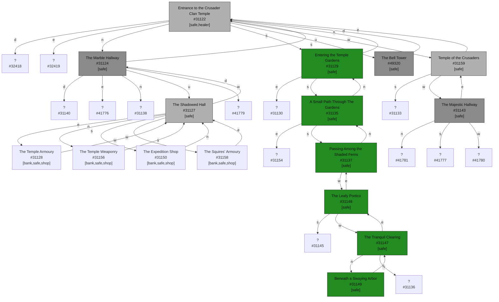

# The Crusader Clan

16 rooms. Solid = direction; dotted = special exit.

```mermaid
flowchart TD
  r31122["Entrance to the Crusader Clan Temple<br/>#31122<br/>[safe,healer]"]
  r31124["The Marble Hallway<br/>#31124<br/>[safe]"]
  r31127["The Shadowed Hall<br/>#31127<br/>[safe]"]
  r31158["The Squires' Armoury<br/>#31158<br/>[bank,safe,shop]"]
  r31128["The Temple Armoury<br/>#31128<br/>[bank,safe,shop]"]
  r31156["The Temple Weaponry<br/>#31156<br/>[bank,safe,shop]"]
  r31150["The Expedition Shop<br/>#31150<br/>[bank,safe,shop]"]
  r31129["Entering the Temple Gardens<br/>#31129<br/>[safe]"]
  r31135["A Small Path Through The Gardens<br/>#31135<br/>[safe]"]
  r31137["Passing Among the Shaded Ferns<br/>#31137<br/>[safe]"]
  r31148["The Leafy Portico<br/>#31148<br/>[safe]"]
  r31147["The Tranquil Clearing<br/>#31147<br/>[safe]"]
  r31149["Beneath a Swaying Arbor<br/>#31149<br/>[safe]"]
  r31159["Temple of the Crusaders<br/>#31159<br/>[safe]"]
  r31143["The Majestic Hallway<br/>#31143<br/>[safe]"]
  r49320["The Bell Tower<br/>#49320<br/>[safe]"]
  r32418["?<br/>#32418"]
  r31122 -->|d| r32418
  r32419["?<br/>#32419"]
  r31122 -->|e| r32419
  r31122 -->|n| r31124
  r31122 -->|s| r31129
  r31122 -->|u| r49320
  r31122 -->|w| r31159
  r31140["?<br/>#31140"]
  r31124 -->|d| r31140
  r41776["?<br/>#41776"]
  r31124 -->|e| r41776
  r31138["?<br/>#31138"]
  r31124 -->|n| r31138
  r31124 -->|s| r31122
  r31124 -->|u| r31127
  r41779["?<br/>#41779"]
  r31124 -->|w| r41779
  r31127 -->|d| r31124
  r31127 -->|e| r31128
  r31127 -->|n| r31156
  r31127 -->|s| r31150
  r31127 -->|w| r31158
  r31158 -->|e| r31127
  r31128 -->|w| r31127
  r31156 -->|s| r31127
  r31150 -->|n| r31127
  r31130["?<br/>#31130"]
  r31129 -->|e| r31130
  r31129 -->|n| r31122
  r31129 -->|s| r31135
  r31154["?<br/>#31154"]
  r31135 -->|e| r31154
  r31135 -->|n| r31129
  r31135 -->|s| r31137
  r31137 -->|n| r31135
  r31137 -->|w| r31148
  r31148 -->|e| r31137
  r31145["?<br/>#31145"]
  r31148 -->|s| r31145
  r31148 -->|w| r31147
  r31147 -->|e| r31148
  r31147 -->|n| r31149
  r31136["?<br/>#31136"]
  r31147 -->|w| r31136
  r31149 -->|s| r31147
  r31159 -->|e| r31122
  r31133["?<br/>#31133"]
  r31159 -->|s| r31133
  r31159 -->|w| r31143
  r31143 -->|e| r31159
  r41781["?<br/>#41781"]
  r31143 -->|n| r41781
  r41777["?<br/>#41777"]
  r31143 -->|s| r41777
  r41780["?<br/>#41780"]
  r31143 -->|w| r41780
  r49320 -->|d| r31122
  classDef t_city fill:#b0b0b0,color:#111,stroke:#222
  class r31122 t_city
  classDef t_inside fill:#8a8a8a,color:#111,stroke:#222
  class r31124 t_inside
  class r31127 t_city
  classDef t_forest fill:#228b22,color:#111,stroke:#222
  class r31129 t_forest
  class r31135 t_forest
  class r31137 t_forest
  class r31148 t_forest
  class r31147 t_forest
  class r31149 t_forest
  class r31159 t_city
  class r31143 t_inside
  class r49320 t_inside
```
