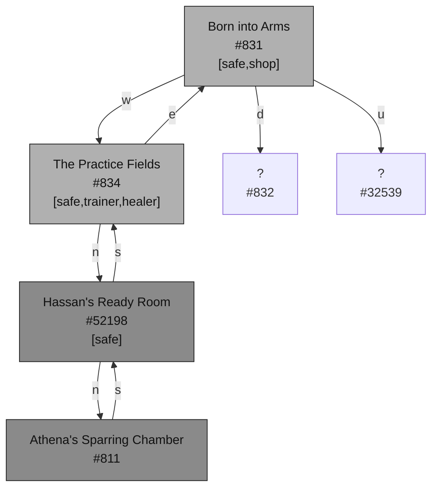

# The Emerald Clan HQ

4 rooms. Solid = direction; dotted = special exit.

```mermaid
flowchart TD
  r831["Born into Arms<br/>#831<br/>[safe,shop]"]
  r834["The Practice Fields<br/>#834<br/>[safe,trainer,healer]"]
  r52198["Hassan's Ready Room <br/>#52198<br/>[safe]"]
  r811["Athena's Sparring Chamber<br/>#811"]
  r832["?<br/>#832"]
  r831 -->|d| r832
  r32539["?<br/>#32539"]
  r831 -->|u| r32539
  r831 -->|w| r834
  r834 -->|e| r831
  r834 -->|n| r52198
  r52198 -->|n| r811
  r52198 -->|s| r834
  r811 -->|s| r52198
  classDef t_city fill:#b0b0b0,color:#111,stroke:#222
  class r831 t_city
  class r834 t_city
  classDef t_inside fill:#8a8a8a,color:#111,stroke:#222
  class r52198 t_inside
  class r811 t_inside
```
