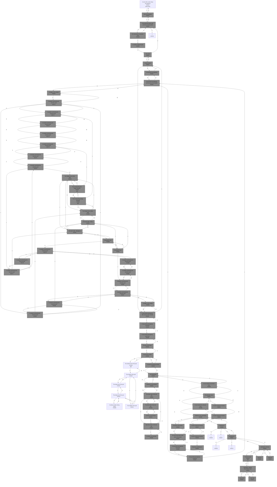

# The First Ascent

76 rooms. Solid = direction; dotted = special exit.

```mermaid
flowchart TD
  r43150["A room with a view! (Atop the platform)<br/>#43150<br/>[safe,shop]"]
  r43151["Dark and forgotten<br/>#43151"]
  r43152["A focusing lens glows with enormous arcane power<br/>#43152"]
  r43153["Port side power conversion room<br/>#43153"]
  r43155["A complex reduction gear<br/>#43155"]
  r43157["The shaft<br/>#43157"]
  r43161["Control station<br/>#43161"]
  r43162["A long sterile passageway<br/>#43162"]
  r43163["A long sterile passageway with access to the catwalk<br/>#43163"]
  r43190["A bridge to the catwalk<br/>#43190"]
  r43164["A long sterile passageway continues<br/>#43164"]
  r43165["A long sterile passageway ends here<br/>#43165"]
  r43170["A catwalk overlooking the exercise yard<br/>#43170"]
  r43171["A catwalk overlooking the exercise yard<br/>#43171"]
  r43169["A catwalk overlooking the exercise yard<br/>#43169"]
  r43172["A catwalk overlooking the exercise yard<br/>#43172"]
  r43173["A catwalk overlooking the exercise yard<br/>#43173"]
  r43174["A catwalk overlooking the exercise yard<br/>#43174"]
  r43175["A catwalk overlooking the exercise yard<br/>#43175"]
  r43176["A catwalk overlooking the exercise yard<br/>#43176"]
  r43186["The Weight Room (East side)<br/>#43186"]
  r43185["The Combat Ring (NO Magic Allowed)<br/>#43185<br/>[pk]"]
  r43184["The Combat Ring (Magic allowed)<br/>#43184<br/>[pk]"]
  r43183["The Weight Room (West side)<br/>#43183"]
  r43191["Arts and Crafts - Shivs<br/>#43191"]
  r43182["Basketball Court<br/>#43182"]
  r43188["Basketball Court<br/>#43188"]
  r43187["Arts and Crafts - Bludgeons<br/>#43187"]
  r43179["A catwalk overlooking the exercise yard<br/>#43179"]
  r43180["A catwalk overlooking the exercise yard<br/>#43180"]
  r43181["A catwalk overlooking the exercise yard<br/>#43181"]
  r43178["A catwalk overlooking the exercise yard<br/>#43178"]
  r43177["A catwalk overlooking the exercise yard<br/>#43177"]
  r43168["A catwalk overlooking the exercise yard<br/>#43168"]
  r43167["A catwalk overlooking the exercise yard<br/>#43167"]
  r43166["A catwalk overlooking the exercise yard<br/>#43166"]
  r43189["A bridge to the catwalk<br/>#43189"]
  r43160["A long sterile passageway with access to the catwalk<br/>#43160"]
  r43159["A long sterile passageway continues<br/>#43159"]
  r43158["A long sterile passageway ends here<br/>#43158"]
  r43192["The top of the stairs<br/>#43192"]
  r43193["A branching corridor<br/>#43193"]
  r43240["The shallow end of the pool<br/>#43240<br/>[pk]"]
  r43242["The middle of the pool<br/>#43242"]
  r43244["The deep end of the pool<br/>#43244"]
  r43243["The deep end of the pool<br/>#43243"]
  r43239["A stubby wooden diving board<br/>#43239"]
  r43241["The middle of the pool<br/>#43241"]
  r43194["A stretch of echoing corridor<br/>#43194"]
  r43195["An intersection<br/>#43195"]
  r43233["Entrance to the bull pen<br/>#43233"]
  r43235["The South side of the bull pen<br/>#43235"]
  r43237["Near the center of the bull pen<br/>#43237"]
  r43238["A corner in the bull pen<br/>#43238"]
  r43234["A corner in the bull pen<br/>#43234"]
  r43236["The North side of the bull pen<br/>#43236"]
  r43196["A room beside the elevator room<br/>#43196"]
  r43197["The elevator room<br/>#43197"]
  r43198["A room beside the elevator room<br/>#43198"]
  r43199["Gateway to the cell blocks<br/>#43199"]
  r43202["Cell block A<br/>#43202"]
  r43211["Cell Block B<br/>#43211"]
  r43220["Cell block C (Front)<br/>#43220"]
  r43219["Trustee lounge<br/>#43219<br/>[pk]"]
  r43221["Cell block C (Back) TRUSTEES ONLY<br/>#43221"]
  r43222["Cell C2B<br/>#43222"]
  r43223["Cell C1B<br/>#43223"]
  r43224["Cell C1F<br/>#43224"]
  r43225["Cell C2F<br/>#43225"]
  r43200["The back of the prison<br/>#43200"]
  r43201["The top of the stairs at the back of the prison<br/>#43201"]
  r43245["A cell in maximum security<br/>#43245"]
  r43246["A cell in maximum security<br/>#43246"]
  r43247["A cell in maximum security<br/>#43247"]
  r43248["A cell in maximum security<br/>#43248"]
  r43249["Maximum confinement<br/>#43249"]
  r43150 -->|u| r43151
  r43151 -->|d| r43150
  r43151 -->|u| r43152
  r43152 -->|d| r43151
  r43152 -->|n| r43153
  r43154["?<br/>#43154"]
  r43152 -->|s| r43154
  r43153 -->|e| r43155
  r43153 -->|s| r43152
  r43155 -->|u| r43157
  r43157 -->|d| r43152
  r43157 -->|e| r43161
  r43161 -->|n| r43162
  r43161 -->|s| r43160
  r43161 -->|w| r43157
  r43162 -->|n| r43163
  r43162 -->|s| r43161
  r43163 -->|e| r43190
  r43163 -->|n| r43164
  r43163 -->|s| r43162
  r43190 -->|e| r43170
  r43190 -->|w| r43163
  r43164 -->|n| r43165
  r43164 -->|s| r43163
  r43165 -->|s| r43164
  r43165 -->|u| r43201
  r43170 -->|n| r43171
  r43170 -->|s| r43169
  r43170 -->|w| r43190
  r43171 -->|e| r43172
  r43171 -->|s| r43170
  r43169 -->|d| r43183
  r43169 -->|n| r43170
  r43169 -->|s| r43168
  r43172 -->|e| r43173
  r43172 -->|w| r43171
  r43173 -->|e| r43174
  r43173 -->|w| r43172
  r43174 -->|s| r43175
  r43174 -->|w| r43173
  r43175 -->|n| r43174
  r43175 -->|s| r43176
  r43176 -->|d| r43186
  r43176 -->|n| r43175
  r43176 -->|s| r43177
  r43186 -->|n| r43185
  r43186 -->|s| r43187
  r43186 -->|w| r43183
  r43185 -->|s| r43186
  r43185 -->|u| r43174
  r43185 -->|w| r43184
  r43184 -->|e| r43185
  r43184 -->|s| r43183
  r43184 -->|u| r43171
  r43183 -->|e| r43186
  r43183 -->|n| r43184
  r43183 -->|s| r43191
  r43191 -->|e| r43187
  r43191 -->|n| r43183
  r43191 -->|s| r43182
  r43182 -->|e| r43188
  r43182 -->|n| r43191
  r43182 -->|u| r43166
  r43188 -->|n| r43187
  r43188 -->|u| r43179
  r43188 -->|w| r43182
  r43187 -->|n| r43186
  r43187 -->|s| r43188
  r43187 -->|w| r43191
  r43179 -->|n| r43178
  r43179 -->|w| r43180
  r43180 -->|e| r43179
  r43180 -->|w| r43181
  r43181 -->|e| r43180
  r43181 -->|w| r43166
  r43178 -->|n| r43177
  r43178 -->|s| r43179
  r43177 -->|d| r43187
  r43177 -->|n| r43176
  r43177 -->|s| r43178
  r43168 -->|d| r43191
  r43168 -->|n| r43169
  r43168 -->|s| r43167
  r43167 -->|n| r43168
  r43167 -->|s| r43166
  r43167 -->|w| r43189
  r43166 -->|e| r43181
  r43166 -->|n| r43167
  r43189 -->|e| r43167
  r43189 -->|w| r43160
  r43160 -->|e| r43189
  r43160 -->|n| r43161
  r43160 -->|s| r43159
  r43159 -->|n| r43160
  r43159 -->|s| r43158
  r43158 -->|n| r43159
  r43158 -->|u| r43192
  r43192 -->|d| r43158
  r43192 -->|n| r43193
  r43193 -->|e| r43240
  r43193 -->|n| r43194
  r43193 -->|s| r43192
  r43240 -->|e| r43242
  r43240 -->|w| r43193
  r43242 -->|e| r43244
  r43242 -->|n| r43241
  r43242 -->|w| r43240
  r43244 -->|n| r43243
  r43244 -->|w| r43242
  r43243 -->|e| r43239
  r43243 -->|s| r43244
  r43243 -->|w| r43241
  r43239 -->|w| r43243
  r43241 -->|e| r43243
  r43241 -->|s| r43242
  r43194 -->|n| r43195
  r43194 -->|s| r43193
  r43195 -->|n| r43196
  r43195 -->|s| r43194
  r43195 -->|w| r43233
  r43233 -->|e| r43195
  r43233 -->|w| r43235
  r43235 -->|e| r43233
  r43235 -->|n| r43236
  r43235 -->|w| r43237
  r43237 -->|e| r43235
  r43237 -->|n| r43234
  r43237 -->|s| r43238
  r43238 -->|n| r43237
  r43234 -->|e| r43236
  r43234 -->|s| r43237
  r43236 -->|s| r43235
  r43236 -->|w| r43234
  r43196 -->|n| r43197
  r43196 -->|s| r43195
  r43197 -->|n| r43198
  r43197 -->|s| r43196
  r43197 -->|u| r43245
  r43198 -->|n| r43199
  r43198 -->|s| r43197
  r43199 -->|n| r43200
  r43199 -->|s| r43198
  r43199 -->|w| r43202
  r43203["?<br/>#43203"]
  r43202 -->|d| r43203
  r43202 -->|e| r43199
  r43207["?<br/>#43207"]
  r43202 -->|u| r43207
  r43202 -->|w| r43211
  r43226["?<br/>#43226"]
  r43211 -->|d| r43226
  r43211 -->|e| r43202
  r43212["?<br/>#43212"]
  r43211 -->|u| r43212
  r43211 -->|w| r43220
  r43220 -->|e| r43211
  r43220 -->|n| r43224
  r43220 -->|s| r43225
  r43220 -->|w| r43219
  r43219 -->|e| r43220
  r43219 -->|w| r43221
  r43221 -->|e| r43219
  r43221 -->|n| r43223
  r43221 -->|s| r43222
  r43222 -->|n| r43221
  r43223 -->|s| r43221
  r43224 -->|s| r43220
  r43225 -->|n| r43220
  r43200 -->|n| r43201
  r43200 -->|s| r43199
  r43201 -->|d| r43165
  r43201 -->|s| r43200
  r43245 -->|d| r43197
  r43245 -->|u| r43246
  r43246 -->|d| r43245
  r43246 -->|u| r43247
  r43247 -->|d| r43246
  r43247 -->|u| r43248
  r43248 -->|d| r43247
  r43248 -->|s| r43249
  classDef t_inside fill:#8a8a8a,color:#111,stroke:#222
  class r43151 t_inside
  class r43152 t_inside
  class r43153 t_inside
  class r43155 t_inside
  class r43157 t_inside
  class r43161 t_inside
  class r43162 t_inside
  class r43163 t_inside
  class r43190 t_inside
  class r43164 t_inside
  class r43165 t_inside
  class r43170 t_inside
  class r43171 t_inside
  class r43169 t_inside
  class r43172 t_inside
  class r43173 t_inside
  class r43174 t_inside
  class r43175 t_inside
  class r43176 t_inside
  class r43186 t_inside
  class r43185 t_inside
  class r43184 t_inside
  class r43183 t_inside
  class r43191 t_inside
  class r43182 t_inside
  class r43188 t_inside
  class r43187 t_inside
  class r43179 t_inside
  class r43180 t_inside
  class r43181 t_inside
  class r43178 t_inside
  class r43177 t_inside
  class r43168 t_inside
  class r43167 t_inside
  class r43166 t_inside
  class r43189 t_inside
  class r43160 t_inside
  class r43159 t_inside
  class r43158 t_inside
  class r43192 t_inside
  class r43193 t_inside
  class r43194 t_inside
  class r43195 t_inside
  class r43233 t_inside
  class r43235 t_inside
  class r43237 t_inside
  class r43238 t_inside
  class r43234 t_inside
  class r43236 t_inside
  class r43196 t_inside
  class r43197 t_inside
  class r43198 t_inside
  class r43199 t_inside
  class r43202 t_inside
  class r43211 t_inside
  class r43220 t_inside
  class r43219 t_inside
  class r43221 t_inside
  class r43222 t_inside
  class r43223 t_inside
  class r43224 t_inside
  class r43225 t_inside
  class r43200 t_inside
  class r43201 t_inside
  class r43245 t_inside
  class r43246 t_inside
  class r43247 t_inside
  class r43248 t_inside
  class r43249 t_inside
```
