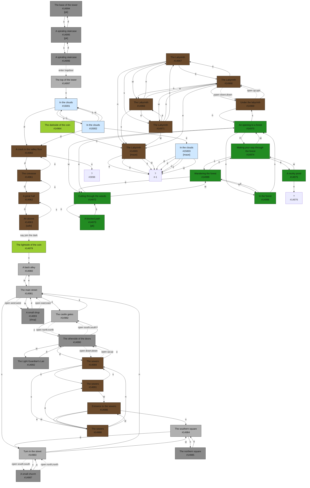

# The Flying Citadel

40 rooms. Solid = direction; dotted = special exit.

```mermaid
flowchart TD
  r14960["A crack in the valley floor<br/>#14960"]
  r14961["The crevasse<br/>#14961"]
  r14962["A great hall<br/>#14962"]
  r14963["An alcove<br/>#14963<br/>[safe]"]
  r14964["The darkside of the coin<br/>#14964"]
  r14965["The Labyrinth<br/>#14965<br/>[maze]"]
  r14967["The Labyrinth<br/>#14967"]
  r14966["The Labyrinth<br/>#14966"]
  r14971["The Labyrinth<br/>#14971"]
  r14969["Under the labyrinth<br/>#14969"]
  r14968["The Labyrinth<br/>#14968"]
  r14970["An opening to a forest<br/>#14970"]
  r14974["Making your way through the forest<br/>#14974"]
  r14999["Wandering the forest<br/>#14999"]
  r14972["Cutting through the weeds<br/>#14972"]
  r14998["In the forest<br/>#14998"]
  r14973["A blocked path<br/>#14973<br/>[pk]"]
  r14975["A murky pond<br/>#14975"]
  r14979["The lightside of the coin<br/>#14979"]
  r14981["The main street<br/>#14981"]
  r14982["The castle gates<br/>#14982"]
  r14993["A small shop<br/>#14993<br/>[shop]"]
  r14980["A back alley<br/>#14980"]
  r14983["Turn in the street<br/>#14983"]
  r14984["The southern square<br/>#14984"]
  r14985["The northern square<br/>#14985"]
  r14987["A small church<br/>#14987"]
  r14990["The otherside of the doors<br/>#14990"]
  r14989["The sewers<br/>#14989"]
  r14992["The Light Guardian's Lair<br/>#14992"]
  r14988["The sewers<br/>#14988"]
  r14986["Entrance to the sewers<br/>#14986"]
  r14991["The sewers<br/>#14991"]
  r14994["The base of the tower<br/>#14994<br/>[pk]"]
  r14995["A spiraling staircase<br/>#14995<br/>[pk]"]
  r14996["A spiraling staircase<br/>#14996"]
  r14997["The top of the tower<br/>#14997"]
  r15001["In the clouds<br/>#15001"]
  r15002["In the clouds<br/>#15002"]
  r15003["In the clouds<br/>#15003<br/>[maze]"]
  r14960 -->|d| r14961
  r3098["?<br/>#3098"]
  r14960 -->|u| r3098
  r14961 -->|d| r14962
  r14961 -->|u| r14960
  r14962 -->|n| r14963
  r14962 -->|u| r14961
  r14963 -->|s| r14962
  r14963 -.->|say join the dark| r14979
  r14964 -->|n| r14965
  r-1["?<br/>#-1"]
  r14965 -->|e| r-1
  r14965 -->|n| r-1
  r14965 -->|s| r-1
  r14965 -->|w| r-1
  r14967 -->|e| r14968
  r14967 -->|n| r14965
  r14967 -->|s| r14971
  r14967 -->|w| r14966
  r14966 -->|e| r14971
  r14966 -->|n| r14967
  r14966 -->|s| r14965
  r14966 -->|w| r14968
  r14971 -->|e| r14966
  r14971 -->|n| r14968
  r14971 -->|s| r14967
  r14971 -->|w| r14965
  r14969 -->|n| r14970
  r14969 -.->|open up;up| r14968
  r14969 -->|u| r14968
  r14968 -->|d| r14969
  r14968 -->|e| r14965
  r14968 -->|n| r14967
  r14968 -.->|open down;down| r14969
  r14968 -->|s| r14966
  r14968 -->|w| r14971
  r14970 -->|e| r14974
  r14970 -->|n| r14998
  r14970 -->|s| r14969
  r14970 -->|w| r14972
  r14974 -->|e| r14975
  r14974 -->|s| r14999
  r14974 -->|w| r14970
  r14999 -->|e| r14972
  r14999 -->|n| r14974
  r14999 -->|w| r14998
  r14972 -->|e| r14970
  r14972 -->|n| r14973
  r14972 -->|w| r14999
  r14998 -->|e| r14999
  r14998 -->|s| r14970
  r14973 -->|s| r14972
  r14976["?<br/>#14976"]
  r14975 -->|n| r14976
  r14975 -->|w| r14974
  r14979 -->|n| r14980
  r14981 -->|e| r14980
  r14981 -->|n| r14982
  r14981 -.->|open west;west| r14993
  r14981 -->|s| r14983
  r14981 -->|w| r14993
  r14982 -->|n| r14990
  r14982 -.->|open north;north| r14990
  r14982 -->|s| r14981
  r14993 -->|e| r14981
  r14993 -.->|open east;east| r14981
  r14980 -->|w| r14981
  r14983 -->|n| r14981
  r14983 -.->|open south;south| r14987
  r14983 -->|s| r14987
  r14983 -->|w| r14984
  r14984 -->|e| r14983
  r14984 -->|n| r14985
  r14985 -->|s| r14984
  r14987 -->|n| r14983
  r14987 -.->|open north;north| r14983
  r14990 -->|d| r14989
  r14990 -.->|open down;down| r14989
  r14990 -.->|open south;south| r14982
  r14990 -->|s| r14982
  r14990 -->|w| r14992
  r14989 -->|n| r14991
  r14989 -.->|open up;up| r14990
  r14989 -->|s| r14988
  r14989 -->|u| r14990
  r14992 -->|e| r14990
  r14988 -->|e| r14991
  r14988 -->|n| r14989
  r14988 -->|w| r14986
  r14986 -->|e| r14988
  r14986 -->|u| r14984
  r14986 -->|w| r14988
  r14991 -->|s| r14989
  r14991 -->|w| r14986
  r14994 -->|u| r14995
  r14995 -->|d| r14994
  r14995 -->|u| r14996
  r14996 -->|d| r14995
  r14996 -.->|enter trapdoor| r14997
  r14997 -->|n| r15001
  r15001 -->|d| r14960
  r15001 -->|n| r15002
  r15002 -->|d| r14960
  r15002 -->|e| r15003
  r15002 -->|n| r15001
  r15002 -->|s| r15001
  r15002 -->|w| r15001
  r15003 -->|d| r-1
  r15003 -->|e| r-1
  r15003 -->|n| r-1
  r15003 -->|s| r-1
  r15003 -->|w| r-1
  classDef t_underground fill:#6b4a2b,color:#111,stroke:#222
  class r14960 t_underground
  class r14961 t_underground
  class r14962 t_underground
  class r14963 t_underground
  classDef t_field fill:#9acd32,color:#111,stroke:#222
  class r14964 t_field
  class r14965 t_underground
  class r14967 t_underground
  class r14966 t_underground
  class r14971 t_underground
  class r14969 t_underground
  class r14968 t_underground
  classDef t_forest fill:#228b22,color:#111,stroke:#222
  class r14970 t_forest
  class r14974 t_forest
  class r14999 t_forest
  class r14972 t_forest
  class r14998 t_forest
  class r14973 t_forest
  class r14975 t_forest
  class r14979 t_field
  classDef t_city fill:#b0b0b0,color:#111,stroke:#222
  class r14981 t_city
  class r14982 t_city
  classDef t_inside fill:#8a8a8a,color:#111,stroke:#222
  class r14993 t_inside
  class r14980 t_city
  class r14983 t_city
  class r14984 t_city
  class r14985 t_inside
  class r14987 t_inside
  class r14990 t_inside
  class r14989 t_underground
  class r14992 t_inside
  class r14988 t_underground
  class r14986 t_underground
  class r14991 t_underground
  class r14994 t_inside
  class r14995 t_inside
  class r14996 t_inside
  class r14997 t_city
  classDef t_air fill:#cfe8ff,color:#111,stroke:#222
  class r15001 t_air
  class r15002 t_air
  class r15003 t_air
```
