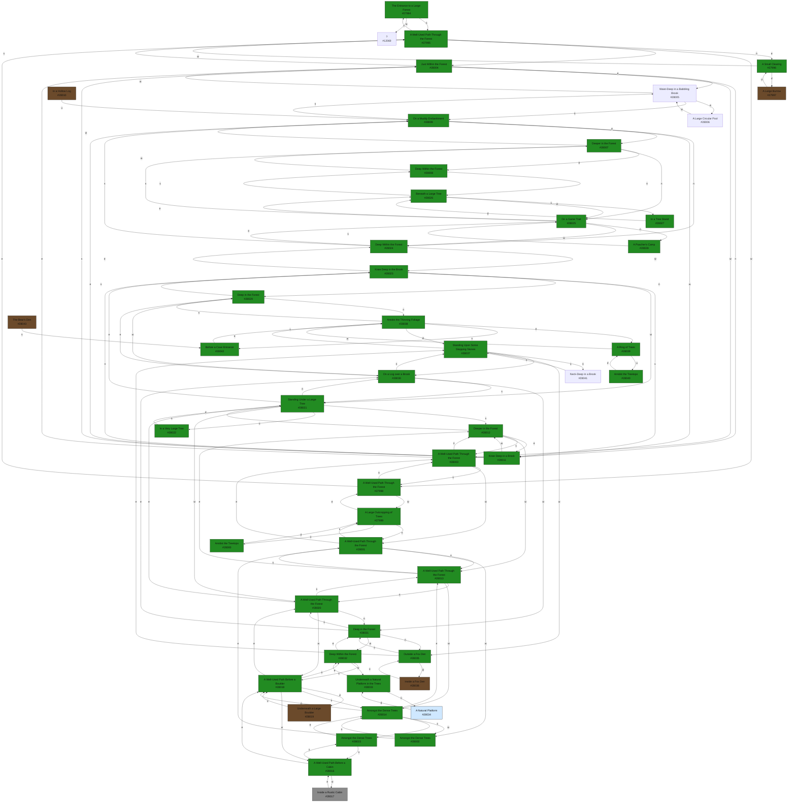

# The Forest of Li'Dnesh

50 rooms. Solid = direction; dotted = special exit.

```mermaid
flowchart TD
  r27994["The Entrance to a Large Forest<br/>#27994"]
  r27995["A Well-Used Path Through the Forest<br/>#27995"]
  r27996["A Small Clearing<br/>#27996"]
  r27997["A Large Burrow<br/>#27997"]
  r27998["A Well-Used Path Through the Forest<br/>#27998"]
  r27999["A Large Outcropping of Trees<br/>#27999"]
  r28000["Amidst the Treetops<br/>#28000"]
  r28001["A Well-Used Path Through the Forest<br/>#28001"]
  r28002["Amongst the Dense Trees<br/>#28002"]
  r28003["A Well-Used Path Through the Forest<br/>#28003"]
  r28004["Just Within the Forest<br/>#28004"]
  r28005["Waist-Deep in a Babbling Brook<br/>#28005"]
  r28006["A Large Circular Pool<br/>#28006"]
  r28007["Deeper in the Forest<br/>#28007"]
  r28008["Deep Within the Forest<br/>#28008"]
  r28009["On a Muddy Embankment<br/>#28009"]
  r28010["In a Hollow Log<br/>#28010"]
  r28011["Knee Deep in a Brook<br/>#28011"]
  r28012["Deeper in the Forest<br/>#28012"]
  r28013["A Well-Used Path Through the Forest<br/>#28013"]
  r28014["Amongst the Dense Trees<br/>#28014"]
  r28015["Amongst the Dense Trees<br/>#28015"]
  r28016["A Well-Used Path Before a Cabin<br/>#28016"]
  r28018["A Well-Used Path Before a Boulder<br/>#28018"]
  r28019["Underneath a Large Boulder<br/>#28019"]
  r28020["A Well-Used Path Through the Forest<br/>#28020"]
  r28021["Standing Under a Large Tree<br/>#28021"]
  r28022["In a Very Large Tree<br/>#28022"]
  r28023["Knee Deep in the Brook<br/>#28023"]
  r28024["Deep Within the Forest<br/>#28024"]
  r28025["On a Game Trail<br/>#28025"]
  r28026["Beneath a Large Tree<br/>#28026"]
  r28027["In a Tree Stand<br/>#28027"]
  r28028["A Poacher's Camp<br/>#28028"]
  r28029["Deep in the Forest<br/>#28029"]
  r28030["On a Log over a Brook<br/>#28030"]
  r28031["Deep in the Forest<br/>#28031"]
  r28032["Deep Within the Forest<br/>#28032"]
  r28033["Underneath a Natural Platform in the Trees<br/>#28033"]
  r28034["A Natural Platform<br/>#28034"]
  r28035["Outside a Fox Den<br/>#28035"]
  r28036["Inside a Fox Den<br/>#28036"]
  r28037["Standing Upon Some Stepping Stones<br/>#28037"]
  r28038["Amidst the Thinning Foliage<br/>#28038"]
  r28039["A Ring of Trees<br/>#28039"]
  r28040["Amidst the Treetops<br/>#28040"]
  r28041["Neck-Deep in a Brook<br/>#28041"]
  r28042["Before a Cave Entrance<br/>#28042"]
  r28043["The Bear's Den<br/>#28043"]
  r28017["Inside a Rustic Cabin<br/>#28017"]
  r27994 -->|n| r27995
  r12069["?<br/>#12069"]
  r27994 -->|w| r12069
  r27995 -->|e| r27996
  r27995 -->|n| r28004
  r27995 -->|s| r27994
  r27995 -->|w| r27998
  r27996 -->|d| r27997
  r27996 -->|w| r27995
  r27997 -->|u| r27996
  r27998 -->|e| r27995
  r27998 -->|n| r28003
  r27998 -->|w| r27999
  r27999 -->|e| r27998
  r27999 -->|n| r28001
  r27999 -->|u| r28000
  r28000 -->|d| r27999
  r28001 -->|e| r28003
  r28001 -->|n| r28013
  r28001 -->|s| r27999
  r28001 -->|w| r28002
  r28002 -->|e| r28001
  r28002 -->|n| r28014
  r28003 -->|e| r28004
  r28003 -->|n| r28012
  r28003 -->|s| r27998
  r28003 -->|w| r28001
  r28004 -->|e| r28005
  r28004 -->|n| r28011
  r28004 -->|s| r27995
  r28004 -->|w| r28003
  r28005 -->|e| r28006
  r28005 -->|n| r28009
  r28005 -->|w| r28004
  r28006 -->|w| r28005
  r28007 -->|e| r28008
  r28007 -->|n| r28025
  r28007 -->|w| r28009
  r28008 -->|n| r28026
  r28008 -->|w| r28007
  r28009 -->|e| r28007
  r28009 -->|n| r28024
  r28009 -->|s| r28005
  r28009 -->|w| r28011
  r28010 -->|u| r28009
  r28011 -->|e| r28009
  r28011 -->|n| r28023
  r28011 -->|s| r28004
  r28011 -->|w| r28012
  r28012 -->|e| r28011
  r28012 -->|n| r28021
  r28012 -->|s| r28003
  r28012 -->|w| r28013
  r28013 -->|e| r28012
  r28013 -->|n| r28020
  r28013 -->|s| r28001
  r28013 -->|w| r28014
  r28014 -->|e| r28013
  r28014 -->|n| r28018
  r28014 -->|s| r28002
  r28014 -->|w| r28015
  r28015 -->|e| r28014
  r28015 -->|n| r28016
  r28016 -->|e| r28018
  r28016 -->|s| r28015
  r28016 -->|w| r28017
  r28018 -->|d| r28019
  r28018 -->|e| r28020
  r28018 -->|n| r28032
  r28018 -->|s| r28014
  r28018 -->|w| r28016
  r28019 -->|u| r28018
  r28020 -->|e| r28021
  r28020 -->|n| r28031
  r28020 -->|s| r28013
  r28020 -->|w| r28018
  r28021 -->|e| r28023
  r28021 -->|n| r28030
  r28021 -->|s| r28012
  r28021 -->|u| r28022
  r28021 -->|w| r28020
  r28022 -->|d| r28021
  r28023 -->|e| r28024
  r28023 -->|n| r28029
  r28023 -->|s| r28011
  r28023 -->|w| r28021
  r28024 -->|e| r28025
  r28024 -->|s| r28009
  r28024 -->|w| r28023
  r28025 -->|e| r28026
  r28025 -->|n| r28028
  r28025 -->|s| r28007
  r28025 -->|w| r28024
  r28026 -->|s| r28008
  r28026 -->|u| r28027
  r28026 -->|w| r28025
  r28027 -->|d| r28026
  r28028 -->|s| r28025
  r28029 -->|n| r28038
  r28029 -->|s| r28023
  r28029 -->|w| r28030
  r28030 -->|e| r28029
  r28030 -->|n| r28037
  r28030 -->|s| r28021
  r28030 -->|w| r28031
  r28031 -->|e| r28030
  r28031 -->|n| r28035
  r28031 -->|s| r28020
  r28031 -->|w| r28032
  r28032 -->|e| r28031
  r28032 -->|s| r28018
  r28032 -->|w| r28033
  r28033 -->|e| r28032
  r28033 -->|u| r28034
  r28034 -->|d| r28033
  r28035 -->|d| r28036
  r28035 -->|e| r28037
  r28035 -->|s| r28031
  r28036 -->|u| r28035
  r28037 -->|e| r28038
  r28037 -->|n| r28041
  r28037 -->|s| r28030
  r28037 -->|w| r28035
  r28038 -->|e| r28039
  r28038 -->|n| r28042
  r28038 -->|s| r28029
  r28038 -->|w| r28037
  r28039 -->|u| r28040
  r28039 -->|w| r28038
  r28040 -->|d| r28039
  r28041 -->|s| r28037
  r28042 -->|s| r28038
  r28043 -->|s| r28042
  r28017 -->|e| r28016
  classDef t_forest fill:#228b22,color:#111,stroke:#222
  class r27994 t_forest
  class r27995 t_forest
  class r27996 t_forest
  classDef t_underground fill:#6b4a2b,color:#111,stroke:#222
  class r27997 t_underground
  class r27998 t_forest
  class r27999 t_forest
  class r28000 t_forest
  class r28001 t_forest
  class r28002 t_forest
  class r28003 t_forest
  class r28004 t_forest
  class r28007 t_forest
  class r28008 t_forest
  class r28009 t_forest
  class r28010 t_underground
  class r28011 t_forest
  class r28012 t_forest
  class r28013 t_forest
  class r28014 t_forest
  class r28015 t_forest
  class r28016 t_forest
  class r28018 t_forest
  class r28019 t_underground
  class r28020 t_forest
  class r28021 t_forest
  class r28022 t_forest
  class r28023 t_forest
  class r28024 t_forest
  class r28025 t_forest
  class r28026 t_forest
  class r28027 t_forest
  class r28028 t_forest
  class r28029 t_forest
  class r28030 t_forest
  class r28031 t_forest
  class r28032 t_forest
  class r28033 t_forest
  classDef t_air fill:#cfe8ff,color:#111,stroke:#222
  class r28034 t_air
  class r28035 t_forest
  class r28036 t_underground
  class r28037 t_forest
  class r28038 t_forest
  class r28039 t_forest
  class r28040 t_forest
  class r28042 t_forest
  class r28043 t_underground
  classDef t_inside fill:#8a8a8a,color:#111,stroke:#222
  class r28017 t_inside
```
