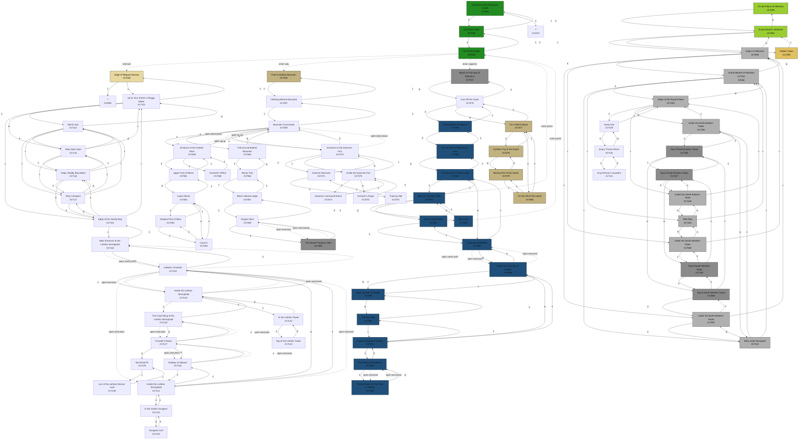

# The Fractured Lands

81 rooms. Solid = direction; dotted = special exit.

```mermaid
flowchart TD
  r17031["Entrance to the Fractured Lands<br/>#17031"]
  r17032["Old Forest Path<br/>#17032"]
  r17033["The Portal Glade<br/>#17033"]
  r17038["Edge of Megawl Swamp<br/>#17038"]
  r17112["Up to Your Knees in Boggy Water<br/>#17112"]
  r17113["Marsh Gas<br/>#17113"]
  r17114["Mud, Mud, Mud<br/>#17114"]
  r17116["Deep, Muddy Bog Water<br/>#17116"]
  r17117["Dirty Cesspool<br/>#17117"]
  r17115["Edge of the Smelly Bog<br/>#17115"]
  r17118["Main Entrance of the Lothetu Stronghold<br/>#17118"]
  r17119["Initiation Chamber<br/>#17119"]
  r17121["Inside the Lothetu Stronghold<br/>#17121"]
  r17120["Inside the Lothetu Stronghold<br/>#17120"]
  r17128["The Crypt Wing of the Lothetu Stronghold<br/>#17128"]
  r17127["Founder's Room<br/>#17127"]
  r17126["Hallway of Statues<br/>#17126"]
  r17125["Dungeon Cell<br/>#17125"]
  r17122["In the Lothetu Tower<br/>#17122"]
  r17123["Top of the Lothetu Tower<br/>#17123"]
  r17129["Sacrificial Pit<br/>#17129"]
  r17130["Lair of the Lothetu Demon Lord<br/>#17130"]
  r17036["On the Plains of Velenisia<br/>#17036"]
  r17094["Dusty Road to Velenisia<br/>#17094"]
  r17095["Hidden Oasis<br/>#17095"]
  r17096["Gates of Velenisia<br/>#17096"]
  r17099["Under the South-Western Tower<br/>#17099"]
  r17097["Under the North-Western Tower<br/>#17097"]
  r17102["Alley under Ramparts<br/>#17102"]
  r17101["Grand Market of Velenisia<br/>#17101<br/>[shop]"]
  r17103["Wall Alley<br/>#17103"]
  r17106["Under the South-Eastern Tower<br/>#17106"]
  r17104["Steps of the Royal Palace<br/>#17104"]
  r17105["Under the North-Eastern Tower<br/>#17105"]
  r17109["Great Hall<br/>#17109"]
  r17108["Top of North-Eastern Tower<br/>#17108"]
  r17107["Top of South-Eastern Tower<br/>#17107"]
  r17100["Top of South-Western Tower<br/>#17100"]
  r17098["Top of North-Western Tower<br/>#17098"]
  r17110["King's Throne Room<br/>#17110"]
  r17111["King Ahknarr's Quarters<br/>#17111"]
  r17124["In the Guild's Dungeon<br/>#17124"]
  r17037["Beach on the Sea of Doleshva<br/>#17037"]
  r17076["Just Off the Coast<br/>#17076"]
  r17081["Diving Below the Waves<br/>#17081"]
  r17082["On the Floor of Doleshva's Sea<br/>#17082"]
  r17083["Front End of a Sunken Ship<br/>#17083"]
  r17084["Rear of a Sunken Ship<br/>#17084"]
  r17085["Sea Cave<br/>#17085"]
  r17077["On a Weird Island<br/>#17077"]
  r17078["Northern Tip of the Island<br/>#17078"]
  r17079["Moving Part of the Island<br/>#17079"]
  r17080["On the Hill of the Island<br/>#17080"]
  r17086["Undersea Battlefield<br/>#17086"]
  r17087["Dense Kelp Forest<br/>#17087"]
  r17088["Inside the Lost City of Sehlan<br/>#17088"]
  r17089["Mage Quarter of Sehlan<br/>#17089"]
  r17090["Training Field<br/>#17090"]
  r17091["General Market of Sehlan<br/>#17091"]
  r17092["The Palace of Doleshva<br/>#17092"]
  r17093["Throne Room of The Lord of Sehlan<br/>#17093"]
  r17035["Path to Baltrok Mountain<br/>#17035"]
  r17057["Climbing Baltrok Mountain<br/>#17057"]
  r17058["Mountain Crossroads<br/>#17058"]
  r17070["Entrance to the Dwarven Fort<br/>#17070"]
  r17071["Dwarven Barracks<br/>#17071"]
  r17072["Training Hall<br/>#17072"]
  r17073["Inside the Dwarven Fort<br/>#17073"]
  r17074["Dwarven Command Room<br/>#17074"]
  r17075["Armorer's Forge<br/>#17075"]
  r17065["Trail Around Baltrok Mountain<br/>#17065"]
  r17066["Rocky Trail<br/>#17066"]
  r17067["Bone Littered Ledge<br/>#17067"]
  r17069["The Secret Treasure Hole<br/>#17069"]
  r17068["Dragon Nest<br/>#17068"]
  r17059["Entrance to the Kobold Mine<br/>#17059"]
  r17060["Overlord's Office<br/>#17060"]
  r17061["Upper Part of Mines<br/>#17061"]
  r17062["Lower Mines<br/>#17062"]
  r17064["Deepest Part of Mine<br/>#17064"]
  r17063["Cave-In<br/>#17063"]
  r17031 -->|n| r17032
  r12373["?<br/>#12373"]
  r17031 -->|s| r12373
  r17032 -->|n| r17033
  r17032 -->|s| r17031
  r17033 -.->|enter jet| r17038
  r17033 -.->|enter ruby| r17035
  r17033 -.->|enter sapphire| r17037
  r17033 -->|s| r17032
  r15060["?<br/>#15060"]
  r17038 -->|n| r15060
  r17038 -->|s| r17112
  r17112 -->|e| r17113
  r17112 -->|n| r17038
  r17112 -->|s| r17115
  r17112 -->|w| r17114
  r17113 -->|e| r17114
  r17113 -->|n| r17117
  r17113 -->|s| r17116
  r17113 -->|w| r17112
  r17114 -->|e| r17112
  r17114 -->|n| r17116
  r17114 -->|s| r17117
  r17114 -->|w| r17113
  r17116 -->|e| r17117
  r17116 -->|n| r17113
  r17116 -->|s| r17114
  r17116 -->|w| r17115
  r17117 -->|e| r17115
  r17117 -->|n| r17114
  r17117 -->|s| r17113
  r17117 -->|w| r17116
  r17115 -->|e| r17116
  r17115 -->|n| r17112
  r17115 -->|s| r17118
  r17115 -->|w| r17117
  r17118 -->|n| r17115
  r17118 -.->|open south;south| r17119
  r17118 -->|s| r17119
  r17119 -->|e| r17120
  r17119 -->|n| r17118
  r17119 -.->|open east;east| r17120
  r17119 -.->|open north;north| r17118
  r17119 -.->|open west;west| r17121
  r17119 -->|w| r17121
  r17121 -->|d| r17124
  r17121 -->|e| r17119
  r17121 -.->|open east;east| r17119
  r17121 -->|s| r17126
  r17120 -.->|open west;west| r17119
  r17120 -->|s| r17128
  r17120 -->|u| r17122
  r17120 -->|w| r17119
  r17128 -->|n| r17120
  r17128 -.->|open west;west| r17127
  r17128 -->|w| r17127
  r17127 -->|d| r17129
  r17127 -->|e| r17128
  r17127 -.->|open east;east| r17128
  r17127 -.->|open west;west| r17126
  r17127 -->|w| r17126
  r17126 -->|e| r17127
  r17126 -->|n| r17121
  r17126 -.->|open east;east| r17127
  r17125 -->|e| r17124
  r17122 -->|d| r17120
  r17122 -->|u| r17123
  r17123 -->|d| r17122
  r17129 -->|s| r17130
  r17130 -->|n| r17129
  r17036 -->|e| r17094
  r17094 -->|e| r17096
  r17094 -->|n| r17095
  r17094 -->|w| r17036
  r17095 -->|s| r17094
  r17096 -->|e| r17101
  r17096 -->|n| r17097
  r17096 -->|s| r17099
  r17096 -->|w| r17094
  r17099 -->|e| r17103
  r17099 -->|n| r17096
  r17099 -->|u| r17100
  r17097 -->|e| r17102
  r17097 -->|s| r17096
  r17097 -->|u| r17098
  r17102 -->|e| r17105
  r17102 -->|s| r17101
  r17102 -->|w| r17097
  r17101 -->|e| r17104
  r17101 -->|n| r17102
  r17101 -->|s| r17103
  r17101 -->|w| r17096
  r17103 -->|e| r17106
  r17103 -->|n| r17101
  r17103 -->|w| r17099
  r17106 -->|n| r17104
  r17106 -->|u| r17107
  r17106 -->|w| r17103
  r17104 -->|e| r17109
  r17104 -->|n| r17105
  r17104 -->|s| r17106
  r17104 -->|w| r17101
  r17105 -->|s| r17104
  r17105 -->|u| r17108
  r17105 -->|w| r17102
  r17109 -->|e| r17110
  r17109 -->|w| r17104
  r17108 -->|d| r17105
  r17108 -->|s| r17107
  r17108 -->|w| r17098
  r17107 -->|d| r17106
  r17107 -->|n| r17108
  r17107 -->|w| r17100
  r17100 -->|d| r17099
  r17100 -->|e| r17107
  r17100 -->|n| r17098
  r17098 -->|d| r17097
  r17098 -->|e| r17108
  r17098 -->|s| r17100
  r17110 -->|s| r17111
  r17110 -->|w| r17109
  r17111 -->|n| r17110
  r17124 -->|u| r17121
  r17124 -->|w| r17125
  r17037 -->|w| r17076
  r17076 -->|d| r17081
  r17076 -->|e| r17037
  r17076 -->|w| r17077
  r17081 -->|d| r17082
  r17081 -->|u| r17076
  r17082 -->|u| r17081
  r17082 -->|w| r17083
  r17083 -->|e| r17082
  r17083 -->|s| r17084
  r17083 -->|w| r17086
  r17084 -->|e| r17085
  r17084 -->|n| r17083
  r17084 -->|w| r17087
  r17085 -.->|enter portal| r17033
  r17085 -->|w| r17084
  r17077 -->|e| r17076
  r17077 -->|n| r17078
  r17077 -->|w| r17080
  r17078 -->|s| r17077
  r17078 -->|w| r17079
  r17079 -->|e| r17078
  r17079 -->|s| r17080
  r17080 -->|e| r17077
  r17080 -->|n| r17079
  r17086 -->|e| r17083
  r17086 -.->|open west;west| r17088
  r17086 -->|s| r17087
  r17086 -->|w| r17088
  r17087 -->|e| r17084
  r17087 -->|n| r17086
  r17088 -->|e| r17086
  r17088 -->|n| r17089
  r17088 -.->|open east;east| r17086
  r17088 -->|w| r17091
  r17089 -->|s| r17088
  r17089 -->|w| r17090
  r17090 -->|e| r17089
  r17090 -->|s| r17091
  r17091 -->|e| r17088
  r17091 -->|n| r17090
  r17091 -->|s| r17092
  r17092 -->|e| r17093
  r17092 -->|n| r17091
  r17092 -.->|open east;east| r17093
  r17093 -.->|open west;west| r17092
  r17093 -->|w| r17092
  r17035 -->|n| r17057
  r17057 -->|n| r17058
  r17057 -->|s| r17035
  r17058 -->|d| r17059
  r17058 -->|e| r17065
  r17058 -.->|open down;down| r17059
  r17058 -.->|open up;up| r17070
  r17058 -->|s| r17057
  r17058 -->|u| r17070
  r17070 -->|d| r17058
  r17070 -->|e| r17071
  r17070 -->|n| r17073
  r17070 -.->|open down;down| r17058
  r17071 -->|n| r17072
  r17071 -->|w| r17070
  r17072 -.->|enter portal| r17033
  r17072 -->|s| r17071
  r17073 -->|n| r17074
  r17073 -->|s| r17070
  r17073 -->|w| r17075
  r17074 -->|s| r17073
  r17075 -->|e| r17073
  r17065 -->|e| r17066
  r17065 -->|w| r17058
  r17066 -->|s| r17067
  r17066 -->|w| r17065
  r17067 -->|n| r17066
  r17067 -->|u| r17068
  r17069 -.->|open west;west| r17068
  r17069 -->|w| r17068
  r17068 -->|d| r17067
  r17068 -->|e| r17069
  r17068 -.->|open east;east| r17069
  r17059 -->|d| r17061
  r17059 -.->|open up;up| r17058
  r17059 -->|s| r17060
  r17059 -->|u| r17058
  r17060 -->|n| r17059
  r17061 -->|d| r17062
  r17061 -->|u| r17059
  r17062 -->|s| r17064
  r17062 -->|u| r17061
  r17062 -->|w| r17063
  r17064 -->|n| r17062
  r17064 -->|s| r17063
  r17063 -->|e| r17062
  r17063 -->|n| r17064
  classDef t_forest fill:#228b22,color:#111,stroke:#222
  class r17031 t_forest
  class r17032 t_forest
  class r17033 t_forest
  classDef t_beach fill:#e8d8a0,color:#111,stroke:#222
  class r17038 t_beach
  classDef t_field fill:#9acd32,color:#111,stroke:#222
  class r17036 t_field
  class r17094 t_field
  classDef t_desert fill:#e0c060,color:#111,stroke:#222
  class r17095 t_desert
  classDef t_city fill:#b0b0b0,color:#111,stroke:#222
  class r17096 t_city
  class r17099 t_city
  class r17097 t_city
  class r17102 t_city
  class r17101 t_city
  class r17103 t_city
  class r17106 t_city
  class r17104 t_city
  class r17105 t_city
  classDef t_inside fill:#8a8a8a,color:#111,stroke:#222
  class r17108 t_inside
  class r17107 t_inside
  class r17100 t_inside
  class r17098 t_inside
  class r17037 t_inside
  classDef t_underwater fill:#20507a,color:#111,stroke:#222
  class r17081 t_underwater
  class r17082 t_underwater
  class r17083 t_underwater
  class r17084 t_underwater
  class r17085 t_underwater
  classDef t_hills fill:#c2b280,color:#111,stroke:#222
  class r17077 t_hills
  class r17078 t_hills
  class r17079 t_hills
  class r17080 t_hills
  class r17086 t_underwater
  class r17087 t_underwater
  class r17088 t_underwater
  class r17089 t_underwater
  class r17090 t_underwater
  class r17091 t_underwater
  class r17092 t_underwater
  class r17093 t_underwater
  class r17035 t_hills
  class r17069 t_inside
```
