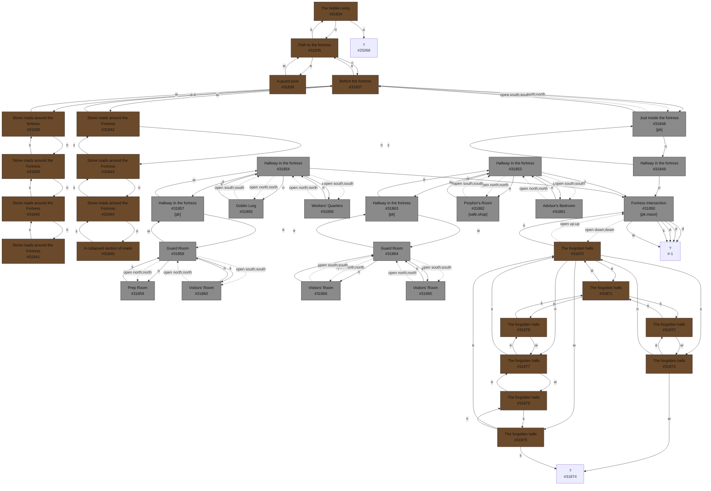

# The Goblin Fortress

37 rooms. Solid = direction; dotted = special exit.

```mermaid
flowchart TD
  r31834["The hidden entry<br/>#31834"]
  r31835["Path to the fortress<br/>#31835"]
  r31836["A guard post<br/>#31836"]
  r31837["Before the fortress<br/>#31837"]
  r31838["Stone roads around the fortress<br/>#31838"]
  r31842["Stone roads around the Fortress<br/>#31842"]
  r31843["Stone roads around the Fortress<br/>#31843"]
  r31848["Just inside the fortress<br/>#31848<br/>[pk]"]
  r31839["Stone roads around the Fortress<br/>#31839"]
  r31840["Stone roads around the Fortress<br/>#31840"]
  r31841["Stone roads around the Fortress<br/>#31841"]
  r31844["Stone roads around the Fortress<br/>#31844"]
  r31845["A collapsed section of roads<br/>#31845"]
  r31849["Hallway in the fortress<br/>#31849"]
  r31850["Fortress intersection<br/>#31850<br/>[pk,maze]"]
  r31853["Hallway in the fortress<br/>#31853"]
  r31854["Hallway in the fortress<br/>#31854"]
  r31855["Goblin Lurg<br/>#31855"]
  r31856["Workers' Quarters<br/>#31856"]
  r31857["Hallway in the fortress<br/>#31857<br/>[pk]"]
  r31858["Guard Room<br/>#31858"]
  r31859["Prep Room<br/>#31859"]
  r31860["Visitors' Room<br/>#31860"]
  r31870["The forgotten halls<br/>#31870"]
  r31862["Porphor's Room<br/>#31862<br/>[safe,shop]"]
  r31861["Advisor's Bedroom<br/>#31861"]
  r31863["Hallway in the fortress<br/>#31863<br/>[pk]"]
  r31864["Guard Room<br/>#31864"]
  r31866["Visitors' Room<br/>#31866"]
  r31865["Visitors' Room<br/>#31865"]
  r31877["The forgotten halls<br/>#31877"]
  r31878["The forgotten halls<br/>#31878"]
  r31871["The forgotten halls<br/>#31871"]
  r31872["The forgotten halls<br/>#31872"]
  r31873["The forgotten halls<br/>#31873"]
  r31875["The forgotten halls<br/>#31875"]
  r31876["The forgotten halls<br/>#31876"]
  r31834 -->|n| r31835
  r25068["?<br/>#25068"]
  r31834 -->|u| r25068
  r31835 -->|e| r31836
  r31835 -->|n| r31837
  r31835 -->|s| r31834
  r31836 -->|w| r31835
  r31837 -->|e| r31838
  r31837 -->|n| r31848
  r31837 -.->|open north;north| r31848
  r31837 -->|s| r31835
  r31837 -->|w| r31842
  r31838 -->|n| r31839
  r31838 -->|w| r31837
  r31842 -->|e| r31837
  r31842 -->|n| r31843
  r31843 -->|n| r31844
  r31843 -->|s| r31842
  r31848 -->|n| r31849
  r31848 -.->|open south;south| r31837
  r31848 -->|s| r31837
  r31839 -->|n| r31840
  r31839 -->|s| r31838
  r31840 -->|n| r31841
  r31840 -->|s| r31839
  r31841 -->|s| r31840
  r31844 -->|n| r31845
  r31844 -->|s| r31843
  r31845 -->|s| r31844
  r31849 -->|n| r31850
  r31849 -->|s| r31848
  r-1["?<br/>#-1"]
  r31850 -->|d| r-1
  r31850 -->|e| r-1
  r31850 -->|n| r-1
  r31850 -.->|open down;down| r31870
  r31850 -->|s| r-1
  r31850 -->|w| r-1
  r31853 -->|e| r31850
  r31853 -->|n| r31862
  r31853 -.->|open north;north| r31862
  r31853 -.->|open south;south| r31861
  r31853 -->|s| r31861
  r31853 -->|w| r31863
  r31854 -->|e| r31857
  r31854 -->|n| r31855
  r31854 -.->|open north;north| r31855
  r31854 -.->|open south;south| r31856
  r31854 -->|s| r31856
  r31854 -->|w| r31850
  r31855 -.->|open south;south| r31854
  r31855 -->|s| r31854
  r31856 -->|n| r31854
  r31856 -.->|open north;north| r31854
  r31857 -->|e| r31858
  r31857 -->|w| r31854
  r31858 -->|n| r31859
  r31858 -.->|open north;north| r31859
  r31858 -.->|open south;south| r31860
  r31858 -->|s| r31860
  r31858 -->|w| r31857
  r31859 -->|s| r31858
  r31860 -->|n| r31858
  r31860 -.->|open north;north| r31858
  r31870 -->|e| r31871
  r31870 -->|n| r31877
  r31870 -.->|open up;up| r31850
  r31870 -->|s| r31873
  r31870 -->|u| r31850
  r31870 -->|w| r31875
  r31862 -.->|open south;south| r31853
  r31862 -->|s| r31853
  r31861 -->|n| r31853
  r31861 -.->|open north;north| r31853
  r31863 -->|e| r31853
  r31863 -->|w| r31864
  r31864 -->|e| r31863
  r31864 -->|n| r31866
  r31864 -.->|open north;north| r31866
  r31864 -.->|open south;south| r31865
  r31864 -->|s| r31865
  r31866 -.->|open south;south| r31864
  r31866 -->|s| r31864
  r31865 -->|n| r31864
  r31865 -.->|open north;north| r31864
  r31877 -->|e| r31878
  r31877 -->|s| r31870
  r31877 -->|w| r31876
  r31878 -->|s| r31871
  r31878 -->|w| r31877
  r31871 -->|n| r31878
  r31871 -->|s| r31872
  r31871 -->|w| r31870
  r31872 -->|n| r31871
  r31872 -->|w| r31873
  r31873 -->|e| r31872
  r31873 -->|n| r31870
  r31874["?<br/>#31874"]
  r31873 -->|w| r31874
  r31875 -->|e| r31870
  r31875 -->|n| r31876
  r31875 -->|s| r31874
  r31876 -->|e| r31877
  r31876 -->|s| r31875
  classDef t_underground fill:#6b4a2b,color:#111,stroke:#222
  class r31834 t_underground
  class r31835 t_underground
  class r31836 t_underground
  class r31837 t_underground
  class r31838 t_underground
  class r31842 t_underground
  class r31843 t_underground
  classDef t_inside fill:#8a8a8a,color:#111,stroke:#222
  class r31848 t_inside
  class r31839 t_underground
  class r31840 t_underground
  class r31841 t_underground
  class r31844 t_underground
  class r31845 t_underground
  class r31849 t_inside
  class r31850 t_inside
  class r31853 t_inside
  class r31854 t_inside
  class r31855 t_inside
  class r31856 t_inside
  class r31857 t_inside
  class r31858 t_inside
  class r31859 t_inside
  class r31860 t_inside
  class r31870 t_underground
  class r31862 t_inside
  class r31861 t_inside
  class r31863 t_inside
  class r31864 t_inside
  class r31866 t_inside
  class r31865 t_inside
  class r31877 t_underground
  class r31878 t_underground
  class r31871 t_underground
  class r31872 t_underground
  class r31873 t_underground
  class r31875 t_underground
  class r31876 t_underground
```
