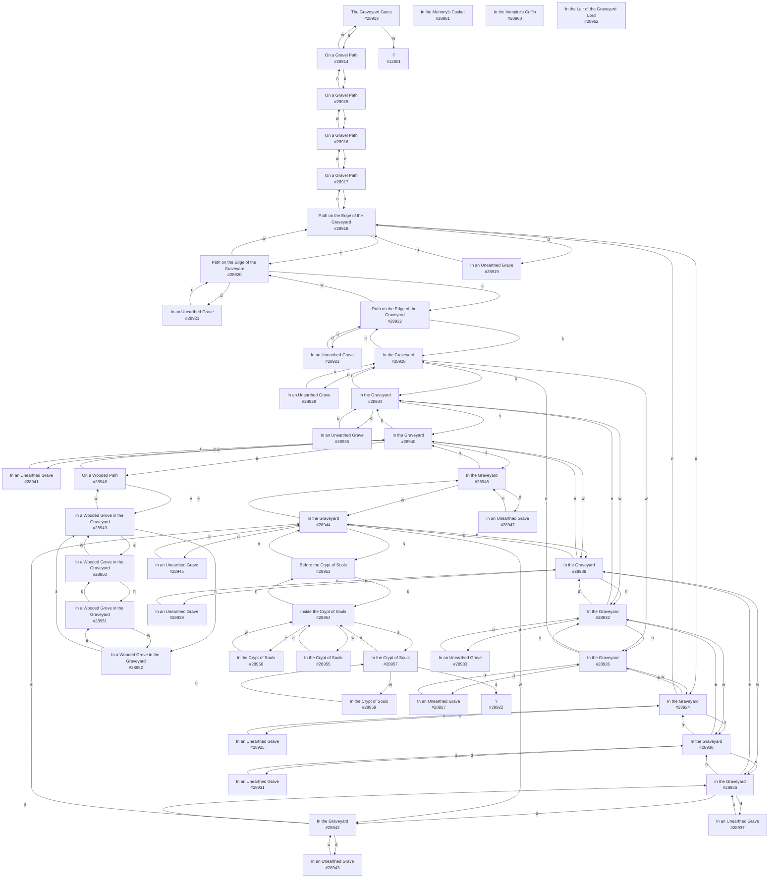

# The Graveyard

49 rooms. Solid = direction; dotted = special exit.

```mermaid
flowchart TD
  r28913["The Graveyard Gates<br/>#28913"]
  r28914["On a Gravel Path<br/>#28914"]
  r28915["On a Gravel Path<br/>#28915"]
  r28916["On a Gravel Path<br/>#28916"]
  r28917["On a Gravel Path<br/>#28917"]
  r28918["Path on the Edge of the Graveyard<br/>#28918"]
  r28924["In the Graveyard<br/>#28924"]
  r28930["In the Graveyard<br/>#28930"]
  r28936["In the Graveyard<br/>#28936"]
  r28942["In the Graveyard<br/>#28942"]
  r28944["In the Graveyard<br/>#28944"]
  r28938["In the Graveyard<br/>#28938"]
  r28932["In the Graveyard<br/>#28932"]
  r28926["In the Graveyard<br/>#28926"]
  r28920["Path on the Edge of the Graveyard<br/>#28920"]
  r28921["In an Unearthed Grave<br/>#28921"]
  r28922["Path on the Edge of the Graveyard<br/>#28922"]
  r28923["In an Unearthed Grave<br/>#28923"]
  r28928["In the Graveyard<br/>#28928"]
  r28929["In an Unearthed Grave<br/>#28929"]
  r28934["In the Graveyard<br/>#28934"]
  r28935["In an Unearthed Grave<br/>#28935"]
  r28940["In the Graveyard<br/>#28940"]
  r28941["In an Unearthed Grave<br/>#28941"]
  r28948["On a Wooded Path<br/>#28948"]
  r28949["In a Wooded Grove in the Graveyard<br/>#28949"]
  r28952["In a Wooded Grove in the Graveyard<br/>#28952"]
  r28951["In a Wooded Grove in the Graveyard<br/>#28951"]
  r28950["In a Wooded Grove in the Graveyard<br/>#28950"]
  r28946["In the Graveyard<br/>#28946"]
  r28947["In an Unearthed Grave<br/>#28947"]
  r28953["Before the Crypt of Souls<br/>#28953"]
  r28954["Inside the Crypt of Souls<br/>#28954"]
  r28956["In the Crypt of Souls<br/>#28956"]
  r28961["In the Mummy's Casket<br/>#28961"]
  r28955["In the Crypt of Souls<br/>#28955"]
  r28960["In the Vampire's Coffin<br/>#28960"]
  r28957["In the Crypt of Souls<br/>#28957"]
  r28959["In the Crypt of Souls<br/>#28959"]
  r28962["In the Lair of the Graveyard Lord<br/>#28962"]
  r28943["In an Unearthed Grave<br/>#28943"]
  r28937["In an Unearthed Grave<br/>#28937"]
  r28931["In an Unearthed Grave<br/>#28931"]
  r28925["In an Unearthed Grave<br/>#28925"]
  r28919["In an Unearthed Grave<br/>#28919"]
  r28927["In an Unearthed Grave<br/>#28927"]
  r28933["In an Unearthed Grave<br/>#28933"]
  r28939["In an Unearthed Grave<br/>#28939"]
  r28945["In an Unearthed Grave<br/>#28945"]
  r28913 -->|e| r28914
  r12801["?<br/>#12801"]
  r28913 -->|w| r12801
  r28914 -->|s| r28915
  r28914 -->|w| r28913
  r28915 -->|e| r28916
  r28915 -->|n| r28914
  r28916 -->|e| r28917
  r28916 -->|w| r28915
  r28917 -->|s| r28918
  r28917 -->|w| r28916
  r28918 -->|d| r28919
  r28918 -->|e| r28920
  r28918 -->|n| r28917
  r28918 -->|s| r28924
  r28924 -->|d| r28925
  r28924 -->|e| r28926
  r28924 -->|n| r28918
  r28924 -->|s| r28930
  r28930 -->|d| r28931
  r28930 -->|e| r28932
  r28930 -->|n| r28924
  r28930 -->|s| r28936
  r28936 -->|d| r28937
  r28936 -->|e| r28938
  r28936 -->|n| r28930
  r28936 -->|s| r28942
  r28942 -->|d| r28943
  r28942 -->|e| r28944
  r28942 -->|n| r28936
  r28944 -->|d| r28945
  r28944 -->|e| r28946
  r28944 -->|n| r28938
  r28944 -->|s| r28953
  r28944 -->|w| r28942
  r28938 -->|d| r28939
  r28938 -->|e| r28940
  r28938 -->|n| r28932
  r28938 -->|s| r28944
  r28938 -->|w| r28936
  r28932 -->|d| r28933
  r28932 -->|e| r28934
  r28932 -->|n| r28926
  r28932 -->|s| r28938
  r28932 -->|w| r28930
  r28926 -->|d| r28927
  r28926 -->|e| r28928
  r28926 -->|s| r28932
  r28926 -->|w| r28924
  r28920 -->|d| r28921
  r28920 -->|e| r28922
  r28920 -->|w| r28918
  r28921 -->|u| r28920
  r28922 -->|d| r28923
  r28922 -->|s| r28928
  r28922 -->|w| r28920
  r28923 -->|u| r28922
  r28928 -->|d| r28929
  r28928 -->|n| r28922
  r28928 -->|s| r28934
  r28928 -->|w| r28926
  r28929 -->|u| r28928
  r28934 -->|d| r28935
  r28934 -->|n| r28928
  r28934 -->|s| r28940
  r28934 -->|w| r28932
  r28935 -->|u| r28934
  r28940 -->|d| r28941
  r28940 -->|e| r28948
  r28940 -->|n| r28934
  r28940 -->|s| r28946
  r28940 -->|w| r28938
  r28941 -->|u| r28940
  r28948 -->|e| r28949
  r28948 -->|w| r28940
  r28949 -->|e| r28950
  r28949 -->|n| r28952
  r28949 -->|w| r28948
  r28952 -->|e| r28951
  r28952 -->|s| r28949
  r28951 -->|s| r28950
  r28951 -->|w| r28952
  r28950 -->|n| r28951
  r28950 -->|w| r28949
  r28946 -->|d| r28947
  r28946 -->|n| r28940
  r28946 -->|w| r28944
  r28947 -->|u| r28946
  r28953 -->|n| r28944
  r28953 -->|s| r28954
  r28954 -->|e| r28956
  r28954 -->|n| r28953
  r28954 -->|s| r28957
  r28954 -->|w| r28955
  r28956 -->|w| r28954
  r28955 -->|e| r28954
  r28957 -->|n| r28954
  r29922["?<br/>#29922"]
  r28957 -->|s| r29922
  r28957 -->|w| r28959
  r28959 -->|e| r28957
  r28943 -->|u| r28942
  r28937 -->|u| r28936
  r28931 -->|u| r28930
  r28925 -->|u| r28924
  r28919 -->|u| r28918
  r28927 -->|u| r28926
  r28933 -->|u| r28932
  r28939 -->|u| r28938
  r28945 -->|u| r28944
```
