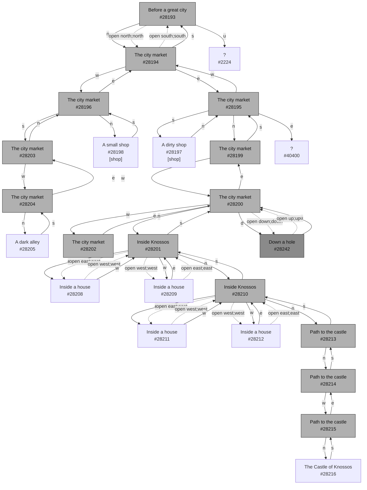

# The Great City of Knossos

23 rooms. Solid = direction; dotted = special exit.

```mermaid
flowchart TD
  r28193["Before a great city<br/>#28193"]
  r28194["The city market<br/>#28194"]
  r28195["The city market<br/>#28195"]
  r28196["The city market<br/>#28196"]
  r28203["The city market<br/>#28203"]
  r28204["The city market<br/>#28204"]
  r28205["A dark alley<br/>#28205"]
  r28198["A small shop<br/>#28198<br/>[shop]"]
  r28197["A dirty shop<br/>#28197<br/>[shop]"]
  r28199["The city market<br/>#28199"]
  r28200["The city market<br/>#28200"]
  r28202["The city market<br/>#28202"]
  r28201["Inside Knossos<br/>#28201"]
  r28208["Inside a house<br/>#28208"]
  r28209["Inside a house<br/>#28209"]
  r28210["Inside Knossos<br/>#28210"]
  r28211["Inside a house<br/>#28211"]
  r28212["Inside a house<br/>#28212"]
  r28213["Path to the castle<br/>#28213"]
  r28214["Path to the castle<br/>#28214"]
  r28215["Path to the castle<br/>#28215"]
  r28216["The Castle of Knossos<br/>#28216"]
  r28242["Down a hole<br/>#28242"]
  r28193 -->|n| r28194
  r28193 -.->|open north;north| r28194
  r2224["?<br/>#2224"]
  r28193 -->|u| r2224
  r28194 -->|e| r28195
  r28194 -.->|open south;south| r28193
  r28194 -->|s| r28193
  r28194 -->|w| r28196
  r40400["?<br/>#40400"]
  r28195 -->|e| r40400
  r28195 -->|n| r28199
  r28195 -->|s| r28197
  r28195 -->|w| r28194
  r28196 -->|e| r28194
  r28196 -->|n| r28198
  r28196 -->|s| r28203
  r28203 -->|n| r28196
  r28203 -->|w| r28204
  r28204 -->|e| r28203
  r28204 -->|n| r28205
  r28205 -->|s| r28204
  r28198 -->|s| r28196
  r28197 -->|n| r28195
  r28199 -->|s| r28195
  r28199 -->|w| r28200
  r28200 -->|d| r28242
  r28200 -->|e| r28199
  r28200 -->|n| r28201
  r28200 -.->|open down;down| r28242
  r28200 -->|w| r28202
  r28202 -->|e| r28200
  r28201 -->|e| r28208
  r28201 -->|n| r28210
  r28201 -.->|open east;east| r28208
  r28201 -.->|open west;west| r28209
  r28201 -->|s| r28200
  r28201 -->|w| r28209
  r28208 -.->|open west;west| r28201
  r28208 -->|w| r28201
  r28209 -->|e| r28201
  r28209 -.->|open east;east| r28201
  r28210 -->|e| r28211
  r28210 -->|n| r28213
  r28210 -.->|open east;east| r28211
  r28210 -.->|open west;west| r28212
  r28210 -->|s| r28201
  r28210 -->|w| r28212
  r28211 -.->|open west;west| r28210
  r28211 -->|w| r28210
  r28212 -->|e| r28210
  r28212 -.->|open east;east| r28210
  r28213 -->|n| r28214
  r28213 -->|s| r28210
  r28214 -->|s| r28213
  r28214 -->|w| r28215
  r28215 -->|e| r28214
  r28215 -->|n| r28216
  r28216 -->|s| r28215
  r28242 -.->|open up;up| r28200
  r28242 -->|u| r28200
  classDef t_city fill:#b0b0b0,color:#111,stroke:#222
  class r28193 t_city
  class r28194 t_city
  class r28195 t_city
  class r28196 t_city
  class r28203 t_city
  class r28204 t_city
  class r28199 t_city
  class r28200 t_city
  class r28202 t_city
  class r28201 t_city
  class r28210 t_city
  class r28213 t_city
  class r28214 t_city
  class r28215 t_city
  classDef t_inside fill:#8a8a8a,color:#111,stroke:#222
  class r28242 t_inside
```
