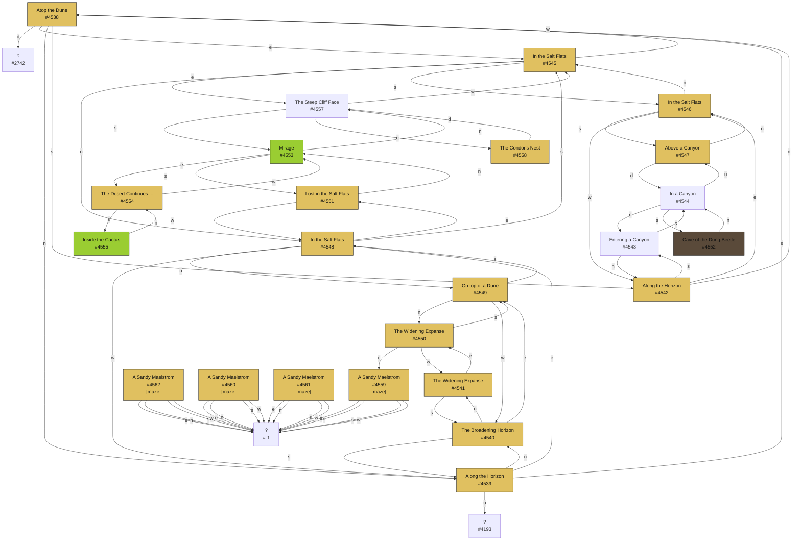

# The Great Salt Flats

24 rooms. Solid = direction; dotted = special exit.

```mermaid
flowchart TD
  r4538["Atop the Dune<br/>#4538"]
  r4539["Along the Horizon<br/>#4539"]
  r4545["In the Salt Flats<br/>#4545"]
  r4542["Along the Horizon<br/>#4542"]
  r4540["The Broadening Horizon<br/>#4540"]
  r4541["The Widening Expanse<br/>#4541"]
  r4550["The Widening Expanse<br/>#4550"]
  r4559["A Sandy Maelstrom<br/>#4559<br/>[maze]"]
  r4549["On top of a Dune<br/>#4549"]
  r4548["In the Salt Flats<br/>#4548"]
  r4546["In the Salt Flats<br/>#4546"]
  r4547["Above a Canyon<br/>#4547"]
  r4543["Entering a Canyon<br/>#4543"]
  r4544["In a Canyon<br/>#4544"]
  r4552["Cave of the Dung Beetle<br/>#4552"]
  r4557["The Steep Cliff Face<br/>#4557"]
  r4553["Mirage<br/>#4553"]
  r4551["Lost in the Salt Flats<br/>#4551"]
  r4554["The Desert Continues....<br/>#4554"]
  r4555["Inside the Cactus<br/>#4555"]
  r4558["The Condor's Nest<br/>#4558"]
  r4562["A Sandy Maelstrom<br/>#4562<br/>[maze]"]
  r4560["A Sandy Maelstrom<br/>#4560<br/>[maze]"]
  r4561["A Sandy Maelstrom<br/>#4561<br/>[maze]"]
  r2742["?<br/>#2742"]
  r4538 -->|d| r2742
  r4538 -->|e| r4545
  r4538 -->|n| r4539
  r4538 -->|s| r4542
  r4539 -->|e| r4548
  r4539 -->|n| r4540
  r4539 -->|s| r4538
  r4193["?<br/>#4193"]
  r4539 -->|u| r4193
  r4545 -->|e| r4557
  r4545 -->|n| r4548
  r4545 -->|s| r4546
  r4545 -->|w| r4538
  r4542 -->|e| r4546
  r4542 -->|n| r4538
  r4542 -->|s| r4543
  r4540 -->|e| r4549
  r4540 -->|n| r4541
  r4540 -->|s| r4539
  r4541 -->|e| r4550
  r4541 -->|s| r4540
  r4550 -->|e| r4559
  r4550 -->|s| r4549
  r4550 -->|w| r4541
  r-1["?<br/>#-1"]
  r4559 -->|e| r-1
  r4559 -->|n| r-1
  r4559 -->|s| r-1
  r4559 -->|w| r-1
  r4549 -->|n| r4550
  r4549 -->|s| r4548
  r4549 -->|w| r4540
  r4548 -->|e| r4551
  r4548 -->|n| r4549
  r4548 -->|s| r4545
  r4548 -->|w| r4539
  r4546 -->|n| r4545
  r4546 -->|s| r4547
  r4546 -->|w| r4542
  r4547 -->|d| r4544
  r4547 -->|n| r4546
  r4543 -->|n| r4542
  r4543 -->|s| r4544
  r4544 -->|n| r4543
  r4544 -->|s| r4552
  r4544 -->|u| r4547
  r4552 -->|n| r4544
  r4557 -->|s| r4553
  r4557 -->|u| r4558
  r4557 -->|w| r4545
  r4553 -->|e| r4554
  r4553 -->|n| r4557
  r4553 -->|s| r4551
  r4551 -->|n| r4553
  r4551 -->|w| r4548
  r4554 -->|s| r4555
  r4554 -->|w| r4553
  r4555 -->|n| r4554
  r4558 -->|d| r4557
  r4562 -->|e| r-1
  r4562 -->|n| r-1
  r4562 -->|s| r-1
  r4562 -->|w| r-1
  r4560 -->|e| r-1
  r4560 -->|n| r-1
  r4560 -->|s| r-1
  r4560 -->|w| r-1
  r4561 -->|e| r-1
  r4561 -->|n| r-1
  r4561 -->|s| r-1
  r4561 -->|w| r-1
  classDef t_desert fill:#e0c060,color:#111,stroke:#222
  class r4538 t_desert
  class r4539 t_desert
  class r4545 t_desert
  class r4542 t_desert
  class r4540 t_desert
  class r4541 t_desert
  class r4550 t_desert
  class r4559 t_desert
  class r4549 t_desert
  class r4548 t_desert
  class r4546 t_desert
  class r4547 t_desert
  classDef t_cave fill:#5a4a3a,color:#111,stroke:#222
  class r4552 t_cave
  classDef t_field fill:#9acd32,color:#111,stroke:#222
  class r4553 t_field
  class r4551 t_desert
  class r4554 t_desert
  class r4555 t_field
  class r4558 t_desert
  class r4562 t_desert
  class r4560 t_desert
  class r4561 t_desert
```
