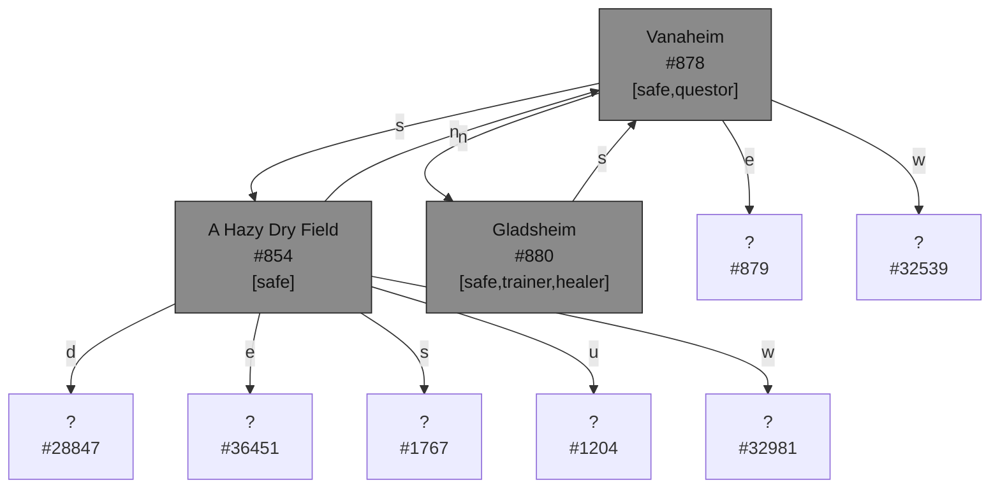

# The Halls of Vanir

3 rooms. Solid = direction; dotted = special exit.

```mermaid
flowchart TD
  r878["Vanaheim<br/>#878<br/>[safe,questor]"]
  r854["A Hazy Dry Field<br/>#854<br/>[safe]"]
  r880["Gladsheim<br/>#880<br/>[safe,trainer,healer]"]
  r879["?<br/>#879"]
  r878 -->|e| r879
  r878 -->|n| r880
  r878 -->|s| r854
  r32539["?<br/>#32539"]
  r878 -->|w| r32539
  r28847["?<br/>#28847"]
  r854 -->|d| r28847
  r36451["?<br/>#36451"]
  r854 -->|e| r36451
  r854 -->|n| r878
  r1767["?<br/>#1767"]
  r854 -->|s| r1767
  r1204["?<br/>#1204"]
  r854 -->|u| r1204
  r32981["?<br/>#32981"]
  r854 -->|w| r32981
  r880 -->|s| r878
  classDef t_inside fill:#8a8a8a,color:#111,stroke:#222
  class r878 t_inside
  class r854 t_inside
  class r880 t_inside
```
