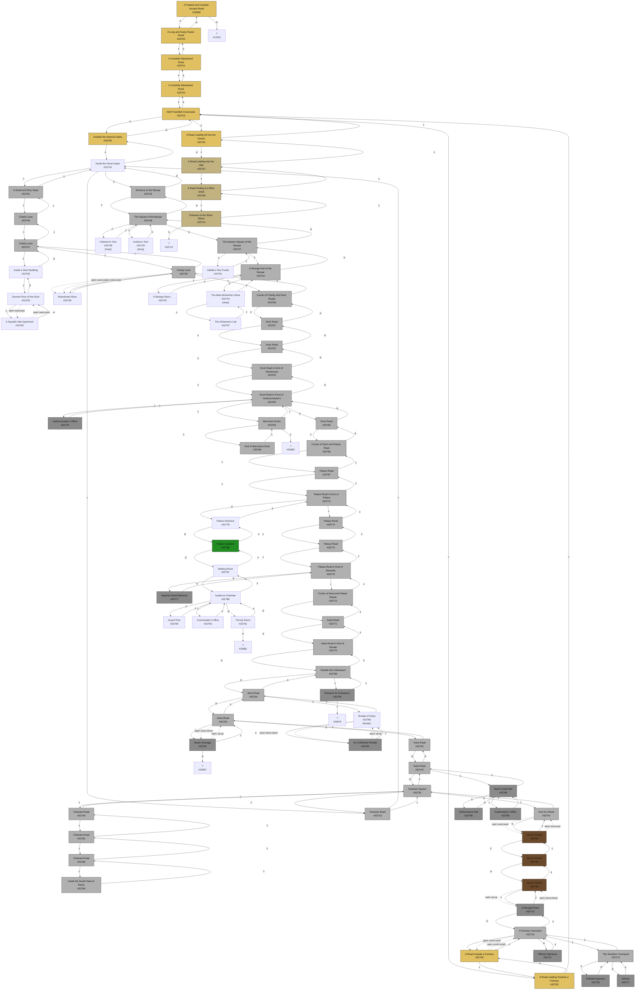

# The Imperial City of Reme

85 rooms. Solid = direction; dotted = special exit.

```mermaid
flowchart TD
  r32699["A Twisted and Cracked Ancient Road<br/>#32699"]
  r32700["A Long and Dusty Paved Road<br/>#32700"]
  r32701["A Carefully Maintained Road<br/>#32701"]
  r32702["A Carefully Maintained Road<br/>#32702"]
  r32703["Well Travelled Crossroads<br/>#32703"]
  r32704["A Road Leading off into the Desert<br/>#32704"]
  r32705["A Road Leading Towards a Fortress<br/>#32705"]
  r32709["A Road Outside a Fortress<br/>#32709"]
  r32707["A Road Leading into the Hills<br/>#32707"]
  r32708["A Road Ending at a Mine Shaft<br/>#32708"]
  r32714["Entrance to the Silver Mines<br/>#32714"]
  r32706["Outside the Imperial Gates<br/>#32706"]
  r32716["Inside the Great Gates<br/>#32716"]
  r32734["A Small and Dirty Road<br/>#32734"]
  r32746["Charity Lane<br/>#32746"]
  r32747["Charity Lane<br/>#32747"]
  r32755["Charity Lane<br/>#32755"]
  r32756["Corner of Charity and Dock Roads<br/>#32756"]
  r32795["Abandoned Store<br/>#32795"]
  r32758["Inside a Slum Building<br/>#32758"]
  r32759["Second Floor of the Slum<br/>#32759"]
  r32760["A Squalid Little Apartment<br/>#32760"]
  r32757["Dock Road<br/>#32757"]
  r32761["Dock Road<br/>#32761"]
  r32762["Dock Road in front of Warehouse<br/>#32762"]
  r32763["Dock Road in Front of Harbourmaster's<br/>#32763"]
  r32779["Harbourmaster's Office<br/>#32779"]
  r32764["Merchant Docks<br/>#32764"]
  r32765["Dock Road<br/>#32765"]
  r32766["Corner of Dock and Palace Road<br/>#32766"]
  r32767["Palace Road<br/>#32767"]
  r32773["Palace Road in front of Palace<br/>#32773"]
  r32778["Palace Entrance<br/>#32778"]
  r32786["Palace Gardens<br/>#32786"]
  r32787["Waiting Room<br/>#32787"]
  r32788["Audience Chamber<br/>#32788"]
  r32791["Throne Room<br/>#32791"]
  r32789["Guard Post<br/>#32789"]
  r32790["Commander's Office<br/>#32790"]
  r32774["Palace Road<br/>#32774"]
  r32775["Palace Road<br/>#32775"]
  r32776["Palace Road in front of Barracks<br/>#32776"]
  r32777["Imperial Guard Barracks<br/>#32777"]
  r32772["Corner of Astra and Palace Roads<br/>#32772"]
  r32771["Astra Road<br/>#32771"]
  r32770["Astra Road in front of Senate<br/>#32770"]
  r32768["Outside the Colosseum<br/>#32768"]
  r32754["Astra Road<br/>#32754"]
  r32798["Temple of Claire<br/>#32798<br/>[healer]"]
  r32753["Astra Road<br/>#32753"]
  r32752["Astra Road<br/>#32752"]
  r32742["Astra Road<br/>#32742"]
  r32735["Octavian Square<br/>#32735"]
  r32741["End of a Road<br/>#32741"]
  r32733["Octavian Road<br/>#32733"]
  r32732["Entrance to the Bazaar<br/>#32732"]
  r32736["The Square of the Bazaar<br/>#32736"]
  r32737["The Eastern Square of the Bazaar<br/>#32737"]
  r32743["A Strange Part of the Bazaar<br/>#32743"]
  r32745["A Strange Store...<br/>#32745"]
  r32744["The Mad Alchemist's Store<br/>#32744<br/>[shop]"]
  r32797["The Alchemist's Lab<br/>#32797"]
  r32751["Adellia's Fine Foods<br/>#32751"]
  r32738["Fahreem's Tent<br/>#32738<br/>[shop]"]
  r32739["Invidius's Tent<br/>#32739<br/>[shop]"]
  r32750["Secret Tunnel<br/>#32750"]
  r32740["Octavian Road<br/>#32740"]
  r32781["Octavian Road<br/>#32781"]
  r32782["Octavian Road<br/>#32782"]
  r32783["Inside the South Gate of Reme<br/>#32783"]
  r32784["Bard's Guild Hall<br/>#32784"]
  r32796["Performance Hall<br/>#32796"]
  r32785["Guildmaster's Office<br/>#32785"]
  r32769["Entrance to Colosseum<br/>#32769"]
  r32792["Sewer Passage<br/>#32792"]
  r32794["An Unfinished Temple<br/>#32794"]
  r32780["End of Merchants Dock<br/>#32780"]
  r32749["Secret Tunnel<br/>#32749"]
  r32748["Secret Tunnel<br/>#32748"]
  r32712["A Storage Room<br/>#32712"]
  r32710["A Fortress Courtyard<br/>#32710"]
  r32713["The Southern Courtyard<br/>#32713"]
  r32718["Enlisted Quarters<br/>#32718"]
  r32717["Armory<br/>#32717"]
  r32711["Officers' Barracks<br/>#32711"]
  r32699 -->|e| r32700
  r12631["?<br/>#12631"]
  r32699 -->|w| r12631
  r32700 -->|e| r32701
  r32700 -->|w| r32699
  r32701 -->|e| r32702
  r32701 -->|w| r32700
  r32702 -->|e| r32703
  r32702 -->|w| r32701
  r32703 -->|e| r32706
  r32703 -->|n| r32704
  r32703 -->|s| r32705
  r32703 -->|w| r32702
  r32704 -->|n| r32707
  r32704 -->|s| r32703
  r32705 -->|n| r32703
  r32705 -->|s| r32709
  r32709 -->|n| r32705
  r32709 -.->|open south;south| r32710
  r32709 -->|s| r32710
  r32707 -->|n| r32708
  r32707 -->|s| r32704
  r32708 -->|n| r32714
  r32708 -->|s| r32707
  r32715["?<br/>#32715"]
  r32714 -->|d| r32715
  r32714 -->|s| r32708
  r32706 -->|e| r32716
  r32706 -->|w| r32703
  r32716 -->|e| r32732
  r32716 -->|n| r32734
  r32716 -->|s| r32733
  r32716 -->|w| r32706
  r32734 -->|n| r32746
  r32734 -->|s| r32716
  r32746 -->|n| r32747
  r32746 -->|s| r32734
  r32747 -->|e| r32758
  r32747 -->|n| r32755
  r32747 -->|s| r32746
  r32755 -->|n| r32756
  r32755 -.->|open east;east| r32795
  r32755 -.->|open west;west| r32795
  r32755 -->|s| r32747
  r32755 -->|w| r32795
  r32756 -->|e| r32757
  r32756 -->|s| r32755
  r32795 -->|e| r32755
  r32758 -->|u| r32759
  r32758 -->|w| r32747
  r32759 -->|d| r32758
  r32759 -->|e| r32760
  r32759 -.->|open east;east| r32760
  r32760 -.->|open west;west| r32759
  r32760 -->|w| r32759
  r32757 -->|e| r32761
  r32757 -->|w| r32756
  r32761 -->|e| r32762
  r32761 -->|w| r32757
  r32762 -->|e| r32763
  r32762 -->|w| r32761
  r32763 -->|e| r32765
  r32763 -->|n| r32764
  r32763 -->|s| r32779
  r32763 -->|w| r32762
  r32779 -->|n| r32763
  r25883["?<br/>#25883"]
  r32764 -->|d| r25883
  r32764 -->|n| r32780
  r32764 -->|s| r32763
  r32765 -->|e| r32766
  r32765 -->|w| r32763
  r32766 -->|s| r32767
  r32766 -->|w| r32765
  r32767 -->|n| r32766
  r32767 -->|s| r32773
  r32773 -->|n| r32767
  r32773 -->|s| r32774
  r32773 -->|w| r32778
  r32778 -->|e| r32773
  r32778 -->|w| r32786
  r32786 -->|e| r32778
  r32786 -->|w| r32787
  r32787 -->|e| r32786
  r32787 -->|w| r32788
  r32788 -->|e| r32787
  r32788 -->|n| r32789
  r32788 -->|s| r32790
  r32788 -->|w| r32791
  r32791 -->|e| r32788
  r25881["?<br/>#25881"]
  r32791 -->|w| r25881
  r32789 -->|s| r32788
  r32790 -->|n| r32788
  r32774 -->|n| r32773
  r32774 -->|s| r32775
  r32775 -->|n| r32774
  r32775 -->|s| r32776
  r32776 -->|n| r32775
  r32776 -->|s| r32772
  r32776 -->|w| r32777
  r32777 -->|e| r32776
  r32772 -->|n| r32776
  r32772 -->|w| r32771
  r32771 -->|e| r32772
  r32771 -->|w| r32770
  r32770 -->|e| r32771
  r32770 -->|w| r32768
  r32768 -->|e| r32770
  r32768 -->|s| r32769
  r32768 -->|w| r32754
  r32754 -->|e| r32768
  r32754 -->|n| r32798
  r32754 -->|w| r32753
  r32798 -->|d| r32794
  r32798 -.->|open down;down| r32794
  r32798 -->|s| r32754
  r32753 -->|d| r32792
  r32753 -->|e| r32754
  r32753 -.->|open down;down| r32792
  r32753 -->|w| r32752
  r32752 -->|e| r32753
  r32752 -->|w| r32742
  r32742 -->|e| r32752
  r32742 -->|s| r32784
  r32742 -->|w| r32735
  r32735 -->|e| r32742
  r32735 -->|n| r32733
  r32735 -->|s| r32740
  r32735 -->|w| r32741
  r32741 -->|e| r32735
  r32741 -.->|open west;west| r32750
  r32741 -->|w| r32750
  r32733 -->|n| r32716
  r32733 -->|s| r32735
  r32732 -->|e| r32736
  r32732 -->|w| r32716
  r32736 -->|e| r32737
  r32736 -->|n| r32738
  r32736 -->|s| r32739
  r32736 -->|w| r32732
  r32737 -->|e| r32743
  r32737 -->|n| r32751
  r32737 -->|w| r32736
  r32743 -->|n| r32744
  r32743 -->|s| r32745
  r32743 -->|w| r32737
  r32745 -->|n| r32743
  r32744 -->|n| r32797
  r32744 -->|s| r32743
  r32797 -->|s| r32744
  r32751 -->|s| r32737
  r32738 -->|s| r32736
  r32739 -->|n| r32736
  r32750 -->|d| r32749
  r32750 -->|e| r32741
  r32750 -.->|open east;east| r32741
  r32740 -->|n| r32735
  r32740 -->|s| r32781
  r32781 -->|n| r32740
  r32781 -->|s| r32782
  r32782 -->|n| r32781
  r32782 -->|s| r32783
  r32783 -->|n| r32782
  r32784 -->|e| r32796
  r32784 -->|n| r32742
  r32784 -->|s| r32785
  r32796 -->|w| r32784
  r32785 -->|n| r32784
  r32769 -->|n| r32768
  r25878["?<br/>#25878"]
  r32769 -->|s| r25878
  r32792 -.->|open up;up| r32753
  r32792 -->|u| r32753
  r25837["?<br/>#25837"]
  r32792 -->|w| r25837
  r32794 -.->|open up;up| r32798
  r32794 -->|u| r32798
  r32780 -->|s| r32764
  r32749 -->|u| r32750
  r32749 -->|w| r32748
  r32748 -->|e| r32749
  r32748 -.->|open up;up| r32712
  r32748 -->|u| r32712
  r32712 -->|d| r32748
  r32712 -.->|open down;down| r32748
  r32712 -->|w| r32710
  r32710 -->|e| r32712
  r32710 -->|n| r32709
  r32710 -.->|open north;north| r32709
  r32710 -->|s| r32713
  r32710 -->|w| r32711
  r32713 -->|e| r32718
  r32713 -->|n| r32710
  r32713 -->|w| r32717
  r32718 -->|w| r32713
  r32717 -->|e| r32713
  r32711 -->|e| r32710
  classDef t_desert fill:#e0c060,color:#111,stroke:#222
  class r32699 t_desert
  class r32700 t_desert
  class r32701 t_desert
  class r32702 t_desert
  class r32703 t_desert
  class r32704 t_desert
  class r32705 t_desert
  class r32709 t_desert
  classDef t_hills fill:#c2b280,color:#111,stroke:#222
  class r32707 t_hills
  class r32708 t_hills
  class r32714 t_hills
  class r32706 t_desert
  classDef t_city fill:#b0b0b0,color:#111,stroke:#222
  class r32734 t_city
  class r32746 t_city
  class r32747 t_city
  class r32755 t_city
  class r32756 t_city
  class r32757 t_city
  class r32761 t_city
  class r32762 t_city
  class r32763 t_city
  classDef t_inside fill:#8a8a8a,color:#111,stroke:#222
  class r32779 t_inside
  class r32764 t_city
  class r32765 t_city
  class r32766 t_city
  class r32767 t_city
  class r32773 t_city
  classDef t_forest fill:#228b22,color:#111,stroke:#222
  class r32786 t_forest
  class r32774 t_city
  class r32775 t_city
  class r32776 t_city
  class r32777 t_inside
  class r32772 t_city
  class r32771 t_city
  class r32770 t_city
  class r32768 t_city
  class r32754 t_city
  class r32753 t_city
  class r32752 t_city
  class r32742 t_city
  class r32735 t_city
  class r32741 t_city
  class r32733 t_city
  class r32732 t_city
  class r32736 t_city
  class r32737 t_city
  class r32743 t_city
  classDef t_underground fill:#6b4a2b,color:#111,stroke:#222
  class r32750 t_underground
  class r32740 t_city
  class r32781 t_city
  class r32782 t_city
  class r32783 t_city
  class r32784 t_inside
  class r32796 t_inside
  class r32785 t_inside
  class r32769 t_inside
  class r32792 t_inside
  class r32794 t_inside
  class r32780 t_city
  class r32749 t_underground
  class r32748 t_underground
  class r32712 t_inside
  class r32710 t_city
  class r32713 t_city
  class r32718 t_inside
  class r32717 t_inside
  class r32711 t_inside
```
