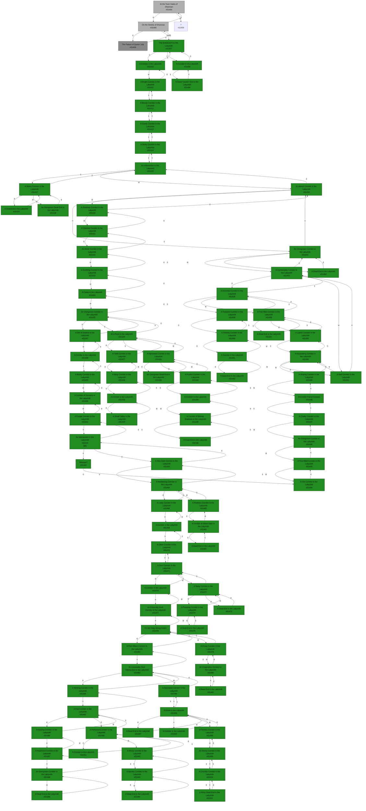

# The Labyrinth

99 rooms. Solid = direction; dotted = special exit.

```mermaid
flowchart TD
  r31404["At the Town Gates of Dharivian<br/>#31404"]
  r31405["On the Streets of Dharivian<br/>#31405"]
  r31406["The Palace of Queen Jula<br/>#31406"]
  r31407["The Entrance(?) to the Labyrinth<br/>#31407"]
  r31408["A Corridor in the Labyrinth<br/>#31408"]
  r31410["A Corridor in the Labyrinth<br/>#31410"]
  r31411["A Bright Corridor in the Labyrinth<br/>#31411"]
  r31412["A Bloody Corridor in the Labyrinth<br/>#31412"]
  r31413["A Comfy Corridor in the Labyrinth<br/>#31413"]
  r31414["A Sticky Corridor in the Labyrinth<br/>#31414"]
  r31415["An Intersection in the Labyrinth<br/>#31415"]
  r31416["A Littered Corridor in the Labyrinth<br/>#31416"]
  r31420["A Shadowy Corridor in the Labyrinth<br/>#31420"]
  r31421["A Claimed Corridor in the Labyrinth<br/>#31421"]
  r31422["An Eerie Corridor in the Labyrinth<br/>#31422"]
  r31423["A Soothing Corridor in the Labyrinth<br/>#31423"]
  r31424["A Camp in the Labyrinth<br/>#31424"]
  r31425["An Overgrown Corridor in the Labyrinth<br/>#31425"]
  r31437["A Den of Snakes in the Labyrinth<br/>#31437"]
  r31438["A Corridor in the Labyrinth<br/>#31438"]
  r31439["A Rocky Corridor in the Labyrinth<br/>#31439"]
  r31440["A Corridor of Screams in the Labyrinth<br/>#31440"]
  r31441["A Fungal Corridor in the Labyrinth<br/>#31441"]
  r31442["An Intersection in the Labyrinth<br/>#31442<br/>[pk]"]
  r31463["A Very Dark Corridor in the Labyrinth<br/>#31463"]
  r31464["A Maddening Corridor in the Labyrinth<br/>#31464"]
  r31465["A Feathery Corridor in the Labyrinth<br/>#31465"]
  r31466["A Corridor of Silken Dark in the Labyrinth<br/>#31466"]
  r31468["A Leafy Corridor in the Labyrinth<br/>#31468"]
  r31469["A Corridor in the Labyrinth<br/>#31469"]
  r31470["A Clean Corridor in the Labyrinth<br/>#31470"]
  r31471["A Sour Corridor in the Labyrinth<br/>#31471"]
  r31476["A Corridor in the Labyrinth<br/>#31476"]
  r31472["A Tacky Corridor in the Labyrinth<br/>#31472"]
  r31473["A Dead End in the Labyrinth<br/>#31473"]
  r31474["A Freezing Corridor in the Labyrinth<br/>#31474"]
  r31475["A Dead End in the Labyrinth<br/>#31475"]
  r31477["An Extremely Dark Corridor in the Labyrinth<br/>#31477"]
  r31478["It's Not Easy Being Green<br/>#31478"]
  r31482["A Pitch Black Corridor in the Labyrinth<br/>#31482"]
  r31479["A Frosty Corridor in the Labyrinth<br/>#31479"]
  r31480["An Imaginative Corridor in the Labyrinth<br/>#31480"]
  r31481["A Dead End in the Labyrinth<br/>#31481"]
  r31483["An Impossibly Dark Intersection in the Labyrinth<br/>#31483"]
  r31495["A Decorated Corridor in the Labyrinth<br/>#31495"]
  r31496["A Dome in the Labyrinth<br/>#31496"]
  r31498["A Flowery Corridor in the Labyrinth<br/>#31498"]
  r31499["An Ebony Corridor in the Labyrinth<br/>#31499"]
  r31500["A Crumbly Corridor in the Labyrinth<br/>#31500"]
  r31501["A Slimy Dead End in the Labyrinth<br/>#31501"]
  r31497["A Dead End in the Labyrinth<br/>#31497"]
  r31502["A Corridor in the Labyrinth<br/>#31502"]
  r31484["A Stinking Corridor in the Labyrinth<br/>#31484"]
  r31485["A Foul Corridor in the Labyrinth<br/>#31485"]
  r31486["A Sizzling Corridor in the Labyrinth<br/>#31486"]
  r31487["A Feathered Corridor in the Labyrinth<br/>#31487"]
  r31488["An Overgrown Corridor in the Labyrinth<br/>#31488"]
  r31489["A Dead End in the Labyrinth<br/>#31489"]
  r31490["A Perfumed Corridor in the Labyrinth<br/>#31490"]
  r31492["A Windy Corridor in the Labyrinth<br/>#31492"]
  r31493["A Spooky Corridor in the Labyrinth<br/>#31493"]
  r31494["A Dead End in the Labyrinth<br/>#31494"]
  r31491["A Corridor in the Labyrinth<br/>#31491"]
  r31467["A Dead End in the Labyrinth<br/>#31467"]
  r31443["Whoops?<br/>#31443"]
  r31444["A Hot Corridor in the Labyrinth<br/>#31444"]
  r31445["A Tree-filled Corridor in the Labyrinth<br/>#31445"]
  r31446["An Overgrown Corridor in the Labyrinth<br/>#31446"]
  r31447["A Chalky Corridor in the Labyrinth<br/>#31447"]
  r31448["A Corridor Full of Corpses<br/>#31448"]
  r31449["A Sloping Corridor in the Labyrinth<br/>#31449"]
  r31450["A Nauseating Corridor in the Labyrinth<br/>#31450"]
  r31451["A Sad Corridor in the Labyrinth<br/>#31451"]
  r31455["A Lupine Corridor in the Labyrinth<br/>#31455"]
  r31456["A Tree-filled Corridor in the Labyrinth<br/>#31456"]
  r31457["A Dead End in the Labyrinth<br/>#31457"]
  r31458["A Scorched Corridor in the Labyrinth<br/>#31458"]
  r31459["A Trampled Corridor in the Labyrinth<br/>#31459"]
  r31452["A Comfortable Corridor in the Labyrinth<br/>#31452"]
  r31453["An Overgrown Corridor in the Labyrinth<br/>#31453"]
  r31454["A Dead End in the Labyrinth<br/>#31454"]
  r31417["A Stinky Corridor in the Labyrinth<br/>#31417"]
  r31418["An Overgrown Dead End in the Labyrinth<br/>#31418"]
  r31419["A Dead End in the Labyrinth<br/>#31419"]
  r31409["A Dead *cackle* End in the Labyrinth<br/>#31409"]
  r31460["A Flowery Corridor in the Labyrinth<br/>#31460"]
  r31461["A Corridor in the Labyrinth<br/>#31461"]
  r31462["A Dead End in the Labyrinth<br/>#31462"]
  r31426["At a Pond in the Labyrinth<br/>#31426"]
  r31427["A Twilit Corridor in the Labyrinth<br/>#31427"]
  r31428["A Misty Corridor in the Labyrinth<br/>#31428"]
  r31429["A Corridor in the Labyrinth<br/>#31429"]
  r31430["A Small Valley in the Labyrinth<br/>#31430"]
  r31431["A Harvested Corridor in the Labyrinth<br/>#31431"]
  r31432["An Overgrown Dead End in the Labyrinth<br/>#31432"]
  r31433["A Fruitful Corridor in the Labyrinth<br/>#31433"]
  r31434["A Corridor in the Labyrinth<br/>#31434"]
  r31435["A Corridor of Ebbing Shadows in the Labyrinth<br/>#31435"]
  r31436["A Dead End in the Labyrinth<br/>#31436"]
  r31404 -->|e| r31405
  r11958["?<br/>#11958"]
  r31404 -->|w| r11958
  r31405 -->|n| r31406
  r31405 -->|north| r31407
  r31405 -->|w| r31404
  r31406 -->|s| r31405
  r31407 -->|n| r31410
  r31407 -->|s| r31408
  r31408 -->|n| r31407
  r31408 -->|s| r31409
  r31410 -->|s| r31407
  r31410 -->|w| r31411
  r31411 -->|e| r31410
  r31411 -->|s| r31412
  r31412 -->|n| r31411
  r31412 -->|s| r31413
  r31413 -->|n| r31412
  r31413 -->|s| r31414
  r31414 -->|n| r31413
  r31414 -->|s| r31415
  r31415 -->|n| r31414
  r31415 -->|s| r31417
  r31415 -->|w| r31416
  r31416 -->|e| r31415
  r31416 -->|n| r31453
  r31416 -->|w| r31420
  r31420 -->|e| r31416
  r31420 -->|w| r31421
  r31421 -->|e| r31420
  r31421 -->|n| r31422
  r31422 -->|s| r31421
  r31422 -->|w| r31423
  r31423 -->|e| r31422
  r31423 -->|w| r31424
  r31424 -->|e| r31423
  r31424 -->|w| r31425
  r31425 -->|e| r31424
  r31425 -->|n| r31437
  r31425 -->|s| r31426
  r31437 -->|s| r31425
  r31437 -->|w| r31438
  r31438 -->|e| r31437
  r31438 -->|s| r31439
  r31439 -->|n| r31438
  r31439 -->|w| r31440
  r31440 -->|e| r31439
  r31440 -->|w| r31441
  r31441 -->|e| r31440
  r31441 -->|n| r31442
  r31442 -->|e| r31443
  r31442 -->|n| r31463
  r31442 -->|s| r31441
  r31463 -->|n| r31464
  r31463 -->|s| r31442
  r31464 -->|e| r31468
  r31464 -->|n| r31465
  r31464 -->|s| r31463
  r31465 -->|e| r31466
  r31465 -->|s| r31464
  r31466 -->|n| r31467
  r31466 -->|w| r31465
  r31468 -->|e| r31469
  r31468 -->|w| r31464
  r31469 -->|n| r31470
  r31469 -->|w| r31468
  r31470 -->|n| r31471
  r31470 -->|s| r31469
  r31471 -->|e| r31476
  r31471 -->|n| r31472
  r31471 -->|s| r31470
  r31476 -->|e| r31477
  r31476 -->|w| r31471
  r31472 -->|e| r31474
  r31472 -->|s| r31471
  r31472 -->|w| r31473
  r31473 -->|e| r31472
  r31474 -->|n| r31475
  r31474 -->|w| r31472
  r31475 -->|s| r31474
  r31477 -->|e| r31478
  r31477 -->|w| r31476
  r31478 -->|e| r31482
  r31478 -->|n| r31479
  r31478 -->|w| r31477
  r31482 -->|s| r31483
  r31482 -->|w| r31478
  r31479 -->|s| r31478
  r31479 -->|w| r31480
  r31480 -->|e| r31479
  r31480 -->|n| r31481
  r31481 -->|s| r31480
  r31483 -->|e| r31484
  r31483 -->|n| r31482
  r31483 -->|w| r31495
  r31495 -->|e| r31483
  r31495 -->|s| r31496
  r31496 -->|e| r31497
  r31496 -->|n| r31495
  r31496 -->|s| r31502
  r31496 -->|w| r31498
  r31498 -->|e| r31496
  r31498 -->|w| r31499
  r31499 -->|e| r31498
  r31499 -->|n| r31500
  r31500 -->|e| r31501
  r31500 -->|s| r31499
  r31501 -->|w| r31500
  r31497 -->|w| r31496
  r31502 -->|n| r31496
  r31484 -->|n| r31485
  r31484 -->|w| r31483
  r31485 -->|e| r31486
  r31485 -->|n| r31490
  r31485 -->|s| r31484
  r31486 -->|e| r31487
  r31486 -->|w| r31485
  r31487 -->|n| r31488
  r31487 -->|w| r31486
  r31488 -->|s| r31487
  r31488 -->|w| r31489
  r31489 -->|e| r31488
  r31490 -->|n| r31491
  r31490 -->|s| r31485
  r31490 -->|w| r31492
  r31492 -->|e| r31490
  r31492 -->|n| r31493
  r31493 -->|s| r31492
  r31493 -->|w| r31494
  r31494 -->|e| r31493
  r31491 -->|s| r31490
  r31467 -->|s| r31466
  r31443 -->|n| r31444
  r31444 -->|e| r31445
  r31445 -->|e| r31446
  r31445 -->|w| r31444
  r31446 -->|e| r31447
  r31446 -->|w| r31445
  r31447 -->|s| r31448
  r31447 -->|w| r31446
  r31448 -->|e| r31449
  r31448 -->|n| r31447
  r31449 -->|e| r31450
  r31449 -->|w| r31448
  r31450 -->|e| r31451
  r31450 -->|n| r31455
  r31450 -->|w| r31449
  r31451 -->|e| r31452
  r31451 -->|w| r31450
  r31455 -->|e| r31456
  r31455 -->|s| r31450
  r31456 -->|e| r31458
  r31456 -->|n| r31457
  r31456 -->|w| r31455
  r31457 -->|s| r31456
  r31458 -->|n| r31459
  r31458 -->|s| r31452
  r31458 -->|w| r31456
  r31459 -->|n| r31460
  r31459 -->|s| r31458
  r31452 -->|n| r31458
  r31452 -->|s| r31453
  r31452 -->|w| r31451
  r31453 -->|n| r31452
  r31453 -->|s| r31416
  r31453 -->|w| r31454
  r31454 -->|e| r31453
  r31417 -->|e| r31419
  r31417 -->|n| r31415
  r31417 -->|w| r31418
  r31418 -->|e| r31417
  r31419 -->|w| r31417
  r31409 -->|n| r31408
  r31460 -->|e| r31461
  r31460 -->|s| r31459
  r31461 -->|e| r31462
  r31461 -->|w| r31460
  r31462 -->|w| r31461
  r31426 -->|e| r31427
  r31426 -->|n| r31425
  r31426 -->|s| r31431
  r31427 -->|e| r31428
  r31427 -->|w| r31426
  r31428 -->|s| r31429
  r31428 -->|w| r31427
  r31429 -->|e| r31430
  r31429 -->|n| r31428
  r31430 -->|w| r31429
  r31431 -->|e| r31432
  r31431 -->|n| r31426
  r31431 -->|w| r31433
  r31432 -->|w| r31431
  r31433 -->|e| r31431
  r31433 -->|n| r31434
  r31434 -->|s| r31433
  r31434 -->|w| r31435
  r31435 -->|e| r31434
  r31435 -->|s| r31436
  r31436 -->|n| r31435
  classDef t_city fill:#b0b0b0,color:#111,stroke:#222
  class r31404 t_city
  class r31405 t_city
  classDef t_inside fill:#8a8a8a,color:#111,stroke:#222
  class r31406 t_inside
  classDef t_forest fill:#228b22,color:#111,stroke:#222
  class r31407 t_forest
  class r31408 t_forest
  class r31410 t_forest
  class r31411 t_forest
  class r31412 t_forest
  class r31413 t_forest
  class r31414 t_forest
  class r31415 t_forest
  class r31416 t_forest
  class r31420 t_forest
  class r31421 t_forest
  class r31422 t_forest
  class r31423 t_forest
  class r31424 t_forest
  class r31425 t_forest
  class r31437 t_forest
  class r31438 t_forest
  class r31439 t_forest
  class r31440 t_forest
  class r31441 t_forest
  class r31442 t_forest
  class r31463 t_forest
  class r31464 t_forest
  class r31465 t_forest
  class r31466 t_forest
  class r31468 t_forest
  class r31469 t_forest
  class r31470 t_forest
  class r31471 t_forest
  class r31476 t_forest
  class r31472 t_forest
  class r31473 t_forest
  class r31474 t_forest
  class r31475 t_forest
  class r31477 t_forest
  class r31478 t_forest
  class r31482 t_forest
  class r31479 t_forest
  class r31480 t_forest
  class r31481 t_forest
  class r31483 t_forest
  class r31495 t_forest
  class r31496 t_forest
  class r31498 t_forest
  class r31499 t_forest
  class r31500 t_forest
  class r31501 t_forest
  class r31497 t_forest
  class r31502 t_forest
  class r31484 t_forest
  class r31485 t_forest
  class r31486 t_forest
  class r31487 t_forest
  class r31488 t_forest
  class r31489 t_forest
  class r31490 t_forest
  class r31492 t_forest
  class r31493 t_forest
  class r31494 t_forest
  class r31491 t_forest
  class r31467 t_forest
  class r31443 t_forest
  class r31444 t_forest
  class r31445 t_forest
  class r31446 t_forest
  class r31447 t_forest
  class r31448 t_forest
  class r31449 t_forest
  class r31450 t_forest
  class r31451 t_forest
  class r31455 t_forest
  class r31456 t_forest
  class r31457 t_forest
  class r31458 t_forest
  class r31459 t_forest
  class r31452 t_forest
  class r31453 t_forest
  class r31454 t_forest
  class r31417 t_forest
  class r31418 t_forest
  class r31419 t_forest
  class r31409 t_forest
  class r31460 t_forest
  class r31461 t_forest
  class r31462 t_forest
  class r31426 t_forest
  class r31427 t_forest
  class r31428 t_forest
  class r31429 t_forest
  class r31430 t_forest
  class r31431 t_forest
  class r31432 t_forest
  class r31433 t_forest
  class r31434 t_forest
  class r31435 t_forest
  class r31436 t_forest
```
