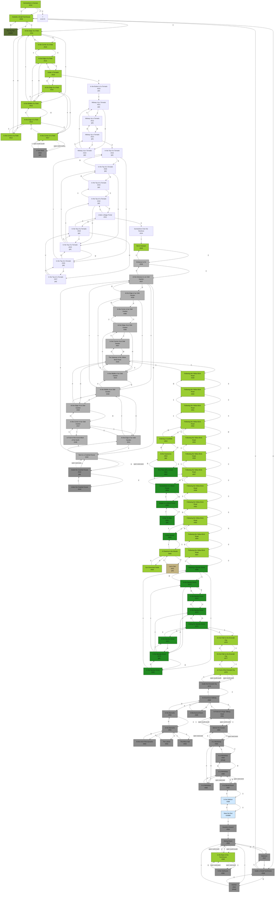

# The Land of Oz

102 rooms. Solid = direction; dotted = special exit.

```mermaid
flowchart TD
  r510["Somewhere in Kansas<br/>#510"]
  r509["Outside a Small Farmhouse<br/>#509"]
  r26887["The Pig Pen<br/>#26887"]
  r508["Inside a Small Farmhouse<br/>#508"]
  r507["Bedroom<br/>#507"]
  r506["Kitchen<br/>#506<br/>[shop]"]
  r505["Dining Room<br/>#505"]
  r598["In the Back of the Farmhouse<br/>#598"]
  r599["In the Outhouse<br/>#599"]
  r511["At the Edge of a Field<br/>#511"]
  r513["In the Corner of a Field<br/>#513"]
  r518["In the Corner of a Field<br/>#518"]
  r515["At the Edge of a Field<br/>#515"]
  r512["In the Middle of a Field<br/>#512"]
  r514["At the Edge of a Field<br/>#514"]
  r517["In the Corner of a Field<br/>#517"]
  r516["At the Edge of a Field<br/>#516"]
  r519["Under a Tornado!<br/>#519"]
  r594["A Tool Shed<br/>#594<br/>[pk]"]
  r520["In the Bottom of a Tornado<br/>#520<br/>[pk]"]
  r521["Midway Up a Tornado<br/>#521<br/>[pk]"]
  r523["Midway Up a Tornado<br/>#523<br/>[pk]"]
  r524["Midway Up a Tornado<br/>#524<br/>[pk]"]
  r522["Midway Up a Tornado<br/>#522<br/>[pk]"]
  r525["In the Top of a Tornado<br/>#525<br/>[pk]"]
  r530["In the Top of a Tornado<br/>#530<br/>[pk]"]
  r533["In the Top of a Tornado<br/>#533<br/>[pk]"]
  r532["In the Top of a Tornado<br/>#532<br/>[pk]"]
  r529["In the Top of a Tornado<br/>#529<br/>[pk]"]
  r527["In the Top of a Tornado<br/>#527<br/>[pk]"]
  r528["In the Top of a Tornado<br/>#528<br/>[pk]"]
  r531["Under a Magic Portal<br/>#531"]
  r534["Somewhere Over the Rainbow<br/>#534"]
  r535["Not in Kansas!<br/>#535"]
  r536["Entrance to Oz<br/>#536"]
  r537["At the Entrance to an Odd Garden<br/>#537"]
  r538["In the Middle of an Odd Garden<br/>#538"]
  r546["At the Edge of an Odd Garden<br/>#546"]
  r547["In the Corner of an Odd Garden<br/>#547"]
  r541["At the Edge of an Odd Garden<br/>#541"]
  r540["Next to a Crashed House<br/>#540"]
  r548["In Front of the Good Witch of the North<br/>#548"]
  r542["Inside the Crashed House<br/>#542<br/>[pk]"]
  r543["Under the Crashed House<br/>#543"]
  r539["At the Edge of an Odd Garden<br/>#539"]
  r544["In the Middle of an Odd Garden<br/>#544"]
  r545["The Gateway to the Yellow Brick Road<br/>#545"]
  r597["In the Corner of an Odd Garden<br/>#597"]
  r595["At the Edge of an Odd Garden<br/>#595"]
  r596["In the Corner of an Odd Garden<br/>#596"]
  r549["Following the Yellow Brick Road<br/>#549"]
  r550["Following the Yellow Brick Road<br/>#550"]
  r551["Following the Yellow Brick Road<br/>#551"]
  r552["Following the Yellow Brick Road<br/>#552"]
  r553["Entering a Cornfield<br/>#553"]
  r554["At the Scarecrow<br/>#554<br/>[pk]"]
  r602["At a Tree with a Crow's Nest<br/>#602"]
  r555["Following the Yellow Brick Road<br/>#555"]
  r556["Following the Yellow Brick Road<br/>#556"]
  r557["Following the Yellow Brick Road<br/>#557"]
  r559["Somewhere in a Weird Forest<br/>#559"]
  r560["Deeper in a Weird Forest<br/>#560"]
  r561["At the Tin Man<br/>#561<br/>[pk]"]
  r558["Following the Yellow Brick Road<br/>#558"]
  r562["Following the Yellow Brick Road<br/>#562"]
  r563["Following the Yellow Brick Road<br/>#563"]
  r565["In the Woods<br/>#565"]
  r566["A Clearing in the Woods<br/>#566"]
  r600["Sun-Drenched Fields<br/>#600"]
  r601["Lion's Den<br/>#601<br/>[pk]"]
  r564["Following the Yellow Brick Road<br/>#564"]
  r567["Following the Yellow Brick Road<br/>#567"]
  r568["Entering a Spooky Grove<br/>#568"]
  r569["In the Spooky Grove<br/>#569"]
  r570["In the Spooky Grove<br/>#570<br/>[pk]"]
  r573["In the Spooky Grove<br/>#573"]
  r574["In the Spooky Grove<br/>#574"]
  r572["In the Spooky Grove<br/>#572"]
  r575["Exiting the Spooky Grove<br/>#575"]
  r571["In the Spooky Grove<br/>#571"]
  r576["On the Path to the Emerald City<br/>#576"]
  r577["On the Path to the Emerald City<br/>#577"]
  r578["In Front of the Emerald City<br/>#578"]
  r579["Inside the Emerald City<br/>#579"]
  r580["An Enormous Hallway<br/>#580"]
  r590["In the Barracks<br/>#590"]
  r591["In the Barracks<br/>#591"]
  r603["At the end of the barracks<br/>#603"]
  r592["The Latrine<br/>#592"]
  r593["The Mess Hall<br/>#593"]
  r589["A Mechanical Room<br/>#589"]
  r581["In Front of a Huge Talking Head<br/>#581"]
  r582["Behind the Screen<br/>#582"]
  r583["In a Workshop<br/>#583"]
  r584["In a Workshop<br/>#584<br/>[shop]"]
  r585["In a Workshop<br/>#585"]
  r586["In a Workshop<br/>#586"]
  r587["In a Secret Room<br/>#587"]
  r588["In the Balloon<br/>#588"]
  r26888["Near the End<br/>#26888"]
  r504["Dorothy's Room!!<br/>#504"]
  r526["In the Top of a Tornado<br/>#526<br/>[pk]"]
  r510 -->|n| r509
  r13179["?<br/>#13179"]
  r510 -->|s| r13179
  r509 -->|e| r26887
  r509 -->|n| r511
  r509 -->|s| r510
  r509 -->|w| r508
  r26887 -->|w| r509
  r508 -->|e| r509
  r508 -->|s| r507
  r508 -->|w| r506
  r507 -->|n| r508
  r507 -->|w| r505
  r506 -->|e| r508
  r506 -->|s| r505
  r505 -->|e| r507
  r505 -->|n| r506
  r505 -.->|open south;south| r598
  r505 -->|s| r598
  r598 -->|e| r599
  r598 -->|n| r505
  r598 -.->|open east;east| r599
  r598 -.->|open north;north| r505
  r599 -.->|open west;west| r598
  r599 -->|w| r598
  r511 -->|e| r518
  r511 -->|n| r512
  r511 -->|s| r509
  r511 -->|w| r513
  r513 -->|e| r511
  r513 -->|n| r514
  r518 -->|n| r515
  r518 -->|w| r511
  r515 -->|n| r519
  r515 -->|s| r518
  r515 -->|w| r512
  r512 -->|e| r515
  r512 -->|n| r516
  r512 -->|s| r511
  r512 -->|w| r514
  r514 -->|e| r512
  r514 -->|n| r517
  r514 -->|s| r513
  r517 -->|e| r516
  r517 -->|n| r594
  r517 -.->|open north;north| r594
  r517 -->|s| r514
  r516 -->|e| r519
  r516 -->|s| r512
  r516 -->|w| r517
  r519 -->|s| r515
  r519 -->|u| r520
  r519 -->|w| r516
  r594 -.->|open south;south| r517
  r594 -->|s| r517
  r520 -->|u| r521
  r521 -->|n| r522
  r521 -->|w| r523
  r523 -->|e| r521
  r523 -->|n| r524
  r524 -->|e| r522
  r524 -->|s| r523
  r524 -->|u| r525
  r522 -->|s| r521
  r522 -->|w| r524
  r525 -->|e| r530
  r525 -->|n| r526
  r530 -->|e| r533
  r530 -->|n| r529
  r530 -->|w| r525
  r533 -->|n| r532
  r533 -->|w| r530
  r532 -->|n| r531
  r532 -->|s| r533
  r532 -->|w| r529
  r529 -->|e| r532
  r529 -->|n| r528
  r529 -->|s| r530
  r529 -->|w| r526
  r527 -->|e| r528
  r527 -->|s| r526
  r528 -->|e| r531
  r528 -->|s| r529
  r528 -->|w| r527
  r531 -->|s| r532
  r531 -->|u| r534
  r531 -->|w| r528
  r534 -->|u| r535
  r535 -->|n| r536
  r536 -->|n| r537
  r536 -->|s| r535
  r537 -->|e| r539
  r537 -->|n| r538
  r537 -->|s| r536
  r537 -->|w| r540
  r538 -->|e| r544
  r538 -->|n| r546
  r538 -->|s| r537
  r538 -->|w| r541
  r546 -->|e| r545
  r546 -->|s| r538
  r546 -->|w| r547
  r547 -->|e| r546
  r547 -->|n| r548
  r547 -->|s| r541
  r541 -->|e| r538
  r541 -->|n| r547
  r541 -->|s| r540
  r540 -->|e| r537
  r540 -->|n| r541
  r540 -.->|open west;west| r542
  r540 -->|w| r542
  r548 -->|s| r547
  r542 -->|d| r543
  r542 -->|e| r540
  r542 -.->|open east;east| r540
  r543 -->|u| r542
  r539 -->|e| r596
  r539 -->|n| r544
  r539 -->|w| r537
  r544 -->|e| r595
  r544 -->|n| r545
  r544 -->|s| r539
  r544 -->|w| r538
  r545 -->|e| r597
  r545 -->|n| r549
  r545 -->|s| r544
  r545 -->|w| r546
  r597 -->|s| r595
  r597 -->|w| r545
  r595 -->|n| r597
  r595 -->|s| r596
  r595 -->|w| r544
  r596 -->|n| r595
  r596 -->|w| r539
  r549 -->|e| r550
  r549 -->|s| r545
  r550 -->|n| r551
  r550 -->|w| r549
  r551 -->|n| r552
  r551 -->|s| r550
  r552 -->|e| r553
  r552 -->|s| r551
  r552 -->|w| r555
  r553 -->|e| r554
  r553 -->|w| r552
  r554 -->|e| r602
  r554 -->|w| r553
  r602 -->|w| r554
  r555 -->|e| r552
  r555 -->|n| r556
  r556 -->|n| r557
  r556 -->|s| r555
  r557 -->|n| r558
  r557 -->|s| r556
  r557 -->|w| r559
  r559 -->|e| r557
  r559 -->|w| r560
  r560 -->|e| r559
  r560 -->|s| r561
  r561 -->|n| r560
  r558 -->|n| r562
  r558 -->|s| r557
  r562 -->|e| r563
  r562 -->|s| r558
  r563 -->|e| r564
  r563 -->|n| r565
  r563 -->|w| r562
  r565 -->|n| r566
  r565 -->|s| r563
  r566 -->|n| r601
  r566 -->|s| r565
  r566 -->|w| r600
  r600 -->|e| r566
  r601 -->|s| r566
  r564 -->|e| r567
  r564 -->|w| r563
  r567 -->|n| r568
  r567 -->|w| r564
  r568 -->|e| r573
  r568 -->|n| r569
  r568 -->|s| r567
  r569 -->|e| r570
  r569 -->|s| r568
  r570 -->|e| r572
  r570 -->|n| r571
  r570 -->|s| r573
  r570 -->|w| r569
  r573 -->|e| r574
  r573 -->|n| r570
  r573 -->|w| r568
  r574 -->|n| r572
  r574 -->|w| r573
  r572 -->|n| r575
  r572 -->|s| r574
  r572 -->|w| r570
  r575 -->|n| r576
  r575 -->|s| r572
  r575 -->|w| r571
  r571 -->|e| r575
  r571 -->|s| r570
  r576 -->|n| r577
  r576 -->|s| r575
  r577 -->|n| r578
  r577 -->|s| r576
  r578 -->|n| r579
  r578 -.->|open north;north| r579
  r578 -->|s| r577
  r579 -->|n| r580
  r579 -.->|open south;south| r578
  r579 -->|s| r578
  r580 -->|e| r590
  r580 -->|n| r581
  r580 -->|s| r579
  r580 -->|w| r589
  r590 -->|e| r591
  r590 -->|w| r580
  r591 -->|e| r603
  r591 -->|n| r592
  r591 -->|s| r593
  r591 -->|w| r590
  r603 -->|w| r591
  r592 -->|s| r591
  r593 -->|n| r591
  r589 -->|e| r580
  r581 -->|n| r582
  r581 -.->|open north;north| r582
  r581 -->|s| r580
  r582 -.->|open south;south| r581
  r582 -.->|open west;west| r583
  r582 -->|s| r581
  r582 -->|w| r583
  r583 -->|e| r582
  r583 -.->|open east;east| r582
  r583 -->|s| r584
  r583 -->|w| r586
  r584 -->|n| r583
  r584 -->|w| r585
  r585 -->|e| r584
  r585 -->|n| r586
  r585 -.->|open west;west| r587
  r585 -->|w| r587
  r586 -->|e| r583
  r586 -->|s| r585
  r587 -->|e| r585
  r587 -.->|open east;east| r585
  r587 -->|u| r588
  r588 -->|d| r587
  r588 -->|u| r26888
  r26888 -->|d| r588
  r26888 -->|u| r504
  r504 -->|e| r505
  r526 -->|e| r529
  r526 -->|n| r527
  r526 -->|s| r525
  classDef t_field fill:#9acd32,color:#111,stroke:#222
  class r510 t_field
  class r509 t_field
  classDef t_swamp fill:#556b2f,color:#111,stroke:#222
  class r26887 t_swamp
  classDef t_inside fill:#8a8a8a,color:#111,stroke:#222
  class r508 t_inside
  class r507 t_inside
  class r506 t_inside
  class r505 t_inside
  class r598 t_field
  class r599 t_inside
  class r511 t_field
  class r513 t_field
  class r518 t_field
  class r515 t_field
  class r512 t_field
  class r514 t_field
  class r517 t_field
  class r516 t_field
  class r519 t_field
  class r594 t_inside
  class r535 t_field
  classDef t_city fill:#b0b0b0,color:#111,stroke:#222
  class r536 t_city
  class r537 t_city
  class r538 t_city
  class r546 t_city
  class r547 t_city
  class r541 t_city
  class r540 t_city
  class r548 t_city
  class r542 t_inside
  class r543 t_inside
  class r539 t_city
  class r544 t_city
  class r545 t_city
  class r597 t_city
  class r595 t_city
  class r596 t_city
  class r549 t_field
  class r550 t_field
  class r551 t_field
  class r552 t_field
  class r553 t_field
  class r554 t_field
  classDef t_forest fill:#228b22,color:#111,stroke:#222
  class r602 t_forest
  class r555 t_field
  class r556 t_field
  class r557 t_field
  class r559 t_forest
  class r560 t_forest
  class r561 t_forest
  class r558 t_field
  class r562 t_field
  class r563 t_field
  class r565 t_forest
  class r566 t_field
  class r600 t_field
  classDef t_hills fill:#c2b280,color:#111,stroke:#222
  class r601 t_hills
  class r564 t_field
  class r567 t_field
  class r568 t_forest
  class r569 t_forest
  class r570 t_forest
  class r573 t_forest
  class r574 t_forest
  class r572 t_forest
  class r575 t_forest
  class r571 t_forest
  class r576 t_field
  class r577 t_field
  class r578 t_field
  class r579 t_inside
  class r580 t_inside
  class r590 t_inside
  class r591 t_inside
  class r603 t_inside
  class r592 t_inside
  class r593 t_inside
  class r589 t_inside
  class r581 t_inside
  class r582 t_inside
  class r583 t_inside
  class r584 t_inside
  class r585 t_inside
  class r586 t_inside
  class r587 t_inside
  classDef t_air fill:#cfe8ff,color:#111,stroke:#222
  class r588 t_air
  class r26888 t_air
  class r504 t_inside
```
