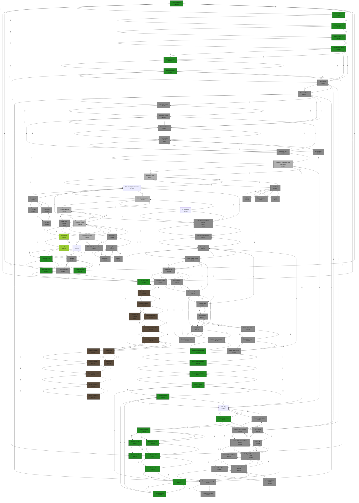

# The Land of the Beer Goblins

101 rooms. Solid = direction; dotted = special exit.

```mermaid
flowchart TD
  r20036["Eastern Woods<br/>#20036"]
  r20037["Eastern Woods<br/>#20037"]
  r20038["Woods East of Inn<br/>#20038"]
  r20039["Woods East of Inn<br/>#20039"]
  r20040["Woods North of Inn<br/>#20040"]
  r20041["Northern Woods<br/>#20041"]
  r20042["Inn's Stable<br/>#20042"]
  r20043["Northern Woods<br/>#20043"]
  r20044["Inn's Stable<br/>#20044"]
  r20045["Northern Woods<br/>#20045"]
  r20046["Hay Loft<br/>#20046"]
  r20047["Northern Woods<br/>#20047"]
  r20048["Woods North of Inn<br/>#20048"]
  r20049["Northern Woods<br/>#20049"]
  r20050["Northern Woods<br/>#20050"]
  r20051["Woods West of Inn<br/>#20051"]
  r20052["Woods West of Inn<br/>#20052"]
  r20053["Western Woods<br/>#20053"]
  r20054["Western Woods<br/>#20054"]
  r20055["Western Woods<br/>#20055"]
  r20056["Western Woods<br/>#20056"]
  r20057["Woods North of Factory<br/>#20057"]
  r20058["Woods North of Factory<br/>#20058"]
  r20059["Path to Rear Entrance<br/>#20059"]
  r20060["Two Stone Columns<br/>#20060"]
  r20061["In a Home<br/>#20061"]
  r20062["Southern Green<br/>#20062"]
  r20063["On a Path<br/>#20063"]
  r20064["On a Path<br/>#20064"]
  r20065["Copenser Avenue<br/>#20065"]
  r20066["Utility Shop<br/>#20066<br/>[shop]"]
  r20067["In a Cabin<br/>#20067"]
  r20068["Mid-Green Junction<br/>#20068"]
  r20069["A Side Alley<br/>#20069"]
  r20070["The Brewington Brew Shoppe<br/>#20070<br/>[shop]"]
  r20071["The Brewington Fountain<br/>#20071"]
  r20072["In a Home<br/>#20072"]
  r20073["Northern Green<br/>#20073"]
  r20074["In a Home<br/>#20074"]
  r20075["Entrance to the Brewington Manor Inn<br/>#20075"]
  r20076["Side Alley<br/>#20076"]
  r20077["Common Room<br/>#20077"]
  r20078["Common Room<br/>#20078"]
  r20079["Common Room<br/>#20079"]
  r20080["The Inn's Bar<br/>#20080<br/>[shop]"]
  r20081["Common Room<br/>#20081"]
  r20082["Common Room<br/>#20082"]
  r20083["Second Floor Balcony<br/>#20083"]
  r20084["The Beer Keg Suite<br/>#20084"]
  r20085["Second Floor Balcony<br/>#20085"]
  r20086["A Trashed Suite<br/>#20086<br/>[trainer]"]
  r20087["Second Floor Balcony<br/>#20087"]
  r20088["The Inn Water Closet<br/>#20088<br/>[healer]"]
  r20089["Corner of the Second Floor Balcony<br/>#20089"]
  r20090["The Crystal Stein Meeting Hall<br/>#20090"]
  r20091["Second Floor Balcony<br/>#20091"]
  r20092["Inn's Kitchen<br/>#20092"]
  r20093["Western Back Stairs<br/>#20093"]
  r20094["A Wooded Path<br/>#20094"]
  r20095["A Wooded Path<br/>#20095"]
  r20096["A Wooded Path<br/>#20096"]
  r20097["Cave Entrance<br/>#20097"]
  r20098["Cavern Chamber<br/>#20098"]
  r20099["Used Can Pit<br/>#20099<br/>[safe]"]
  r20100["Cavern Chamber<br/>#20100"]
  r20101["Lower Cavern Chamber<br/>#20101"]
  r20102["Lower Cavern Chamber<br/>#20102"]
  r20103["Meeting Hall<br/>#20103"]
  r20104["Beer Rack<br/>#20104"]
  r20105["Guard Barracks<br/>#20105"]
  r20106["Guard Barracks<br/>#20106"]
  r20107["King's Waiting Room<br/>#20107"]
  r20108["King's Entrance<br/>#20108"]
  r20109["King's Chamber<br/>#20109"]
  r20110["Living Room<br/>#20110"]
  r20111["Kitchen<br/>#20111"]
  r20112["A Bedroom<br/>#20112"]
  r20113["A Bedroom<br/>#20113"]
  r20114["The Attic<br/>#20114"]
  r20115["A Kitchen<br/>#20115"]
  r20116["A Patio<br/>#20116"]
  r20117["A Cellar<br/>#20117"]
  r20118["Guest Quarters<br/>#20118"]
  r20119["A Small Bedroom<br/>#20119"]
  r20120["Beer Factory Entrance<br/>#20120"]
  r20121["Brewing Vats<br/>#20121"]
  r20122["Brewing Vats<br/>#20122"]
  r20123["Aging Casks<br/>#20123"]
  r20124["Observation Deck<br/>#20124"]
  r20125["Observation Deck<br/>#20125"]
  r20126["Observation Deck<br/>#20126"]
  r20127["Factory Rear Entrance<br/>#20127"]
  r20128["Aging Casks<br/>#20128"]
  r20129["Inspection Room<br/>#20129"]
  r20130["Taste Testing Room<br/>#20130"]
  r20131["Brew Rejection Room<br/>#20131"]
  r20132["Bottling Room<br/>#20132"]
  r20133["Bottling Room<br/>#20133"]
  r20134["Manager's Office<br/>#20134"]
  r20135["Eastern Woods<br/>#20135"]
  r34741["Behind the Western Pillar<br/>#34741"]
  r20036 -->|n| r20037
  r20036 -->|s| r20096
  r20036 -->|w| r20135
  r20037 -->|n| r20038
  r20037 -->|s| r20036
  r20038 -->|n| r20039
  r20038 -->|s| r20037
  r20039 -->|n| r20040
  r20039 -->|s| r20038
  r20040 -->|n| r20041
  r20040 -->|s| r20039
  r20040 -->|w| r20042
  r20041 -->|s| r20040
  r20041 -->|w| r20043
  r20042 -->|e| r20040
  r20042 -->|n| r20043
  r20042 -->|s| r20082
  r20042 -->|w| r20044
  r20043 -->|e| r20041
  r20043 -->|s| r20042
  r20043 -->|w| r20045
  r20044 -->|e| r20042
  r20044 -->|u| r20046
  r20044 -->|w| r20048
  r20045 -->|e| r20043
  r20045 -->|w| r20047
  r20046 -->|d| r20044
  r20047 -->|e| r20045
  r20047 -->|w| r20049
  r20048 -->|e| r20044
  r20048 -->|n| r20049
  r20048 -->|s| r20076
  r20049 -->|e| r20047
  r20049 -->|s| r20048
  r20049 -->|w| r20050
  r20050 -->|e| r20049
  r20050 -->|s| r20051
  r20051 -->|n| r20050
  r20051 -->|s| r20052
  r20052 -->|n| r20051
  r20052 -->|s| r20053
  r20053 -->|e| r20054
  r20053 -->|n| r20052
  r20053 -->|s| r20056
  r20054 -->|s| r20055
  r20054 -->|w| r20053
  r20055 -->|e| r20076
  r20055 -->|n| r20054
  r20055 -->|w| r20056
  r20056 -->|e| r20055
  r20056 -->|n| r20053
  r20056 -->|w| r20057
  r20057 -->|e| r20056
  r20057 -->|w| r20058
  r20058 -->|e| r20057
  r20058 -->|s| r20059
  r20059 -->|n| r20058
  r20059 -->|s| r20127
  r20060 -->|n| r20062
  r12642["?<br/>#12642"]
  r20060 -->|s| r12642
  r20060 -->|w| r34741
  r20061 -->|e| r20062
  r20061 -->|s| r20110
  r20062 -->|e| r20063
  r20062 -->|n| r20065
  r20062 -->|s| r20060
  r20062 -->|w| r20061
  r20063 -->|e| r20064
  r20063 -->|w| r20062
  r20064 -->|e| r20094
  r20064 -->|n| r20067
  r20064 -->|w| r20063
  r20065 -->|e| r20066
  r20065 -->|n| r20068
  r20065 -->|s| r20062
  r20066 -->|w| r20065
  r20067 -->|n| r20135
  r20067 -->|s| r20064
  r20067 -->|w| r20119
  r20068 -->|n| r20071
  r20068 -->|s| r20065
  r20068 -->|w| r20069
  r20069 -->|e| r20068
  r20069 -->|n| r20070
  r20070 -->|e| r20071
  r20070 -->|s| r20069
  r20070 -->|w| r20120
  r20071 -->|e| r20072
  r20071 -->|n| r20073
  r20071 -->|s| r20068
  r20071 -->|w| r20070
  r20072 -->|e| r20115
  r20072 -->|n| r20113
  r20072 -->|w| r20071
  r20073 -->|n| r20075
  r20073 -->|s| r20071
  r20073 -->|w| r20074
  r20074 -->|d| r20117
  r20074 -->|e| r20073
  r20074 -->|s| r20118
  r20074 -->|w| r20116
  r20075 -->|n| r20077
  r20075 -->|s| r20073
  r20075 -->|w| r20076
  r20076 -->|e| r20075
  r20076 -->|n| r20048
  r20076 -->|u| r20093
  r20076 -->|w| r20055
  r20077 -->|e| r20078
  r20077 -->|n| r20080
  r20077 -->|s| r20075
  r20078 -->|e| r20079
  r20078 -->|n| r20081
  r20078 -->|w| r20077
  r20079 -->|n| r20082
  r20079 -->|w| r20078
  r20080 -->|e| r20081
  r20080 -->|s| r20077
  r20080 -->|w| r20092
  r20081 -->|e| r20082
  r20081 -->|s| r20078
  r20081 -->|w| r20080
  r20082 -->|n| r20042
  r20082 -->|s| r20079
  r20082 -->|u| r20083
  r20082 -->|w| r20081
  r20083 -->|d| r20082
  r20083 -->|n| r20084
  r20083 -->|w| r20085
  r20084 -->|s| r20083
  r20085 -->|e| r20083
  r20085 -->|n| r20086
  r20085 -->|w| r20087
  r20086 -->|s| r20085
  r20087 -->|e| r20085
  r20087 -->|n| r20088
  r20087 -->|w| r20089
  r20088 -->|s| r20087
  r20089 -->|e| r20087
  r20089 -->|n| r20090
  r20089 -->|s| r20091
  r20090 -->|s| r20089
  r20091 -->|n| r20089
  r20091 -->|s| r20093
  r20092 -->|e| r20080
  r20093 -->|d| r20076
  r20093 -->|n| r20091
  r20094 -->|n| r20095
  r20094 -->|w| r20064
  r20095 -->|n| r20096
  r20095 -->|s| r20094
  r20096 -->|e| r20097
  r20096 -->|n| r20036
  r20096 -->|s| r20095
  r20097 -->|e| r20098
  r20097 -->|w| r20096
  r20098 -->|e| r20100
  r20098 -->|n| r20099
  r20098 -->|w| r20097
  r20100 -->|d| r20101
  r20100 -->|w| r20098
  r20101 -->|u| r20100
  r20101 -->|w| r20102
  r20102 -->|d| r20105
  r20102 -->|e| r20101
  r20102 -->|w| r20103
  r20103 -->|e| r20102
  r20103 -->|s| r20104
  r20104 -->|n| r20103
  r20105 -->|e| r20106
  r20105 -->|u| r20102
  r20106 -->|d| r20107
  r20106 -->|w| r20105
  r20107 -->|u| r20106
  r20107 -->|w| r20108
  r20108 -->|e| r20107
  r20108 -->|w| r20109
  r20109 -->|e| r20108
  r20110 -->|n| r20061
  r20110 -->|u| r20112
  r20110 -->|w| r20111
  r20111 -->|e| r20110
  r20112 -->|d| r20110
  r20113 -->|s| r20072
  r20113 -->|u| r20114
  r20114 -->|d| r20113
  r20115 -->|w| r20072
  r20116 -->|e| r20074
  r20117 -->|u| r20074
  r20118 -->|n| r20074
  r20119 -->|e| r20067
  r20120 -->|e| r20070
  r20120 -->|w| r20121
  r20121 -->|e| r20120
  r20121 -->|s| r20130
  r20121 -->|u| r20126
  r20121 -->|w| r20122
  r20122 -->|e| r20121
  r20122 -->|s| r20129
  r20122 -->|w| r20123
  r20123 -->|e| r20122
  r20123 -->|s| r20128
  r20123 -->|u| r20124
  r20124 -->|d| r20123
  r20124 -->|e| r20125
  r20125 -->|e| r20126
  r20125 -->|w| r20124
  r20126 -->|d| r20121
  r20126 -->|w| r20125
  r20127 -->|e| r20128
  r20127 -->|n| r20059
  r20128 -->|e| r20129
  r20128 -->|n| r20123
  r20128 -->|s| r20131
  r20128 -->|w| r20127
  r20129 -->|e| r20130
  r20129 -->|n| r20122
  r20129 -->|s| r20132
  r20129 -->|w| r20128
  r20130 -->|n| r20121
  r20130 -->|s| r20133
  r20130 -->|w| r20129
  r20131 -->|e| r20132
  r20131 -->|n| r20128
  r20132 -->|e| r20133
  r20132 -->|n| r20129
  r20132 -->|w| r20131
  r20133 -->|e| r20134
  r20133 -->|n| r20130
  r20133 -->|w| r20132
  r20134 -->|w| r20133
  r20135 -->|e| r20036
  r20135 -->|s| r20067
  r34741 -->|e| r20060
  classDef t_forest fill:#228b22,color:#111,stroke:#222
  class r20036 t_forest
  class r20037 t_forest
  class r20038 t_forest
  class r20039 t_forest
  class r20040 t_forest
  class r20041 t_forest
  classDef t_inside fill:#8a8a8a,color:#111,stroke:#222
  class r20042 t_inside
  class r20043 t_forest
  class r20044 t_inside
  class r20045 t_forest
  class r20046 t_inside
  class r20047 t_forest
  class r20048 t_forest
  class r20049 t_forest
  class r20050 t_forest
  class r20051 t_forest
  class r20052 t_forest
  class r20053 t_forest
  class r20054 t_forest
  class r20055 t_forest
  class r20056 t_forest
  class r20057 t_forest
  class r20058 t_forest
  class r20059 t_forest
  classDef t_city fill:#b0b0b0,color:#111,stroke:#222
  class r20060 t_city
  class r20061 t_inside
  class r20062 t_city
  classDef t_field fill:#9acd32,color:#111,stroke:#222
  class r20063 t_field
  class r20064 t_field
  class r20065 t_city
  class r20066 t_inside
  class r20067 t_inside
  class r20068 t_city
  class r20070 t_inside
  class r20072 t_inside
  class r20073 t_city
  class r20074 t_inside
  class r20075 t_city
  class r20077 t_inside
  class r20078 t_inside
  class r20079 t_inside
  class r20080 t_inside
  class r20081 t_inside
  class r20082 t_inside
  class r20083 t_inside
  class r20084 t_inside
  class r20085 t_inside
  class r20086 t_inside
  class r20087 t_inside
  class r20088 t_inside
  class r20089 t_inside
  class r20090 t_inside
  class r20091 t_inside
  class r20092 t_inside
  class r20093 t_inside
  class r20094 t_forest
  class r20095 t_forest
  class r20096 t_forest
  classDef t_cave fill:#5a4a3a,color:#111,stroke:#222
  class r20097 t_cave
  class r20098 t_cave
  class r20099 t_cave
  class r20100 t_cave
  class r20101 t_cave
  class r20102 t_cave
  class r20103 t_cave
  class r20104 t_cave
  class r20105 t_cave
  class r20106 t_cave
  class r20107 t_cave
  class r20108 t_cave
  class r20109 t_cave
  class r20110 t_inside
  class r20111 t_inside
  class r20112 t_inside
  class r20113 t_inside
  class r20114 t_inside
  class r20115 t_inside
  class r20116 t_inside
  class r20117 t_inside
  class r20118 t_inside
  class r20119 t_inside
  class r20120 t_inside
  class r20121 t_inside
  class r20122 t_inside
  class r20123 t_inside
  class r20124 t_inside
  class r20125 t_inside
  class r20126 t_inside
  class r20127 t_inside
  class r20128 t_inside
  class r20129 t_inside
  class r20130 t_inside
  class r20131 t_inside
  class r20132 t_inside
  class r20133 t_inside
  class r20134 t_inside
  class r20135 t_forest
  class r34741 t_inside
```
