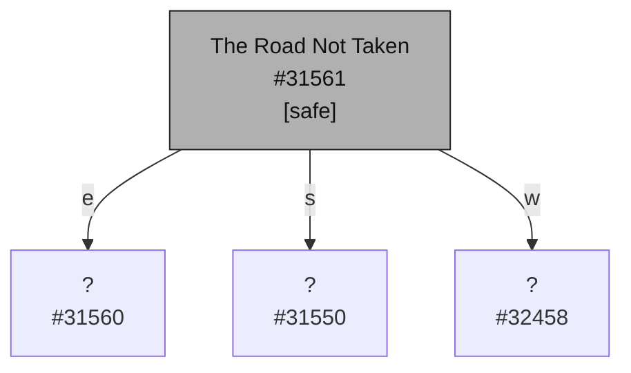

# The Legendary City of Tanelorn

1 rooms. Solid = direction; dotted = special exit.

```mermaid
flowchart TD
  r31561["The Road Not Taken<br/>#31561<br/>[safe]"]
  r31560["?<br/>#31560"]
  r31561 -->|e| r31560
  r31550["?<br/>#31550"]
  r31561 -->|s| r31550
  r32458["?<br/>#32458"]
  r31561 -->|w| r32458
  classDef t_city fill:#b0b0b0,color:#111,stroke:#222
  class r31561 t_city
```
