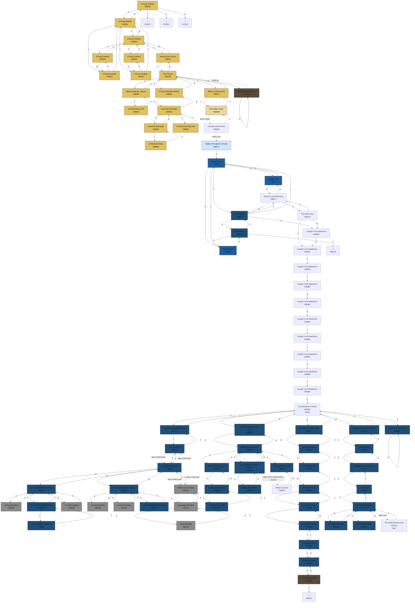

# The Maelstrom

81 rooms. Solid = direction; dotted = special exit.

```mermaid
flowchart TD
  r38050["A Dusty Seabed<br/>#38050"]
  r38051["A Dusty Seabed<br/>#38051"]
  r38052["A Dusty Seabed<br/>#38052"]
  r38055["A Dusty Seabed<br/>#38055"]
  r38054["A Dusty Seabed<br/>#38054"]
  r38056["A Dusty Seabed<br/>#38056"]
  r38053["A Dusty Seabed<br/>#38053"]
  r38057["Nearing the Fissure<br/>#38057"]
  r38058["The Fissure<br/>#38058"]
  r38059["Approaching the Canyon<br/>#38059"]
  r38060["A Breathtaking View<br/>#38060"]
  r38061["A Trail of Wooden Debris<br/>#38061"]
  r38062["Amid the Wreckage<br/>#38062"]
  r38064["Amid the Wreckage<br/>#38064"]
  r38063["A Half-buried Ship Hull<br/>#38063"]
  r38065["A Shattered Mast<br/>#38065"]
  r38070["A Bottomless Chasm?<br/>#38070"]
  r38067["Before a Ruined City<br/>#38067"]
  r38068["The Fallen Tower<br/>#38068"]
  r38069["A Nearly Intact Room<br/>#38069"]
  r38071["Falling Through the Clouds<br/>#38071"]
  r38072["Rough Seas<br/>#38072"]
  r38073["Rough Seas<br/>#38073"]
  r38076["At the Brink<br/>#38076"]
  r38075["At the Brink<br/>#38075"]
  r38077["Aboard a Doomed Ship<br/>#38077"]
  r38074["Rough Seas<br/>#38074"]
  r38078["The Ship's Bow<br/>#38078"]
  r38080["Caught in the Maelstrom<br/>#38080"]
  r38081["Caught in the Maelstrom<br/>#38081"]
  r38083["Caught in the Maelstrom<br/>#38083"]
  r38084["Caught in the Maelstrom<br/>#38084"]
  r38085["Caught in the Maelstrom<br/>#38085"]
  r38086["Caught in the Maelstrom<br/>#38086"]
  r38087["Caught in the Maelstrom<br/>#38087"]
  r38088["Caught in the Maelstrom<br/>#38088"]
  r38089["Caught in the Maelstrom<br/>#38089"]
  r38090["The Maelstrom's Heart<br/>#38090<br/>[safe]"]
  r38092["Before a Graveyard of Ships<br/>#38092"]
  r38116["Entering the Kelp Forest<br/>#38116"]
  r38125["Nearing the Oceanic Trench<br/>#38125"]
  r38091["Trapped in the Torrent<br/>#38091"]
  r38101["Approaching the Coral City<br/>#38101"]
  r38102["The City Gates<br/>#38102"]
  r38103["A Grand Intersection<br/>#38103"]
  r38104["On a Crushed Shell Street<br/>#38104"]
  r38106["A Coral Dwelling<br/>#38106"]
  r38110["On a Crushed Shell Street<br/>#38110"]
  r38112["Lost in a Maze of Streets<br/>#38112"]
  r38108["A Coral Dwelling<br/>#38108"]
  r38105["On a Crushed Shell Street<br/>#38105"]
  r38109["A Coral Dwelling<br/>#38109"]
  r38107["A Coral Dwelling<br/>#38107"]
  r38111["On a Crushed Shell Street<br/>#38111"]
  r38113["Within a Coral Spire<br/>#38113"]
  r38114["Ascending the Spire<br/>#38114"]
  r38115["Atop the Spire<br/>#38115"]
  r38093["Within the Graveyard<br/>#38093"]
  r38096["In the Shadow of the Galleon<br/>#38096"]
  r38098["Within the Graveyard<br/>#38098"]
  r38094["An Upended Wreck<br/>#38094"]
  r38099["A Broken Ship (Fore)<br/>#38099"]
  r38100["A Broken Ship (Aft)<br/>#38100"]
  r38097["Aboard the Galleon<br/>#38097"]
  r38095["Within the Hold<br/>#38095"]
  r38117["The Kelp Forest<br/>#38117"]
  r38118["The Kelp Forest<br/>#38118"]
  r38119["The Kelp Forest<br/>#38119"]
  r38120["The Kelp Forest<br/>#38120"]
  r38121["The Kelp Forest<br/>#38121"]
  r38122["The Kelp Forest<br/>#38122"]
  r38124["The Kelp Forest<br/>#38124"]
  r38123["A Mysterious Cave<br/>#38123"]
  r38126["The Precipice<br/>#38126"]
  r38127["Descending Into Darkness<br/>#38127"]
  r38128["The Deep<br/>#38128"]
  r38129["At Trench's Bottom<br/>#38129"]
  r38130["At Trench's Bottom<br/>#38130"]
  r38131["At Trench's Bottom<br/>#38131"]
  r38132["The Hydrothermal Vent<br/>#38132<br/>[pk]"]
  r38082["Caught in the Maelstrom<br/>#38082"]
  r38050 -->|e| r38051
  r24281["?<br/>#24281"]
  r38050 -->|n| r24281
  r24341["?<br/>#24341"]
  r38050 -->|s| r24341
  r24310["?<br/>#24310"]
  r38050 -->|w| r24310
  r38051 -->|e| r38054
  r38051 -->|n| r38052
  r38051 -->|s| r38053
  r38051 -->|w| r38050
  r38052 -->|e| r38055
  r38052 -->|s| r38051
  r38055 -->|s| r38054
  r38055 -->|w| r38052
  r38054 -->|e| r38057
  r38054 -->|n| r38055
  r38054 -->|s| r38056
  r38054 -->|w| r38051
  r38056 -->|n| r38054
  r38056 -->|w| r38053
  r38053 -->|e| r38056
  r38053 -->|n| r38051
  r38057 -->|e| r38058
  r38057 -->|w| r38054
  r38058 -->|d| r38070
  r38058 -->|e| r38061
  r38058 -->|n| r38059
  r38058 -->|s| r38067
  r38058 -->|w| r38057
  r38059 -->|n| r38060
  r38059 -->|s| r38058
  r38060 -->|s| r38059
  r38061 -->|e| r38062
  r38061 -->|w| r38058
  r38062 -->|e| r38064
  r38062 -->|n| r38063
  r38062 -->|w| r38061
  r38064 -->|s| r38065
  r38064 -->|w| r38062
  r38063 -->|s| r38062
  r38065 -->|n| r38064
  r38070 -.->|climb up| r38058
  r38070 -->|d| r38070
  r38067 -->|n| r38058
  r38067 -->|s| r38068
  r38068 -.->|enter rubble| r38069
  r38068 -->|n| r38067
  r38069 -.->|enter pool| r38071
  r38069 -->|n| r38068
  r38071 -->|d| r38072
  r38072 -->|e| r38074
  r38072 -->|n| r38075
  r38072 -->|w| r38073
  r38073 -->|e| r38072
  r38073 -->|n| r38076
  r38076 -->|e| r38075
  r38079["?<br/>#38079"]
  r38076 -->|n| r38079
  r38076 -->|s| r38073
  r38075 -->|e| r38077
  r38075 -->|n| r38080
  r38075 -->|s| r38072
  r38075 -->|w| r38076
  r38077 -->|n| r38078
  r38077 -->|s| r38074
  r38077 -->|w| r38075
  r38074 -->|n| r38077
  r38074 -->|w| r38072
  r38078 -->|n| r38081
  r38078 -->|s| r38077
  r38078 -->|w| r38080
  r38080 -->|e| r38081
  r38081 -->|n| r38082
  r38083 -->|w| r38084
  r38084 -->|w| r38085
  r38085 -->|s| r38086
  r38086 -->|s| r38087
  r38087 -->|e| r38088
  r38088 -->|n| r38089
  r38089 -->|d| r38090
  r38090 -->|d| r38091
  r38090 -->|e| r38092
  r38090 -->|n| r38125
  r38090 -->|s| r38101
  r38090 -->|w| r38116
  r38092 -->|e| r38093
  r38092 -->|w| r38090
  r38116 -->|e| r38090
  r38116 -->|w| r38117
  r38125 -->|n| r38126
  r38125 -->|s| r38090
  r38091 -->|d| r38091
  r38101 -->|n| r38090
  r38101 -->|s| r38102
  r38102 -->|n| r38101
  r38102 -.->|open south;south| r38103
  r38102 -->|s| r38103
  r38103 -->|e| r38105
  r38103 -->|n| r38102
  r38103 -.->|open north;north| r38102
  r38103 -.->|open south;south| r38113
  r38103 -->|s| r38113
  r38103 -->|w| r38104
  r38104 -->|e| r38103
  r38104 -->|n| r38106
  r38104 -->|s| r38110
  r38104 -->|w| r38108
  r38106 -->|s| r38104
  r38110 -->|n| r38104
  r38110 -->|s| r38112
  r38112 -->|n| r38110
  r38108 -->|e| r38104
  r38105 -->|e| r38109
  r38105 -->|n| r38107
  r38105 -->|s| r38111
  r38105 -->|w| r38103
  r38109 -->|w| r38105
  r38107 -->|s| r38105
  r38111 -->|n| r38105
  r38113 -->|n| r38103
  r38113 -.->|open north;north| r38103
  r38113 -->|u| r38114
  r38114 -->|d| r38113
  r38114 -->|u| r38115
  r38115 -->|d| r38114
  r38093 -->|e| r38096
  r38093 -->|n| r38094
  r38093 -->|s| r38098
  r38093 -->|w| r38092
  r38096 -->|u| r38097
  r38096 -->|w| r38093
  r38098 -->|e| r38099
  r38098 -->|n| r38093
  r38094 -.->|open enter breach;enter breach| r38095
  r38094 -->|s| r38093
  r38099 -->|s| r38100
  r38099 -->|w| r38098
  r38100 -->|n| r38099
  r38097 -->|d| r38096
  r38095 -->|w| r38094
  r38117 -->|e| r38116
  r38117 -->|n| r38118
  r38118 -->|s| r38117
  r38118 -->|w| r38119
  r38119 -->|e| r38118
  r38119 -->|n| r38120
  r38120 -->|e| r38121
  r38120 -->|s| r38119
  r38121 -->|s| r38122
  r38121 -->|w| r38120
  r38122 -->|e| r38124
  r38122 -->|n| r38121
  r38124 -->|e| r38123
  r38124 -->|w| r38122
  r20024["?<br/>#20024"]
  r38123 -->|e| r20024
  r38123 -->|w| r38124
  r38126 -->|d| r38127
  r38126 -->|s| r38125
  r38127 -->|d| r38128
  r38127 -->|u| r38126
  r38128 -->|d| r38129
  r38128 -->|u| r38127
  r38129 -->|e| r38131
  r38129 -.->|enter vent| r38132
  r38129 -->|u| r38128
  r38129 -->|w| r38130
  r38130 -->|e| r38129
  r38131 -->|w| r38129
  r38132 -->|u| r38129
  r38082 -->|n| r38083
  classDef t_desert fill:#e0c060,color:#111,stroke:#222
  class r38050 t_desert
  class r38051 t_desert
  class r38052 t_desert
  class r38055 t_desert
  class r38054 t_desert
  class r38056 t_desert
  class r38053 t_desert
  class r38057 t_desert
  class r38058 t_desert
  class r38059 t_desert
  class r38060 t_desert
  class r38061 t_desert
  class r38062 t_desert
  class r38064 t_desert
  class r38063 t_desert
  class r38065 t_desert
  classDef t_cave fill:#5a4a3a,color:#111,stroke:#222
  class r38070 t_cave
  class r38067 t_desert
  classDef t_beach fill:#e8d8a0,color:#111,stroke:#222
  class r38068 t_beach
  classDef t_air fill:#cfe8ff,color:#111,stroke:#222
  class r38071 t_air
  classDef t_ocean2 fill:#1f5f9e,color:#111,stroke:#222
  class r38072 t_ocean2
  class r38073 t_ocean2
  classDef t_ocean3 fill:#20507a,color:#111,stroke:#222
  class r38076 t_ocean3
  class r38075 t_ocean3
  class r38074 t_ocean2
  classDef t_underwater fill:#20507a,color:#111,stroke:#222
  class r38092 t_underwater
  class r38116 t_underwater
  class r38125 t_underwater
  class r38091 t_underwater
  class r38101 t_underwater
  class r38102 t_underwater
  class r38103 t_underwater
  class r38104 t_underwater
  classDef t_inside fill:#8a8a8a,color:#111,stroke:#222
  class r38106 t_inside
  class r38110 t_underwater
  class r38112 t_underwater
  class r38108 t_inside
  class r38105 t_underwater
  class r38109 t_inside
  class r38107 t_inside
  class r38111 t_underwater
  class r38113 t_inside
  class r38114 t_inside
  class r38115 t_inside
  class r38093 t_underwater
  class r38096 t_underwater
  class r38098 t_underwater
  class r38094 t_underwater
  class r38099 t_underwater
  class r38100 t_underwater
  class r38097 t_underwater
  class r38117 t_underwater
  class r38118 t_underwater
  class r38119 t_underwater
  class r38120 t_underwater
  class r38121 t_underwater
  class r38122 t_underwater
  class r38124 t_underwater
  class r38123 t_cave
  class r38126 t_underwater
  class r38127 t_underwater
  class r38128 t_underwater
  class r38129 t_underwater
  class r38130 t_underwater
  class r38131 t_underwater
```
