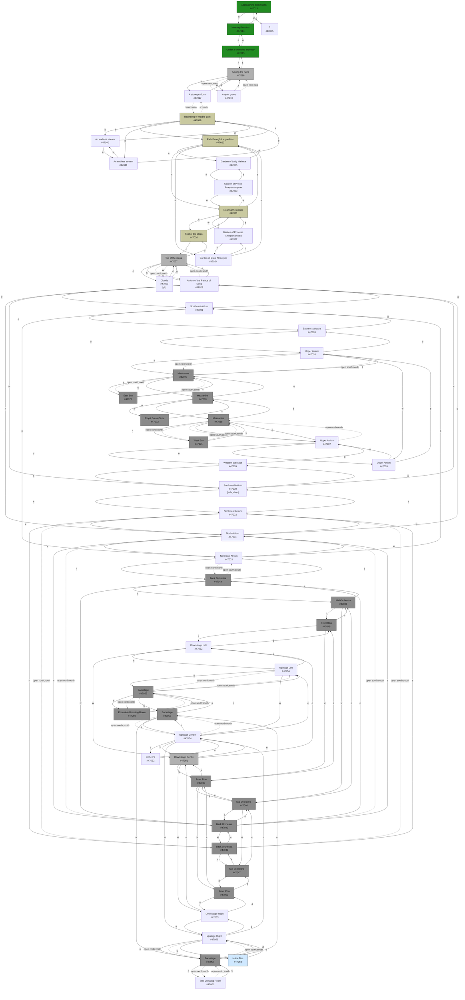

# The Palace of Song

57 rooms. Solid = direction; dotted = special exit.

```mermaid
flowchart TD
  r47013["Approaching some ruins<br/>#47013"]
  r47014["Nearing the ruins<br/>#47014"]
  r47015["Under a crumbled archway<br/>#47015"]
  r47017["A stone platform<br/>#47017"]
  r47019["A quiet grove<br/>#47019"]
  r47016["Among the ruins<br/>#47016"]
  r47018["Beginning of marble path<br/>#47018"]
  r47041["An endless stream<br/>#47041"]
  r47040["An endless stream<br/>#47040"]
  r47020["Path through the gardens<br/>#47020"]
  r47021["Nearing the palace<br/>#47021"]
  r47022["Garden of Princess Amepsmamptra<br/>#47022"]
  r47024["Garden of Duke Nhoukym<br/>#47024"]
  r47025["Garden of Lady Maltesa<br/>#47025"]
  r47023["Garden of Prince Amepsmamptrer<br/>#47023"]
  r47026["Foot of the steps<br/>#47026"]
  r47027["Top of the steps<br/>#47027"]
  r47029["Clouds<br/>#47029<br/>[pk]"]
  r47028["Atrium of the Palace of Song<br/>#47028"]
  r47031["Southeast Atrium<br/>#47031"]
  r47036["Eastern staircase<br/>#47036"]
  r47030["Southwest Atrium<br/>#47030<br/>[safe,shop]"]
  r47035["Western staircase<br/>#47035"]
  r47032["Northwest Atrium<br/>#47032"]
  r47034["North Atrium<br/>#47034"]
  r47033["Northeast Atrium<br/>#47033"]
  r47044["Back Orchestra<br/>#47044"]
  r47042["Back Orchestra<br/>#47042"]
  r47043["Back Orchestra<br/>#47043"]
  r47047["Mid Orchestra<br/>#47047"]
  r47046["Mid Orchestra<br/>#47046"]
  r47045["Mid Orchestra<br/>#47045"]
  r47048["Front Row<br/>#47048"]
  r47049["Front Row<br/>#47049"]
  r47050["Front Row<br/>#47050"]
  r47037["Upper Atrium<br/>#47037"]
  r47039["Upper Atrium<br/>#47039"]
  r47038["Upper Atrium<br/>#47038"]
  r47070["Mezzanine<br/>#47070"]
  r47073["East Box<br/>#47073"]
  r47069["Mezzanine<br/>#47069"]
  r47072["Royal Dress Circle<br/>#47072"]
  r47068["Mezzanine<br/>#47068"]
  r47071["West Box<br/>#47071"]
  r47053["Downstage Right<br/>#47053"]
  r47051["Downstage Centre<br/>#47051"]
  r47052["Downstage Left<br/>#47052"]
  r47062["In the Pit<br/>#47062"]
  r47063["In the flies<br/>#47063"]
  r47058["Backstage<br/>#47058"]
  r47054["Upstage Centre<br/>#47054"]
  r47059["Backstage<br/>#47059"]
  r47055["Upstage Left<br/>#47055"]
  r47060["Ensemble Dressing Room<br/>#47060"]
  r47057["Backstage<br/>#47057"]
  r47056["Upstage Right<br/>#47056"]
  r47061["Star Dressing Room<br/>#47061"]
  r47013 -->|n| r47014
  r13635["?<br/>#13635"]
  r47013 -->|u| r13635
  r47014 -->|e| r47015
  r47014 -->|s| r47013
  r47015 -->|n| r47016
  r47015 -->|w| r47014
  r47017 -.->|harmonize| r47018
  r47017 -->|s| r47016
  r47019 -->|e| r47016
  r47019 -.->|open east;east| r47016
  r47016 -->|n| r47017
  r47016 -.->|open west;west| r47019
  r47016 -->|s| r47015
  r47016 -->|w| r47019
  r47018 -->|e| r47040
  r47018 -->|n| r47020
  r47018 -.->|screech| r47017
  r47018 -->|w| r47041
  r47041 -->|e| r47018
  r47041 -->|w| r47040
  r47040 -->|e| r47041
  r47040 -->|w| r47018
  r47020 -->|e| r47025
  r47020 -->|n| r47021
  r47020 -->|s| r47018
  r47020 -->|w| r47024
  r47021 -->|e| r47023
  r47021 -->|n| r47026
  r47021 -->|s| r47020
  r47021 -->|w| r47022
  r47022 -->|e| r47021
  r47022 -->|s| r47024
  r47024 -->|e| r47020
  r47024 -->|n| r47022
  r47025 -->|n| r47023
  r47025 -->|w| r47020
  r47023 -->|s| r47025
  r47023 -->|w| r47021
  r47026 -->|s| r47021
  r47026 -->|u| r47027
  r47027 -->|d| r47026
  r47027 -->|e| r47029
  r47027 -->|n| r47028
  r47027 -.->|open north;north| r47028
  r47027 -->|w| r47029
  r47029 -->|e| r47027
  r47029 -->|w| r47027
  r47028 -->|e| r47031
  r47028 -->|n| r47034
  r47028 -.->|open south;south| r47027
  r47028 -->|s| r47027
  r47028 -->|w| r47030
  r47031 -->|e| r47036
  r47031 -->|n| r47033
  r47031 -->|w| r47028
  r47036 -->|u| r47038
  r47036 -->|w| r47031
  r47030 -->|e| r47028
  r47030 -->|n| r47032
  r47030 -->|w| r47035
  r47035 -->|e| r47030
  r47035 -->|u| r47037
  r47032 -->|e| r47034
  r47032 -->|n| r47043
  r47032 -.->|open north;north| r47043
  r47032 -->|s| r47030
  r47034 -->|e| r47033
  r47034 -->|n| r47042
  r47034 -.->|open north;north| r47042
  r47034 -->|s| r47028
  r47034 -->|w| r47032
  r47033 -->|n| r47044
  r47033 -.->|open north;north| r47044
  r47033 -->|s| r47031
  r47033 -->|w| r47034
  r47044 -->|n| r47045
  r47044 -.->|open south;south| r47033
  r47044 -->|s| r47033
  r47044 -->|w| r47042
  r47042 -->|e| r47044
  r47042 -->|n| r47046
  r47042 -.->|open south;south| r47034
  r47042 -->|s| r47034
  r47042 -->|w| r47043
  r47043 -->|e| r47042
  r47043 -->|n| r47047
  r47043 -.->|open south;south| r47032
  r47043 -->|s| r47032
  r47047 -->|e| r47046
  r47047 -->|n| r47050
  r47047 -->|s| r47043
  r47046 -->|e| r47045
  r47046 -->|n| r47049
  r47046 -->|s| r47042
  r47046 -->|w| r47047
  r47045 -->|n| r47048
  r47045 -->|s| r47044
  r47045 -->|w| r47046
  r47048 -->|s| r47045
  r47048 -->|u| r47052
  r47048 -->|w| r47049
  r47049 -->|e| r47048
  r47049 -->|s| r47046
  r47049 -->|u| r47051
  r47049 -->|w| r47050
  r47050 -->|e| r47049
  r47050 -->|s| r47047
  r47050 -->|u| r47053
  r47037 -->|d| r47035
  r47037 -->|e| r47039
  r47037 -->|n| r47068
  r47037 -.->|open north;north| r47068
  r47039 -->|e| r47038
  r47039 -->|w| r47037
  r47038 -->|d| r47036
  r47038 -->|n| r47070
  r47038 -.->|open north;north| r47070
  r47038 -->|w| r47039
  r47070 -->|n| r47073
  r47070 -.->|open north;north| r47073
  r47070 -.->|open south;south| r47038
  r47070 -->|s| r47038
  r47070 -->|w| r47069
  r47073 -.->|open south;south| r47070
  r47073 -->|s| r47070
  r47069 -->|e| r47070
  r47069 -->|n| r47072
  r47069 -->|w| r47068
  r47072 -->|s| r47069
  r47068 -->|e| r47069
  r47068 -->|n| r47071
  r47068 -.->|open north;north| r47071
  r47068 -.->|open south;south| r47037
  r47068 -->|s| r47037
  r47071 -.->|open south;south| r47068
  r47071 -->|s| r47068
  r47053 -->|d| r47050
  r47053 -->|e| r47051
  r47053 -->|n| r47056
  r47051 -->|d| r47049
  r47051 -->|e| r47052
  r47051 -->|n| r47054
  r47051 -->|w| r47053
  r47052 -->|d| r47048
  r47052 -->|n| r47055
  r47052 -->|w| r47051
  r47062 -->|u| r47054
  r47063 -->|d| r47056
  r47058 -->|e| r47059
  r47058 -.->|open south;south| r47054
  r47058 -->|s| r47054
  r47058 -->|w| r47057
  r47054 -->|d| r47062
  r47054 -->|e| r47055
  r47054 -->|n| r47058
  r47054 -.->|open north;north| r47058
  r47054 -->|s| r47051
  r47054 -->|w| r47056
  r47059 -->|n| r47060
  r47059 -.->|open north;north| r47060
  r47059 -.->|open south;south| r47055
  r47059 -->|s| r47055
  r47059 -->|w| r47058
  r47055 -->|n| r47059
  r47055 -.->|open north;north| r47059
  r47055 -->|s| r47052
  r47055 -->|w| r47054
  r47060 -.->|open south;south| r47059
  r47060 -->|s| r47059
  r47057 -->|e| r47058
  r47057 -->|n| r47061
  r47057 -.->|open north;north| r47061
  r47057 -.->|open south;south| r47056
  r47057 -->|s| r47056
  r47056 -->|e| r47054
  r47056 -->|n| r47057
  r47056 -.->|open north;north| r47057
  r47056 -->|s| r47053
  r47056 -->|u| r47063
  r47061 -.->|open south;south| r47057
  r47061 -->|s| r47057
  classDef t_forest fill:#228b22,color:#111,stroke:#222
  class r47013 t_forest
  class r47014 t_forest
  class r47015 t_forest
  classDef t_city fill:#b0b0b0,color:#111,stroke:#222
  class r47016 t_city
  classDef t_road fill:#c9c9a0,color:#111,stroke:#222
  class r47018 t_road
  class r47020 t_road
  class r47021 t_road
  class r47026 t_road
  class r47027 t_city
  classDef t_inside fill:#8a8a8a,color:#111,stroke:#222
  class r47044 t_inside
  class r47042 t_inside
  class r47043 t_inside
  class r47047 t_inside
  class r47046 t_inside
  class r47045 t_inside
  class r47048 t_inside
  class r47049 t_inside
  class r47050 t_inside
  class r47070 t_inside
  class r47073 t_inside
  class r47069 t_inside
  class r47072 t_inside
  class r47068 t_inside
  class r47071 t_inside
  class r47051 t_city
  classDef t_air fill:#cfe8ff,color:#111,stroke:#222
  class r47063 t_air
  class r47058 t_inside
  class r47059 t_inside
  class r47060 t_inside
  class r47057 t_inside
```
