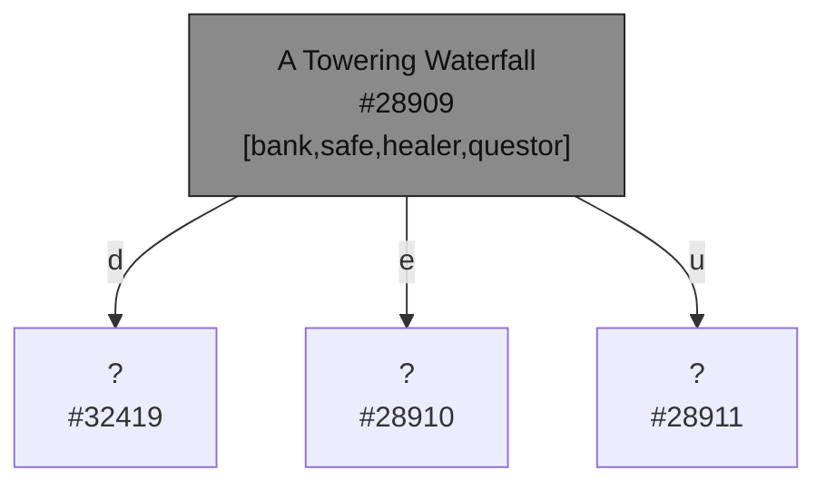

# The Realm of Chaos

1 rooms. Solid = direction; dotted = special exit.

```mermaid
flowchart TD
  r28909["A Towering Waterfall<br/>#28909<br/>[bank,safe,healer,questor]"]
  r32419["?<br/>#32419"]
  r28909 -->|d| r32419
  r28910["?<br/>#28910"]
  r28909 -->|e| r28910
  r28911["?<br/>#28911"]
  r28909 -->|u| r28911
  classDef t_inside fill:#8a8a8a,color:#111,stroke:#222
  class r28909 t_inside
```
