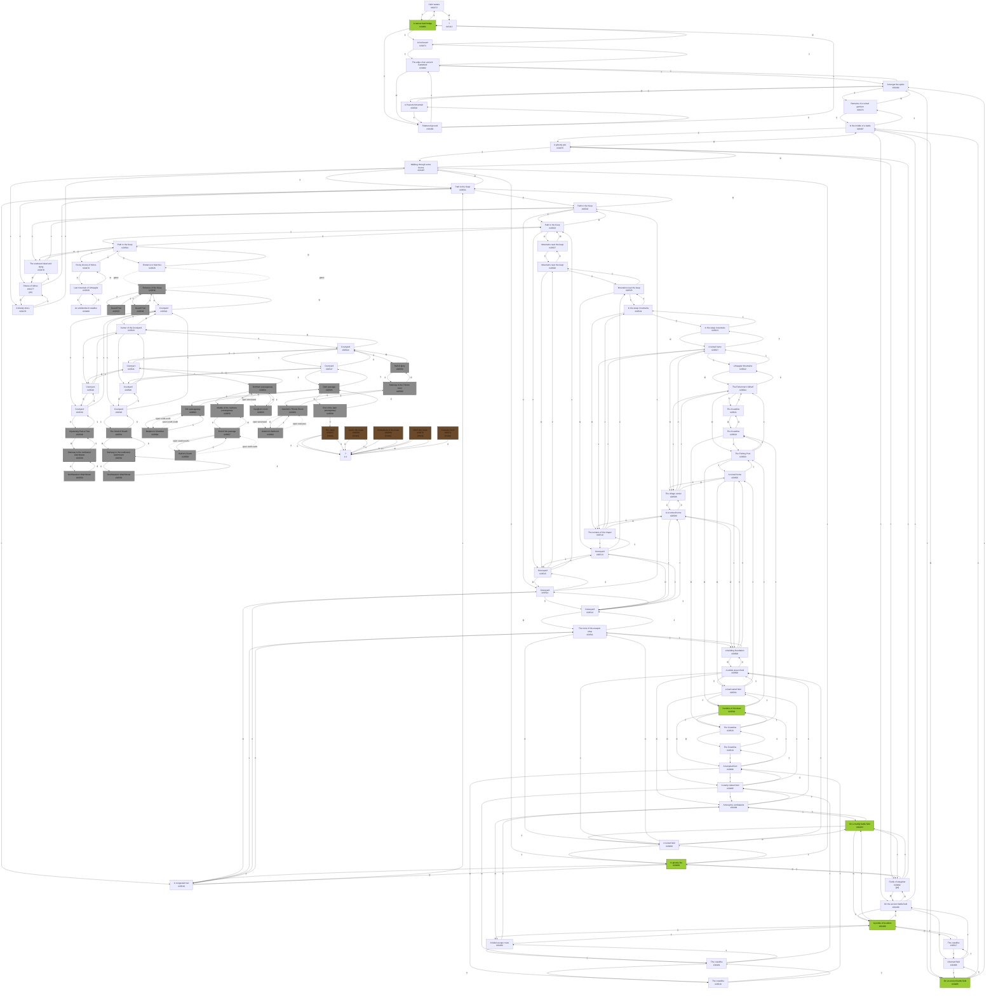

# The Shadows of Minos

100 rooms. Solid = direction; dotted = special exit.

```mermaid
flowchart TD
  r20472["Calm waters<br/>#20472"]
  r20481["A narrow land bridge<br/>#20481"]
  r20483["Shattered ground<br/>#20483"]
  r20473["A foul beach<br/>#20473"]
  r20482["The edge of an ancient battlefield<br/>#20482"]
  r20516["A Peaceful Mountain<br/>#20516"]
  r20484["Amongst the spirits<br/>#20484"]
  r20474["Remains of a ruined garrison<br/>#20474"]
  r20485["On an ancient battle field<br/>#20485"]
  r20487["In the middle of a battle<br/>#20487"]
  r20475["A ghostly pier<br/>#20475"]
  r20497["Walking through some thorns<br/>#20497"]
  r20531["Path to the Keep<br/>#20531"]
  r20532["Path to the Keep<br/>#20532"]
  r20533["Path to the Keep<br/>#20533"]
  r20527["Mountains near the keep<br/>#20527"]
  r20526["Mountains near the keep<br/>#20526"]
  r20525["Mountains near the keep<br/>#20525"]
  r20515["Graveyard<br/>#20515"]
  r20514["Graveyard<br/>#20514"]
  r20530["A congested trail<br/>#20530"]
  r20498["In ghostly fire<br/>#20498"]
  r20492["Fields of slaughter<br/>#20492<br/>[pk]"]
  r20488["On the ancient battle field<br/>#20488"]
  r20486["A burned field<br/>#20486"]
  r20517["The coastline<br/>#20517"]
  r20489["A jumble of boulders<br/>#20489"]
  r20493["On a muddy battle field<br/>#20493"]
  r20499["A ruined field<br/>#20499"]
  r20511["The ruins of the weapon shop<br/>#20511"]
  r20512["Graveyard<br/>#20512"]
  r20513["Graveyard<br/>#20513"]
  r20524["In the steep mountains<br/>#20524"]
  r20510["The remains of the chapel<br/>#20510"]
  r20509["A scorched home<br/>#20509"]
  r20508["A building foundation<br/>#20508"]
  r20500["A rubble strewn field<br/>#20500"]
  r20494["Among the combatants<br/>#20494"]
  r20490["A failed escape route<br/>#20490"]
  r20491["The coastline<br/>#20491"]
  r20495["A stump dotted field<br/>#20495"]
  r20501["A barricaded field<br/>#20501"]
  r20505["A ruined home<br/>#20505"]
  r20506["The village center<br/>#20506"]
  r20507["A ruined home<br/>#20507"]
  r20523["In the steep mountains<br/>#20523"]
  r20522["Lithaeglar Mountains<br/>#20522"]
  r20504["The Fisherman's Wharf<br/>#20504"]
  r20503["The Fishing Post<br/>#20503"]
  r20502["Gardens of the dead<br/>#20502"]
  r20496["A trampled field<br/>#20496"]
  r20518["The coastline<br/>#20518"]
  r20519["The Coastline<br/>#20519"]
  r20520["The Coastline<br/>#20520"]
  r20529["The Coastline<br/>#20529"]
  r20521["The Coastline<br/>#20521"]
  r20478["The scattered dead and dying<br/>#20478"]
  r20534["Path to the Keep<br/>#20534"]
  r20477["Shores of Minos<br/>#20477<br/>[pk]"]
  r20476["A bloody shore<br/>#20476"]
  r20535["Entrance to Melchos<br/>#20535"]
  r20479["Rocky shores of Minos<br/>#20479"]
  r20528["Last mountain of Lithaeglar<br/>#20528"]
  r20480["An undisturbed coastline<br/>#20480"]
  r20536["Entrance of the Keep<br/>#20536"]
  r20537["Guard Post<br/>#20537"]
  r20538["Guard Post<br/>#20538"]
  r20542["Courtyard<br/>#20542"]
  r20539["Courtyard<br/>#20539"]
  r20548["Squeezing Past a Tree<br/>#20548"]
  r20549["Stairway to the northwest watchtower<br/>#20549"]
  r20550["Northwestern Watchtower<br/>#20550"]
  r20545["Courtyard<br/>#20545"]
  r20551["The Smell of Death<br/>#20551"]
  r20552["Stairway to the southwest watchtower<br/>#20552"]
  r20546["Courtyard<br/>#20546"]
  r20543["Center of the Courtyard<br/>#20543"]
  r20540["Courtyard<br/>#20540"]
  r20541["Courtyard<br/>#20541"]
  r20544["Courtyard<br/>#20544"]
  r20547["Courtyard<br/>#20547"]
  r20565["Dark passage<br/>#20565"]
  r20566["End of the dark passageway<br/>#20566"]
  r20563["Dim passageway<br/>#20563"]
  r20564["Melphon's Chamber<br/>#20564"]
  r20559["Hall of glory<br/>#20559"]
  r20554["Northern passageway<br/>#20554"]
  r20555["Kazgher's room<br/>#20555"]
  r20556["Middle of the northern passageway<br/>#20556"]
  r20557["End of the passage<br/>#20557"]
  r20558["Bullror's Room<br/>#20558"]
  r20560["Stairway to the Throne room<br/>#20560"]
  r20561["Asterion's Throne Room<br/>#20561"]
  r20562["Asterion's bedroom<br/>#20562"]
  r20567["The maze<br/>#20567<br/>[maze]"]
  r20568["Lost in the maze<br/>#20568<br/>[maze]"]
  r20569["Somewhere in the maze<br/>#20569<br/>[maze]"]
  r20570["Still in the maze<br/>#20570<br/>[maze]"]
  r20571["Treasure room<br/>#20571<br/>[maze]"]
  r20553["Southwestern Watchtower<br/>#20553"]
  r20472 -->|n| r20481
  r13110["?<br/>#13110"]
  r20472 -->|w| r13110
  r20481 -->|e| r20473
  r20481 -->|n| r20483
  r20481 -->|s| r20472
  r20483 -->|e| r20482
  r20483 -->|n| r20516
  r20483 -->|s| r20481
  r20473 -->|n| r20482
  r20473 -->|w| r20481
  r20482 -->|n| r20484
  r20482 -->|s| r20473
  r20482 -->|w| r20483
  r20516 -->|e| r20484
  r20516 -->|s| r20483
  r20484 -->|e| r20474
  r20484 -->|n| r20485
  r20484 -->|s| r20482
  r20484 -->|w| r20516
  r20474 -->|n| r20487
  r20474 -->|w| r20484
  r20485 -->|e| r20487
  r20485 -->|n| r20486
  r20485 -->|s| r20484
  r20487 -->|e| r20475
  r20487 -->|n| r20488
  r20487 -->|s| r20474
  r20487 -->|w| r20485
  r20475 -->|e| r20497
  r20475 -->|n| r20492
  r20475 -->|w| r20487
  r20497 -->|e| r20531
  r20497 -->|n| r20498
  r20497 -->|s| r20476
  r20497 -->|w| r20475
  r20531 -->|e| r20532
  r20531 -->|n| r20530
  r20531 -->|s| r20477
  r20531 -->|w| r20497
  r20532 -->|e| r20533
  r20532 -->|n| r20514
  r20532 -->|s| r20478
  r20532 -->|w| r20531
  r20533 -->|e| r20527
  r20533 -->|n| r20515
  r20533 -->|s| r20534
  r20533 -->|w| r20532
  r20527 -->|n| r20526
  r20527 -->|w| r20533
  r20526 -->|n| r20525
  r20526 -->|s| r20527
  r20526 -->|w| r20515
  r20525 -->|n| r20524
  r20525 -->|s| r20526
  r20525 -->|w| r20513
  r20515 -->|e| r20526
  r20515 -->|n| r20513
  r20515 -->|s| r20533
  r20515 -->|w| r20514
  r20514 -->|e| r20515
  r20514 -->|n| r20512
  r20514 -->|s| r20532
  r20514 -->|w| r20530
  r20530 -->|e| r20514
  r20530 -->|n| r20511
  r20530 -->|s| r20531
  r20530 -->|w| r20498
  r20498 -->|e| r20530
  r20498 -->|n| r20499
  r20498 -->|s| r20497
  r20498 -->|w| r20492
  r20492 -->|e| r20498
  r20492 -->|n| r20493
  r20492 -->|s| r20475
  r20492 -->|w| r20488
  r20488 -->|e| r20492
  r20488 -->|n| r20489
  r20488 -->|s| r20487
  r20488 -->|w| r20486
  r20486 -->|e| r20488
  r20486 -->|n| r20517
  r20486 -->|s| r20485
  r20517 -->|e| r20489
  r20517 -->|s| r20486
  r20489 -->|e| r20493
  r20489 -->|n| r20490
  r20489 -->|s| r20488
  r20489 -->|w| r20517
  r20493 -->|e| r20499
  r20493 -->|n| r20494
  r20493 -->|s| r20492
  r20493 -->|w| r20489
  r20499 -->|e| r20511
  r20499 -->|n| r20500
  r20499 -->|s| r20498
  r20499 -->|w| r20493
  r20511 -->|e| r20512
  r20511 -->|n| r20508
  r20511 -->|s| r20530
  r20511 -->|w| r20499
  r20512 -->|e| r20513
  r20512 -->|n| r20509
  r20512 -->|s| r20514
  r20512 -->|w| r20511
  r20513 -->|e| r20525
  r20513 -->|n| r20510
  r20513 -->|s| r20515
  r20513 -->|w| r20512
  r20524 -->|n| r20523
  r20524 -->|s| r20525
  r20524 -->|w| r20510
  r20510 -->|e| r20524
  r20510 -->|n| r20507
  r20510 -->|s| r20513
  r20510 -->|w| r20509
  r20509 -->|e| r20510
  r20509 -->|n| r20506
  r20509 -->|s| r20512
  r20509 -->|w| r20508
  r20508 -->|e| r20509
  r20508 -->|n| r20505
  r20508 -->|s| r20511
  r20508 -->|w| r20500
  r20500 -->|e| r20508
  r20500 -->|n| r20501
  r20500 -->|s| r20499
  r20500 -->|w| r20494
  r20494 -->|e| r20500
  r20494 -->|n| r20495
  r20494 -->|s| r20493
  r20494 -->|w| r20490
  r20490 -->|e| r20494
  r20490 -->|n| r20491
  r20490 -->|s| r20489
  r20491 -->|e| r20495
  r20491 -->|n| r20518
  r20491 -->|s| r20490
  r20495 -->|e| r20501
  r20495 -->|n| r20496
  r20495 -->|s| r20494
  r20495 -->|w| r20491
  r20501 -->|e| r20505
  r20501 -->|n| r20502
  r20501 -->|s| r20500
  r20501 -->|w| r20495
  r20505 -->|e| r20506
  r20505 -->|n| r20503
  r20505 -->|s| r20508
  r20505 -->|w| r20501
  r20506 -->|e| r20507
  r20506 -->|n| r20504
  r20506 -->|s| r20509
  r20506 -->|w| r20505
  r20507 -->|e| r20523
  r20507 -->|n| r20522
  r20507 -->|s| r20510
  r20507 -->|w| r20506
  r20523 -->|s| r20524
  r20523 -->|w| r20507
  r20522 -->|s| r20507
  r20522 -->|w| r20504
  r20504 -->|e| r20522
  r20504 -->|n| r20521
  r20504 -->|s| r20506
  r20504 -->|w| r20503
  r20503 -->|e| r20504
  r20503 -->|n| r20529
  r20503 -->|s| r20505
  r20503 -->|w| r20502
  r20502 -->|e| r20503
  r20502 -->|n| r20520
  r20502 -->|s| r20501
  r20502 -->|w| r20496
  r20496 -->|e| r20502
  r20496 -->|n| r20519
  r20496 -->|s| r20495
  r20496 -->|w| r20518
  r20518 -->|e| r20496
  r20518 -->|s| r20491
  r20519 -->|e| r20520
  r20519 -->|s| r20496
  r20520 -->|e| r20529
  r20520 -->|s| r20502
  r20520 -->|w| r20519
  r20529 -->|e| r20521
  r20529 -->|s| r20503
  r20529 -->|w| r20520
  r20521 -->|s| r20504
  r20521 -->|w| r20529
  r20478 -->|e| r20534
  r20478 -->|n| r20532
  r20478 -->|w| r20477
  r20534 -->|e| r20535
  r20534 -->|n| r20533
  r20534 -->|s| r20479
  r20534 -->|w| r20478
  r20477 -->|e| r20478
  r20477 -->|n| r20531
  r20477 -->|w| r20476
  r20476 -->|e| r20477
  r20476 -->|n| r20497
  r20535 -.->|gates| r20536
  r20535 -->|w| r20534
  r20479 -->|e| r20528
  r20479 -->|n| r20534
  r20528 -->|s| r20480
  r20528 -->|w| r20479
  r20480 -->|n| r20528
  r20536 -->|e| r20542
  r20536 -.->|gates| r20535
  r20536 -->|n| r20537
  r20536 -->|s| r20538
  r20537 -->|s| r20536
  r20538 -->|n| r20536
  r20542 -->|e| r20543
  r20542 -->|n| r20539
  r20542 -->|s| r20545
  r20542 -->|w| r20536
  r20539 -->|e| r20540
  r20539 -->|n| r20548
  r20539 -->|s| r20542
  r20548 -->|s| r20539
  r20548 -->|w| r20549
  r20549 -->|e| r20548
  r20549 -->|u| r20550
  r20550 -->|d| r20549
  r20545 -->|e| r20546
  r20545 -->|n| r20542
  r20545 -->|s| r20551
  r20551 -->|n| r20545
  r20551 -->|w| r20552
  r20552 -->|e| r20551
  r20552 -->|u| r20553
  r20546 -->|e| r20547
  r20546 -->|n| r20543
  r20546 -->|w| r20545
  r20543 -->|e| r20544
  r20543 -->|n| r20540
  r20543 -->|s| r20546
  r20543 -->|w| r20542
  r20540 -->|e| r20541
  r20540 -->|s| r20543
  r20540 -->|w| r20539
  r20541 -->|n| r20554
  r20541 -->|s| r20544
  r20541 -->|w| r20540
  r20544 -->|e| r20559
  r20544 -->|n| r20541
  r20544 -->|s| r20547
  r20544 -->|w| r20543
  r20547 -->|n| r20544
  r20547 -->|s| r20565
  r20547 -->|w| r20546
  r20565 -->|e| r20563
  r20565 -->|n| r20547
  r20565 -->|w| r20566
  r20566 -->|d| r20567
  r20566 -->|e| r20565
  r20563 -->|n| r20564
  r20563 -.->|open north;north| r20564
  r20563 -->|w| r20565
  r20564 -.->|open south;south| r20563
  r20564 -->|s| r20563
  r20559 -->|e| r20560
  r20559 -->|w| r20544
  r20554 -->|e| r20556
  r20554 -.->|open west;west| r20555
  r20554 -->|s| r20541
  r20554 -->|w| r20555
  r20555 -->|e| r20554
  r20556 -->|e| r20557
  r20556 -->|w| r20554
  r20557 -.->|open south;south| r20558
  r20557 -->|s| r20558
  r20557 -->|w| r20556
  r20558 -->|n| r20557
  r20558 -.->|open north;north| r20557
  r20560 -->|u| r20561
  r20560 -->|w| r20559
  r20561 -->|d| r20560
  r20561 -.->|open west;west| r20562
  r20561 -->|w| r20562
  r20562 -->|e| r20561
  r20562 -.->|open east;east| r20561
  r-1["?<br/>#-1"]
  r20567 -->|e| r-1
  r20567 -->|s| r-1
  r20567 -->|u| r-1
  r20568 -->|e| r-1
  r20568 -->|n| r-1
  r20569 -->|s| r-1
  r20569 -->|w| r-1
  r20570 -->|e| r-1
  r20570 -->|n| r-1
  r20570 -->|w| r-1
  r20571 -->|e| r-1
  r20553 -->|d| r20552
  classDef t_field fill:#9acd32,color:#111,stroke:#222
  class r20481 t_field
  class r20485 t_field
  class r20498 t_field
  class r20489 t_field
  class r20493 t_field
  class r20502 t_field
  classDef t_inside fill:#8a8a8a,color:#111,stroke:#222
  class r20536 t_inside
  class r20537 t_inside
  class r20538 t_inside
  class r20548 t_inside
  class r20549 t_inside
  class r20550 t_inside
  class r20551 t_inside
  class r20552 t_inside
  class r20565 t_inside
  class r20566 t_inside
  class r20563 t_inside
  class r20564 t_inside
  class r20559 t_inside
  class r20554 t_inside
  class r20555 t_inside
  class r20556 t_inside
  class r20557 t_inside
  class r20558 t_inside
  class r20560 t_inside
  class r20561 t_inside
  class r20562 t_inside
  classDef t_underground fill:#6b4a2b,color:#111,stroke:#222
  class r20567 t_underground
  class r20568 t_underground
  class r20569 t_underground
  class r20570 t_underground
  class r20571 t_underground
  class r20553 t_inside
```
