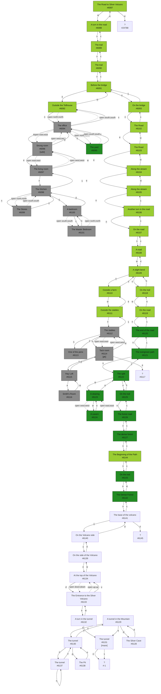

# The Silver Volcano

55 rooms. Solid = direction; dotted = special exit.

```mermaid
flowchart TD
  r6087["The Road to Silver Volcano<br/>#6087"]
  r6088["A turn in the road<br/>#6088"]
  r6089["The trail<br/>#6089"]
  r6090["The trail<br/>#6090"]
  r6091["Before the bridge<br/>#6091"]
  r6092["Outside the Tollhouse<br/>#6092"]
  r6093["On the bridge<br/>#6093"]
  r6102["The Road<br/>#6102"]
  r6103["The Road<br/>#6103"]
  r6104["Along the stream<br/>#6104"]
  r6105["Along the stream<br/>#6105"]
  r6094["The office<br/>#6094"]
  r6095["The yard<br/>#6095"]
  r6096["Strong room<br/>#6096<br/>[safe]"]
  r6097["The living room<br/>#6097"]
  r6098["The Kitchen<br/>#6098"]
  r6099["The Stores<br/>#6099"]
  r6100["A bedroom<br/>#6100"]
  r6101["The Master Bedroom<br/>#6101"]
  r6106["Another turn in the road<br/>#6106"]
  r6107["On the road<br/>#6107"]
  r6108["A road<br/>#6108"]
  r6109["A slight bend<br/>#6109"]
  r6110["Outside a farm<br/>#6110"]
  r6111["Outside the stables<br/>#6111"]
  r6112["The stables<br/>#6112"]
  r6113["One of the pens<br/>#6113"]
  r6114["Tack room<br/>#6114<br/>[pk]"]
  r6115["Hay Loft<br/>#6115"]
  r6116["Smith's Room<br/>#6116"]
  r6118["On the trail<br/>#6118"]
  r6119["On the road<br/>#6119"]
  r6120["The end of the road<br/>#6120"]
  r6121["The overgrown path<br/>#6121"]
  r6122["The split<br/>#6122"]
  r6123["A clearing<br/>#6123"]
  r6124["A cavern<br/>#6124"]
  r6125["On the trail<br/>#6125"]
  r6126["The forest road<br/>#6126"]
  r6127["The dense forest<br/>#6127"]
  r6144["The Beginning of the Path<br/>#6144"]
  r6143["On the trail<br/>#6143"]
  r6142["The Dense Forest<br/>#6142"]
  r6141["The base of the volcano<br/>#6141"]
  r6140["On the Volcano side<br/>#6140"]
  r6139["On the side of the Volcano<br/>#6139"]
  r6134["At the top of the Volcano<br/>#6134"]
  r6133["The Entrance to the Silver Volcano<br/>#6133"]
  r6132["A turn in the tunnel<br/>#6132"]
  r6131["The tunnel<br/>#6131<br/>[maze]"]
  r6129["A tunnel in the Mountain<br/>#6129"]
  r6130["The tunnel<br/>#6130"]
  r6137["The tunnel<br/>#6137"]
  r6138["The Pit<br/>#6138"]
  r6128["The Silver Cave<br/>#6128"]
  r24788["?<br/>#24788"]
  r6087 -->|e| r24788
  r6087 -->|w| r6088
  r6088 -->|e| r6087
  r6088 -->|n| r6089
  r6089 -->|n| r6090
  r6089 -->|s| r6088
  r6090 -->|n| r6091
  r6090 -->|s| r6089
  r6091 -->|e| r6092
  r6091 -->|n| r6093
  r6091 -->|s| r6090
  r6092 -->|n| r6094
  r6092 -.->|open north;north| r6094
  r6092 -->|w| r6091
  r6093 -->|n| r6102
  r6093 -->|s| r6091
  r6102 -->|e| r6103
  r6102 -->|s| r6093
  r6103 -->|e| r6104
  r6103 -->|w| r6102
  r6104 -->|e| r6105
  r6104 -->|w| r6103
  r6105 -->|n| r6106
  r6105 -->|w| r6104
  r6094 -->|e| r6096
  r6094 -->|n| r6095
  r6094 -.->|open east;east| r6096
  r6094 -.->|open north;north| r6095
  r6094 -.->|open south;south| r6092
  r6094 -->|s| r6092
  r6095 -.->|open south;south| r6094
  r6095 -->|s| r6094
  r6096 -->|e| r6097
  r6096 -.->|open east;east| r6097
  r6096 -.->|open west;west| r6094
  r6096 -->|w| r6094
  r6097 -->|n| r6098
  r6097 -.->|open west;west| r6096
  r6097 -->|w| r6096
  r6098 -->|n| r6099
  r6098 -.->|open north;north| r6099
  r6098 -->|s| r6097
  r6098 -->|u| r6100
  r6099 -.->|open south;south| r6098
  r6099 -->|s| r6098
  r6100 -->|d| r6098
  r6100 -.->|open south;south| r6101
  r6100 -->|s| r6101
  r6101 -->|n| r6100
  r6101 -.->|open north;north| r6100
  r6106 -->|n| r6107
  r6106 -->|s| r6105
  r6107 -->|n| r6108
  r6107 -->|s| r6106
  r6108 -->|s| r6107
  r6108 -->|w| r6109
  r6109 -->|e| r6108
  r6109 -->|n| r6110
  r6109 -->|s| r6118
  r6110 -->|s| r6109
  r6110 -->|w| r6111
  r6111 -->|e| r6110
  r6111 -->|n| r6112
  r6112 -->|e| r6114
  r6112 -->|n| r6113
  r6112 -.->|open east;east| r6114
  r6112 -->|s| r6111
  r6113 -->|s| r6112
  r6117["?<br/>#6117"]
  r6114 -->|e| r6117
  r6114 -.->|open west;west| r6112
  r6114 -->|u| r6115
  r6114 -->|w| r6112
  r6115 -->|d| r6114
  r6115 -->|e| r6116
  r6116 -->|w| r6115
  r6118 -->|n| r6109
  r6118 -->|w| r6119
  r6119 -->|e| r6118
  r6119 -->|n| r6120
  r6120 -->|n| r6121
  r6120 -->|s| r6119
  r6121 -->|n| r6122
  r6121 -->|s| r6120
  r6122 -->|n| r6125
  r6122 -->|s| r6121
  r6122 -->|w| r6123
  r6123 -->|e| r6122
  r6123 -.->|open west;west| r6124
  r6123 -->|w| r6124
  r6124 -->|e| r6123
  r6124 -.->|open east;east| r6123
  r6125 -->|n| r6126
  r6125 -->|s| r6122
  r6126 -->|n| r6127
  r6126 -->|s| r6125
  r6127 -->|n| r6144
  r6127 -->|s| r6126
  r6144 -->|n| r6143
  r6144 -->|s| r6127
  r6143 -->|e| r6142
  r6143 -->|s| r6144
  r6142 -->|n| r6141
  r6142 -->|w| r6143
  r6145["?<br/>#6145"]
  r6141 -->|n| r6145
  r6141 -->|s| r6142
  r6141 -->|u| r6140
  r6140 -->|d| r6141
  r6140 -->|u| r6139
  r6139 -->|d| r6140
  r6139 -->|e| r6134
  r6134 -->|d| r6133
  r6134 -.->|open down;down| r6133
  r6134 -->|w| r6139
  r6133 -->|e| r6132
  r6133 -.->|open up;up| r6134
  r6133 -->|u| r6134
  r6132 -->|n| r6131
  r6132 -->|w| r6133
  r-1["?<br/>#-1"]
  r6131 -->|e| r-1
  r6131 -->|s| r-1
  r6129 -->|n| r6130
  r6129 -->|s| r6131
  r6129 -->|w| r6128
  r6130 -->|d| r6138
  r6130 -->|n| r6137
  r6130 -->|s| r6129
  r6137 -->|n| r6137
  r6137 -->|s| r6130
  r6138 -->|u| r6130
  r6128 -->|e| r6129
  classDef t_field fill:#9acd32,color:#111,stroke:#222
  class r6087 t_field
  class r6088 t_field
  class r6089 t_field
  class r6090 t_field
  class r6091 t_field
  class r6092 t_field
  class r6093 t_field
  class r6102 t_field
  class r6103 t_field
  class r6104 t_field
  class r6105 t_field
  classDef t_inside fill:#8a8a8a,color:#111,stroke:#222
  class r6094 t_inside
  classDef t_forest fill:#228b22,color:#111,stroke:#222
  class r6095 t_forest
  class r6096 t_inside
  class r6097 t_inside
  class r6098 t_inside
  class r6099 t_inside
  class r6100 t_inside
  class r6101 t_inside
  class r6106 t_field
  class r6107 t_field
  class r6108 t_field
  class r6109 t_field
  class r6110 t_field
  class r6111 t_field
  class r6112 t_inside
  class r6113 t_inside
  class r6114 t_inside
  class r6115 t_inside
  class r6116 t_inside
  class r6118 t_field
  class r6119 t_field
  class r6120 t_forest
  class r6121 t_forest
  class r6122 t_forest
  class r6123 t_forest
  class r6124 t_forest
  class r6125 t_forest
  class r6126 t_forest
  class r6127 t_forest
  class r6144 t_field
  class r6143 t_forest
  class r6142 t_forest
```
