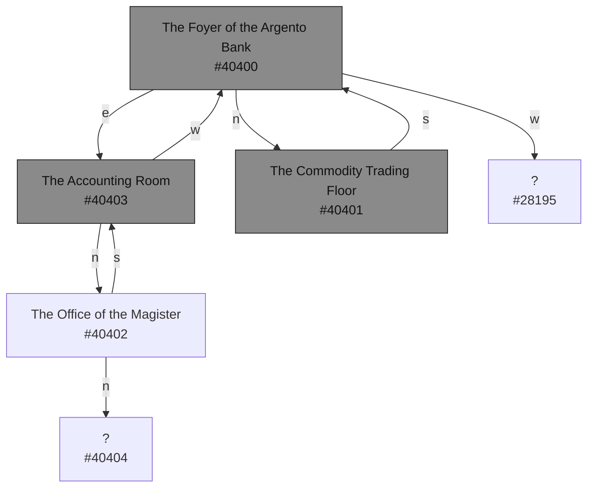

# The Stuff of Shadows

4 rooms. Solid = direction; dotted = special exit.

```mermaid
flowchart TD
  r40400["The Foyer of the Argento Bank<br/>#40400"]
  r40403["The Accounting Room<br/>#40403"]
  r40402["The Office of the Magister<br/>#40402"]
  r40401["The Commodity Trading Floor<br/>#40401"]
  r40400 -->|e| r40403
  r40400 -->|n| r40401
  r28195["?<br/>#28195"]
  r40400 -->|w| r28195
  r40403 -->|n| r40402
  r40403 -->|w| r40400
  r40404["?<br/>#40404"]
  r40402 -->|n| r40404
  r40402 -->|s| r40403
  r40401 -->|s| r40400
  classDef t_inside fill:#8a8a8a,color:#111,stroke:#222
  class r40400 t_inside
  class r40403 t_inside
  class r40401 t_inside
```
