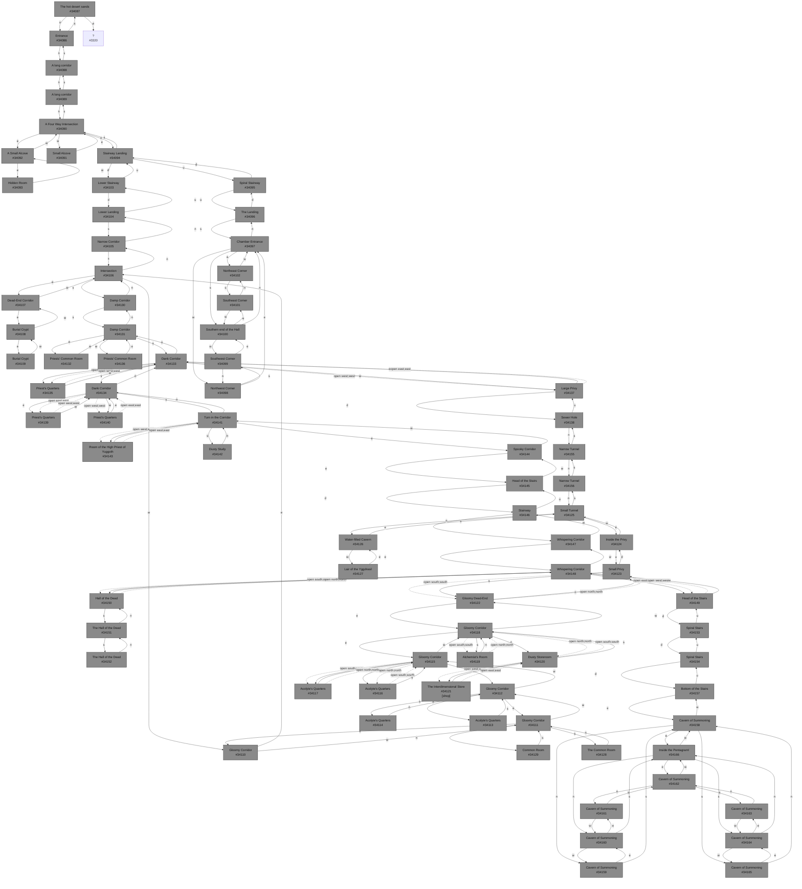

# The Temple of Shouggoth

81 rooms. Solid = direction; dotted = special exit.

```mermaid
flowchart TD
  r34087["The hot desert sands<br/>#34087"]
  r34086["Entrance<br/>#34086"]
  r34088["A long corridor<br/>#34088"]
  r34089["A long corridor<br/>#34089"]
  r34090["A Four Way Intersection<br/>#34090"]
  r34092["A Small Alcove<br/>#34092"]
  r34093["Hidden Room<br/>#34093"]
  r34091["Small Alcove<br/>#34091"]
  r34094["Stairway Landing<br/>#34094"]
  r34103["Lower Stairway<br/>#34103"]
  r34104["Lower Landing<br/>#34104"]
  r34105["Narrow Corridor<br/>#34105"]
  r34106["Intersection<br/>#34106"]
  r34107["Dead-End Corridor<br/>#34107"]
  r34108["Burial Crypt<br/>#34108"]
  r34110["Gloomy Corridor<br/>#34110"]
  r34111["Gloomy Corridor<br/>#34111"]
  r34129["Common Room<br/>#34129"]
  r34112["Gloomy Corridor<br/>#34112"]
  r34109["Burial Crypt<br/>#34109"]
  r34130["Damp Corridor<br/>#34130"]
  r34131["Damp Corridor<br/>#34131"]
  r34132["Priests' Common Room<br/>#34132"]
  r34136["Priests' Common Room<br/>#34136"]
  r34133["Dank Corridor<br/>#34133"]
  r34135["Priest's Quarters<br/>#34135"]
  r34137["Large Privy<br/>#34137"]
  r34134["Dank Corridor<br/>#34134"]
  r34139["Priest's Quarters<br/>#34139"]
  r34140["Priest's Quarters<br/>#34140"]
  r34141["Turn in the Corridor<br/>#34141"]
  r34143["Room of the High Priest of Yuggoth<br/>#34143"]
  r34144["Spooky Corridor<br/>#34144"]
  r34145["Head of the Stairs<br/>#34145"]
  r34142["Dusty Study<br/>#34142"]
  r34146["Stairway<br/>#34146"]
  r34147["Whispering Corridor<br/>#34147"]
  r34148["Whispering Corridor<br/>#34148"]
  r34150["Hall of the Dead<br/>#34150"]
  r34151["The Hall of the Dead<br/>#34151"]
  r34152["The Hall of the Dead<br/>#34152"]
  r34149["Head of the Stairs<br/>#34149"]
  r34153["Spiral Stairs<br/>#34153"]
  r34154["Spiral Stairs<br/>#34154"]
  r34157["Bottom of the Stairs<br/>#34157"]
  r34158["Cavern of Summoning<br/>#34158"]
  r34165["Cavern of Summoning<br/>#34165"]
  r34164["Cavern of Summoning<br/>#34164"]
  r34166["Inside the Pentagram!<br/>#34166"]
  r34095["Spiral Stairway<br/>#34095"]
  r34096["The Landing<br/>#34096"]
  r34097["Chamber Entrance<br/>#34097"]
  r34098["Northwest Corner<br/>#34098"]
  r34102["Northeast Corner<br/>#34102"]
  r34101["Southeast Corner<br/>#34101"]
  r34100["Southern end of the Hall<br/>#34100"]
  r34099["Southwest Corner<br/>#34099"]
  r34128["The Common Room<br/>#34128"]
  r34114["Acolyte's Quarters<br/>#34114"]
  r34113["Acolyte's Quarters<br/>#34113"]
  r34115["Gloomy Corridor<br/>#34115"]
  r34117["Acolyte's Quarters<br/>#34117"]
  r34116["Acolyte's Quarters<br/>#34116"]
  r34118["Gloomy Corridor<br/>#34118"]
  r34120["Dusty Storeroom<br/>#34120"]
  r34119["Alchemist's Room<br/>#34119"]
  r34121["The Interdimensional Store<br/>#34121<br/>[shop]"]
  r34122["Gloomy Dead-End<br/>#34122"]
  r34123["Small Privy<br/>#34123"]
  r34124["Inside the Privy<br/>#34124"]
  r34125["Small Tunnel<br/>#34125"]
  r34126["Water-filled Cavern<br/>#34126"]
  r34156["Narrow Tunnel<br/>#34156"]
  r34155["Narrow Tunnel<br/>#34155"]
  r34138["Sewer Hole<br/>#34138"]
  r34127["Lair of the Yggdrasil<br/>#34127"]
  r34159["Cavern of Summoning<br/>#34159"]
  r34160["Cavern of Summoning<br/>#34160"]
  r34161["Cavern of Summoning<br/>#34161"]
  r34162["Cavern of Summoning<br/>#34162"]
  r34163["Cavern of Summoning<br/>#34163"]
  r3320["?<br/>#3320"]
  r34087 -->|e| r3320
  r34087 -->|n| r34086
  r34086 -->|n| r34088
  r34086 -->|s| r34087
  r34088 -->|n| r34089
  r34088 -->|s| r34086
  r34089 -->|n| r34090
  r34089 -->|s| r34088
  r34090 -->|e| r34092
  r34090 -->|n| r34094
  r34090 -->|s| r34089
  r34090 -->|w| r34091
  r34092 -->|e| r34093
  r34092 -->|w| r34090
  r34093 -->|w| r34092
  r34091 -->|e| r34090
  r34094 -->|d| r34103
  r34094 -->|s| r34090
  r34094 -->|u| r34095
  r34103 -->|d| r34104
  r34103 -->|u| r34094
  r34104 -->|s| r34105
  r34104 -->|u| r34103
  r34105 -->|n| r34104
  r34105 -->|s| r34106
  r34106 -->|e| r34107
  r34106 -->|n| r34105
  r34106 -->|s| r34130
  r34106 -->|w| r34110
  r34107 -->|e| r34108
  r34107 -->|w| r34106
  r34108 -->|e| r34109
  r34108 -->|w| r34107
  r34110 -->|e| r34106
  r34110 -->|w| r34111
  r34111 -->|e| r34110
  r34111 -->|n| r34129
  r34111 -->|s| r34128
  r34111 -->|w| r34112
  r34129 -->|s| r34111
  r34112 -->|e| r34111
  r34112 -->|n| r34113
  r34112 -->|s| r34114
  r34112 -->|w| r34115
  r34109 -->|w| r34108
  r34130 -->|n| r34106
  r34130 -->|s| r34131
  r34131 -->|e| r34132
  r34131 -->|n| r34130
  r34131 -->|s| r34133
  r34131 -->|w| r34136
  r34132 -->|w| r34131
  r34136 -->|e| r34131
  r34133 -->|e| r34135
  r34133 -->|n| r34131
  r34133 -.->|open east;east| r34135
  r34133 -.->|open west;west| r34137
  r34133 -->|s| r34134
  r34133 -->|w| r34137
  r34135 -.->|open west;west| r34133
  r34135 -->|w| r34133
  r34137 -->|d| r34138
  r34137 -->|e| r34133
  r34137 -.->|open east;east| r34133
  r34134 -->|e| r34139
  r34134 -->|n| r34133
  r34134 -.->|open east;east| r34139
  r34134 -.->|open west;west| r34140
  r34134 -->|s| r34141
  r34134 -->|w| r34140
  r34139 -.->|open west;west| r34134
  r34139 -->|w| r34134
  r34140 -->|e| r34134
  r34140 -.->|open east;east| r34134
  r34141 -->|e| r34144
  r34141 -->|n| r34134
  r34141 -.->|open west;west| r34143
  r34141 -->|s| r34142
  r34141 -->|w| r34143
  r34143 -->|e| r34141
  r34143 -.->|open east;east| r34141
  r34144 -->|e| r34145
  r34144 -->|w| r34141
  r34145 -->|d| r34146
  r34145 -->|w| r34144
  r34142 -->|n| r34141
  r34146 -->|e| r34147
  r34146 -->|u| r34145
  r34147 -->|e| r34148
  r34147 -->|w| r34146
  r34148 -->|e| r34149
  r34148 -.->|open east;east| r34149
  r34148 -.->|open south;south| r34150
  r34148 -->|s| r34150
  r34148 -->|w| r34147
  r34150 -->|n| r34148
  r34150 -.->|open north;north| r34148
  r34150 -->|s| r34151
  r34151 -->|n| r34150
  r34151 -->|s| r34152
  r34152 -->|n| r34151
  r34149 -->|d| r34153
  r34149 -.->|open west;west| r34148
  r34149 -->|w| r34148
  r34153 -->|d| r34154
  r34153 -->|u| r34149
  r34154 -->|d| r34157
  r34154 -->|u| r34153
  r34157 -->|e| r34158
  r34157 -->|u| r34154
  r34158 -->|e| r34166
  r34158 -->|n| r34159
  r34158 -->|s| r34165
  r34158 -->|w| r34157
  r34165 -->|e| r34164
  r34165 -->|n| r34158
  r34164 -->|e| r34163
  r34164 -->|n| r34166
  r34164 -->|w| r34165
  r34166 -->|e| r34162
  r34166 -->|n| r34160
  r34166 -->|s| r34164
  r34166 -->|w| r34158
  r34095 -->|d| r34094
  r34095 -->|u| r34096
  r34096 -->|d| r34095
  r34096 -->|s| r34097
  r34097 -->|e| r34102
  r34097 -->|n| r34096
  r34097 -->|s| r34100
  r34097 -->|w| r34098
  r34098 -->|e| r34097
  r34098 -->|s| r34099
  r34102 -->|s| r34101
  r34102 -->|w| r34097
  r34101 -->|n| r34102
  r34101 -->|w| r34100
  r34100 -->|e| r34101
  r34100 -->|n| r34097
  r34100 -->|w| r34099
  r34099 -->|e| r34100
  r34099 -->|n| r34098
  r34128 -->|n| r34111
  r34114 -->|n| r34112
  r34113 -->|s| r34112
  r34115 -->|e| r34112
  r34115 -->|n| r34116
  r34115 -.->|open north;north| r34116
  r34115 -.->|open south;south| r34117
  r34115 -->|s| r34117
  r34115 -->|w| r34118
  r34117 -->|n| r34115
  r34117 -.->|open north;north| r34115
  r34116 -.->|open south;south| r34115
  r34116 -->|s| r34115
  r34118 -->|e| r34115
  r34118 -->|n| r34120
  r34118 -.->|open north;north| r34120
  r34118 -.->|open south;south| r34119
  r34118 -->|s| r34119
  r34118 -->|w| r34122
  r34120 -.->|open south;south| r34118
  r34120 -.->|open west;west| r34121
  r34120 -->|s| r34118
  r34120 -->|w| r34121
  r34119 -->|n| r34118
  r34119 -.->|open north;north| r34118
  r34121 -->|e| r34120
  r34121 -.->|open east;east| r34120
  r34122 -->|e| r34118
  r34122 -->|n| r34123
  r34122 -.->|open north;north| r34123
  r34123 -->|d| r34124
  r34123 -.->|open south;south| r34122
  r34123 -->|s| r34122
  r34124 -->|u| r34123
  r34124 -->|w| r34125
  r34125 -->|e| r34124
  r34125 -->|n| r34126
  r34125 -->|s| r34156
  r34126 -->|s| r34125
  r34126 -->|w| r34127
  r34156 -->|n| r34125
  r34156 -->|s| r34155
  r34155 -->|n| r34156
  r34155 -->|s| r34138
  r34138 -->|n| r34155
  r34138 -->|u| r34137
  r34127 -->|e| r34126
  r34159 -->|e| r34160
  r34159 -->|s| r34158
  r34160 -->|e| r34161
  r34160 -->|s| r34166
  r34160 -->|w| r34159
  r34161 -->|s| r34162
  r34161 -->|w| r34160
  r34162 -->|n| r34161
  r34162 -->|s| r34163
  r34162 -->|w| r34166
  r34163 -->|n| r34162
  r34163 -->|w| r34164
  classDef t_inside fill:#8a8a8a,color:#111,stroke:#222
  class r34087 t_inside
  class r34086 t_inside
  class r34088 t_inside
  class r34089 t_inside
  class r34090 t_inside
  class r34092 t_inside
  class r34093 t_inside
  class r34091 t_inside
  class r34094 t_inside
  class r34103 t_inside
  class r34104 t_inside
  class r34105 t_inside
  class r34106 t_inside
  class r34107 t_inside
  class r34108 t_inside
  class r34110 t_inside
  class r34111 t_inside
  class r34129 t_inside
  class r34112 t_inside
  class r34109 t_inside
  class r34130 t_inside
  class r34131 t_inside
  class r34132 t_inside
  class r34136 t_inside
  class r34133 t_inside
  class r34135 t_inside
  class r34137 t_inside
  class r34134 t_inside
  class r34139 t_inside
  class r34140 t_inside
  class r34141 t_inside
  class r34143 t_inside
  class r34144 t_inside
  class r34145 t_inside
  class r34142 t_inside
  class r34146 t_inside
  class r34147 t_inside
  class r34148 t_inside
  class r34150 t_inside
  class r34151 t_inside
  class r34152 t_inside
  class r34149 t_inside
  class r34153 t_inside
  class r34154 t_inside
  class r34157 t_inside
  class r34158 t_inside
  class r34165 t_inside
  class r34164 t_inside
  class r34166 t_inside
  class r34095 t_inside
  class r34096 t_inside
  class r34097 t_inside
  class r34098 t_inside
  class r34102 t_inside
  class r34101 t_inside
  class r34100 t_inside
  class r34099 t_inside
  class r34128 t_inside
  class r34114 t_inside
  class r34113 t_inside
  class r34115 t_inside
  class r34117 t_inside
  class r34116 t_inside
  class r34118 t_inside
  class r34120 t_inside
  class r34119 t_inside
  class r34121 t_inside
  class r34122 t_inside
  class r34123 t_inside
  class r34124 t_inside
  class r34125 t_inside
  class r34126 t_inside
  class r34156 t_inside
  class r34155 t_inside
  class r34138 t_inside
  class r34127 t_inside
  class r34159 t_inside
  class r34160 t_inside
  class r34161 t_inside
  class r34162 t_inside
  class r34163 t_inside
```
