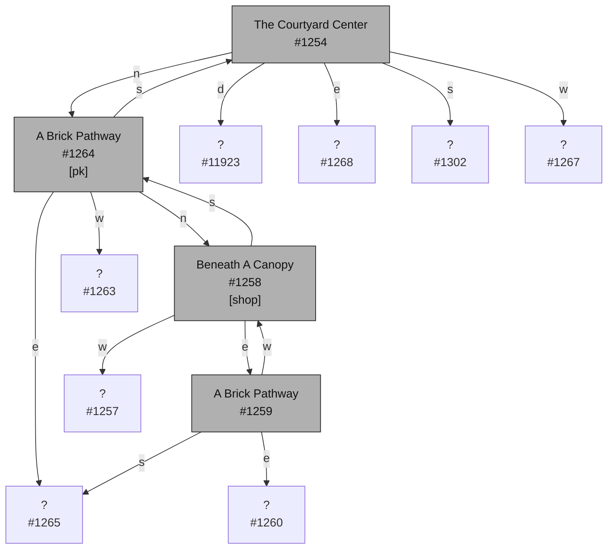

# The Three Pillars of Diatz

4 rooms. Solid = direction; dotted = special exit.

```mermaid
flowchart TD
  r1254["The Courtyard Center<br/>#1254"]
  r1264["A Brick Pathway<br/>#1264<br/>[pk]"]
  r1258["Beneath A Canopy<br/>#1258<br/>[shop]"]
  r1259["A Brick Pathway<br/>#1259"]
  r11923["?<br/>#11923"]
  r1254 -->|d| r11923
  r1268["?<br/>#1268"]
  r1254 -->|e| r1268
  r1254 -->|n| r1264
  r1302["?<br/>#1302"]
  r1254 -->|s| r1302
  r1267["?<br/>#1267"]
  r1254 -->|w| r1267
  r1265["?<br/>#1265"]
  r1264 -->|e| r1265
  r1264 -->|n| r1258
  r1264 -->|s| r1254
  r1263["?<br/>#1263"]
  r1264 -->|w| r1263
  r1258 -->|e| r1259
  r1258 -->|s| r1264
  r1257["?<br/>#1257"]
  r1258 -->|w| r1257
  r1260["?<br/>#1260"]
  r1259 -->|e| r1260
  r1259 -->|s| r1265
  r1259 -->|w| r1258
  classDef t_city fill:#b0b0b0,color:#111,stroke:#222
  class r1254 t_city
  class r1264 t_city
  class r1258 t_city
  class r1259 t_city
```
