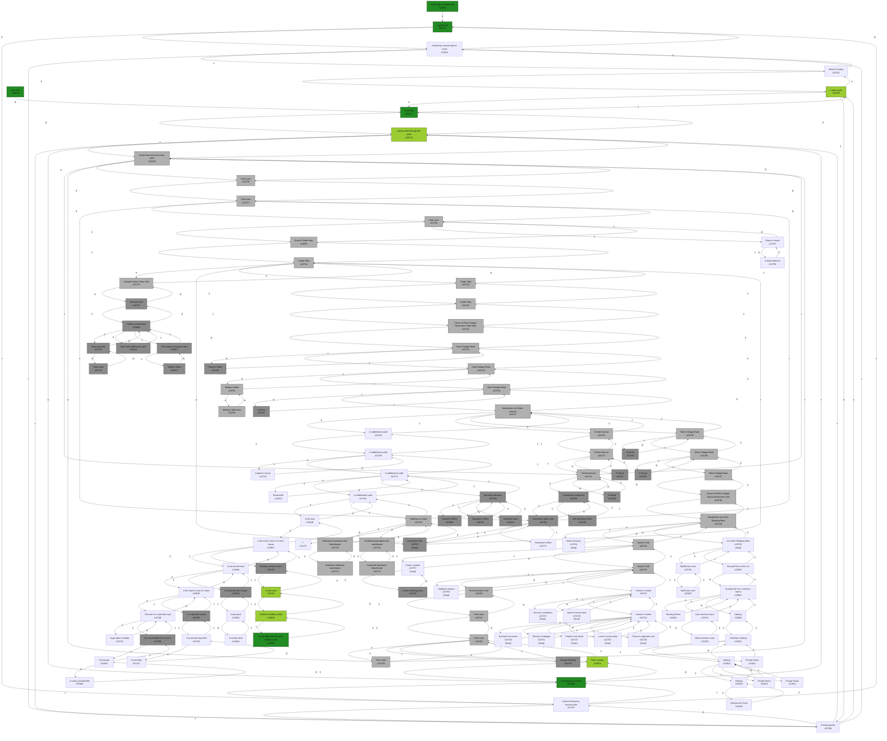

# The Town of Solan

126 rooms. Solid = direction; dotted = special exit.

```mermaid
flowchart TD
  r23712["A giant tree<br/>#23712"]
  r23713["Gateway to Solan<br/>#23713"]
  r23714["Center Avenue<br/>#23714"]
  r23715["Center Avenue<br/>#23715"]
  r23716["Center Avenue<br/>#23716"]
  r23717["Intersection at Center Avenue<br/>#23717"]
  r23718["East Cottage Road<br/>#23718"]
  r23719["East Cottage Road<br/>#23719"]
  r23720["East Cottage Road<br/>#23720"]
  r23721["Corner of East Cottage Road and Cinder Way<br/>#23721"]
  r23722["Cinder Way<br/>#23722"]
  r23723["Cinder Way<br/>#23723"]
  r23724["Cinder Way<br/>#23724"]
  r23725["Northeast Guardpost and Watchtower<br/>#23725"]
  r23726["Park Lane<br/>#23726"]
  r23727["Park Lane<br/>#23727"]
  r23728["Park Lane<br/>#23728"]
  r23729["Park Lane<br/>#23729"]
  r23730["Park Lane<br/>#23730"]
  r23731["Park Lane<br/>#23731"]
  r23732["Northwest guardpost and watchtower<br/>#23732"]
  r23733["Autumn Trail<br/>#23733"]
  r23734["Autumn Trail<br/>#23734"]
  r23735["Outside the Inn of the Sleeping Bear<br/>#23735"]
  r23736["Corner of West Cottage Road and Autumn Trail<br/>#23736"]
  r23737["West Cottage Road<br/>#23737"]
  r23738["West Cottage Road<br/>#23738"]
  r23739["West Cottage Road<br/>#23739"]
  r23740["Huge piles of rubble<br/>#23740"]
  r23741["A lush field<br/>#23741"]
  r23742["Farmer's market<br/>#23742"]
  r23743["Captain's house<br/>#23743"]
  r23744["Farmer's market<br/>#23744"]
  r23745["A farm yard<br/>#23745"]
  r23746["Frevan's vegetable cart<br/>#23746<br/>[shop]"]
  r23747["Frieda's fruit stand<br/>#23747<br/>[shop]"]
  r23748["Samual's souvenirs<br/>#23748<br/>[shop]"]
  r23749["Nyomi's frozen food<br/>#23749<br/>[shop]"]
  r23750["Murray's mulberry farm<br/>#23750"]
  r23751["Tomas's rutabagas<br/>#23751<br/>[shop]"]
  r23752["Lance's scuba shop<br/>#23752<br/>[shop]"]
  r23753["Connor's containers<br/>#23753<br/>[shop]"]
  r23754["Brad's brewery<br/>#23754<br/>[shop]"]
  r23755["A House<br/>#23755"]
  r23756["A House<br/>#23756"]
  r23757["Carla's cookies<br/>#23757<br/>[shop]"]
  r23758["A House<br/>#23758"]
  r23759["Old Gambling Parlor<br/>#23759"]
  r23760["Stephan's bakery<br/>#23760<br/>[shop]"]
  r23761["A House<br/>#23761"]
  r23762["Carla's relaxing room<br/>#23762"]
  r23763["A House<br/>#23763"]
  r23764["Mallory's birds<br/>#23764"]
  r23765["Mallory's bird room<br/>#23765"]
  r23766["Storage Building<br/>#23766"]
  r23767["Anastasia's Bar<br/>#23767<br/>[shop]"]
  r23768["Anastasia's pool room<br/>#23768"]
  r23769["Anastasia's restaurant<br/>#23769"]
  r23770["A grass path through the park<br/>#23770"]
  r23771["Anastasia's office<br/>#23771"]
  r23772["Inside the northeast watchtower<br/>#23772"]
  r23773["Inside the Northwest Watchtower<br/>#23773"]
  r23774["A cobblestone path<br/>#23774"]
  r23775["Outside Solan's Town Hall<br/>#23775"]
  r23776["Entrance Hall<br/>#23776"]
  r23777["A tall tree<br/>#23777"]
  r23778["Town treasurer<br/>#23778"]
  r23779["Town vault<br/>#23779"]
  r23780["In a tiny farm house<br/>#23780"]
  r23781["Water Fountain<br/>#23781"]
  r23782["A cobblestone path<br/>#23782"]
  r23783["A small well kept field<br/>#23783"]
  r23784["A cobblestone path<br/>#23784"]
  r23785["Doctor's office<br/>#23785"]
  r23786["In a comfortable farm house<br/>#23786"]
  r23787["A bed of heavenly honeysuckle<br/>#23787"]
  r23788["A large gazebo<br/>#23788"]
  r23789["A grass path<br/>#23789"]
  r23790["West common room<br/>#23790"]
  r23791["East common room<br/>#23791"]
  r23792["Middle bar room<br/>#23792"]
  r23793["Inn of the Sleeping Bear<br/>#23793<br/>[shop]"]
  r23794["A cobblestone path<br/>#23794"]
  r23795["Sergeant's Office<br/>#23795"]
  r23796["The end of a small dirt road<br/>#23796"]
  r23797["Mayor's house<br/>#23797"]
  r23798["A large bedroom<br/>#23798"]
  r23799["Barracks entrance<br/>#23799"]
  r23800["Hallway<br/>#23800"]
  r23801["Outside the inn's common rooms<br/>#23801"]
  r23802["Second Floor of the Inn<br/>#23802"]
  r23803["North bar room<br/>#23803"]
  r23804["Captain's Office<br/>#23804"]
  r23805["A farmyard<br/>#23805"]
  r23806["A newly planted field<br/>#23806"]
  r23807["The mayor's reception area<br/>#23807"]
  r23808["Hallway intersection<br/>#23808"]
  r23809["A small grove of trees<br/>#23809"]
  r23810["Blacksmith<br/>#23810"]
  r23811["Private Room<br/>#23811"]
  r23812["Private Room<br/>#23812"]
  r23813["Private Room<br/>#23813"]
  r23814["Town hall conference room<br/>#23814"]
  r23815["A blissfully scented bed of roses<br/>#23815"]
  r23816["Barracks room<br/>#23816"]
  r23817["Mayor's office<br/>#23817"]
  r23818["A field of mulberry trees<br/>#23818"]
  r23819["In a humble farm house<br/>#23819"]
  r23820["Reading Room<br/>#23820"]
  r23821["Third floor hallway<br/>#23821"]
  r23822["Hallway<br/>#23822"]
  r23823["Hallway<br/>#23823"]
  r23824["Plant nursery<br/>#23824"]
  r23825["A farmyard<br/>#23825"]
  r23826["A healthy field<br/>#23826"]
  r23827["A dirt road in front of a farm house<br/>#23827"]
  r23828["A narrow dirt road<br/>#23828"]
  r23829["A dirt road in front of a farm<br/>#23829"]
  r23830["Honeymoon Suite<br/>#23830"]
  r40548["A dirt road<br/>#40548"]
  r40549["Up a tree<br/>#40549"]
  r44256["At the top of a giant tree<br/>#44256"]
  r44257["In the high branches of a mulberry tree<br/>#44257"]
  r44258["End of Cinder Way<br/>#44258"]
  r44259["Center Avenue at the town park<br/>#44259"]
  r44281["End of Autumn Trail<br/>#44281"]
  r23712 -->|e| r23815
  r23712 -->|n| r23787
  r23713 -->|e| r23725
  r12475["?<br/>#12475"]
  r23713 -->|n| r12475
  r23713 -->|s| r23782
  r23713 -->|w| r23732
  r23714 -->|e| r23769
  r23714 -->|n| r23715
  r23714 -->|s| r44259
  r23714 -->|w| r23758
  r23715 -->|n| r23716
  r23715 -->|s| r23714
  r23715 -->|w| r23761
  r23716 -->|n| r23717
  r23716 -->|s| r23715
  r23717 -->|e| r23718
  r23717 -->|n| r23794
  r23717 -->|s| r23716
  r23717 -->|w| r23739
  r23718 -->|e| r23719
  r23718 -->|s| r23763
  r23718 -->|w| r23717
  r23719 -->|e| r23720
  r23719 -->|s| r23764
  r23719 -->|w| r23718
  r23720 -->|e| r23721
  r23720 -->|n| r23785
  r23720 -->|w| r23719
  r23721 -->|s| r23722
  r23721 -->|w| r23720
  r23722 -->|n| r23721
  r23722 -->|s| r23723
  r23723 -->|n| r23722
  r23723 -->|s| r23724
  r23724 -->|e| r23775
  r23724 -->|n| r23723
  r23724 -->|s| r44258
  r23724 -->|w| r23767
  r23725 -->|u| r23772
  r23725 -->|w| r23713
  r23726 -->|e| r44258
  r23726 -->|s| r23797
  r23726 -->|w| r23727
  r23727 -->|e| r23726
  r23727 -->|n| r23768
  r23727 -->|w| r23728
  r23728 -->|e| r23727
  r23728 -->|w| r44259
  r23729 -->|e| r44259
  r23729 -->|w| r23730
  r23730 -->|e| r23729
  r23730 -->|n| r23766
  r23730 -->|s| r23824
  r23730 -->|w| r23731
  r23731 -->|e| r23730
  r23731 -->|w| r44281
  r23732 -->|e| r23713
  r23732 -->|u| r23773
  r23733 -->|e| r23760
  r23733 -->|n| r23734
  r23733 -->|s| r44281
  r23733 -->|w| r23742
  r23734 -->|e| r23757
  r23734 -->|n| r23735
  r23734 -->|s| r23733
  r23735 -->|e| r23754
  r23735 -->|n| r23736
  r23735 -->|s| r23734
  r23735 -->|w| r23793
  r23736 -->|e| r23737
  r23736 -->|s| r23735
  r23737 -->|e| r23738
  r23737 -->|w| r23736
  r23738 -->|e| r23739
  r23738 -->|s| r23755
  r23738 -->|w| r23737
  r23739 -->|e| r23717
  r23739 -->|s| r23756
  r23739 -->|w| r23738
  r23740 -->|w| r23796
  r23741 -->|w| r23783
  r23742 -->|e| r23733
  r23742 -->|n| r23753
  r23742 -->|s| r23749
  r23742 -->|w| r23744
  r23743 -->|w| r23784
  r23744 -->|d| r23748
  r23744 -->|e| r23742
  r23744 -->|n| r23751
  r23744 -->|s| r23747
  r23744 -->|u| r23752
  r23744 -->|w| r23746
  r23745 -->|e| r23818
  r23745 -->|n| r23750
  r23746 -->|e| r23744
  r23747 -->|n| r23744
  r23748 -->|u| r23744
  r23749 -->|n| r23742
  r23750 -->|n| r23827
  r23750 -->|s| r23745
  r23751 -->|s| r23744
  r23752 -->|d| r23744
  r23753 -->|s| r23742
  r23754 -->|w| r23735
  r23755 -->|n| r23738
  r23756 -->|n| r23739
  r23757 -->|e| r23762
  r23757 -->|w| r23734
  r23758 -->|e| r23714
  r23759 -->|s| r23769
  r23760 -->|w| r23733
  r23761 -->|e| r23715
  r23762 -->|w| r23757
  r23763 -->|n| r23718
  r23764 -->|e| r23765
  r23764 -->|n| r23719
  r23765 -->|w| r23764
  r23766 -->|s| r23730
  r23767 -->|e| r23724
  r23767 -->|w| r23768
  r23768 -->|e| r23767
  r23768 -->|n| r23771
  r23768 -->|s| r23727
  r23768 -->|w| r23769
  r23769 -->|e| r23768
  r23769 -->|n| r23759
  r23769 -->|w| r23714
  r23770 -->|e| r23777
  r23770 -->|n| r44259
  r23770 -->|s| r23788
  r23770 -->|w| r23809
  r23771 -->|s| r23768
  r23772 -->|d| r23725
  r23773 -->|d| r23732
  r23774 -->|e| r23810
  r23774 -->|n| r23782
  r23774 -->|s| r23784
  r23774 -->|w| r23799
  r23775 -->|e| r23776
  r23775 -->|w| r23724
  r23776 -->|e| r23808
  r23776 -->|w| r23775
  r23777 -->|s| r23789
  r23777 -->|w| r23770
  r23778 -->|e| r23779
  r23778 -->|w| r23808
  r23779 -->|w| r23778
  r23780 -->|n| r23829
  r23780 -->|s| r23783
  r23781 -->|n| r23789
  r23781 -->|w| r23815
  r23782 -->|e| r40548
  r23782 -->|n| r23713
  r23782 -->|s| r23774
  r23783 -->|e| r23741
  r23783 -->|n| r23780
  r23784 -->|e| r23743
  r23784 -->|n| r23774
  r23784 -->|s| r23794
  r23785 -->|s| r23720
  r23786 -->|n| r23805
  r23786 -->|s| r23796
  r23787 -->|e| r23788
  r23787 -->|n| r23809
  r23787 -->|s| r23712
  r23788 -->|e| r23789
  r23788 -->|n| r23770
  r23788 -->|s| r23815
  r23788 -->|w| r23787
  r23789 -->|n| r23777
  r23789 -->|s| r23781
  r23789 -->|w| r23788
  r23790 -->|e| r23791
  r23791 -->|n| r23801
  r23791 -->|w| r23790
  r23792 -->|n| r23803
  r23792 -->|s| r23793
  r23793 -->|e| r23735
  r23793 -->|n| r23792
  r23793 -->|u| r23802
  r23794 -->|n| r23784
  r23794 -->|s| r23717
  r23795 -->|n| r23799
  r23796 -->|e| r23740
  r23796 -->|n| r23786
  r23796 -->|w| r23829
  r23797 -->|n| r23726
  r23797 -->|w| r23798
  r23798 -->|e| r23797
  r23799 -->|e| r23774
  r23799 -->|n| r23804
  r23799 -->|s| r23795
  r23799 -->|w| r23816
  r23800 -->|e| r23801
  r23800 -->|u| r23821
  r23801 -->|e| r23802
  r23801 -->|n| r23820
  r23801 -->|s| r23791
  r23801 -->|w| r23800
  r23802 -->|d| r23793
  r23802 -->|w| r23801
  r23803 -->|s| r23792
  r23804 -->|s| r23799
  r23805 -->|e| r23806
  r23805 -->|s| r23786
  r23806 -->|w| r23805
  r23807 -->|e| r23817
  r23807 -->|n| r23808
  r23808 -->|e| r23778
  r23808 -->|n| r23814
  r23808 -->|s| r23807
  r23808 -->|w| r23776
  r23809 -->|e| r23770
  r23809 -->|s| r23787
  r23809 -->|w| r23824
  r23810 -->|w| r23774
  r23811 -->|n| r23821
  r23812 -->|n| r23822
  r23813 -->|s| r23822
  r23814 -->|s| r23808
  r23815 -->|e| r23781
  r23815 -->|n| r23788
  r23815 -->|w| r23712
  r23816 -->|e| r23799
  r23817 -->|w| r23807
  r23818 -->|u| r44257
  r23818 -->|w| r23745
  r23819 -->|n| r23825
  r23819 -->|s| r23828
  r23820 -->|s| r23801
  r23821 -->|d| r23800
  r23821 -->|e| r23822
  r23821 -->|s| r23811
  r23822 -->|e| r23823
  r23822 -->|n| r23813
  r23822 -->|s| r23812
  r23822 -->|w| r23821
  r23823 -->|u| r23830
  r23823 -->|w| r23822
  r23824 -->|e| r23809
  r23824 -->|n| r23730
  r23825 -->|s| r23819
  r23825 -->|w| r23826
  r23826 -->|e| r23825
  r23827 -->|e| r23828
  r23827 -->|s| r23750
  r23827 -->|w| r40548
  r23828 -->|e| r23829
  r23828 -->|n| r23819
  r23828 -->|w| r23827
  r23829 -->|e| r23796
  r23829 -->|s| r23780
  r23829 -->|w| r23828
  r23830 -->|d| r23823
  r40548 -->|e| r23827
  r40548 -->|w| r23782
  r40549 -->|d| r23777
  r44256 -->|d| r23712
  r44257 -->|d| r23818
  r44258 -->|n| r23724
  r44258 -->|w| r23726
  r44259 -->|e| r23728
  r44259 -->|n| r23714
  r44259 -->|s| r23770
  r44259 -->|w| r23729
  r44281 -->|e| r23731
  r44281 -->|n| r23733
  classDef t_forest fill:#228b22,color:#111,stroke:#222
  class r23712 t_forest
  classDef t_city fill:#b0b0b0,color:#111,stroke:#222
  class r23713 t_city
  class r23714 t_city
  class r23715 t_city
  class r23716 t_city
  class r23717 t_city
  class r23718 t_city
  class r23719 t_city
  class r23720 t_city
  class r23721 t_city
  class r23722 t_city
  class r23723 t_city
  class r23724 t_city
  class r23725 t_city
  class r23726 t_city
  class r23727 t_city
  class r23728 t_city
  class r23729 t_city
  class r23730 t_city
  class r23731 t_city
  class r23732 t_city
  class r23733 t_city
  class r23734 t_city
  class r23735 t_city
  class r23736 t_city
  class r23737 t_city
  class r23738 t_city
  class r23739 t_city
  classDef t_field fill:#9acd32,color:#111,stroke:#222
  class r23745 t_field
  classDef t_inside fill:#8a8a8a,color:#111,stroke:#222
  class r23750 t_inside
  class r23755 t_inside
  class r23756 t_inside
  class r23758 t_inside
  class r23759 t_inside
  class r23761 t_inside
  class r23762 t_inside
  class r23763 t_inside
  class r23764 t_city
  class r23765 t_city
  class r23766 t_inside
  class r23767 t_inside
  class r23768 t_inside
  class r23769 t_inside
  class r23770 t_field
  class r23772 t_city
  class r23773 t_city
  class r23775 t_city
  class r23776 t_inside
  class r23777 t_forest
  class r23778 t_inside
  class r23779 t_inside
  class r23780 t_inside
  class r23785 t_inside
  class r23786 t_inside
  class r23789 t_field
  class r23795 t_inside
  class r23799 t_inside
  class r23804 t_inside
  class r23807 t_inside
  class r23808 t_inside
  class r23809 t_forest
  class r23814 t_inside
  class r23816 t_inside
  class r23817 t_inside
  class r23818 t_field
  class r23819 t_inside
  class r23824 t_field
  class r40549 t_forest
  class r44256 t_forest
  class r44257 t_forest
  class r44258 t_city
  class r44259 t_city
  class r44281 t_city
```
