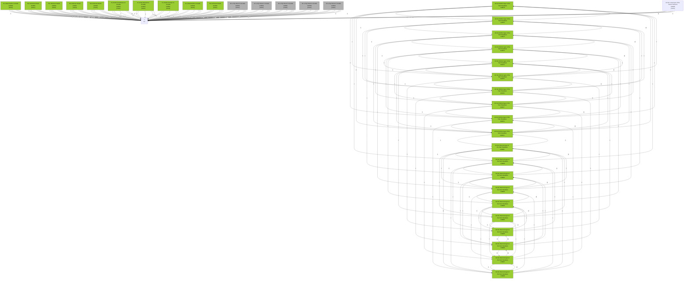

# The Upper Planes

36 rooms. Solid = direction; dotted = special exit.

```mermaid
flowchart TD
  r10870["On the Dothion layer of the Twin Paradises<br/>#10870"]
  r10879["On the Dothion layer of the Twin Paradises<br/>#10879"]
  r10871["On the Dothion layer of the Twin Paradises<br/>#10871"]
  r10872["On the Dothion layer of the Twin Paradises<br/>#10872"]
  r10873["On the Dothion layer of the Twin Paradises<br/>#10873"]
  r10875["On the Dothion layer of the Twin Paradises<br/>#10875"]
  r10876["On the Dothion layer of the Twin Paradises<br/>#10876"]
  r10877["On the Dothion layer of the Twin Paradises<br/>#10877"]
  r10888["On the Shurrock layer of the Twin Paradises<br/>#10888"]
  r10880["On the Shurrock layer of the Twin Paradises<br/>#10880"]
  r10881["On the Shurrock layer of the Twin Paradises<br/>#10881"]
  r10882["On the Shurrock layer of the Twin Paradises<br/>#10882"]
  r10889["On the Shurrock layer of the Twin Paradises<br/>#10889"]
  r10887["On the Shurrock layer of the Twin Paradises<br/>#10887"]
  r10886["On the Shurrock layer of the Twin Paradises<br/>#10886"]
  r10885["On the Shurrock layer of the Twin Paradises<br/>#10885"]
  r10883["On the Shurrock layer of the Twin Paradises<br/>#10883"]
  r10884["On the Shurrock layer of the Twin Paradises<br/>#10884"]
  r10874["On the Dothion layer of the Twin Paradises<br/>#10874"]
  r10878["On the Dothion layer of the Twin Paradises<br/>#10878"]
  r10820["In a Great Field on Arcadia<br/>#10820<br/>[maze]"]
  r10825["The Unknown Realm<br/>#10825<br/>[maze]"]
  r10828["The Unknown Realm<br/>#10828<br/>[maze]"]
  r10827["The Unknown Realm<br/>#10827<br/>[maze]"]
  r10829["The Unknown Realm<br/>#10829<br/>[maze]"]
  r10824["In a Field of Tall Grass on Arcadia<br/>#10824<br/>[maze]"]
  r10822["In a Fruit Orchard on Arcadia<br/>#10822<br/>[maze]"]
  r10821["In a Field of Crops on Arcadia<br/>#10821<br/>[maze]"]
  r10823["In a Great Field on Arcadia<br/>#10823<br/>[maze]"]
  r10826["The Unknown Realm<br/>#10826<br/>[maze]"]
  r10833["On a City Street in Arcadia<br/>#10833<br/>[maze]"]
  r10834["On a City Street in Arcadia<br/>#10834<br/>[maze]"]
  r10831["On a City Street in Arcadia<br/>#10831<br/>[maze]"]
  r10830["On a City Street in Arcadia<br/>#10830<br/>[maze]"]
  r10832["On a City Street in Arcadia<br/>#10832<br/>[maze]"]
  r10835["On the Lunia layer of the Seven Heavens<br/>#10835<br/>[maze]"]
  r10870 -->|e| r10871
  r10870 -->|n| r10878
  r10870 -->|s| r10875
  r10870 -->|u| r10880
  r10870 -->|w| r10879
  r10879 -->|e| r10870
  r10879 -->|n| r10874
  r10879 -->|s| r10872
  r10879 -->|u| r10889
  r10879 -->|w| r10878
  r10871 -->|e| r10872
  r10871 -->|n| r10876
  r10871 -->|s| r10876
  r10871 -->|u| r10881
  r10871 -->|w| r10870
  r10872 -->|e| r10873
  r10872 -->|n| r10879
  r10872 -->|s| r10877
  r10872 -->|u| r10882
  r10872 -->|w| r10871
  r10873 -->|e| r10874
  r10873 -->|n| r10875
  r10873 -->|s| r10878
  r10873 -->|u| r10883
  r10873 -->|w| r10872
  r10875 -->|e| r10876
  r10875 -->|n| r10870
  r10875 -->|s| r10873
  r10875 -->|u| r10885
  r10875 -->|w| r10874
  r10876 -->|e| r10877
  r10876 -->|n| r10871
  r10876 -->|s| r10871
  r10876 -->|u| r10886
  r10876 -->|w| r10875
  r10877 -->|e| r10878
  r10877 -->|n| r10872
  r10877 -->|s| r10874
  r10877 -->|u| r10887
  r10877 -->|w| r10876
  r10888 -->|e| r10889
  r10888 -->|n| r10883
  r10888 -->|s| r10880
  r10888 -->|u| r10878
  r10888 -->|w| r10887
  r10880 -->|e| r10881
  r10880 -->|n| r10888
  r10880 -->|s| r10885
  r10880 -->|u| r10870
  r10880 -->|w| r10889
  r10881 -->|e| r10882
  r10881 -->|n| r10886
  r10881 -->|s| r10886
  r10881 -->|u| r10871
  r10881 -->|w| r10880
  r10882 -->|e| r10883
  r10882 -->|n| r10889
  r10882 -->|s| r10887
  r10882 -->|u| r10872
  r10882 -->|w| r10881
  r10889 -->|e| r10880
  r10889 -->|n| r10884
  r10889 -->|s| r10882
  r10889 -->|u| r10879
  r10889 -->|w| r10888
  r10887 -->|e| r10888
  r10887 -->|n| r10882
  r10887 -->|s| r10884
  r10887 -->|u| r10877
  r10887 -->|w| r10886
  r10886 -->|e| r10887
  r10886 -->|n| r10881
  r10886 -->|s| r10881
  r10886 -->|u| r10876
  r10886 -->|w| r10885
  r10885 -->|e| r10886
  r10885 -->|n| r10880
  r10885 -->|s| r10883
  r10885 -->|u| r10875
  r10885 -->|w| r10884
  r10883 -->|e| r10884
  r10883 -->|n| r10885
  r10883 -->|s| r10888
  r10883 -->|u| r10873
  r10883 -->|w| r10882
  r10884 -->|e| r10885
  r10884 -->|n| r10887
  r10884 -->|s| r10889
  r10884 -->|u| r10874
  r10884 -->|w| r10883
  r10874 -->|e| r10875
  r10874 -->|n| r10877
  r10874 -->|s| r10879
  r10874 -->|u| r10884
  r10874 -->|w| r10873
  r10878 -->|e| r10879
  r10878 -->|n| r10873
  r10878 -->|s| r10870
  r10878 -->|u| r10888
  r10878 -->|w| r10877
  r-1["?<br/>#-1"]
  r10820 -->|e| r-1
  r10820 -->|n| r-1
  r10820 -->|s| r-1
  r10820 -->|u| r-1
  r10820 -->|w| r-1
  r10825 -->|d| r-1
  r10825 -->|e| r-1
  r10825 -->|n| r-1
  r10825 -->|s| r-1
  r10825 -->|u| r-1
  r10825 -->|w| r-1
  r10828 -->|d| r-1
  r10828 -->|e| r-1
  r10828 -->|n| r-1
  r10828 -->|s| r-1
  r10828 -->|u| r-1
  r10828 -->|w| r-1
  r10827 -->|d| r-1
  r10827 -->|e| r-1
  r10827 -->|n| r-1
  r10827 -->|s| r-1
  r10827 -->|u| r-1
  r10827 -->|w| r-1
  r10829 -->|d| r-1
  r10829 -->|e| r-1
  r10829 -->|n| r-1
  r10829 -->|s| r-1
  r10829 -->|u| r-1
  r10829 -->|w| r-1
  r10824 -->|e| r-1
  r10824 -->|n| r-1
  r10824 -->|s| r-1
  r10824 -->|u| r-1
  r10824 -->|w| r-1
  r10822 -->|e| r-1
  r10822 -->|n| r-1
  r10822 -->|s| r-1
  r10822 -->|u| r-1
  r10822 -->|w| r-1
  r10821 -->|e| r-1
  r10821 -->|n| r-1
  r10821 -->|s| r-1
  r10821 -->|u| r-1
  r10821 -->|w| r-1
  r10823 -->|e| r-1
  r10823 -->|n| r-1
  r10823 -->|s| r-1
  r10823 -->|u| r-1
  r10823 -->|w| r-1
  r10826 -->|d| r-1
  r10826 -->|e| r-1
  r10826 -->|n| r-1
  r10826 -->|s| r-1
  r10826 -->|u| r-1
  r10826 -->|w| r-1
  r10833 -->|d| r-1
  r10833 -->|e| r-1
  r10833 -->|n| r-1
  r10833 -->|s| r-1
  r10833 -->|u| r-1
  r10834 -->|d| r-1
  r10834 -->|e| r-1
  r10834 -->|n| r-1
  r10834 -->|s| r-1
  r10834 -->|w| r-1
  r10831 -->|d| r-1
  r10831 -->|e| r-1
  r10831 -->|n| r-1
  r10831 -->|s| r-1
  r10831 -->|w| r-1
  r10830 -->|d| r-1
  r10830 -->|e| r-1
  r10830 -->|n| r-1
  r10830 -->|s| r-1
  r10830 -->|u| r-1
  r10832 -->|d| r-1
  r10832 -->|e| r-1
  r10832 -->|n| r-1
  r10832 -->|s| r-1
  r10832 -->|u| r-1
  r10835 -->|e| r-1
  r10835 -->|n| r-1
  r10835 -->|s| r-1
  r10835 -->|u| r-1
  r10835 -->|w| r-1
  classDef t_field fill:#9acd32,color:#111,stroke:#222
  class r10870 t_field
  class r10879 t_field
  class r10871 t_field
  class r10872 t_field
  class r10873 t_field
  class r10875 t_field
  class r10876 t_field
  class r10877 t_field
  class r10888 t_field
  class r10880 t_field
  class r10881 t_field
  class r10882 t_field
  class r10889 t_field
  class r10887 t_field
  class r10886 t_field
  class r10885 t_field
  class r10883 t_field
  class r10884 t_field
  class r10874 t_field
  class r10878 t_field
  class r10820 t_field
  class r10825 t_field
  class r10828 t_field
  class r10827 t_field
  class r10829 t_field
  class r10824 t_field
  class r10822 t_field
  class r10821 t_field
  class r10823 t_field
  class r10826 t_field
  classDef t_city fill:#b0b0b0,color:#111,stroke:#222
  class r10833 t_city
  class r10834 t_city
  class r10831 t_city
  class r10830 t_city
  class r10832 t_city
```
