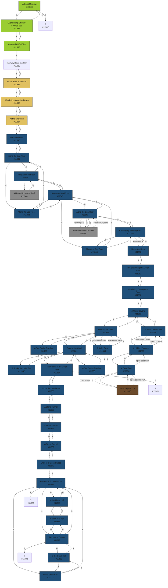

# The Wobbly Woes of Woobleville

43 rooms. Solid = direction; dotted = special exit.

```mermaid
flowchart TD
  r11383["A Quiet Meadow<br/>#11383"]
  r11335["A Jagged Cliff's Edge<br/>#11335"]
  r11336["Halfway Down the Cliff<br/>#11336"]
  r11339["At the Base of the Cliff<br/>#11339"]
  r11338["Wandering Along the Beach<br/>#11338"]
  r11337["At the Shoreline<br/>#11337"]
  r11340["Into the Depths<br/>#11340"]
  r11341["Along the Sea Floor<br/>#11341"]
  r11342["Along the Sea Floor<br/>#11342"]
  r11343["Along the Sea Floor<br/>#11343"]
  r11345["Along the Sea Floor<br/>#11345"]
  r11346["Along the Sea Floor<br/>#11346"]
  r11349["A Strangely Glowing Rock<br/>#11349"]
  r11347["Along the Sea Floor<br/>#11347"]
  r11344["A House Under the Sea?<br/>#11344"]
  r11348["An Upside-Down House!<br/>#11348"]
  r11350["Under the Rock<br/>#11350"]
  r11351["The Beginning of a Coral Reef<br/>#11351"]
  r11352["Wandering Through the Coral<br/>#11352"]
  r11353["A Coral Cavern<br/>#11353"]
  r11358["Deep in the Coral<br/>#11358"]
  r11360["A Sea Snake Dwelling<br/>#11360"]
  r11361["Deep in the Coral<br/>#11361"]
  r11359["A Kinky Cave<br/>#11359"]
  r11362["A Snaky Bachelor Pad<br/>#11362"]
  r11364["The Center of the Coral Reef<br/>#11364"]
  r11363["A Sea Snake Dwelling<br/>#11363"]
  r11366["End of the Coral Reef<br/>#11366"]
  r11368["A Stone Tunnel<br/>#11368"]
  r11367["A Stone Tunnel<br/>#11367"]
  r11355["A Hidden Passage<br/>#11355"]
  r11354["A Small Coral Cave<br/>#11354"]
  r11356["A Dead End<br/>#11356"]
  r11357["A Storage Room<br/>#11357"]
  r11369["A Stone Tunnel<br/>#11369"]
  r11370["Entry to a Stone Palace<br/>#11370"]
  r11371["Before the Throne Room<br/>#11371"]
  r11372["In the Great Hall<br/>#11372"]
  r11373["In the Great Hall<br/>#11373"]
  r11381["In the Great Hall<br/>#11381"]
  r11379["Before the Throne<br/>#11379"]
  r11380["In the Great Hall<br/>#11380"]
  r11384["Overlooking a Newly Formed Sea<br/>#11384"]
  r11383 -->|n| r11384
  r11587["?<br/>#11587"]
  r11383 -->|s| r11587
  r11335 -->|d| r11336
  r11335 -->|w| r11384
  r11336 -->|d| r11339
  r11339 -->|n| r11338
  r11339 -->|u| r11336
  r11338 -->|n| r11337
  r11338 -->|s| r11339
  r11337 -->|d| r11340
  r11337 -->|s| r11338
  r11340 -->|d| r11341
  r11340 -->|u| r11337
  r11341 -->|n| r11342
  r11341 -->|u| r11340
  r11341 -->|w| r11343
  r11342 -->|s| r11341
  r11342 -->|u| r11344
  r11342 -->|w| r11345
  r11343 -->|e| r11341
  r11343 -->|n| r11345
  r11345 -->|e| r11342
  r11345 -->|n| r11347
  r11345 -->|s| r11343
  r11345 -->|w| r11346
  r11346 -->|e| r11345
  r11346 -->|n| r11349
  r11349 -->|e| r11347
  r11349 -.->|enter crack| r11350
  r11349 -->|s| r11346
  r11347 -.->|open up;up| r11348
  r11347 -->|s| r11345
  r11347 -->|u| r11348
  r11347 -->|w| r11349
  r11344 -->|d| r11342
  r11348 -->|d| r11347
  r11348 -.->|open down;down| r11347
  r11350 -->|n| r11351
  r11350 -->|u| r11349
  r11351 -->|n| r11352
  r11351 -->|s| r11350
  r11352 -->|n| r11353
  r11352 -->|s| r11351
  r11353 -->|n| r11358
  r11353 -->|s| r11352
  r11353 -->|w| r11354
  r11358 -->|e| r11359
  r11358 -->|n| r11361
  r11358 -.->|open east;east| r11359
  r11358 -->|s| r11353
  r11358 -->|w| r11360
  r11360 -->|e| r11358
  r11361 -->|e| r11362
  r11361 -->|n| r11363
  r11361 -->|s| r11358
  r11361 -->|w| r11364
  r11359 -.->|open west;west| r11358
  r11359 -->|w| r11358
  r11362 -->|w| r11361
  r11364 -->|e| r11361
  r11364 -->|n| r11366
  r11365["?<br/>#11365"]
  r11364 -->|u| r11365
  r11363 -->|s| r11361
  r11366 -->|n| r11368
  r11366 -->|s| r11364
  r11368 -->|s| r11366
  r11368 -->|w| r11367
  r11367 -->|e| r11368
  r11367 -->|w| r11369
  r11355 -.->|open up;up| r11354
  r11355 -->|s| r11356
  r11355 -->|u| r11354
  r11354 -->|d| r11355
  r11354 -->|e| r11353
  r11354 -.->|open down;down| r11355
  r11356 -->|e| r11355
  r11356 -.->|open east;east| r11355
  r11356 -.->|open up;up| r11357
  r11356 -->|u| r11357
  r11357 -->|d| r11356
  r11357 -.->|open down;down| r11356
  r11369 -->|e| r11367
  r11369 -->|s| r11370
  r11370 -->|n| r11369
  r11370 -->|s| r11371
  r11374["?<br/>#11374"]
  r11371 -->|d| r11374
  r11371 -->|e| r11373
  r11371 -->|n| r11370
  r11371 -->|s| r11379
  r11371 -->|w| r11372
  r11372 -->|e| r11371
  r11372 -->|s| r11380
  r11373 -->|s| r11381
  r11373 -->|w| r11371
  r11381 -->|n| r11373
  r11381 -->|w| r11379
  r11379 -->|e| r11381
  r11379 -->|n| r11371
  r11382["?<br/>#11382"]
  r11379 -->|s| r11382
  r11379 -->|w| r11380
  r11380 -->|e| r11379
  r11380 -->|n| r11372
  r11384 -->|e| r11335
  r11384 -->|s| r11383
  classDef t_field fill:#9acd32,color:#111,stroke:#222
  class r11383 t_field
  class r11335 t_field
  classDef t_desert fill:#e0c060,color:#111,stroke:#222
  class r11339 t_desert
  class r11338 t_desert
  class r11337 t_desert
  classDef t_underwater fill:#20507a,color:#111,stroke:#222
  class r11340 t_underwater
  class r11341 t_underwater
  class r11342 t_underwater
  class r11343 t_underwater
  class r11345 t_underwater
  class r11346 t_underwater
  class r11349 t_underwater
  class r11347 t_underwater
  classDef t_inside fill:#8a8a8a,color:#111,stroke:#222
  class r11344 t_inside
  class r11348 t_inside
  class r11350 t_underwater
  class r11351 t_underwater
  class r11352 t_underwater
  class r11353 t_underwater
  class r11358 t_underwater
  class r11360 t_underwater
  class r11361 t_underwater
  class r11359 t_underwater
  class r11362 t_underwater
  class r11364 t_underwater
  class r11363 t_underwater
  class r11366 t_underwater
  class r11368 t_underwater
  class r11367 t_underwater
  class r11355 t_underwater
  class r11354 t_underwater
  class r11356 t_underwater
  classDef t_underground fill:#6b4a2b,color:#111,stroke:#222
  class r11357 t_underground
  class r11369 t_underwater
  class r11370 t_underwater
  class r11371 t_underwater
  class r11372 t_underwater
  class r11373 t_underwater
  class r11381 t_underwater
  class r11379 t_underwater
  class r11380 t_underwater
  class r11384 t_field
```
