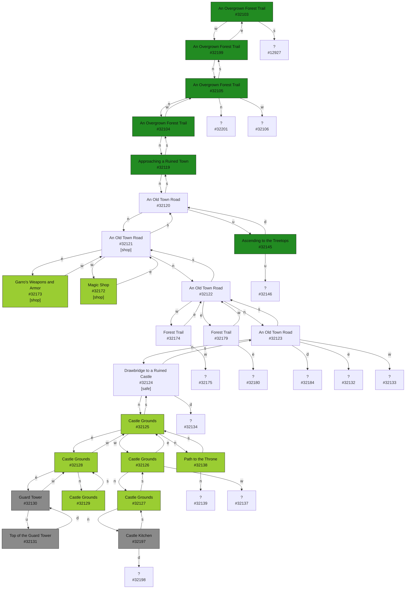

# The Wood Elves of Nalondir

24 rooms. Solid = direction; dotted = special exit.

```mermaid
flowchart TD
  r32103["An Overgrown Forest Trail<br/>#32103"]
  r32199["An Overgrown Forest Trail<br/>#32199"]
  r32105["An Overgrown Forest Trail<br/>#32105"]
  r32104["An Overgrown Forest Trail<br/>#32104"]
  r32119["Approaching a Ruined Town<br/>#32119"]
  r32120["An Old Town Road<br/>#32120"]
  r32145["Ascending to the Treetops<br/>#32145"]
  r32121["An Old Town Road<br/>#32121<br/>[shop]"]
  r32173["Garro's Weapons and Armor<br/>#32173<br/>[shop]"]
  r32172["Magic Shop<br/>#32172<br/>[shop]"]
  r32122["An Old Town Road<br/>#32122"]
  r32174["Forest Trail<br/>#32174"]
  r32179["Forest Trail<br/>#32179"]
  r32123["An Old Town Road<br/>#32123"]
  r32124["Drawbridge to a Ruined Castle<br/>#32124<br/>[safe]"]
  r32125["Castle Grounds<br/>#32125"]
  r32138["Path to the Throne<br/>#32138"]
  r32128["Castle Grounds<br/>#32128"]
  r32130["Guard Tower<br/>#32130"]
  r32131["Top of the Guard Tower<br/>#32131"]
  r32129["Castle Grounds<br/>#32129"]
  r32126["Castle Grounds<br/>#32126"]
  r32127["Castle Grounds<br/>#32127"]
  r32197["Castle Kitchen<br/>#32197"]
  r12927["?<br/>#12927"]
  r32103 -->|s| r12927
  r32103 -->|w| r32199
  r32199 -->|e| r32103
  r32199 -->|n| r32105
  r32105 -->|e| r32104
  r32201["?<br/>#32201"]
  r32105 -->|n| r32201
  r32105 -->|s| r32199
  r32106["?<br/>#32106"]
  r32105 -->|w| r32106
  r32104 -->|n| r32119
  r32104 -->|w| r32105
  r32119 -->|n| r32120
  r32119 -->|s| r32104
  r32120 -->|n| r32121
  r32120 -->|s| r32119
  r32120 -->|u| r32145
  r32145 -->|d| r32120
  r32146["?<br/>#32146"]
  r32145 -->|u| r32146
  r32121 -->|e| r32173
  r32121 -->|n| r32122
  r32121 -->|s| r32120
  r32121 -->|w| r32172
  r32173 -->|w| r32121
  r32172 -->|e| r32121
  r32122 -->|e| r32179
  r32122 -->|n| r32123
  r32122 -->|s| r32121
  r32122 -->|w| r32174
  r32174 -->|e| r32122
  r32175["?<br/>#32175"]
  r32174 -->|w| r32175
  r32180["?<br/>#32180"]
  r32179 -->|e| r32180
  r32179 -->|w| r32122
  r32184["?<br/>#32184"]
  r32123 -->|d| r32184
  r32132["?<br/>#32132"]
  r32123 -->|e| r32132
  r32123 -->|n| r32124
  r32123 -->|s| r32122
  r32133["?<br/>#32133"]
  r32123 -->|w| r32133
  r32134["?<br/>#32134"]
  r32124 -->|d| r32134
  r32124 -->|n| r32125
  r32124 -->|s| r32123
  r32125 -->|e| r32128
  r32125 -->|n| r32138
  r32125 -->|s| r32124
  r32125 -->|w| r32126
  r32139["?<br/>#32139"]
  r32138 -->|n| r32139
  r32138 -->|s| r32125
  r32128 -->|e| r32130
  r32128 -->|n| r32129
  r32128 -->|w| r32125
  r32130 -->|u| r32131
  r32130 -->|w| r32128
  r32131 -->|d| r32130
  r32129 -->|s| r32128
  r32126 -->|e| r32125
  r32126 -->|n| r32127
  r32137["?<br/>#32137"]
  r32126 -->|w| r32137
  r32127 -->|n| r32197
  r32127 -->|s| r32126
  r32198["?<br/>#32198"]
  r32197 -->|d| r32198
  r32197 -->|s| r32127
  classDef t_forest fill:#228b22,color:#111,stroke:#222
  class r32103 t_forest
  class r32199 t_forest
  class r32105 t_forest
  class r32104 t_forest
  class r32119 t_forest
  class r32145 t_forest
  classDef t_field fill:#9acd32,color:#111,stroke:#222
  class r32173 t_field
  class r32172 t_field
  class r32125 t_field
  class r32138 t_field
  class r32128 t_field
  classDef t_inside fill:#8a8a8a,color:#111,stroke:#222
  class r32130 t_inside
  class r32131 t_inside
  class r32129 t_field
  class r32126 t_field
  class r32127 t_field
  class r32197 t_inside
```
