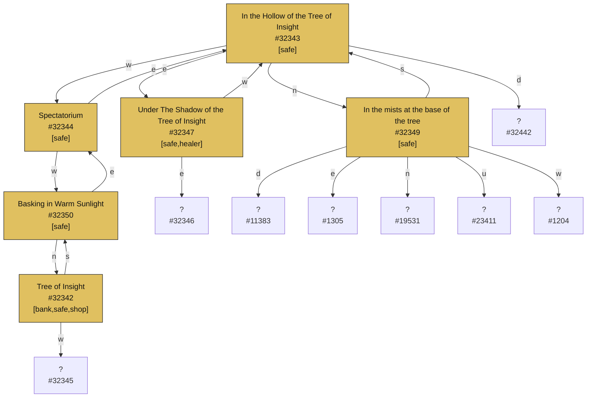

# The World of the Watchmen

6 rooms. Solid = direction; dotted = special exit.

```mermaid
flowchart TD
  r32343["In the Hollow of the Tree of Insight<br/>#32343<br/>[safe]"]
  r32347["Under The Shadow of the Tree of Insight<br/>#32347<br/>[safe,healer]"]
  r32344["Spectatorium<br/>#32344<br/>[safe]"]
  r32349["In the mists at the base of the tree<br/>#32349<br/>[safe]"]
  r32350["Basking in Warm Sunlight<br/>#32350<br/>[safe]"]
  r32342["Tree of Insight<br/>#32342<br/>[bank,safe,shop]"]
  r32442["?<br/>#32442"]
  r32343 -->|d| r32442
  r32343 -->|e| r32347
  r32343 -->|n| r32349
  r32343 -->|w| r32344
  r32346["?<br/>#32346"]
  r32347 -->|e| r32346
  r32347 -->|w| r32343
  r32344 -->|e| r32343
  r32344 -->|w| r32350
  r11383["?<br/>#11383"]
  r32349 -->|d| r11383
  r1305["?<br/>#1305"]
  r32349 -->|e| r1305
  r19531["?<br/>#19531"]
  r32349 -->|n| r19531
  r32349 -->|s| r32343
  r23411["?<br/>#23411"]
  r32349 -->|u| r23411
  r1204["?<br/>#1204"]
  r32349 -->|w| r1204
  r32350 -->|e| r32344
  r32350 -->|n| r32342
  r32342 -->|s| r32350
  r32345["?<br/>#32345"]
  r32342 -->|w| r32345
  classDef t_desert fill:#e0c060,color:#111,stroke:#222
  class r32343 t_desert
  class r32347 t_desert
  class r32344 t_desert
  class r32349 t_desert
  class r32350 t_desert
  class r32342 t_desert
```
