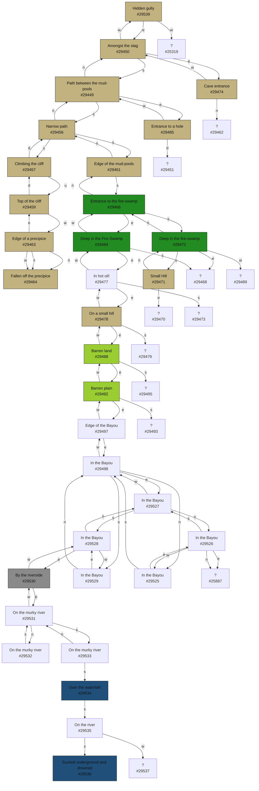

# The Yurgach Domain

33 rooms. Solid = direction; dotted = special exit.

```mermaid
flowchart TD
  r29539["Hidden gully<br/>#29539"]
  r29450["Amongst the slag<br/>#29450"]
  r29449["Path between the mud-pools<br/>#29449"]
  r29456["Narrow path<br/>#29456"]
  r29457["Climbing the cliff<br/>#29457"]
  r29459["Top of the cliff<br/>#29459"]
  r29463["Edge of a precipice<br/>#29463"]
  r29464["Fallen off the precipice<br/>#29464"]
  r29461["Edge of the mud-pools<br/>#29461"]
  r29466["Entrance to the fire-swamp<br/>#29466"]
  r29472["Deep in the fire-swamp<br/>#29472"]
  r29471["Small Hill<br/>#29471"]
  r29474["Cave entrance<br/>#29474"]
  r29485["Entrance to a hole<br/>#29485"]
  r29484["Deep in the Fire Swamp<br/>#29484"]
  r29477["In hot oil!<br/>#29477"]
  r29478["On a small hill<br/>#29478"]
  r29488["Barren land<br/>#29488"]
  r29492["Barren plain<br/>#29492"]
  r29497["Edge of the Bayou<br/>#29497"]
  r29498["In the Bayou<br/>#29498"]
  r29527["In the Bayou<br/>#29527"]
  r29526["In the Bayou<br/>#29526"]
  r29528["In the Bayou<br/>#29528"]
  r29530["By the riverside<br/>#29530"]
  r29529["In the Bayou<br/>#29529"]
  r29525["In the Bayou<br/>#29525"]
  r29531["On the murky river<br/>#29531"]
  r29532["On the murky river<br/>#29532"]
  r29533["On the murky river<br/>#29533"]
  r29534["Over the waterfall!<br/>#29534"]
  r29535["On the river<br/>#29535"]
  r29536["Sucked underground and drowned<br/>#29536"]
  r29539 -->|e| r29450
  r25319["?<br/>#25319"]
  r29539 -->|w| r25319
  r29450 -->|e| r29474
  r29450 -->|s| r29449
  r29450 -->|w| r29539
  r29449 -->|e| r29485
  r29449 -->|n| r29450
  r29449 -->|s| r29456
  r29456 -->|n| r29449
  r29456 -->|s| r29461
  r29456 -->|u| r29457
  r29457 -->|d| r29456
  r29457 -->|u| r29459
  r29459 -->|d| r29457
  r29459 -->|w| r29463
  r29463 -->|e| r29459
  r29463 -->|n| r29464
  r29463 -->|s| r29464
  r29463 -->|w| r29464
  r29461 -->|n| r29456
  r29461 -->|s| r29466
  r29466 -->|e| r29484
  r29466 -->|n| r29461
  r29466 -->|s| r29472
  r29468["?<br/>#29468"]
  r29472 -->|e| r29468
  r29472 -->|n| r29466
  r29472 -->|s| r29471
  r29489["?<br/>#29489"]
  r29472 -->|w| r29489
  r29470["?<br/>#29470"]
  r29471 -->|e| r29470
  r29471 -->|n| r29472
  r29462["?<br/>#29462"]
  r29474 -->|n| r29462
  r29474 -->|w| r29450
  r29451["?<br/>#29451"]
  r29485 -->|d| r29451
  r29485 -->|w| r29449
  r29484 -->|e| r29477
  r29484 -->|s| r29468
  r29484 -->|w| r29466
  r29477 -->|e| r29478
  r29473["?<br/>#29473"]
  r29477 -->|s| r29473
  r29477 -->|w| r29484
  r29478 -->|e| r29488
  r29479["?<br/>#29479"]
  r29478 -->|s| r29479
  r29478 -->|w| r29477
  r29488 -->|e| r29492
  r29495["?<br/>#29495"]
  r29488 -->|s| r29495
  r29488 -->|w| r29478
  r29492 -->|e| r29497
  r29493["?<br/>#29493"]
  r29492 -->|s| r29493
  r29492 -->|w| r29488
  r29497 -->|e| r29498
  r29497 -->|w| r29492
  r29498 -->|e| r29527
  r29498 -->|n| r29525
  r29498 -->|s| r29529
  r29498 -->|w| r29497
  r29527 -->|n| r29526
  r29527 -->|s| r29528
  r29527 -->|w| r29498
  r25887["?<br/>#25887"]
  r29526 -->|e| r25887
  r29526 -->|n| r25887
  r29526 -->|s| r29527
  r29526 -->|w| r29525
  r29528 -->|e| r29530
  r29528 -->|n| r29527
  r29528 -->|w| r29529
  r29530 -->|e| r29531
  r29530 -->|w| r29528
  r29529 -->|e| r29528
  r29529 -->|n| r29498
  r29525 -->|e| r29526
  r29525 -->|s| r29498
  r29531 -->|n| r29532
  r29531 -->|s| r29533
  r29531 -->|w| r29530
  r29532 -->|s| r29531
  r29533 -->|n| r29531
  r29533 -->|s| r29534
  r29534 -->|s| r29535
  r29535 -->|s| r29536
  r29537["?<br/>#29537"]
  r29535 -->|w| r29537
  classDef t_hills fill:#c2b280,color:#111,stroke:#222
  class r29539 t_hills
  class r29450 t_hills
  class r29449 t_hills
  class r29456 t_hills
  class r29457 t_hills
  class r29459 t_hills
  class r29463 t_hills
  class r29464 t_hills
  class r29461 t_hills
  classDef t_forest fill:#228b22,color:#111,stroke:#222
  class r29466 t_forest
  class r29472 t_forest
  class r29471 t_hills
  class r29474 t_hills
  class r29485 t_hills
  class r29484 t_forest
  class r29478 t_hills
  classDef t_field fill:#9acd32,color:#111,stroke:#222
  class r29488 t_field
  class r29492 t_field
  classDef t_inside fill:#8a8a8a,color:#111,stroke:#222
  class r29530 t_inside
  classDef t_underwater fill:#20507a,color:#111,stroke:#222
  class r29534 t_underwater
  class r29536 t_underwater
```
