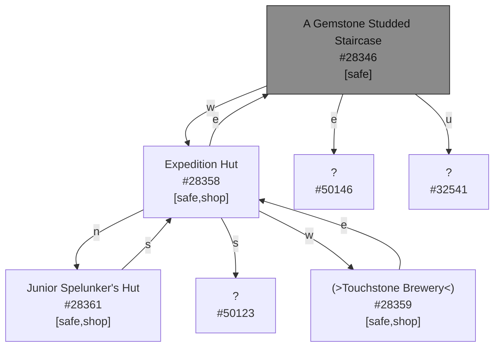

# Touchstone Cavern

4 rooms. Solid = direction; dotted = special exit.

```mermaid
flowchart TD
  r28346["A Gemstone Studded Staircase<br/>#28346<br/>[safe]"]
  r28358["Expedition Hut<br/>#28358<br/>[safe,shop]"]
  r28359["(>Touchstone Brewery<)<br/>#28359<br/>[safe,shop]"]
  r28361["Junior Spelunker's Hut<br/>#28361<br/>[safe,shop]"]
  r50146["?<br/>#50146"]
  r28346 -->|e| r50146
  r32541["?<br/>#32541"]
  r28346 -->|u| r32541
  r28346 -->|w| r28358
  r28358 -->|e| r28346
  r28358 -->|n| r28361
  r50123["?<br/>#50123"]
  r28358 -->|s| r50123
  r28358 -->|w| r28359
  r28359 -->|e| r28358
  r28361 -->|s| r28358
  classDef t_inside fill:#8a8a8a,color:#111,stroke:#222
  class r28346 t_inside
```
