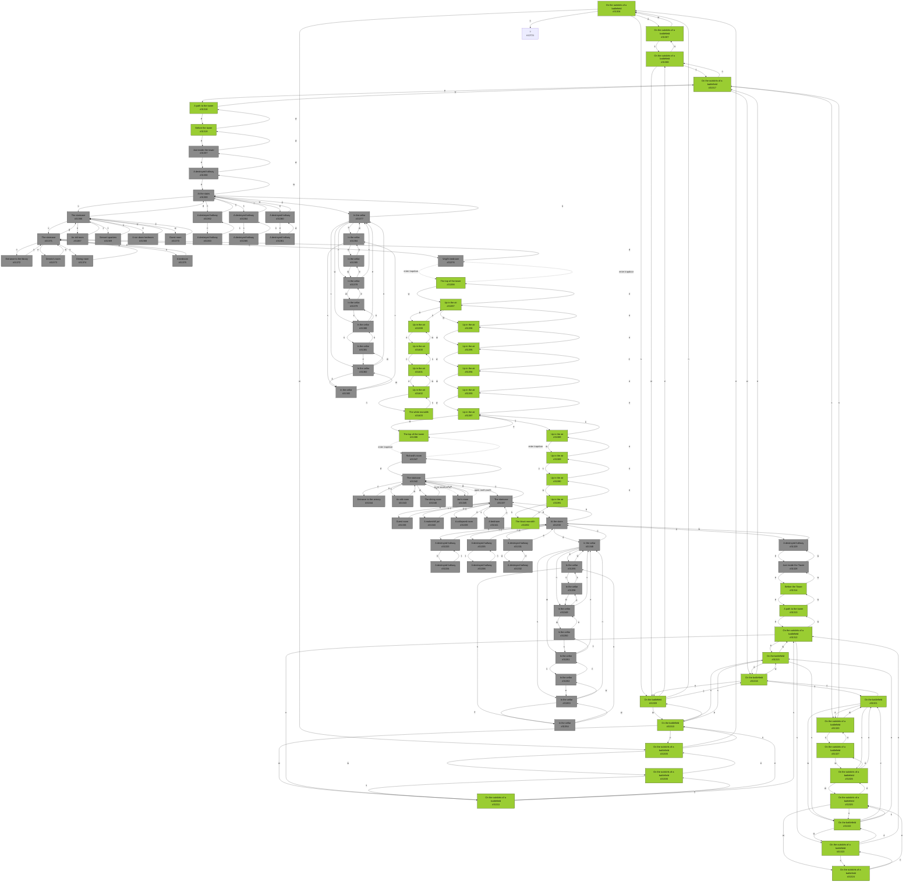

# War of the Wizards

100 rooms. Solid = direction; dotted = special exit.

```mermaid
flowchart TD
  r31304["On the outskirts of a battlefield<br/>#31304"]
  r31305["On the outskirts of a battlefield<br/>#31305"]
  r31307["On the outskirts of a battlefield<br/>#31307"]
  r31308["On the outskirts of a battlefield<br/>#31308"]
  r31309["On the battlefield<br/>#31309"]
  r31317["On the outskirts of a battlefield<br/>#31317"]
  r31310["On the battlefield<br/>#31310"]
  r31311["On the outskirts of a battlefield<br/>#31311"]
  r31306["On the outskirts of a battlefield<br/>#31306"]
  r31312["On the outskirts of a battlefield<br/>#31312"]
  r31313["A path to the tower<br/>#31313"]
  r31314["Before the Tower<br/>#31314"]
  r31328["Just inside the Tower<br/>#31328"]
  r31329["A destroyed hallway<br/>#31329"]
  r31330["At the stairs<br/>#31330"]
  r31333["A destroyed hallway<br/>#31333"]
  r31334["A destroyed hallway<br/>#31334"]
  r31335["A destroyed hallway<br/>#31335"]
  r31336["A destroyed hallway<br/>#31336"]
  r31331["A destroyed hallway<br/>#31331"]
  r31332["A destroyed hallway<br/>#31332"]
  r31337["The staircase<br/>#31337"]
  r31338["Guest room<br/>#31338"]
  r31340["A makeshift jail<br/>#31340"]
  r31339["A collapsed room<br/>#31339"]
  r31341["A bedroom<br/>#31341"]
  r31342["The staircase<br/>#31342"]
  r31344["Entrance to the armory<br/>#31344"]
  r31343["An old room<br/>#31343"]
  r31346["The dining room<br/>#31346"]
  r31345["Jon's room<br/>#31345"]
  r31347["Richard's room<br/>#31347"]
  r31386["The top of the tower<br/>#31386"]
  r31387["Up in the air<br/>#31387"]
  r31388["Up in the air<br/>#31388"]
  r31389["Up in the air<br/>#31389"]
  r31390["Up in the air<br/>#31390"]
  r31391["Up in the air<br/>#31391"]
  r31392["The black monolith<br/>#31392"]
  r31393["Up in the air<br/>#31393"]
  r31394["Up in the air<br/>#31394"]
  r31395["Up in the air<br/>#31395"]
  r31396["Up in the air<br/>#31396"]
  r31397["Up in the air<br/>#31397"]
  r31399["Up in the air<br/>#31399"]
  r31400["Up in the air<br/>#31400"]
  r31398["The top of the tower<br/>#31398"]
  r31371["The staircase<br/>#31371"]
  r31372["Entrance to the library<br/>#31372"]
  r31373["Dennis's room<br/>#31373"]
  r31374["Dining room<br/>#31374"]
  r31375["A bedroom<br/>#31375"]
  r31366["The staircase<br/>#31366"]
  r31367["An old room<br/>#31367"]
  r31369["Servant quarters<br/>#31369"]
  r31368["A run down bedroom<br/>#31368"]
  r31370["Guest room<br/>#31370"]
  r31359["At the stairs<br/>#31359"]
  r31360["A destroyed hallway<br/>#31360"]
  r31358["A destroyed hallway<br/>#31358"]
  r31362["A destroyed hallway<br/>#31362"]
  r31363["A destroyed hallway<br/>#31363"]
  r31364["A destroyed hallway<br/>#31364"]
  r31365["A destroyed hallway<br/>#31365"]
  r31361["A destroyed hallway<br/>#31361"]
  r31357["Just inside the tower<br/>#31357"]
  r31319["Before the tower<br/>#31319"]
  r31318["A path to the tower<br/>#31318"]
  r31320["On the outskirts of a battlefield<br/>#31320"]
  r31327["On the outskirts of a battlefield<br/>#31327"]
  r31326["On the outskirts of a battlefield<br/>#31326"]
  r31321["On the battlefield<br/>#31321"]
  r31316["On the battlefield<br/>#31316"]
  r31315["On the battlefield<br/>#31315"]
  r31322["On the battlefield<br/>#31322"]
  r31325["On the outskirts of a battlefield<br/>#31325"]
  r31324["On the outskirts of a battlefield<br/>#31324"]
  r31323["On the outskirts of a battlefield<br/>#31323"]
  r31377["In the cellar<br/>#31377"]
  r31378["In the cellar<br/>#31378"]
  r31382["In the cellar<br/>#31382"]
  r31383["In the cellar<br/>#31383"]
  r31381["In the cellar<br/>#31381"]
  r31380["In the cellar<br/>#31380"]
  r31379["In the cellar<br/>#31379"]
  r31385["In the cellar<br/>#31385"]
  r31384["In the cellar<br/>#31384"]
  r31401["Up in the air<br/>#31401"]
  r31402["Up in the air<br/>#31402"]
  r31403["The white monolith<br/>#31403"]
  r31348["In the cellar<br/>#31348"]
  r31349["In the cellar<br/>#31349"]
  r31353["In the cellar<br/>#31353"]
  r31354["In the cellar<br/>#31354"]
  r31355["In the cellar<br/>#31355"]
  r31356["In the cellar<br/>#31356"]
  r31350["In the cellar<br/>#31350"]
  r31351["In the cellar<br/>#31351"]
  r31352["In the cellar<br/>#31352"]
  r31376["Virgil's bedroom<br/>#31376"]
  r31304 -->|e| r31307
  r12721["?<br/>#12721"]
  r31304 -->|n| r12721
  r31304 -->|s| r31309
  r31304 -->|w| r31305
  r31305 -->|e| r31304
  r31305 -->|s| r31310
  r31305 -->|w| r31306
  r31307 -->|s| r31308
  r31307 -->|w| r31304
  r31308 -->|n| r31307
  r31308 -->|s| r31317
  r31308 -->|w| r31309
  r31309 -->|e| r31308
  r31309 -->|n| r31304
  r31309 -->|s| r31316
  r31309 -->|w| r31310
  r31317 -->|e| r31318
  r31317 -->|n| r31308
  r31317 -->|s| r31320
  r31317 -->|w| r31316
  r31310 -->|e| r31309
  r31310 -->|n| r31305
  r31310 -->|s| r31315
  r31310 -->|w| r31311
  r31311 -->|e| r31310
  r31311 -->|n| r31306
  r31311 -->|s| r31312
  r31306 -->|e| r31305
  r31306 -->|s| r31311
  r31312 -->|e| r31315
  r31312 -->|n| r31311
  r31312 -->|s| r31323
  r31312 -->|w| r31313
  r31313 -->|e| r31312
  r31313 -->|w| r31314
  r31314 -->|e| r31313
  r31314 -->|w| r31328
  r31328 -->|e| r31314
  r31328 -->|w| r31329
  r31329 -->|e| r31328
  r31329 -->|w| r31330
  r31330 -->|d| r31348
  r31330 -->|e| r31329
  r31330 -->|n| r31333
  r31330 -->|s| r31335
  r31330 -->|u| r31337
  r31330 -->|w| r31331
  r31333 -->|n| r31334
  r31333 -->|s| r31330
  r31334 -->|s| r31333
  r31335 -->|n| r31330
  r31335 -->|s| r31336
  r31336 -->|n| r31335
  r31331 -->|e| r31330
  r31331 -->|w| r31332
  r31332 -->|e| r31331
  r31337 -->|d| r31330
  r31337 -->|e| r31340
  r31337 -->|n| r31338
  r31337 -->|s| r31341
  r31337 -->|u| r31342
  r31337 -->|w| r31339
  r31338 -->|s| r31337
  r31340 -->|w| r31337
  r31339 -->|e| r31337
  r31341 -->|n| r31337
  r31342 -->|d| r31337
  r31342 -->|e| r31343
  r31342 -->|n| r31344
  r31342 -.->|open south;south| r31345
  r31342 -->|s| r31345
  r31342 -->|u| r31347
  r31342 -->|w| r31346
  r31344 -->|s| r31342
  r31343 -->|w| r31342
  r31346 -->|e| r31342
  r31345 -->|n| r31342
  r31345 -.->|open north;north| r31342
  r31347 -->|d| r31342
  r31347 -.->|enter trapdoor| r31386
  r31386 -->|e| r31387
  r31386 -.->|enter trapdoor| r31347
  r31387 -->|e| r31393
  r31387 -->|s| r31388
  r31387 -->|w| r31386
  r31388 -->|n| r31387
  r31388 -->|w| r31389
  r31389 -->|e| r31388
  r31389 -->|s| r31390
  r31390 -->|n| r31389
  r31390 -->|w| r31391
  r31391 -->|e| r31390
  r31391 -->|s| r31392
  r31392 -->|n| r31391
  r31393 -->|e| r31394
  r31393 -->|w| r31387
  r31394 -->|e| r31395
  r31394 -->|w| r31393
  r31395 -->|e| r31396
  r31395 -->|w| r31394
  r31396 -->|e| r31397
  r31396 -->|w| r31395
  r31397 -->|e| r31398
  r31397 -->|n| r31399
  r31397 -->|w| r31396
  r31399 -->|e| r31400
  r31399 -->|s| r31397
  r31400 -->|n| r31401
  r31400 -->|w| r31399
  r31398 -.->|enter trapdoor| r31376
  r31398 -->|w| r31397
  r31371 -->|d| r31366
  r31371 -->|e| r31373
  r31371 -->|n| r31372
  r31371 -->|s| r31374
  r31371 -->|u| r31376
  r31371 -->|w| r31375
  r31372 -->|s| r31371
  r31373 -->|w| r31371
  r31374 -->|n| r31371
  r31375 -->|e| r31371
  r31366 -->|d| r31359
  r31366 -->|e| r31368
  r31366 -->|n| r31367
  r31366 -->|s| r31369
  r31366 -->|u| r31371
  r31366 -->|w| r31370
  r31367 -->|s| r31366
  r31369 -->|n| r31366
  r31368 -->|w| r31366
  r31370 -->|e| r31366
  r31359 -->|d| r31377
  r31359 -->|e| r31360
  r31359 -->|n| r31362
  r31359 -->|s| r31364
  r31359 -->|u| r31366
  r31359 -->|w| r31358
  r31360 -->|e| r31361
  r31360 -->|w| r31359
  r31358 -->|e| r31359
  r31358 -->|w| r31357
  r31362 -->|n| r31363
  r31362 -->|s| r31359
  r31363 -->|s| r31362
  r31364 -->|n| r31359
  r31364 -->|s| r31365
  r31365 -->|n| r31364
  r31361 -->|w| r31360
  r31357 -->|e| r31358
  r31357 -->|w| r31319
  r31319 -->|e| r31357
  r31319 -->|w| r31318
  r31318 -->|e| r31319
  r31318 -->|w| r31317
  r31320 -->|n| r31317
  r31320 -->|s| r31327
  r31320 -->|w| r31321
  r31327 -->|n| r31320
  r31327 -->|w| r31326
  r31326 -->|e| r31327
  r31326 -->|n| r31321
  r31326 -->|w| r31325
  r31321 -->|e| r31320
  r31321 -->|n| r31316
  r31321 -->|s| r31326
  r31321 -->|w| r31322
  r31316 -->|e| r31317
  r31316 -->|n| r31309
  r31316 -->|s| r31321
  r31316 -->|w| r31315
  r31315 -->|e| r31316
  r31315 -->|n| r31310
  r31315 -->|s| r31322
  r31315 -->|w| r31312
  r31322 -->|e| r31321
  r31322 -->|n| r31315
  r31322 -->|s| r31325
  r31322 -->|w| r31323
  r31325 -->|e| r31326
  r31325 -->|n| r31322
  r31325 -->|w| r31324
  r31324 -->|e| r31325
  r31324 -->|n| r31323
  r31323 -->|e| r31322
  r31323 -->|n| r31312
  r31323 -->|s| r31324
  r31377 -->|e| r31384
  r31377 -->|n| r31378
  r31377 -->|s| r31382
  r31377 -->|u| r31359
  r31377 -->|w| r31380
  r31378 -->|e| r31385
  r31378 -->|s| r31377
  r31378 -->|w| r31379
  r31382 -->|e| r31383
  r31382 -->|n| r31377
  r31382 -->|w| r31381
  r31383 -->|n| r31384
  r31383 -->|w| r31382
  r31381 -->|e| r31382
  r31381 -->|n| r31380
  r31380 -->|e| r31377
  r31380 -->|n| r31379
  r31380 -->|s| r31381
  r31379 -->|e| r31378
  r31379 -->|s| r31380
  r31385 -->|s| r31384
  r31385 -->|w| r31378
  r31384 -->|n| r31385
  r31384 -->|s| r31383
  r31384 -->|w| r31377
  r31401 -->|e| r31402
  r31401 -->|s| r31400
  r31402 -->|n| r31403
  r31402 -->|w| r31401
  r31403 -->|s| r31402
  r31348 -->|e| r31355
  r31348 -->|n| r31349
  r31348 -->|s| r31353
  r31348 -->|u| r31330
  r31348 -->|w| r31351
  r31349 -->|e| r31356
  r31349 -->|s| r31348
  r31349 -->|w| r31350
  r31353 -->|e| r31354
  r31353 -->|n| r31348
  r31353 -->|w| r31352
  r31354 -->|n| r31355
  r31354 -->|w| r31353
  r31355 -->|n| r31356
  r31355 -->|s| r31354
  r31355 -->|w| r31348
  r31356 -->|s| r31355
  r31356 -->|w| r31349
  r31350 -->|e| r31349
  r31350 -->|s| r31351
  r31351 -->|e| r31348
  r31351 -->|n| r31350
  r31351 -->|s| r31352
  r31352 -->|e| r31353
  r31352 -->|n| r31351
  r31376 -->|d| r31371
  r31376 -.->|enter trapdoor| r31398
  classDef t_field fill:#9acd32,color:#111,stroke:#222
  class r31304 t_field
  class r31305 t_field
  class r31307 t_field
  class r31308 t_field
  class r31309 t_field
  class r31317 t_field
  class r31310 t_field
  class r31311 t_field
  class r31306 t_field
  class r31312 t_field
  class r31313 t_field
  class r31314 t_field
  classDef t_inside fill:#8a8a8a,color:#111,stroke:#222
  class r31328 t_inside
  class r31329 t_inside
  class r31330 t_inside
  class r31333 t_inside
  class r31334 t_inside
  class r31335 t_inside
  class r31336 t_inside
  class r31331 t_inside
  class r31332 t_inside
  class r31337 t_inside
  class r31338 t_inside
  class r31340 t_inside
  class r31339 t_inside
  class r31341 t_inside
  class r31342 t_inside
  class r31344 t_inside
  class r31343 t_inside
  class r31346 t_inside
  class r31345 t_inside
  class r31347 t_inside
  class r31386 t_field
  class r31387 t_field
  class r31388 t_field
  class r31389 t_field
  class r31390 t_field
  class r31391 t_field
  class r31392 t_field
  class r31393 t_field
  class r31394 t_field
  class r31395 t_field
  class r31396 t_field
  class r31397 t_field
  class r31399 t_field
  class r31400 t_field
  class r31398 t_field
  class r31371 t_inside
  class r31372 t_inside
  class r31373 t_inside
  class r31374 t_inside
  class r31375 t_inside
  class r31366 t_inside
  class r31367 t_inside
  class r31369 t_inside
  class r31368 t_inside
  class r31370 t_inside
  class r31359 t_inside
  class r31360 t_inside
  class r31358 t_inside
  class r31362 t_inside
  class r31363 t_inside
  class r31364 t_inside
  class r31365 t_inside
  class r31361 t_inside
  class r31357 t_inside
  class r31319 t_field
  class r31318 t_field
  class r31320 t_field
  class r31327 t_field
  class r31326 t_field
  class r31321 t_field
  class r31316 t_field
  class r31315 t_field
  class r31322 t_field
  class r31325 t_field
  class r31324 t_field
  class r31323 t_field
  class r31377 t_inside
  class r31378 t_inside
  class r31382 t_inside
  class r31383 t_inside
  class r31381 t_inside
  class r31380 t_inside
  class r31379 t_inside
  class r31385 t_inside
  class r31384 t_inside
  class r31401 t_field
  class r31402 t_field
  class r31403 t_field
  class r31348 t_inside
  class r31349 t_inside
  class r31353 t_inside
  class r31354 t_inside
  class r31355 t_inside
  class r31356 t_inside
  class r31350 t_inside
  class r31351 t_inside
  class r31352 t_inside
  class r31376 t_inside
```
