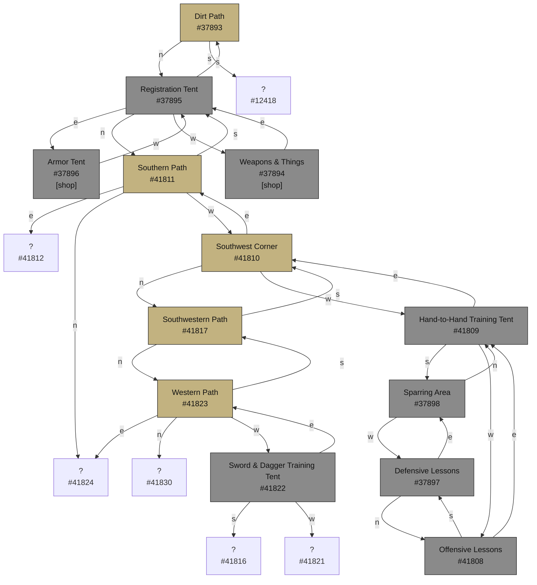

# Warrior's Training Camp

13 rooms. Solid = direction; dotted = special exit.

```mermaid
flowchart TD
  r37893["Dirt Path<br/>#37893"]
  r37895["Registration Tent<br/>#37895"]
  r37894["Weapons & Things<br/>#37894<br/>[shop]"]
  r37896["Armor Tent<br/>#37896<br/>[shop]"]
  r41811["Southern Path<br/>#41811"]
  r41810["Southwest Corner<br/>#41810"]
  r41809["Hand-to-Hand Training Tent<br/>#41809"]
  r41808["Offensive Lessons<br/>#41808"]
  r37897["Defensive Lessons<br/>#37897"]
  r37898["Sparring Area<br/>#37898"]
  r41817["Southwestern Path<br/>#41817"]
  r41823["Western Path<br/>#41823"]
  r41822["Sword & Dagger Training Tent<br/>#41822"]
  r37893 -->|n| r37895
  r12418["?<br/>#12418"]
  r37893 -->|s| r12418
  r37895 -->|e| r37896
  r37895 -->|n| r41811
  r37895 -->|s| r37893
  r37895 -->|w| r37894
  r37894 -->|e| r37895
  r37896 -->|w| r37895
  r41812["?<br/>#41812"]
  r41811 -->|e| r41812
  r41824["?<br/>#41824"]
  r41811 -->|n| r41824
  r41811 -->|s| r37895
  r41811 -->|w| r41810
  r41810 -->|e| r41811
  r41810 -->|n| r41817
  r41810 -->|w| r41809
  r41809 -->|e| r41810
  r41809 -->|s| r37898
  r41809 -->|w| r41808
  r41808 -->|e| r41809
  r41808 -->|s| r37897
  r37897 -->|e| r37898
  r37897 -->|n| r41808
  r37898 -->|n| r41809
  r37898 -->|w| r37897
  r41817 -->|n| r41823
  r41817 -->|s| r41810
  r41823 -->|e| r41824
  r41830["?<br/>#41830"]
  r41823 -->|n| r41830
  r41823 -->|s| r41817
  r41823 -->|w| r41822
  r41822 -->|e| r41823
  r41816["?<br/>#41816"]
  r41822 -->|s| r41816
  r41821["?<br/>#41821"]
  r41822 -->|w| r41821
  classDef t_hills fill:#c2b280,color:#111,stroke:#222
  class r37893 t_hills
  classDef t_inside fill:#8a8a8a,color:#111,stroke:#222
  class r37895 t_inside
  class r37894 t_inside
  class r37896 t_inside
  class r41811 t_hills
  class r41810 t_hills
  class r41809 t_inside
  class r41808 t_inside
  class r37897 t_inside
  class r37898 t_inside
  class r41817 t_hills
  class r41823 t_hills
  class r41822 t_inside
```
