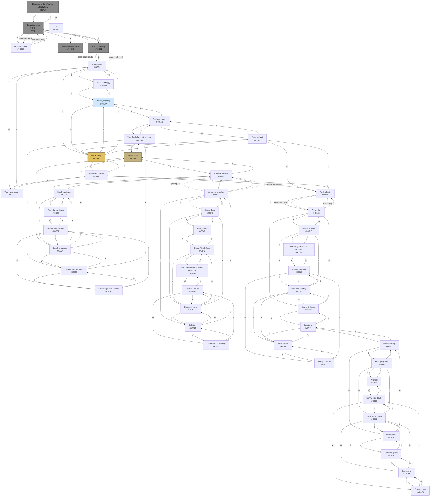

# Weather Observatory

50 rooms. Solid = direction; dotted = special exit.

```mermaid
flowchart TD
  r40497["Entrance to the Weather Observatory<br/>#40497"]
  r40499["Reception area<br/>#40499<br/>[shop]"]
  r40500["Director's office<br/>#40500"]
  r40498["Administrative office<br/>#40498"]
  r40501["A short hallway<br/>#40501"]
  r40503["A sunny day<br/>#40503"]
  r40504["Cool and foggy<br/>#40504"]
  r40506["Hot and dry<br/>#40506"]
  r40509["Extreme heat<br/>#40509"]
  r40505["Warm and breezy<br/>#40505"]
  r40510["Cool and cloudy<br/>#40510"]
  r40507["A dewy morning<br/>#40507"]
  r40502["Warm and cloudy<br/>#40502"]
  r40520["The clouds before the storm<br/>#40520"]
  r40521["Green skies<br/>#40521"]
  r40525["Weak hurricane<br/>#40525"]
  r40524["Small tornadoes<br/>#40524"]
  r40523["It's only a water spout<br/>#40523"]
  r40526["Hail and powerful winds<br/>#40526"]
  r40527["Fast moving tornado<br/>#40527"]
  r40528["Powerful hurricane<br/>#40528"]
  r40544["When fronts collide<br/>#40544"]
  r40522["Extreme weather<br/>#40522"]
  r40545["Rainy days<br/>#40545"]
  r40546["Heavy rains<br/>#40546"]
  r40543["Oops! A flash flood<br/>#40543"]
  r40540["The rainbow at the end of the storm<br/>#40540"]
  r40539["A sudden squall<br/>#40539"]
  r40542["Electrical storm<br/>#40542"]
  r40541["Hail storm<br/>#40541"]
  r40538["Thunderstorm warning<br/>#40538"]
  r40513["An icy day<br/>#40513"]
  r40508["Partly cloudy<br/>#40508"]
  r40516["Sleet and snow<br/>#40516"]
  r40519["Shrieking winds of a blizzard<br/>#40519"]
  r40518["A frosty morning<br/>#40518"]
  r40517["Sunny but cold<br/>#40517"]
  r40514["A Nor'easter<br/>#40514"]
  r40515["Cold and blustery<br/>#40515"]
  r40512["Cold and cloudy<br/>#40512"]
  r40511["Ice storm<br/>#40511"]
  r40537["Wind advisory<br/>#40537"]
  r40534["Kids flying kites<br/>#40534"]
  r40531["Wildfire!<br/>#40531"]
  r40530["Sunny dust devils<br/>#40530"]
  r40529["A breezy day<br/>#40529"]
  r40532["Dust storm<br/>#40532"]
  r40533["Frigid snow devils<br/>#40533"]
  r40536["Wind storm<br/>#40536"]
  r40535["Cold and gusty<br/>#40535"]
  r18445["?<br/>#18445"]
  r40497 -->|d| r18445
  r40497 -->|s| r40499
  r40499 -->|e| r40500
  r40499 -->|n| r40497
  r40499 -.->|open east;east| r40500
  r40499 -->|s| r40501
  r40499 -->|w| r40498
  r40500 -.->|open west;west| r40499
  r40500 -->|w| r40499
  r40498 -->|e| r40499
  r40501 -->|n| r40499
  r40501 -.->|open south;south| r40503
  r40501 -->|s| r40503
  r40503 -->|e| r40504
  r40503 -->|n| r40501
  r40503 -.->|open north;north| r40501
  r40503 -->|s| r40506
  r40503 -->|w| r40502
  r40504 -->|s| r40507
  r40504 -->|w| r40503
  r40506 -->|e| r40507
  r40506 -->|n| r40503
  r40506 -->|s| r40509
  r40506 -->|w| r40505
  r40509 -->|e| r40510
  r40509 -->|n| r40506
  r40509 -->|w| r40508
  r40505 -->|e| r40506
  r40505 -->|n| r40502
  r40505 -->|s| r40508
  r40510 -->|d| r40520
  r40510 -->|n| r40507
  r40510 -->|w| r40509
  r40507 -->|n| r40504
  r40507 -->|s| r40510
  r40507 -->|w| r40506
  r40502 -->|e| r40503
  r40502 -->|s| r40505
  r40520 -->|e| r40521
  r40520 -->|s| r40523
  r40520 -->|u| r40510
  r40521 -->|e| r40522
  r40521 -->|s| r40524
  r40521 -->|w| r40520
  r40525 -->|n| r40522
  r40525 -->|s| r40528
  r40525 -->|w| r40524
  r40524 -->|e| r40525
  r40524 -->|n| r40521
  r40524 -->|s| r40527
  r40524 -->|w| r40523
  r40523 -->|e| r40524
  r40523 -->|n| r40520
  r40523 -->|s| r40526
  r40526 -->|e| r40527
  r40526 -->|n| r40523
  r40527 -->|e| r40528
  r40527 -->|n| r40524
  r40527 -->|w| r40526
  r40528 -->|n| r40525
  r40528 -->|w| r40527
  r40544 -->|d| r40522
  r40544 -->|e| r40545
  r40544 -->|n| r40541
  r40544 -.->|open down;down| r40522
  r40522 -.->|open up;up| r40544
  r40522 -->|s| r40525
  r40522 -->|u| r40544
  r40522 -->|w| r40521
  r40545 -->|e| r40546
  r40545 -->|n| r40542
  r40545 -->|w| r40544
  r40546 -->|n| r40543
  r40546 -->|w| r40545
  r40543 -->|n| r40540
  r40543 -->|s| r40546
  r40543 -->|w| r40542
  r40540 -->|s| r40543
  r40540 -->|w| r40539
  r40539 -->|e| r40540
  r40539 -->|s| r40542
  r40539 -->|w| r40538
  r40542 -->|e| r40543
  r40542 -->|n| r40539
  r40542 -->|s| r40545
  r40542 -->|w| r40541
  r40541 -->|e| r40542
  r40541 -->|n| r40538
  r40541 -->|s| r40544
  r40538 -->|e| r40539
  r40538 -->|s| r40541
  r40513 -.->|open up;up| r40508
  r40513 -->|s| r40516
  r40513 -->|u| r40508
  r40513 -->|w| r40512
  r40508 -->|d| r40513
  r40508 -->|e| r40509
  r40508 -->|n| r40505
  r40508 -.->|open down;down| r40513
  r40516 -->|n| r40513
  r40516 -->|s| r40519
  r40516 -->|w| r40515
  r40519 -->|n| r40516
  r40519 -->|w| r40518
  r40518 -->|e| r40519
  r40518 -->|n| r40515
  r40518 -->|w| r40517
  r40517 -->|e| r40518
  r40517 -->|n| r40514
  r40514 -->|e| r40515
  r40514 -->|n| r40511
  r40514 -->|s| r40517
  r40515 -->|e| r40516
  r40515 -->|n| r40512
  r40515 -->|s| r40518
  r40515 -->|w| r40514
  r40512 -->|e| r40513
  r40512 -->|s| r40515
  r40512 -->|w| r40511
  r40511 -->|e| r40512
  r40511 -->|s| r40514
  r40511 -->|u| r40537
  r40537 -->|d| r40511
  r40537 -->|n| r40534
  r40537 -->|w| r40536
  r40534 -->|n| r40531
  r40534 -->|s| r40537
  r40534 -->|w| r40533
  r40531 -->|s| r40534
  r40531 -->|w| r40530
  r40530 -->|e| r40531
  r40530 -->|s| r40533
  r40530 -->|w| r40529
  r40529 -->|e| r40530
  r40529 -->|s| r40532
  r40532 -->|e| r40533
  r40532 -->|n| r40529
  r40532 -->|s| r40535
  r40533 -->|e| r40534
  r40533 -->|n| r40530
  r40533 -->|s| r40536
  r40533 -->|w| r40532
  r40536 -->|e| r40537
  r40536 -->|n| r40533
  r40536 -->|w| r40535
  r40535 -->|e| r40536
  r40535 -->|n| r40532
  classDef t_inside fill:#8a8a8a,color:#111,stroke:#222
  class r40497 t_inside
  class r40499 t_inside
  class r40498 t_inside
  class r40501 t_inside
  classDef t_desert fill:#e0c060,color:#111,stroke:#222
  class r40506 t_desert
  classDef t_air fill:#cfe8ff,color:#111,stroke:#222
  class r40507 t_air
  classDef t_hills fill:#c2b280,color:#111,stroke:#222
  class r40521 t_hills
```
