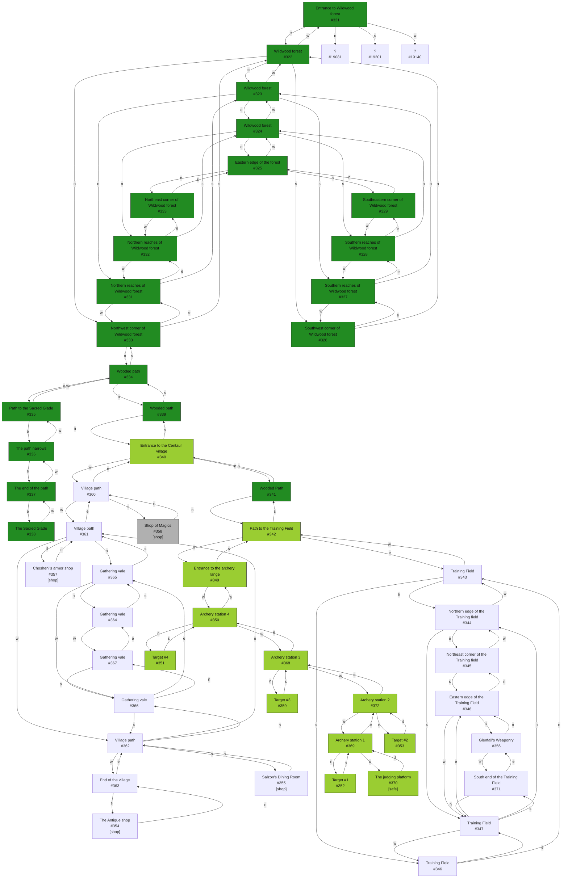

# Wildwood

52 rooms. Solid = direction; dotted = special exit.

```mermaid
flowchart TD
  r321["Entrance to Wildwood forest<br/>#321"]
  r322["Wildwood forest<br/>#322"]
  r330["Northwest corner of Wildwood forest<br/>#330"]
  r326["Southwest corner of Wildwood forest<br/>#326"]
  r323["Wildwood forest<br/>#323"]
  r331["Northern reaches of Wildwood forest<br/>#331"]
  r334["Wooded path<br/>#334"]
  r339["Wooded path<br/>#339"]
  r327["Southern reaches of Wildwood forest<br/>#327"]
  r328["Southern reaches of Wildwood forest<br/>#328"]
  r324["Wildwood forest<br/>#324"]
  r332["Northern reaches of Wildwood forest<br/>#332"]
  r333["Northeast corner of Wildwood forest<br/>#333"]
  r325["Eastern edge of the forest<br/>#325"]
  r329["Southeastern corner of Wildwood forest<br/>#329"]
  r335["Path to the Sacred Glade<br/>#335"]
  r336["The path narrows<br/>#336"]
  r337["The end of the path<br/>#337"]
  r338["The Sacred Glade<br/>#338"]
  r340["Entrance to the Centaur village<br/>#340"]
  r360["Village path<br/>#360"]
  r361["Village path<br/>#361"]
  r362["Village path<br/>#362"]
  r363["End of the village<br/>#363"]
  r354["The Antique shop<br/>#354<br/>[shop]"]
  r355["Salzon's Dining Room<br/>#355<br/>[shop]"]
  r366["Gathering vale<br/>#366"]
  r367["Gathering vale<br/>#367"]
  r364["Gathering vale<br/>#364"]
  r365["Gathering vale<br/>#365"]
  r357["Chosheni's armor shop<br/>#357<br/>[shop]"]
  r358["Shop of Magics<br/>#358<br/>[shop]"]
  r341["Wooded Path<br/>#341"]
  r342["Path to the Training Field<br/>#342"]
  r343["Training Field<br/>#343"]
  r344["Northern edge of the Training field<br/>#344"]
  r345["Northeast corner of the Training field<br/>#345"]
  r348["Eastern edge of the Training Field<br/>#348"]
  r356["Glenfall's Weaponry<br/>#356"]
  r371["South end of the Training Field<br/>#371"]
  r347["Training Field<br/>#347"]
  r346["Training Field<br/>#346"]
  r349["Entrance to the archery range<br/>#349"]
  r350["Archery station 4<br/>#350"]
  r368["Archery station 3<br/>#368"]
  r372["Archery station 2<br/>#372"]
  r369["Archery station 1<br/>#369"]
  r352["Target #1<br/>#352"]
  r353["Target #2<br/>#353"]
  r359["Target #3<br/>#359"]
  r351["Target #4<br/>#351"]
  r370["The judging platform<br/>#370<br/>[safe]"]
  r321 -->|e| r322
  r19081["?<br/>#19081"]
  r321 -->|n| r19081
  r19201["?<br/>#19201"]
  r321 -->|s| r19201
  r19140["?<br/>#19140"]
  r321 -->|w| r19140
  r322 -->|e| r323
  r322 -->|n| r330
  r322 -->|s| r326
  r322 -->|w| r321
  r330 -->|e| r331
  r330 -->|n| r334
  r330 -->|s| r322
  r326 -->|e| r327
  r326 -->|n| r322
  r323 -->|e| r324
  r323 -->|n| r331
  r323 -->|s| r327
  r323 -->|w| r322
  r331 -->|e| r332
  r331 -->|s| r323
  r331 -->|w| r330
  r334 -->|e| r335
  r334 -->|n| r339
  r334 -->|s| r330
  r339 -->|n| r340
  r339 -->|s| r334
  r327 -->|e| r328
  r327 -->|n| r323
  r327 -->|w| r326
  r328 -->|e| r329
  r328 -->|n| r324
  r328 -->|w| r327
  r324 -->|e| r325
  r324 -->|n| r332
  r324 -->|s| r328
  r324 -->|w| r323
  r332 -->|e| r333
  r332 -->|s| r324
  r332 -->|w| r331
  r333 -->|s| r325
  r333 -->|w| r332
  r325 -->|n| r333
  r325 -->|s| r329
  r325 -->|w| r324
  r329 -->|n| r325
  r329 -->|w| r328
  r335 -->|e| r336
  r335 -->|w| r334
  r336 -->|e| r337
  r336 -->|w| r335
  r337 -->|e| r338
  r337 -->|w| r336
  r338 -->|w| r337
  r340 -->|n| r341
  r340 -->|s| r339
  r340 -->|w| r360
  r360 -->|e| r340
  r360 -->|s| r358
  r360 -->|w| r361
  r361 -->|e| r360
  r361 -->|n| r365
  r361 -->|s| r357
  r361 -->|w| r362
  r362 -->|e| r361
  r362 -->|n| r366
  r362 -->|s| r355
  r362 -->|w| r363
  r363 -->|e| r362
  r363 -->|s| r354
  r354 -->|n| r363
  r355 -->|n| r362
  r366 -->|e| r365
  r366 -->|n| r367
  r366 -->|s| r362
  r367 -->|e| r364
  r367 -->|s| r366
  r364 -->|s| r365
  r364 -->|w| r367
  r365 -->|n| r364
  r365 -->|s| r361
  r365 -->|w| r366
  r357 -->|n| r361
  r358 -->|n| r360
  r341 -->|n| r342
  r341 -->|s| r340
  r342 -->|e| r343
  r342 -->|n| r349
  r342 -->|s| r341
  r343 -->|e| r344
  r343 -->|s| r346
  r343 -->|w| r342
  r344 -->|e| r345
  r344 -->|s| r347
  r344 -->|w| r343
  r345 -->|s| r348
  r345 -->|w| r344
  r348 -->|n| r345
  r348 -->|s| r356
  r348 -->|w| r347
  r356 -->|n| r348
  r356 -->|w| r371
  r371 -->|e| r356
  r371 -->|n| r347
  r347 -->|e| r348
  r347 -->|n| r344
  r347 -->|s| r371
  r347 -->|w| r346
  r346 -->|e| r347
  r346 -->|n| r343
  r349 -->|n| r350
  r349 -->|s| r342
  r350 -->|n| r351
  r350 -->|s| r349
  r350 -->|w| r368
  r368 -->|e| r350
  r368 -->|n| r359
  r368 -->|w| r372
  r372 -->|e| r368
  r372 -->|n| r353
  r372 -->|w| r369
  r369 -->|e| r372
  r369 -->|n| r352
  r369 -->|u| r370
  r352 -->|s| r369
  r353 -->|s| r372
  r359 -->|s| r368
  r351 -->|s| r350
  r370 -->|d| r369
  classDef t_forest fill:#228b22,color:#111,stroke:#222
  class r321 t_forest
  class r322 t_forest
  class r330 t_forest
  class r326 t_forest
  class r323 t_forest
  class r331 t_forest
  class r334 t_forest
  class r339 t_forest
  class r327 t_forest
  class r328 t_forest
  class r324 t_forest
  class r332 t_forest
  class r333 t_forest
  class r325 t_forest
  class r329 t_forest
  class r335 t_forest
  class r336 t_forest
  class r337 t_forest
  class r338 t_forest
  classDef t_field fill:#9acd32,color:#111,stroke:#222
  class r340 t_field
  classDef t_city fill:#b0b0b0,color:#111,stroke:#222
  class r358 t_city
  class r341 t_forest
  class r342 t_field
  class r349 t_field
  class r350 t_field
  class r368 t_field
  class r372 t_field
  class r369 t_field
  class r352 t_field
  class r353 t_field
  class r359 t_field
  class r351 t_field
  class r370 t_field
```
