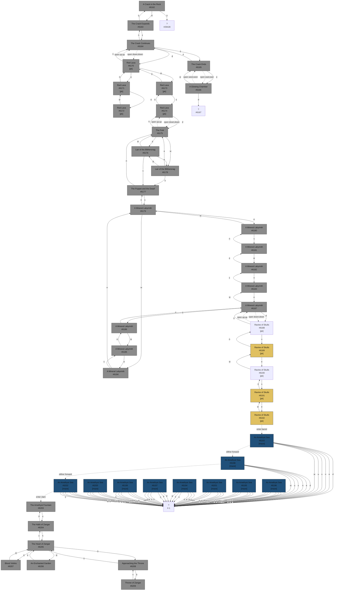

# Zangar's Demonic Grotto

45 rooms. Solid = direction; dotted = special exit.

```mermaid
flowchart TD
  r6162["A Crack in the Rock<br/>#6162"]
  r6163["The Crack Expands<br/>#6163"]
  r6165["The Crack Ends<br/>#6165"]
  r6170["Red Lava<br/>#6170<br/>[pk]"]
  r6164["The Crack Continues<br/>#6164"]
  r6173["Red Lava<br/>#6173<br/>[pk]"]
  r6171["Red Lava<br/>#6171<br/>[pk]"]
  r6172["Red Lava<br/>#6172<br/>[pk]"]
  r6175["The Fork<br/>#6175"]
  r6174["Red Lava<br/>#6174<br/>[pk]"]
  r6178["Lair of the Blithersnag<br/>#6178"]
  r6176["Lair of the Blithersnag<br/>#6176"]
  r6177["The Puppet and the Dwarf<br/>#6177"]
  r6179["A Mineral Labyrinth<br/>#6179"]
  r6184["A Mineral Labyrinth<br/>#6184"]
  r6185["A Mineral Labyrinth<br/>#6185"]
  r6186["A Mineral Labyrinth<br/>#6186"]
  r6183["A Mineral Labyrinth<br/>#6183"]
  r6182["A Mineral Labyrinth<br/>#6182"]
  r6181["A Mineral Labyrinth<br/>#6181"]
  r6166["A Glowing Chamber<br/>#6166"]
  r6180["A Mineral Labyrinth<br/>#6180"]
  r6188["Ravine of Skulls<br/>#6188<br/>[pk]"]
  r6187["A Mineral Labyrinth<br/>#6187"]
  r6189["Ravine of Skulls<br/>#6189<br/>[pk]"]
  r6190["Ravine of Skulls<br/>#6190<br/>[pk]"]
  r6191["Ravine of Skulls<br/>#6191<br/>[pk]"]
  r6192["Ravine of Skulls<br/>#6192<br/>[pk]"]
  r6193["An Amethyst Sea<br/>#6193<br/>[maze]"]
  r6198["An Amethyst Sea<br/>#6198<br/>[maze]"]
  r6196["An Amethyst Sea<br/>#6196<br/>[maze]"]
  r6195["An Amethyst Sea<br/>#6195<br/>[maze]"]
  r6201["An Amethyst Sea<br/>#6201<br/>[maze]"]
  r6194["An Amethyst Sea<br/>#6194<br/>[maze]"]
  r6197["An Amethyst Sea<br/>#6197<br/>[maze]"]
  r6199["An Amethyst Sea<br/>#6199<br/>[maze]"]
  r6200["An Amethyst Sea<br/>#6200<br/>[maze]"]
  r6202["An Amethyst Sea<br/>#6202<br/>[maze]"]
  r6203["The Amethyst Fountain<br/>#6203"]
  r6204["The Halls of Zangar<br/>#6204"]
  r6205["The Heart of Zangar<br/>#6205"]
  r6207["Blood Violins<br/>#6207"]
  r6206["An Enchanted Garden<br/>#6206"]
  r6208["Approaching the Throne<br/>#6208"]
  r6209["Throne of Zangar<br/>#6209"]
  r6162 -->|d| r6163
  r29428["?<br/>#29428"]
  r6162 -->|u| r29428
  r6163 -->|s| r6164
  r6163 -->|u| r6162
  r6165 -->|e| r6166
  r6165 -->|n| r6164
  r6165 -.->|open east;east| r6166
  r6170 -.->|open up;up| r6164
  r6170 -->|s| r6171
  r6170 -->|u| r6164
  r6170 -->|w| r6173
  r6164 -->|d| r6170
  r6164 -->|n| r6163
  r6164 -.->|open down;down| r6170
  r6164 -->|s| r6165
  r6173 -->|e| r6170
  r6173 -->|s| r6174
  r6171 -->|e| r6172
  r6171 -->|n| r6170
  r6172 -->|w| r6171
  r6175 -->|e| r6176
  r6175 -.->|open up;up| r6174
  r6175 -->|u| r6174
  r6175 -->|w| r6178
  r6174 -->|d| r6175
  r6174 -->|n| r6173
  r6174 -.->|open down;down| r6175
  r6178 -->|e| r6175
  r6178 -->|s| r6177
  r6178 -->|w| r6176
  r6176 -->|e| r6178
  r6176 -->|s| r6177
  r6176 -->|w| r6175
  r6177 -->|n| r6175
  r6177 -->|s| r6179
  r6179 -->|e| r6180
  r6179 -->|n| r6177
  r6179 -->|w| r6184
  r6184 -->|e| r6179
  r6184 -->|s| r6185
  r6185 -->|e| r6186
  r6185 -->|n| r6184
  r6186 -->|n| r6187
  r6186 -->|w| r6185
  r6183 -->|e| r6187
  r6183 -->|s| r6182
  r6182 -->|e| r6181
  r6182 -->|n| r6183
  r6181 -->|n| r6180
  r6181 -->|w| r6182
  r6167["?<br/>#6167"]
  r6166 -->|d| r6167
  r6166 -.->|open west;west| r6165
  r6166 -->|w| r6165
  r6180 -->|s| r6181
  r6180 -->|w| r6179
  r6188 -.->|open up;up| r6187
  r6188 -->|s| r6189
  r6188 -->|u| r6187
  r6187 -->|d| r6188
  r6187 -.->|open down;down| r6188
  r6187 -->|s| r6186
  r6187 -->|w| r6183
  r6189 -->|e| r6190
  r6189 -->|n| r6188
  r6190 -->|s| r6191
  r6190 -->|w| r6189
  r6191 -->|e| r6192
  r6191 -->|n| r6190
  r6192 -.->|enter barrel| r6193
  r6192 -->|w| r6191
  r-1["?<br/>#-1"]
  r6193 -->|d| r-1
  r6193 -->|e| r-1
  r6193 -->|n| r-1
  r6193 -->|s| r-1
  r6193 -.->|slither forward| r6198
  r6193 -->|u| r-1
  r6193 -->|w| r-1
  r6198 -->|d| r-1
  r6198 -->|e| r-1
  r6198 -->|n| r-1
  r6198 -->|s| r-1
  r6198 -.->|slither forward| r6202
  r6198 -->|u| r-1
  r6198 -->|w| r-1
  r6196 -->|d| r-1
  r6196 -->|e| r-1
  r6196 -->|n| r-1
  r6196 -->|s| r-1
  r6196 -->|u| r-1
  r6196 -->|w| r-1
  r6195 -->|d| r-1
  r6195 -->|e| r-1
  r6195 -->|n| r-1
  r6195 -->|s| r-1
  r6195 -->|u| r-1
  r6195 -->|w| r-1
  r6201 -->|d| r-1
  r6201 -->|e| r-1
  r6201 -->|n| r-1
  r6201 -->|s| r-1
  r6201 -->|u| r-1
  r6201 -->|w| r-1
  r6194 -->|d| r-1
  r6194 -->|e| r-1
  r6194 -->|n| r-1
  r6194 -->|s| r-1
  r6194 -->|u| r-1
  r6194 -->|w| r-1
  r6197 -->|d| r-1
  r6197 -->|e| r-1
  r6197 -->|n| r-1
  r6197 -->|s| r-1
  r6197 -->|u| r-1
  r6197 -->|w| r-1
  r6199 -->|d| r-1
  r6199 -->|e| r-1
  r6199 -->|n| r-1
  r6199 -->|s| r-1
  r6199 -->|u| r-1
  r6199 -->|w| r-1
  r6200 -->|d| r-1
  r6200 -->|e| r-1
  r6200 -->|n| r-1
  r6200 -->|s| r-1
  r6200 -->|u| r-1
  r6200 -->|w| r-1
  r6202 -->|d| r-1
  r6202 -->|e| r-1
  r6202 -.->|enter clam| r6203
  r6202 -->|n| r-1
  r6202 -->|s| r-1
  r6202 -->|u| r-1
  r6202 -->|w| r-1
  r6203 -->|u| r6204
  r6204 -->|d| r6203
  r6204 -->|n| r6205
  r6205 -->|e| r6207
  r6205 -->|n| r6208
  r6205 -->|s| r6204
  r6205 -->|w| r6206
  r6207 -->|w| r6205
  r6206 -->|e| r6205
  r6208 -->|n| r6209
  r6208 -->|s| r6205
  r6209 -->|s| r6208
  classDef t_inside fill:#8a8a8a,color:#111,stroke:#222
  class r6162 t_inside
  class r6163 t_inside
  class r6165 t_inside
  class r6170 t_inside
  class r6164 t_inside
  class r6173 t_inside
  class r6171 t_inside
  class r6172 t_inside
  class r6175 t_inside
  class r6174 t_inside
  class r6178 t_inside
  class r6176 t_inside
  class r6177 t_inside
  class r6179 t_inside
  class r6184 t_inside
  class r6185 t_inside
  class r6186 t_inside
  class r6183 t_inside
  class r6182 t_inside
  class r6181 t_inside
  class r6166 t_inside
  class r6180 t_inside
  class r6187 t_inside
  classDef t_desert fill:#e0c060,color:#111,stroke:#222
  class r6189 t_desert
  class r6191 t_desert
  class r6192 t_desert
  classDef t_underwater fill:#20507a,color:#111,stroke:#222
  class r6193 t_underwater
  class r6198 t_underwater
  class r6196 t_underwater
  class r6195 t_underwater
  class r6201 t_underwater
  class r6194 t_underwater
  class r6197 t_underwater
  class r6199 t_underwater
  class r6200 t_underwater
  class r6202 t_underwater
  class r6203 t_inside
  class r6204 t_inside
  class r6205 t_inside
  class r6207 t_inside
  class r6206 t_inside
  class r6208 t_inside
  class r6209 t_inside
```
