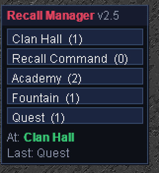

# Recall Manager



A miniwindow of **clickable buttons you build yourself** — each fires a list of
commands. Good for recalls, portals, held-item transports, shop runs, anything
you do the same way every time. Ships empty; nothing is assumed about your
character. Optional per-button arrival detection updates an "At:" readout.

The miniwindow shows `Recall Manager v<version>` on its title bar.

## Install

1. MUSHclient → **File → Plugins → Add…**
2. Pick `RecallManager.xml`.
3. Done. Type `recallmanager help` to configure it.

Runs inside the [Aardwolf MUSHclient client package](https://github.com/fiendish/aardwolfclientpackage)
— it uses the bundled `movewindow`, `serialize`, and `constants.lua`. Nothing
depends on the folder it lives in. To keep it loaded across restarts, leave it
added (MUSHclient remembers) or add `<include name="RecallManager.xml" plugin="y" />`
to your world file's plugins block.

## Commands

```
recallmanager add <name> <cmd|cmd|...>    add a button (quote multi-word names)
recallmanager edit <name> <cmd|cmd|...>   change a button's commands
recallmanager del <name>                  remove a button
recallmanager at <name> <regexp|off>      when that line is seen, set 'At:' to <name>
recallmanager var <name> <value|off>      define $name (an id, a clan, anything)
recallmanager <name>                      fire a button (same as clicking it)
recallmanager list | vars                 show buttons / vars
recallmanager reset                       zero the counters
recallmanager factoryreset confirm        wipe ALL buttons + vars (no undo)
recallmanager                             show/hide the window
recallmanager help                        this
```

## Vars — dynamic values in commands

Put `$name` in a command and it's replaced by whatever you set that var to. Define
a value once — an item id that changes per reboot or per clan, a keyword, a clan
name, anything — reference it in as many buttons as you like, and change it in one
place. The plugin isn't opinionated about what a var means; that's your call.

```
recallmanager var bag 67890
recallmanager var bus 12345
recallmanager var wep 55555
recallmanager add bus get $bus $bag|hold $bus|enter|dual $wep|put $bus $bag
```

Fixing an id later is one command: `recallmanager var bus 99999`. `recallmanager
vars` lists them; `recallmanager var bus off` removes one. A command with no `$`
is sent literally, so raw ids still work if you don't want vars.

**Commands are separated by `|`, not `;`.** Aardwolf's command stacking splits a
typed `;` before the plugin ever sees it, so the pipe is the safe delimiter.

## Example

A plain recall, an academy portal (held item, ids in vars) with an arrival line,
and a "get to the questor" combo:

```
recallmanager var bag 3841471214
recallmanager var academy 3841475716
recallmanager var wep 3843558662
recallmanager add "Recall Command" recall
recallmanager add Academy get $academy $bag|hold $academy|enter|dual $wep|put $academy $bag
recallmanager at Academy ^Inside the Academy Foyer$
recallmanager add Quest get $academy $bag|hold $academy|enter|dual $wep|put $academy $bag|run d|runto quest
```

Get an item's object id in-game with the `id` spell/command. Drag the window by
its title bar; right-click it for Hide / Reset. All buttons, counters, vars, and
window position persist across sessions.

## License

MIT — see [../LICENSE](../LICENSE).
